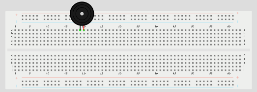
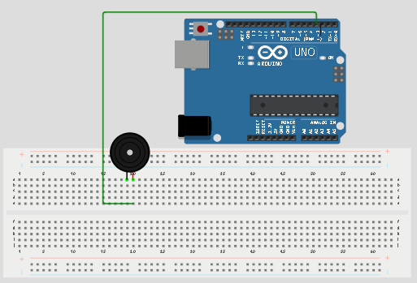
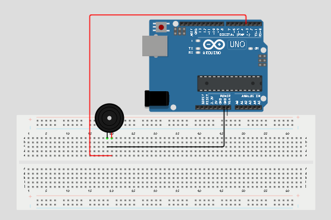
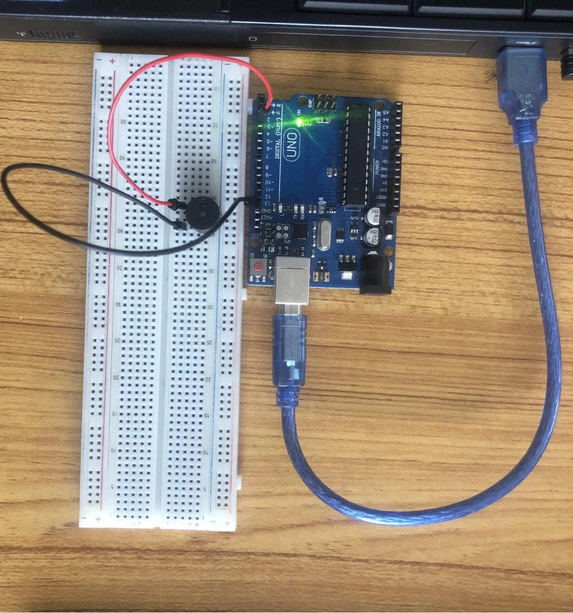
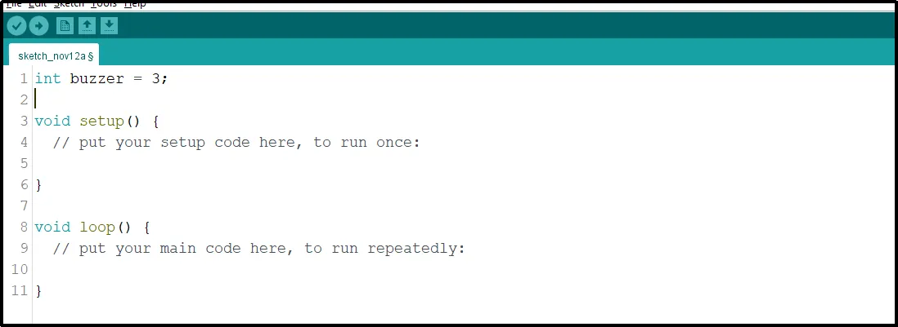
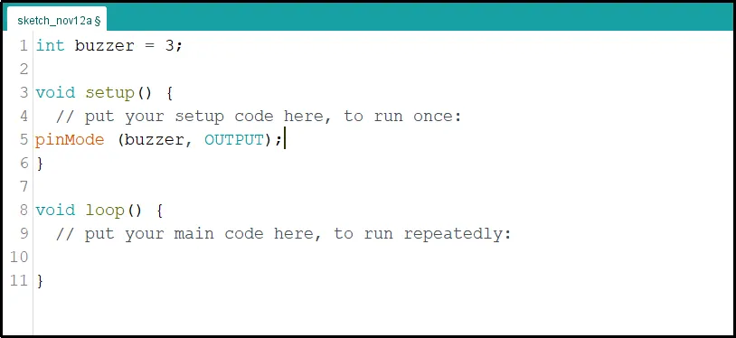
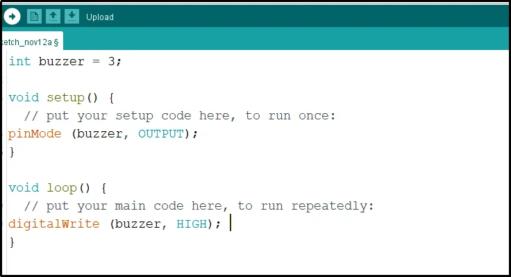
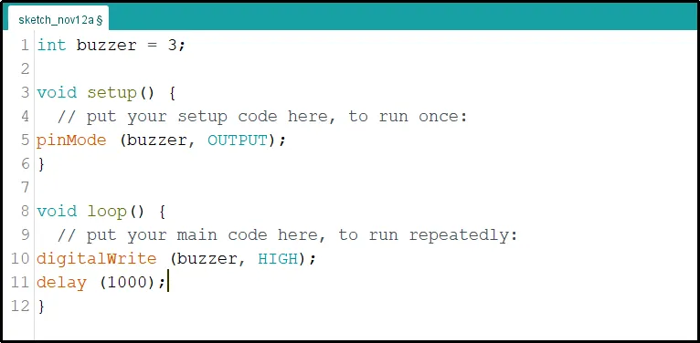
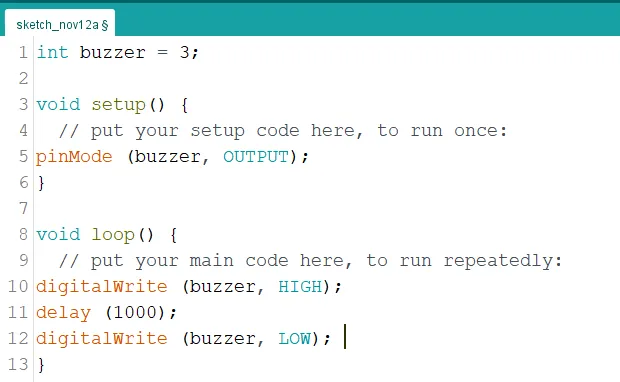
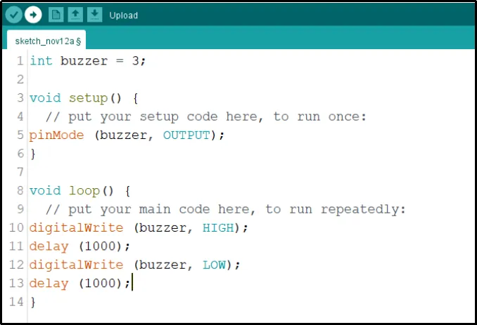

# Project 1.2.2: Buzzer Control With Arduino(On and OFF)

| **Description** | This project shows how to control a buzzer using an Arduino Uno. The buzzer can be turned on and off using simple Arduino code.|
| --------------- | --------------------------------------------------------------------------------------------------------------- |
| **Use case**    |This project can be used in alarm systems, notification systems, and devices that need sound alerts.                                                              |

## Components (Things You will need)

|  |  |  |  |  |
| -------------------------------------------------- | --------------------------------------------------- | ----------------------------------------------------------- | ----------------------------------------------------- | ------------------------------------------------------ |

## Building the circuit

Things Needed:

- Arduino Uno = 1
- Arduino USB cable = 1
- Buzzer = 1
- Red jumper wires = 1
- Blue jumper wires = 1

## Mounting the component on the breadboard

**Step 1:** Place the buzzer on the breadboard. The longer pin is the positive pin, while the shorter pin is the negative pin.

.

_**NB:** Make sure you identify where the positive pin (+) and the negative pin (-) is connected to on the breadboard. The longer pin of the Buzzer is the positive pin and the shorter one, the negative PIN_.

## WIRING THE CIRCUIT

### Things Needed:

- Red male-to-male jumper wires = 1
- Green male-to-male jumper wires = 1

**Step 2:** Connect the positive pin of the buzzer to pin 3 on the Arduino Uno using a jumper wire.

.

**Step 3:** Connect the negative pin of the buzzer to GND on the Arduino Uno.

.

_make sure you connect the arduino usb blue cable to the Arduino board_.
<!-- 
.

_just as shown above, connect your USB cable to the Arduino board and to your laptop._ -->

## PROGRAMMING

**Step 1:** Open your Arduino IDE. See how to set up here: [Getting Started](../../getting-started/overview.md).

**Step 2:** Type `  int buzzer = 3;` before the void setup function.

.

**Step 3:** Type the following codes in the void setup function as shown below;

```
pinMode (buzzer, OUTPUT);
```

.

**Step 4:** Type the following codes in the void loop function as shown below;

```
digitalWrite (buzzer, HIGH);
```

.

**Step 5:** Now, let's add a delay by typing the following code.;

```
 delay(1000);
```

.

**Step 6:**Continue by typing the code shown below exactly as displayed in the image.

```
digitalWrite (buzzer, LOW);
```

.

**Step 7:** Finally, let's complete it by typing the following delay code as shown below.

```
delay(1000);
```

.

**Step 5:** Save your code. _See the [Getting Started](../../getting-started/overview.md) section_

**Step 6:** Select the arduino board and port _See the [Getting Started](../../getting-started/overview.md) section:Selecting Arduino Board Type and Uploading your code_.

**Step 7:** Upload your code. _See the [Getting Started](../../getting-started/overview.md) section:Selecting Arduino Board Type and Uploading your code_

## OBSERVATION

The buzzer turns on and off repeatedly, producing a beep sound every second.

## CONCLUSION

This project helps learners understand how to control a buzzer using Arduino. It introduces simple sound control, timing, and repeated actions in electronics projects.
