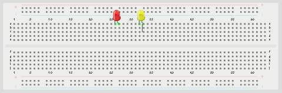
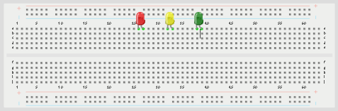

# Push Button Interface

Welcome to the **Push Button Interface** workspace. This project contains practical use cases and step-by-step tutorials to build and program with STEMAIDE.

Explore the lessons below to begin.

---

---

### Project Lessons

  <a href="1.3.1.Push_Button_press_with_1_LED.md" class="lesson-card">
    

      
    

    
1

    

      <h4>BUTTON LIT</h4>
      
This project shows how to control an LED using a push button with an Arduino Uno. When the button is pressed, the LED turns on, and when the button is released, the LED turns off.

      Learn More →
    

  </a>
  <a href="1.3.2.Push_Button_press_with_2_LEDs.md" class="lesson-card">
    

      
    

    
2

    

      <h4>TWIN LIGHT</h4>
      
This project shows how to control two LEDs using a push button with an Arduino Uno. When the button is pressed, both LEDs turn on at the same time. When the button is released, both ...

      Learn More →
    

  </a>
  <a href="1.3.3.Push_Button_press_with_3_LEDs.md" class="lesson-card">
    

      
    

    
3

    

      <h4>TRI-LIGHT</h4>
      
This project shows how to control three LEDs using a push button with an Arduino Uno. When the button is pressed, all three LEDs turn on together. When the button is released, all th...

      Learn More →
    

  </a>

