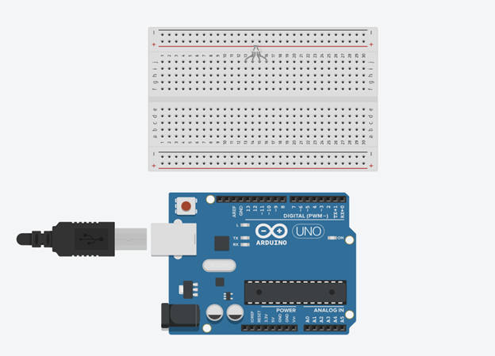
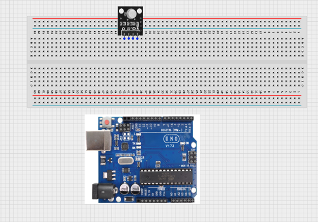

# RGB LED module

Welcome to the **RGB LED module** workspace. This project contains practical use cases and step-by-step tutorials to build and program with STEMAIDE.

Explore the lessons below to begin.

---

---

### Project Lessons

  <a href="1.5.1.RGB_Red_On.md" class="lesson-card">
    

      
    

    
1

    

      <h4>RED-G-B</h4>
      
This project teaches how to connect and program an RGB LED so that only the red light turns on using an Arduino.

      Learn More →
    

  </a>
  <a href="1.5.2.RGB_Red_Blink.md" class="lesson-card">
    

      
    

    
2

    

      <h4>Red Blink</h4>
      
This project teaches how to connect and program an RGB LED so that only the red-light blinks using an Arduino.

      Learn More →
    

  </a>
  <a href="1.5.3.RGB_Green_On.md" class="lesson-card">
    

      
    

    
3

    

      <h4>TURNING ON/OFF GREEN LED ON RGB</h4>
      
This project teaches how to connect and program an RGB LED so that only the green light turns on/off using an Arduino.

      Learn More →
    

  </a>
  <a href="1.5.4.RGB_Green_Blink.md" class="lesson-card">
    

      
    

    
4

    

      <h4>GREEN LED BLINKING ON RGB</h4>
      
A blinking green LED means the system is working normally and everything is okay.

      Learn More →
    

  </a>
  <a href="1.5.5.RGB_Blue_On.md" class="lesson-card">
    

      
    

    
5

    

      <h4>R -G-Blue</h4>
      
This project teaches how to connect and program an RGB LED so that only the blue light turns on/off using an Arduino.

      Learn More →
    

  </a>
  <a href="1.5.6.RGB_Blue_Blink.md" class="lesson-card">
    

      
    

    
6

    

      <h4>BLUE LED BLINKING ON RGB</h4>
      
A blinking green LED means the system is working normally and everything is okay.

      Learn More →
    

  </a>
  <a href="1.5.7.RGB_Rainbow_Colors.md" class="lesson-card">
    

      
    

    
7

    

      <h4>RAINBOW COLORS ON RGB</h4>
      
This programming section demonstrates how to control an RGB LED using Arduino to produce rainbow colors. By combining different values of red, green, and blue in sequence with short ...

      Learn More →
    

  </a>

