# Project 1.9.0: Noise Checker – Sound Sensor Threshold Detection

| **Description** | In this project, you will learn how to use a sound sensor with an Arduino to detect and monitor sound levels in the environment. This project introduces the basic concept of sound sensing, which is commonly used in systems such as noise alarms, security devices, and smart systems that respond to sound. |
| --------------- | -------------------------------------------------------------------------------------------------------------------------------------------------------------------------------------------------------------------------------------------------------------------------- |
| **Use case**    | Sound sensors are used in engineering and real-life systems to detect and respond to noise or sound levels. In engineering, they are commonly used in security alarms, automation systems, and sound-monitoring devices, while in everyday life they can be found in clap-activated lights, noise detectors, smart home systems, and devices that respond automatically to sound.                                                                                                                                 |

## Components (Things You will need)

|  |  | 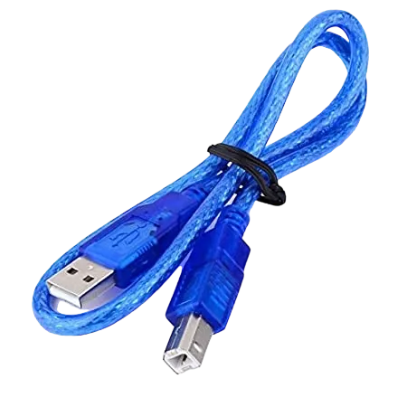 | 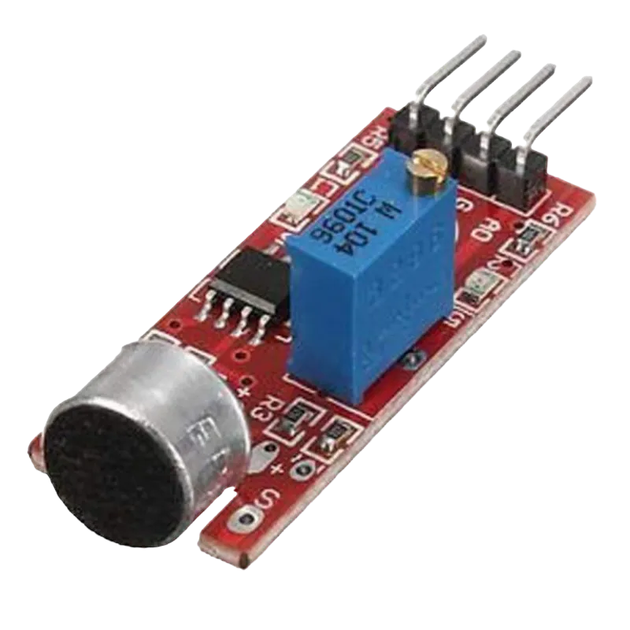 |  |
| --------------------------------------------------- | ------------------------------------------------------ | ----------------------------------------------------------- | --------------------------------------------------------- | ------------------------------------------------------ |

## Building the circuit

Things Needed:

- Arduino Uno = 1
- Arduino USB cable = 1
- Sound sensor = 1
- Jumper Wires = 4
- Breadboard = 1

## Mounting the component on the breadboard

- Breadboard = 1
- Sound sensor = 1

**Step 1:** Mount the sound sensor
Insert the 4-pin sound sensor module into the breadboard, ensuring the pins are firmly placed in separate rows.

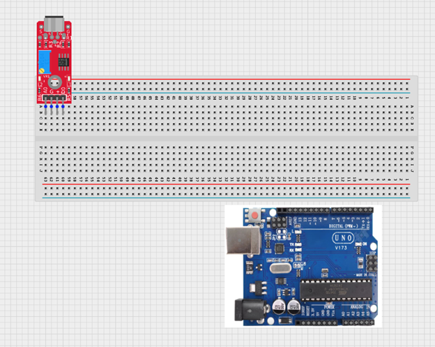.

_**NB:** Make sure you identify where the positive pin (+) and the negative pin (-) is connected to on the breadboard. The longer pin of the LED is the positive pin and the shorter one, the negative PIN_.

## WIRING THE CIRCUIT

### Things Needed:

- Arduino Uno = 1
- Red jumper wire = 1
- Black jumper wire = 1
- Green jumper wire = 1

**Step 2:**Connect the power wires
Use jumper wires to connect:
•	VCC on the LDR → 5V on the Arduino 
•	GND on the LDR → GND on the Arduino
NB: VCC is the power supply pin that provides electricity to the sensor, while GND (Ground) completes the circuit and allows the sensor to work properly. The GND is the negative terminal.

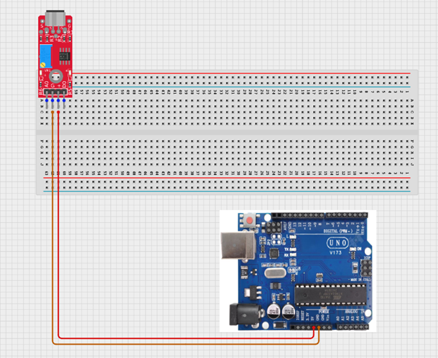.

**Step 2:** Connect the signal wires and power the board
Connect the AO (Analog Output) pin on the sound sensor to the A0 pin on the Arduino Uno. This allows the Arduino to read different sound intensity levels.
You can also connect the DO (Digital Output) pin to a digital pin on the Arduino if you want the sensor to detect only whether sound is present or absent.
.

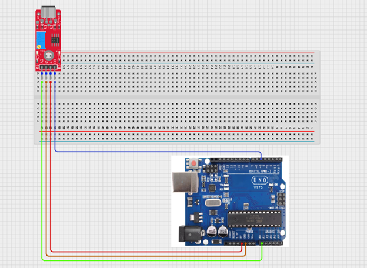.

<!-- **Step 3:** Green Wire (Signal): Connect one end of the green jumper wire to the OUT pin on the sound sensor and the other end to the A0 pin on the Arduino Uno.

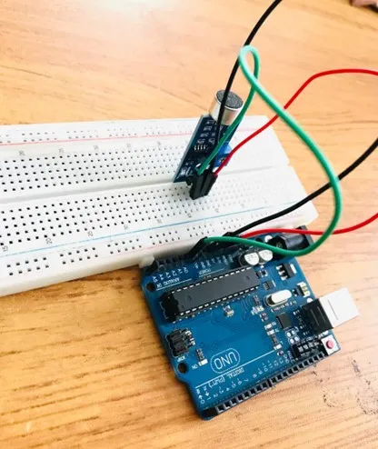. -->

_just as shown above, connect your USB cable to the Arduino board and to your laptop._

## PROGRAMMING

**Step 1:** Open your Arduino IDE. See how to set up here: [Getting Started](../../getting-started/overview.md).

**Step 2:** Type `const int soundSensorPin = A0;`
as shown below in the picture below: on line one before void Setup() function.

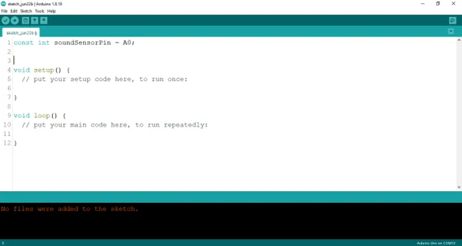.

**NB:** Make sure you avoid errors when typing. Do not omit any character or symbol especially the bracket {} and semicolons; and place them as you see in the image. The code that comes after the two ash backslashes “//” are called comments. They are not part of the code that will be run, they only explain the lines of code. You can avoid typing them.

**Step 3:** In the {} after the `void setup (), type Serial.begin (9600);` as shown below in the picture below:

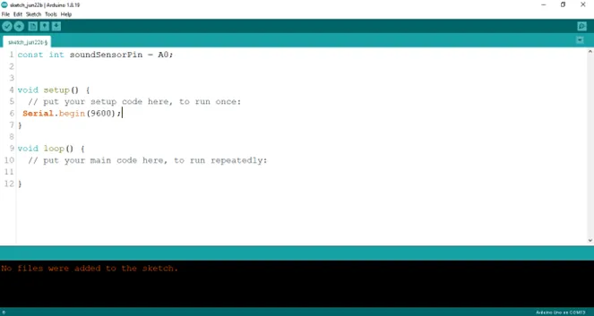.

**Step 4:** In the {} after the `void loop (), type int soundValue = analogueRead (soundSensorPin);` as shown below in the picture below:

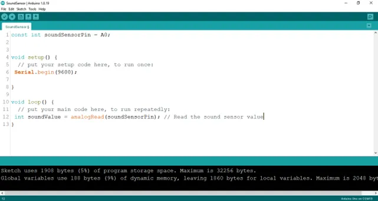.

**Step 5:** Type `Serial.printLn (soundValue) ;` as shown below in the picture below:

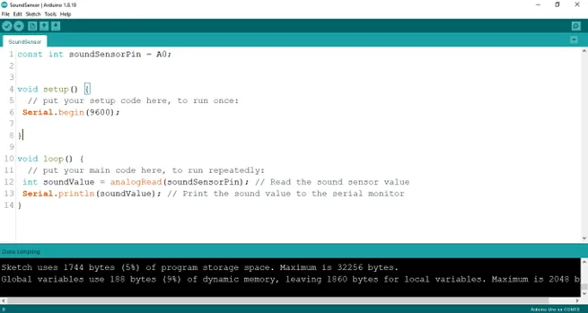.

**Step 6:** Type `delay (50) ;` as shown below in the picture below:

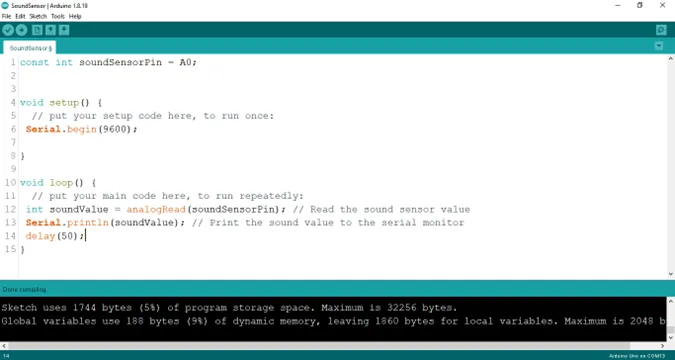.

**Step 7:** Save your code. _See the [Getting Started](../../getting-started/overview.md) section_

**Step 8:** Select the arduino board and port _See the [Getting Started](../../getting-started/overview.md) section:Selecting Arduino Board Type and Uploading your code_.

**Step 9:** Upload your code. _See the [Getting Started](../../getting-started/overview.md) section:Selecting Arduino Board Type and Uploading your code_

**Step 10:** Click on the serial monitor icon to view the amount of sound being recorded as shown in the picture below:

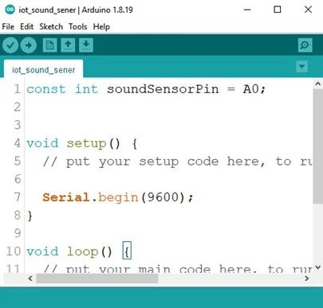.

## OBSERVATION

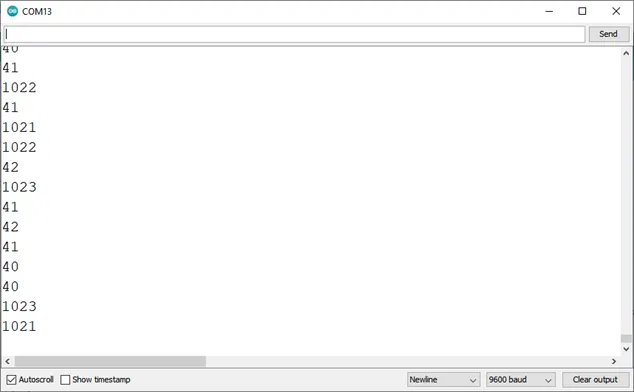.

## CONCLUSION

In conclusion, the sound sensor project aimed at measuring ambient noise levels presents a practical exploration of audio sensing and data acquisition. By utilizing the sound sensor to detect and quantify noise, participants acquire insights into analog signal processing, threshold detection, and environmental monitoring. This endeavor marks a significant milestone in electronics exploration, underscoring the importance of sensory technology in assessing noise pollution and inspiring interest in applications such as smart cities, noise control systems, and data-driven urban planning.
