# Project 2.3.1: Ultrasonic distance sensor with traffic light module.

| **Description** | This project shows how to use an ultrasonic sensor and a traffic light module with an Arduino Uno. The traffic lights change based on the distance detected by the ultrasonic sensor. |
| --------------- | --------------------------------------------------------------------------------------------------------------------------------------------- |
| **Use case**    | This project can be used in smart traffic systems to control traffic lights depending on the distance of vehicles on the road.         |

## Components (Things You will need)

|  |  |  |  || |
|-------------------------|-------------------------|-------------------------|-------------------------|-------------------------| -------------------------|

## Building the circuit

Things Needed:

- Arduino Uno = 1
- Arduino USB cable = 1
- Jumper wires
- ultrasonic Sensor = 1
- Breadboard = 1
- Traffic Light Module = 1

## Mounting the component on the breadboard

- Breadboard = 1
- Traffic Light Module = 1
- Ultrasonic sensor = 1

**Step 1:** Place the ultrasonic sensor on the breadboard.

.

**Step 2:** Connect the Echo pin of the ultrasonic sensor to pin 2 on the Arduino Uno.

.

**NB:**Take note of where each of the pins are placed on the bread board.

## WIRING THE CIRCUIT

### Things Needed:

- Red male-male-to-male jumper wires = 2
- White male-to-male jumper wires = 2
- Green male-to-male jumper wires = 2
- Yellow male-to-male jumper wires = 2
- Arduino Uno Board

**Step 3:**  Connect the Trig pin of the ultrasonic sensor to pin 3 on the Arduino Uno.

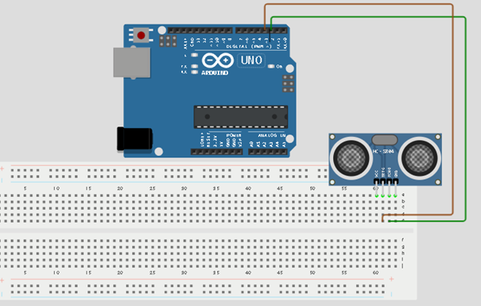.

**NB:**Take note of the digital pin you allocated to the Echo pin.

**Step 4:**  Connect the VCC pin of the ultrasonic sensor to the 5V pin on the Arduino Uno.
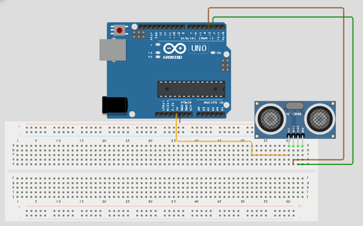.

**NB:**Take note of the digital pin you allocated to the trig pin.

**Step 5:**  Connect the GND pin of the ultrasonic sensor to GND on the Arduino Uno.

.

**Step 6:** Place the traffic light module on the breadboard.

.

**Step 7:** Connect the R pin of the traffic light module to pin 4 on the Arduino Uno.

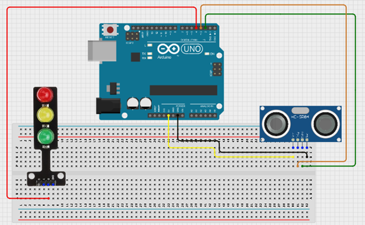.

**NB:**Take note of the digital pin you allocated to the Positive pin.

**Step 8:** Connect the G pin of the traffic light module to pin 5 on the Arduino Uno

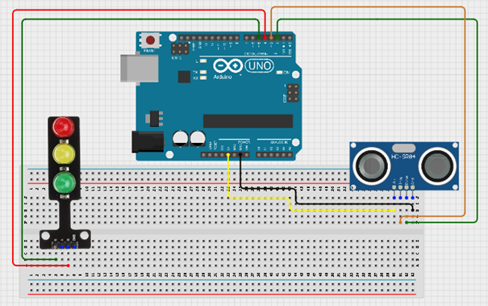.

**Step 9:** Connect the Y pin of the traffic light module to pin 6 on the Arduino Uno.

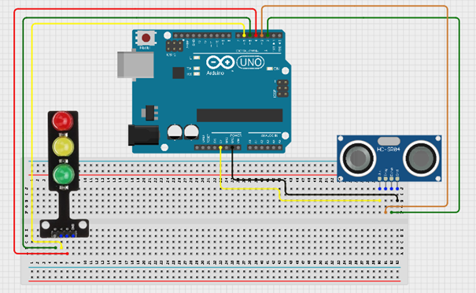.

**Step 10:** Connect the GND pin of the traffic light module to GND on the Arduino Uno.

.

<!-- **Step 9:** Connect the USB port of the Arduino cable to the USB port of your laptop and the other side to the Arduino Uno Board.

. -->

## PROGRAMMING

**Step 1:** Open your Arduino IDE. See how to set up here: [Getting Started](../../getting-started/overview.md).

**Step 2:** Type `const int Echo = 2; `
as shown below in the picture below: on line one before void Setup() function.

.

**Step 3:** Type `int Trig = 3;  `
as shown below in the picture below: on line one before void Setup() function.

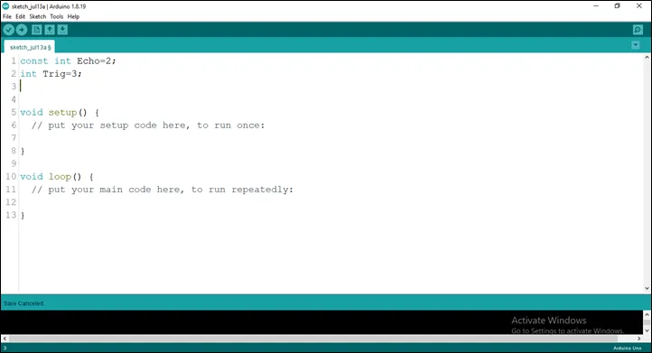.

**Step 4:** Type `int Red = 4; `
as shown below in the picture below: on line one before void Setup() function.

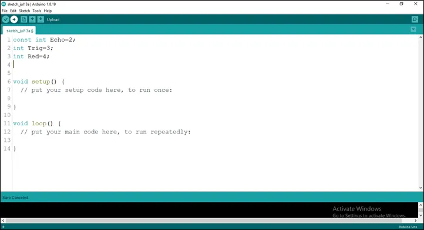.

**Step 5:** Type `int Green  = 5; `
as shown below in the picture below: on line one before void Setup() function.

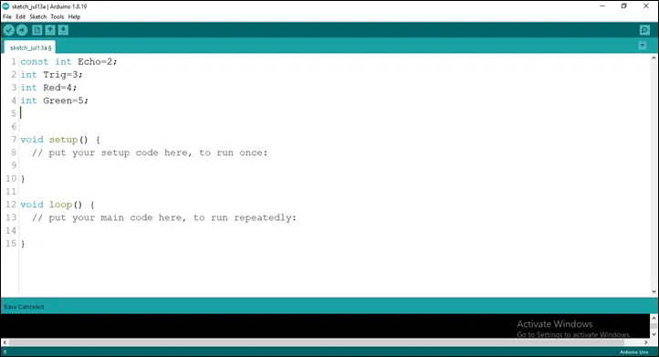.

**Step 6:** Type `int Yellow = 6; `
as shown below in the picture below: on line one before void Setup() function.

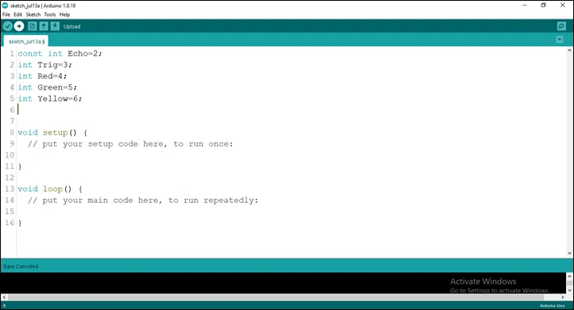.

**Step 7:** Type `long duration; ` and Type ` long duration;`
as shown below in the picture below: on line one before void Setup() function.

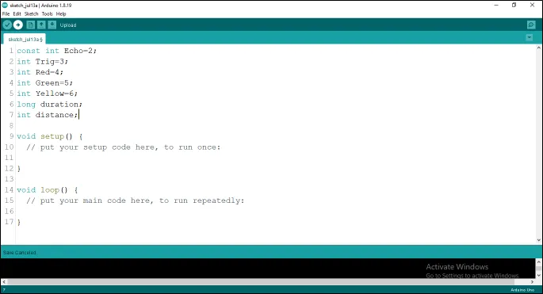.

**Step 8:** Type
`const int red_threshold = 10;`
`const int yellow_threshold = 20; `
`const int green_threshold = 5;`

as shown below in the picture below: on line one before void Setup() function.

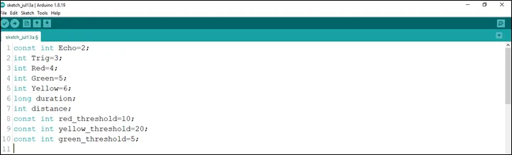.

**NB:** Make sure you avoid errors when typing. Do not omit any character or symbol especially the bracket {} and semicolons; and place them as you see in the image. The code that comes after the two ash backslashes “//” are called comments. They are not part of the code that will be run, they only explain the lines of code. You can avoid typing them.

**Step 9:** In the {} after the

`pinMode (Echo, INTPUT);`
`pinMode (Trig, OUTPUT); `
`Serial.begin (9600);`
`pinMode (Red, OUTPUT);`
`pinMode (Yellow, OUTPUT);`
`pinMode (Green, OUTPUT);`

as shown below in the picture below:

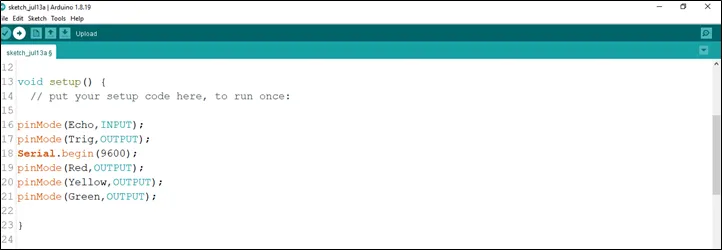.

**Step 10:** In the {} after the

`digitalWrite (Trig, LOW); `
`delay (200);`
`digitalWrite (Trig, HIGH); `
`delay (100);`
`digitalWrite (Trig, LOW);`
`duration = pulseIn (Echo, HIGH);`
`distance = duration * 0.034/2;`
as shown below in the picture below:

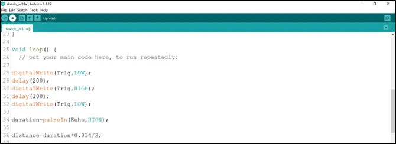.

**Step 11:** Type This Function as shown in the image below.

`if (distance == red_threshold)`
`digitalWrite (Red, HIGH); `
`else`
`digitalWrite (Red, LOW); `
`if (distance == yellow_threshold)`
`digitalWrite (Yellow, HIGH); `
`else`
`digitalWrite (Yellow, LOW); `
`if (distance == green_threshold)`
`digitalWrite (Green, HIGH); `
`else`
`digitalWrite (Green, LOW); `
`Serial.print (distance);`
`Serial.println (“cm”);`
`delay (100);`
`distance = duration * 0.034/2; `
as shown in the picture below.

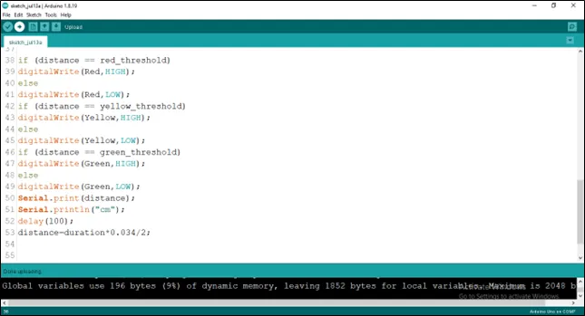.

**Step 12:** Save your code. _See the [Getting Started](../../getting-started/overview.md) section_

**Step 13:** Select the arduino board and port _See the [Getting Started](../../getting-started/overview.md) section:Selecting Arduino Board Type and Uploading your code_.

**Step 14:** Upload your code. _See the [Getting Started](../../getting-started/overview.md) section:Selecting Arduino Board Type and Uploading your code_

**Step 15:** Click on the serial monitor icon to view the amount of sound being recorded as shown in the picture below:

.

## OBSERVATION

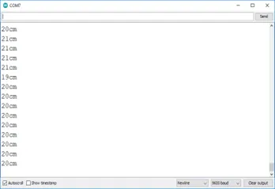

<!-- 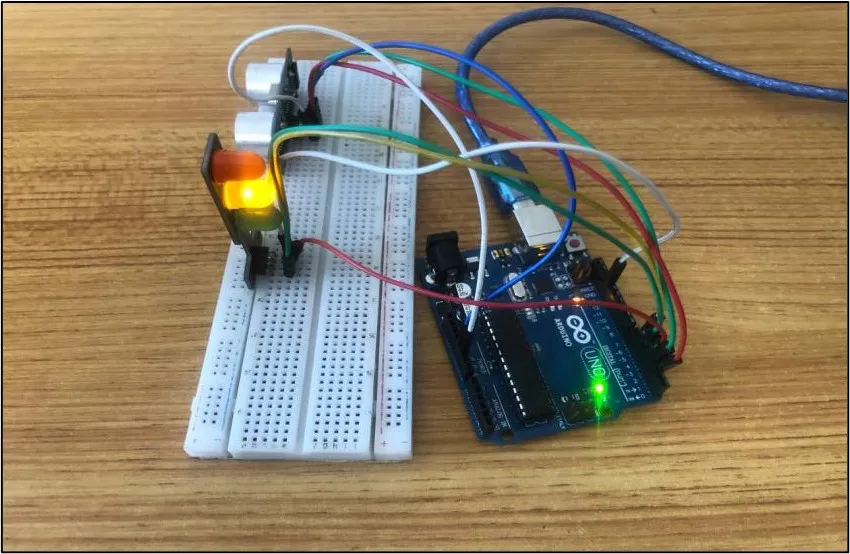

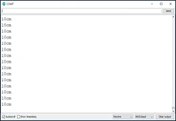

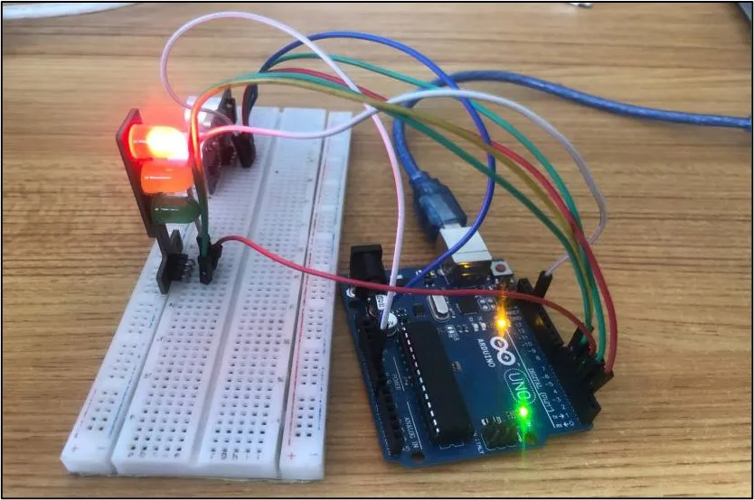

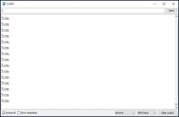

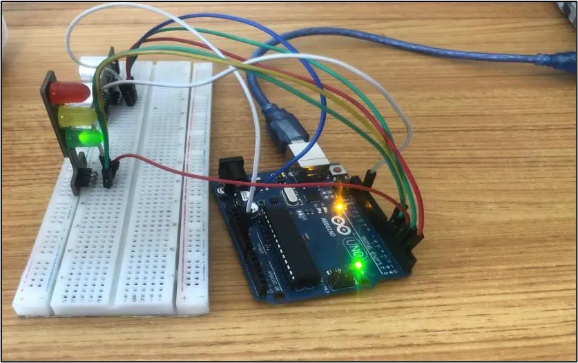 -->

## CONCLUSION

This project helps learners understand how to combine sensors and traffic light modules using Arduino. It introduces distance measurement, smart control systems, and traffic light automation in electronics and programming.
