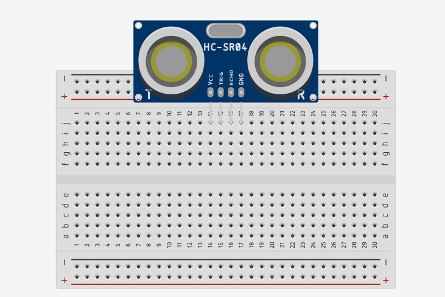
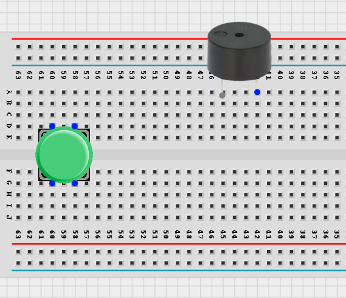
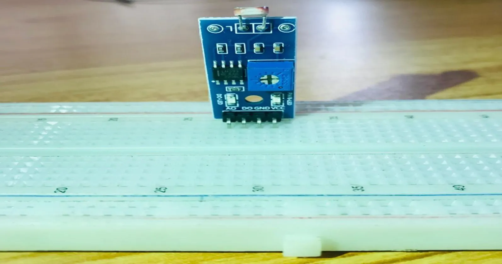
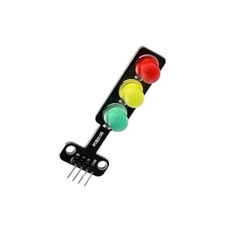

## Manual 2.0

### 2.1 Ultrasonic Sensor With LED

  <a href="2.1.Ultrasonic+LED/2.1.1.Ultrasonic_and_1_LED.md" class="lesson-card">
    

      
    

    
1

    

      <h4>LED and Ultrasonic Sensor Control</h4>
      
You will learn how to create a simple circuit using a microcontroller, LED and an Ultrasonic Sensor.

      Learn More →
    

  </a>
  <a href="2.1.Ultrasonic+LED/2.1.2.Ultrasonic_and_2_LED.md" class="lesson-card">
    

      
    

    
2

    

      <h4>LED and Ultrasonic Sensor Control</h4>
      
You will learn how to create a simple circuit using a microcontroller, Two LEDs and an Ultrasonic Sensor.

      Learn More →
    

  </a>
  <a href="2.1.Ultrasonic+LED/2.1.3.Ultrasonic_and_3_LED.md" class="lesson-card">
    

      
    

    
3

    

      <h4>LED and Ultrasonic Sensor Control</h4>
      
You will learn how to create a simple circuit using a microcontroller, Three LEDs and an Ultrasonic Sensor.

      Learn More →
    

  </a>
  <a href="2.1.Ultrasonic+LED/2.1.4.Ultrasonic_and_4_LED.md" class="lesson-card">
    

      
    

    
4

    

      <h4>SMART ALERT LIGHTINING SYSTEM</h4>
      
This smart lighting system illustrate the potential of using Arduino, LEDs and ultrasonic sensor in infrastructure and street light planning.

      Learn More →
    

  </a>
  <a href="2.1.Ultrasonic+LED/2.1.5.Ultrasonic_and_5_LED.md" class="lesson-card">
    

      
    

    
5

    

      <h4>Ultrasonic Sensor With Five LED</h4>
      
Learn step-by-step how to construct and code this project.

      Learn More →
    

  </a>

---

### 2.2 Ultrasonic Sensor With Buzzer

  <a href="2.2.Ultrasonic+Buzzer/2.2.2.Ultrasonic_sensor_and_buzzer.md" class="lesson-card">
    

      
    

    
1

    

      <h4>Ultrasonic Sensor With Buzzer</h4>
      
Learn step-by-step how to construct and code this project.

      Learn More →
    

  </a>

---

### 2.3 Ultrasonic Sensor With Traffic Light

  <a href="2.3.Ultrasonic+TrafficLight/2.3.1.ultrasonic_sensor_and_trafficLight_module.md" class="lesson-card">
    

      
    

    
1

    

      <h4>Ultrasonic distance sensor with traffic light module.</h4>
      
This project shows how to use an ultrasonic sensor and a traffic light module with an Arduino Uno. The traffic lights change based on the distance detected by the ultrasonic sensor.

      Learn More →
    

  </a>

---

### 2.4 Ultrasonic Sensor With RGB

  <a href="2.4.Ultrasonic+RGB/2.4.1.ultrasonic_sensor_and_RGB_module.md" class="lesson-card">
    

      
    

    
1

    

      <h4>Smart lightening system with RGB module.</h4>
      
This project shows how to use an ultrasonic sensor and an RGB module with an Arduino Uno. The RGB lights change when an object comes close to the ultrasonic sensor.

      Learn More →
    

  </a>

---

### 2.5 Push Button With LED

  <a href="2.5.Push_Button+LED/2.5.1.Push_Button_to_turn_on_and_off_LED.md" class="lesson-card">
    

      
    

    
1

    

      <h4>LED Control with Arduino and Push Button</h4>
      
You will learn how to create a simple circuit using an Arduino micro-controller and a push button to turn on and Off

      Learn More →
    

  </a>
  <a href="2.5.Push_Button+LED/2.5.2.Push_Button_to_blink_one_LED.md" class="lesson-card">
    

      
    

    
2

    

      <h4>LED Control with Arduino and Push Button</h4>
      
You will learn how to create a simple circuit using an Arduino microelectronic and a push button.

      Learn More →
    

  </a>
  <a href="2.5.Push_Button+LED/2.5.3.Push_Button_to_turn_on_and_off_2_LED.md" class="lesson-card">
    

      
    

    
3

    

      <h4>LED Control with Arduino and Push Button</h4>
      
You will learn how to create a simple circuit using an Arduino microcontroller and a push button to make LED blink.

      Learn More →
    

  </a>
  <a href="2.5.Push_Button+LED/2.5.4.Push_Button_to_blink_two_LED.md" class="lesson-card">
    

      
    

    
4

    

      <h4>LED Control with Arduino and Push Button</h4>
      
You will learn how to create a simple circuit using an Arduino microcontroller and a push button to make LED blink.

      Learn More →
    

  </a>
  <a href="2.5.Push_Button+LED/2.5.5.Push_Button_to_turn_on_and_off_three_LED.md" class="lesson-card">
    

      
    

    
5

    

      <h4>LED Control with Arduino and Push Button</h4>
      
Things Needed:

      Learn More →
    

  </a>
  <a href="2.5.Push_Button+LED/2.5.6.Push_Button_to_blink_three_LED.md" class="lesson-card">
    

      
    

    
6

    

      <h4>Push Button Blink Three LEDs</h4>
      
Learn step-by-step how to construct and code this project.

      Learn More →
    

  </a>
  <a href="2.5.Push_Button+LED/2.5.7.Push_Button_to_turn_on_and_off_four_LED.md" class="lesson-card">
    

      
    

    
7

    

      <h4>LED Control with Arduino and Push Button</h4>
      
Things Needed:

      Learn More →
    

  </a>
  <a href="2.5.Push_Button+LED/2.5.8.Push_Button_to_blink_four_LED.md" class="lesson-card">
    

      
    

    
8

    

      <h4>LED Control with Arduino and Push Button</h4>
      
Things Needed:

      Learn More →
    

  </a>
  <a href="2.5.Push_Button+LED/2.5.9.Push_Button_to_turn_on_and_off_five_LED.md" class="lesson-card">
    

      
    

    
9

    

      <h4>Push Button With Five LEDs</h4>
      
Learn step-by-step how to construct and code this project.

      Learn More →
    

  </a>

---

### 2.6 Push Button With Buzzer

  <a href="2.6.Push_Button+Buzzer/2.6.1.Push_button_and_Buzzer.md" class="lesson-card">
    

      
    

    
1

    

      <h4>Push Button with Buzzer</h4>
      
This project demonstrates how to create a simple circuit using a push button and a buzzer. When the push button is pressed, the buzzer produces a sound, making the project useful for...

      Learn More →
    

  </a>

---

### 2.7 Push Button With Traffic Light

  <a href="2.7.PushButton+TrafficLightModule/2.7.1.PushButton+TrafficLightModule.md" class="lesson-card">
    

      
    

    
1

    

      <h4>Push Button with Traffic Light Module</h4>
      
In this project, you will learn how to build a simple traffic light control. When the push button is pressed, it triggers the traffic light to change in sequence, simulating a real p...

      Learn More →
    

  </a>

---

### 2.8 Push Button With RGB

  <a href="2.8.PushButton+RGB/2.8.1.PushButton+RGB.md" class="lesson-card">
    

      
    

    
1

    

      <h4>STEMAIDE Pushbutton And RGB Control</h4>
      
In this project, you will learn how to use a push button to control an RGB LED with an Arduino Uno. Each press of the button changes the LED to different colors, demonstrating how in...

      Learn More →
    

  </a>

---

### 2.9 LDR With LED

  <a href="2.9.LDR+LED/2.9.1.LDR+1_LED.md" class="lesson-card">
    

      
    

    
1

    

      <h4>SMART STREET LIGHT (1 LED)</h4>
      
You will learn how to detect the presence or absence of light.

      Learn More →
    

  </a>
  <a href="2.9.LDR+LED/2.9.2.LDR+2_LED.md" class="lesson-card">
    

      
    

    
2

    

      <h4>SMART STREET LIGHT (2 LEDs)</h4>
      
You will learn how use the detection of the presence or absence of light to turn on or turn off LEDs.

      Learn More →
    

  </a>
  <a href="2.9.LDR+LED/" class="lesson-card">
    

      
    

    
3

    

      <h4>LDR With Three LED</h4>
      
Learn step-by-step how to construct and code this project.

      Learn More →
    

  </a>
  <a href="2.9.LDR+LED/2.9.4.LDR+4_LED.md" class="lesson-card">
    

      
    

    
4

    

      <h4>SMART STREET LIGHT (4 LEDs)</h4>
      
You will learn how use the detection of the presence or absence of light to turn on or turn off LEDs.

      Learn More →
    

  </a>
  <a href="2.9.LDR+LED/2.9.5.LDR+5_LED.md" class="lesson-card">
    

      
    

    
5

    

      <h4>SMART STREET LIGHT (5 LEDs)</h4>
      
You will learn how use the detection of the presence or absence of light to turn on or turn off LEDs.

      Learn More →
    

  </a>

---

### 2.10 LDR With Buzzer

  <a href="2.10.LDR+Buzzer/2.10.1.LDR+Buzzer.md" class="lesson-card">
    

      
    

    
1

    

      <h4>SMART SOUND ALERT SYSTEM</h4>
      
You will learn how to detect the presence or absence of light.

      Learn More →
    

  </a>

---

### 2.11 LDR With RGB

  <a href="2.11.LDR_RGB/2.11.1.LDR_RGB.md" class="lesson-card">
    

      
    

    
1

    

      <h4>TRAFFIC LIGHT with STEMAIDE</h4>
      
You will learn how to detect the presence or absence of light.

      Learn More →
    

  </a>

---

### 2.12 TrafficLight STEMAIDE

  <a href="2.12.Traffic_Light_STEMAIDE/2.12.1.Traffic_Light_STEMAIDE.md" class="lesson-card">
    

      
    

    
1

    

      <h4>TRAFFIC LIGHT with STEMAIDE</h4>
      
You will learn how to detect the presence or absence of light.

      Learn More →
    

  </a>

---

### 2.13 Sound Sensor With LED

  <a href="2.13.SoundSensor+LED/2.13.1.SoundSensor+1_LED.md" class="lesson-card">
    

      
    

    
1

    

      <h4>OPERATING A SOUND SENSOR WIITH ONE LED</h4>
      
This project demonstrates how to use a sound sensor and an LED with an Arduino Uno to detect sound and respond by turning on the LED. It helps in understanding how sensors can be use...

      Learn More →
    

  </a>
  <a href="2.13.SoundSensor+LED/2.13.2.Soundsensor+2_LED.md" class="lesson-card">
    

      
    

    
2

    

      <h4>OPERATING A SOUND SENSOR WITH TWO LEDs</h4>
      
This project uses a sound sensor with an Arduino Uno to detect sound levels in the environment. The sensor reads analog sound signals and responds by controlling two LEDs to indicate...

      Learn More →
    

  </a>
  <a href="2.13.SoundSensor+LED/2.13.3.SoundSensor+3_LED.md" class="lesson-card">
    

      
    

    
3

    

      <h4>OPERATING A SOUND SENSOR WITH THREE LEDs</h4>
      
This project uses a sound sensor with an Arduino Uno to detect sound levels in the environment. The sensor reads analog sound signals and responds by controlling three LEDs to indica...

      Learn More →
    

  </a>

---

### 2.14 SOund Sensor With Traffic Light

  <a href="2.14.SoundSensor+Traffic/2.14.1.SoundSensor+TrafficLight_module.md" class="lesson-card">
    

      
    

    
1

    

      <h4>OPERATING A SOUND SENSOR AND LED WITH STEMAIDE</h4>
      
You will learn how to turn ON three LED's with response to sound.

      Learn More →
    

  </a>

---
