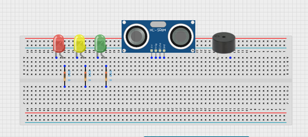
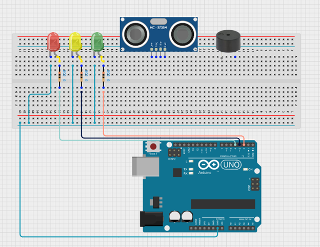
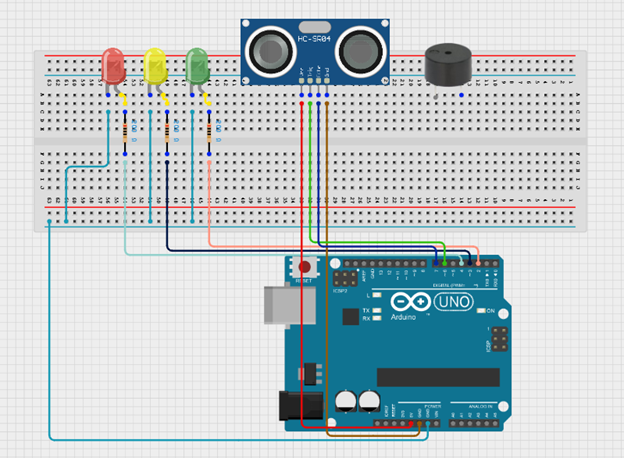
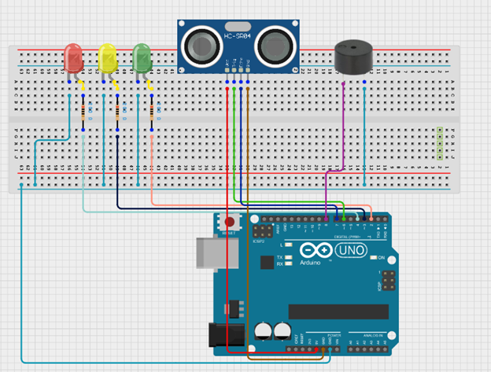
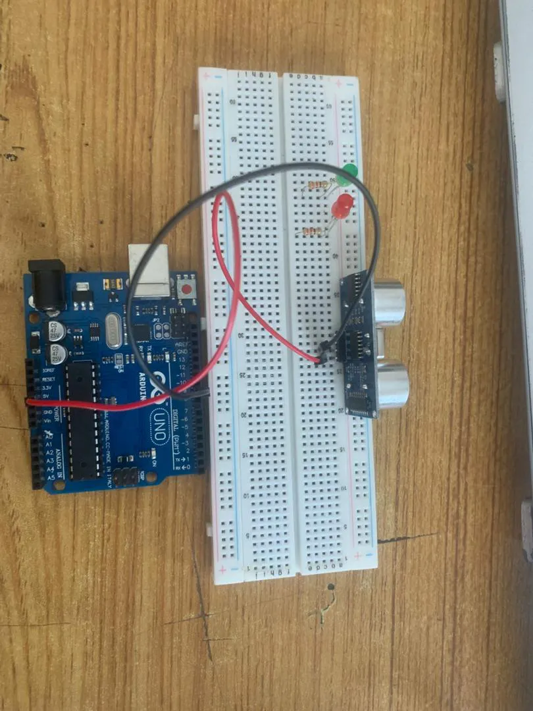
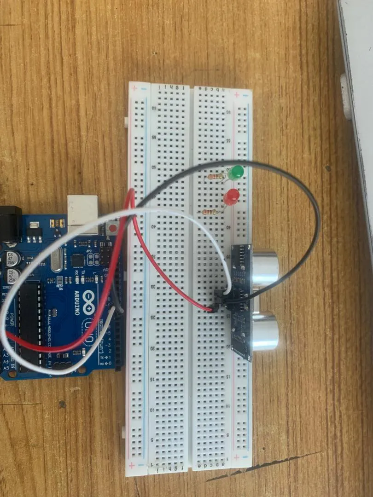
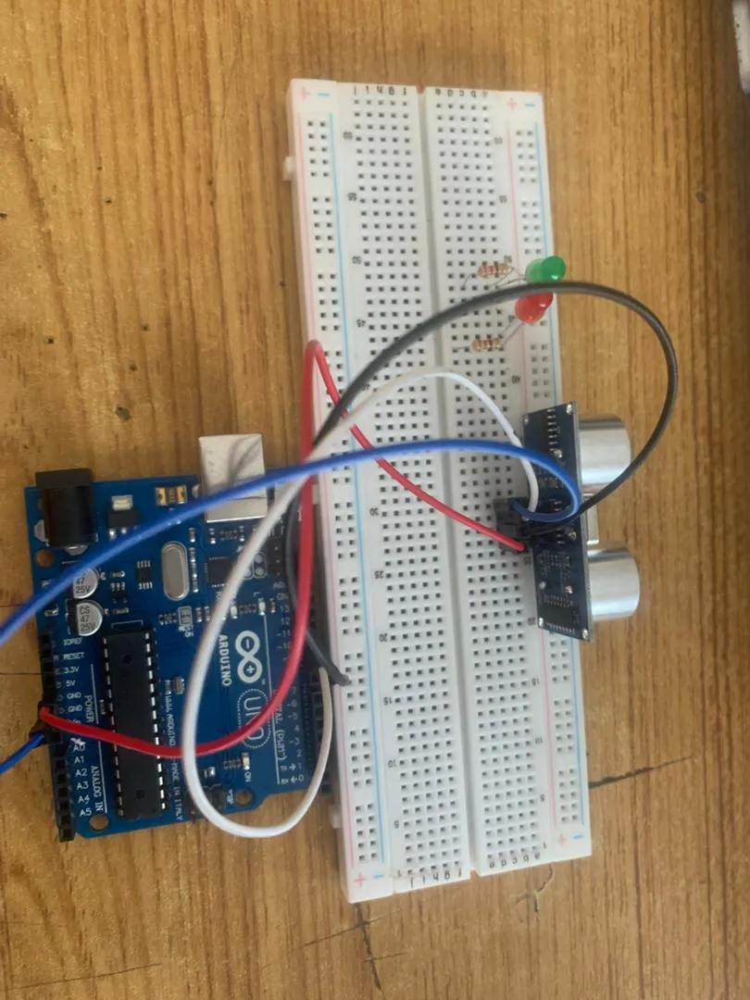
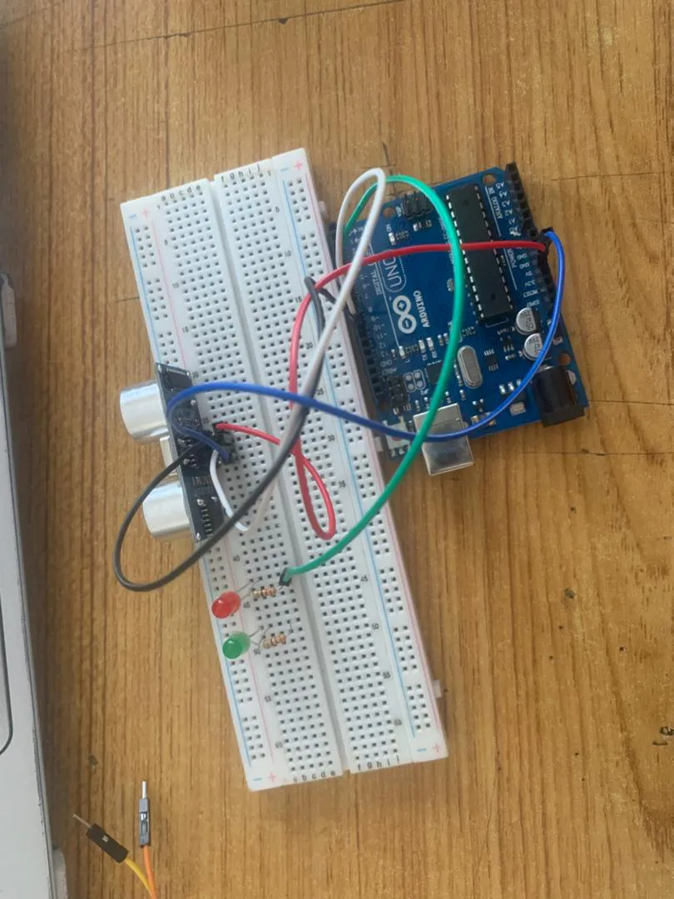
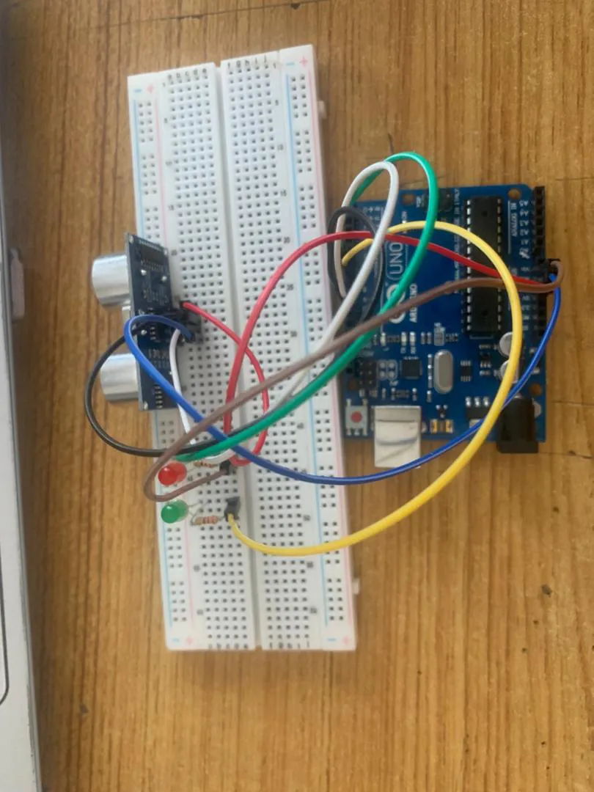
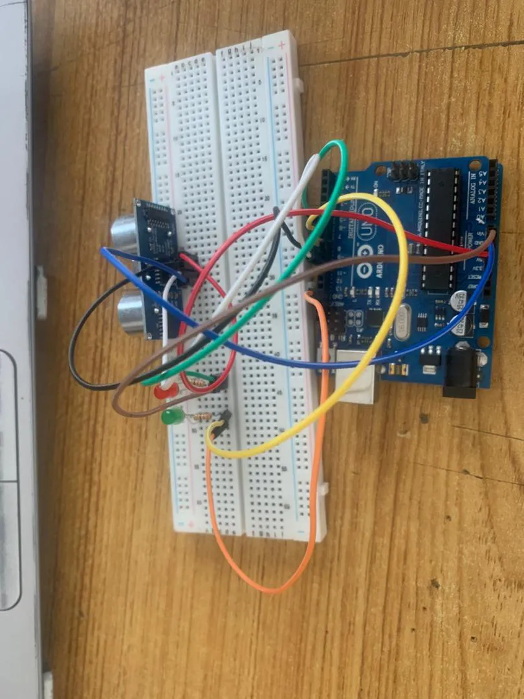

# Project 3.1.1: LED and Ultrasonic Sensor Control 

| **Description** | This project demonstrates how to build a water level monitoring system using an ultrasonic sensor, LEDs, and a buzzer. The ultrasonic sensor measures the water level, the LEDs indicate different water levels, and the buzzer provides an alert when the water reaches a certain point.  |
|------------------|----------------------------------------------------------------|
| **Use case**     | This project can be used in water storage tanks to monitor water levels automatically. For example, the LEDs can indicate whether the tank is low, medium, or full, while the buzzer alerts users when the tank is completely full to prevent water overflow. |


## Components (Things You will need)

|  |  |  |  || |
|-------------------------|-------------------------|-------------------------|-------------------------|-------------------------|-------------------------|


## Building the circuit

Things Needed:

-	Arduino Uno Board: 1
-	Arduino USB cable: 1
-	Breadboard: 1
-	Red LED = 1
-	Green LED = 1
-	Ultrasonic sensor = 1
-	Jumper Wires.


## Mounting the component on the breadboard

### Things needed:
-	Ultrasonic Sensor = 1
-	Breadboard =1
- 	Red LED = 1
- 	Green LED = 1

**Step 1:** Insert the ultrasonic sensor into the breadboard. Then place the red, green, and yellow LEDs beside the sensor, ensuring the positive and negative pins are correctly identified. Connect a resistor to the positive pin of each LED, and insert the buzzer into the breadboard with the positive and negative pins properly positioned.

.

## WIRING THE CIRCUIT


**Step 2:** Connect the positive pins of the LEDs to their respective digital pins on the Arduino Uno through resistors using jumper wires, and connect all the negative pins of the LEDs to the GND pin on the Arduino Uno.
NB: The resistor is added to limit the amount of current flowing through the LED, helping to protect the LED from damage and ensuring it operates safely.


.

**Step 3:** Connect the VCC pin of the ultrasonic sensor to the 5V pin on the Arduino Uno and connect the GND pin to GND. Then connect the TRIG pin to Digital Pin 7 and the ECHO pin to Digital Pin 6 on the Arduino 
Uno using jumper wires.

.


**Step 4:** Connect the positive pin (+) of the buzzer to a digital pin on the Arduino Uno (for example Digital Pin 8), and connect the negative pin (–) to the GND pin on the Arduino Uno.




<!-- **Step 2:** Connect one end of black  male-to-male jumper wire to the TRIG pin of the ultrasonic sensor on the breadboard and the other end to digital pin number 9 on the Arduino UNO as shown below.

. -->

<!-- **Step 3:** Connect one end of white  male-to-male jumper wire to the ECHO pin of the ultrasonic sensor on the breadboard and the other end to digital pin number 10 on the Arduino UNO as shown below.

. -->

<!-- **Step 4:**Connect one end of blue male-to-male jumper wire to the GND pin of the ultrasonic sensor on the breadboard and the other end to GND on the Arduino UNO as shown below.

. -->
<!-- 
**Step 5:** Connect one end of the green male-to-male jumper wire to the positive pin of the LED and the other end to digital pin 13 on the Arduino Uno board as shown in the picture below.

. -->
<!-- 
**Step 6:** Connect one end of the brown  male-to-male jumper wire to the negative pin of Red LED on the bread board to GND on the Arduino UNO.

. -->
<!-- 
**Step 7:** Connect one end of the yellow  male-to-male jumper wire to the positive pin of Green LED on the bread board to digital pin number 7 on the Arduino UNO through the resistor as shown below.

. -->

<!-- **Step 8:** Connect one end of the orange male-to-male jumper wire to the negative pin of Red LED on the bread board to GND on the Arduino UNO.

. -->


## PROGRAMMING

**Step 1:** Open your Arduino IDE. See how to set up here: [Getting Started](../../getting-started/overview.md).

**Step 2:** type the following codes below.
``` cpp
// Include comments to explain the code
const int trigPin = 9;    // Trigger pin of ultrasonic sensor
const int echoPin = 10;   // Echo pin of ultrasonic sensor
const int redLed = 6;     // Pin connected to Red LED
const int greenLed = 7;   // Pin connected to Green LED

long duration;  // Variable to store duration of sound wave travel
int distance;   // Variable to store distance calculated

void setup() {
  // Set up the pins as input or output
  pinMode(trigPin, OUTPUT);
  pinMode(echoPin, INPUT);
  pinMode(redLed, OUTPUT);
  pinMode(greenLed, OUTPUT);

  // Start serial communication
  Serial.begin(9600);
}

void loop() {
  // Clear the trigPin by setting it LOW
  digitalWrite(trigPin, LOW);
  delayMicroseconds(2);

  // Set the trigPin HIGH for 10 microseconds
  digitalWrite(trigPin, HIGH);
  delayMicroseconds(10);
  digitalWrite(trigPin, LOW);

  // Read the echoPin, and calculate the distance
  duration = pulseIn(echoPin, HIGH);
  distance = duration * 0.034 / 2;  // Convert to distance in cm

  // Print the distance to the Serial Monitor
  Serial.print("Distance: ");
  Serial.print(distance);
  Serial.println(" cm");

  // LED control based on distance
  if (distance < 10) {  // If object is within 10 cm
    digitalWrite(redLed, HIGH);  // Turn on Red LED
    digitalWrite(greenLed, LOW); // Turn off Green LED
  } else {
    digitalWrite(redLed, LOW);   // Turn off Red LED
    digitalWrite(greenLed, HIGH); // Turn on Green LED
  }

  // Delay to allow for stable readings
  delay(500);
}

```

**Step 4:** Save your code. _See the [Getting Started](../../getting-started/overview.md) section_

**Step 5:** Select the arduino board and port _See the [Getting Started](../../getting-started/overview.md) section:Selecting Arduino Board Type and Uploading your code_.

**Step 6:** Upload your code. _See the [Getting Started](../../getting-started/overview.md) section:Selecting Arduino Board Type and Uploading your code_


## CONCLUSION
This project demonstrated how an ultrasonic sensor, LEDs, and a buzzer can be used together to monitor water levels in a tank. It helped in understanding how distance sensing works and how outputs like LEDs and buzzers can provide visual and audio alerts for real-life applications such as water level monitoring systems.
