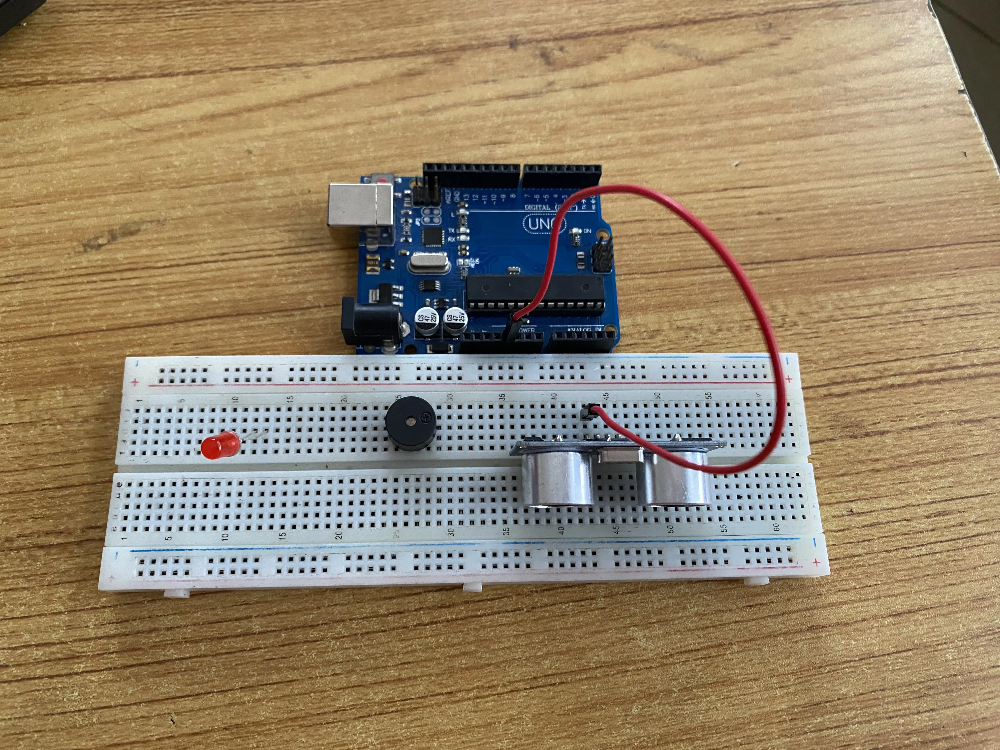
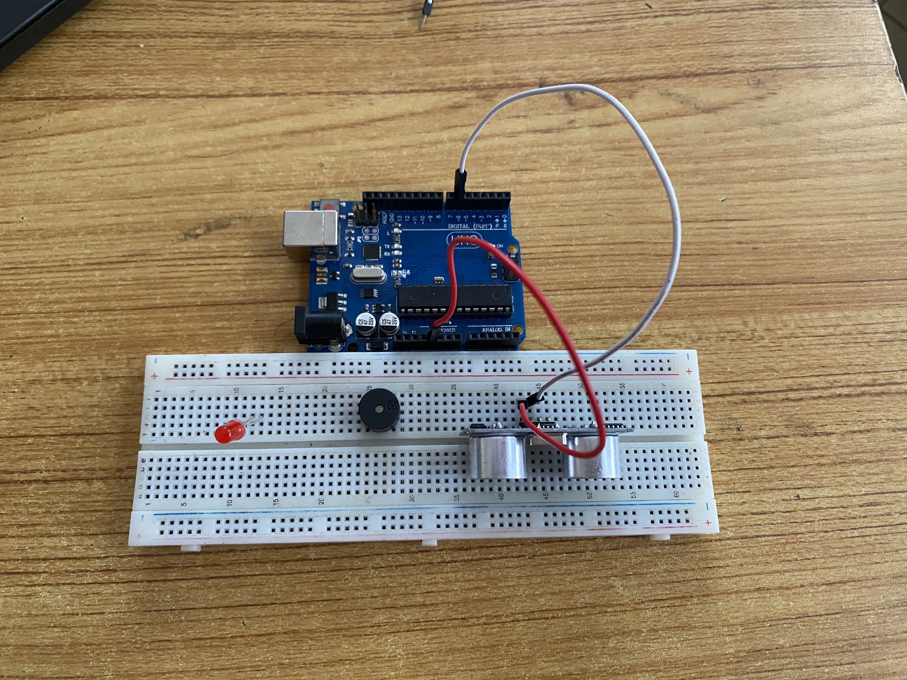
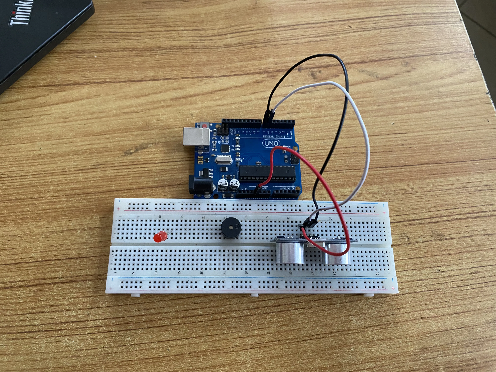
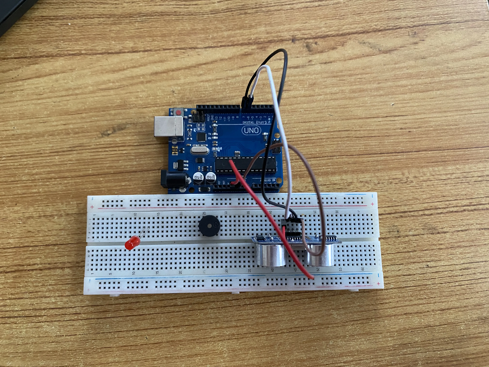
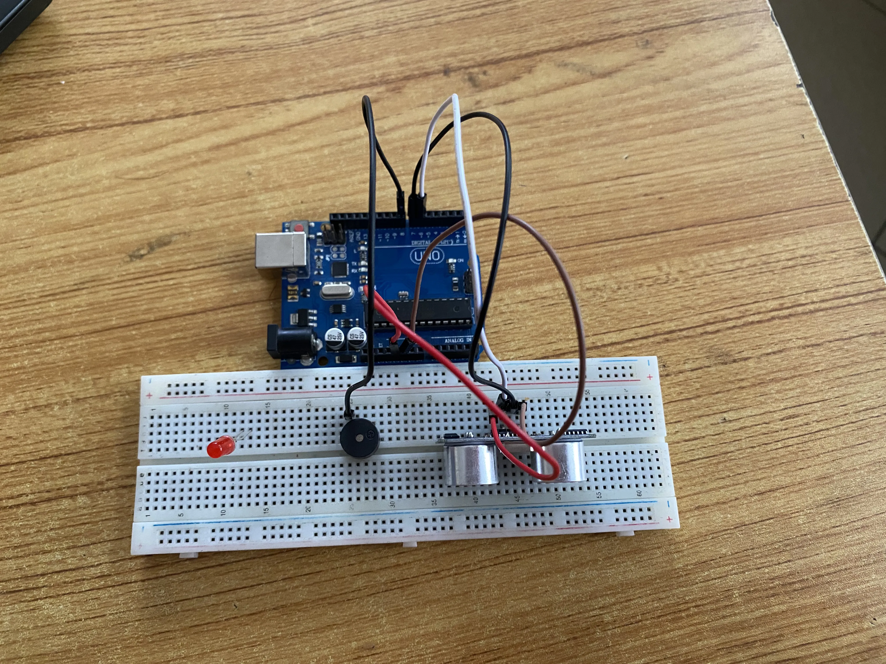
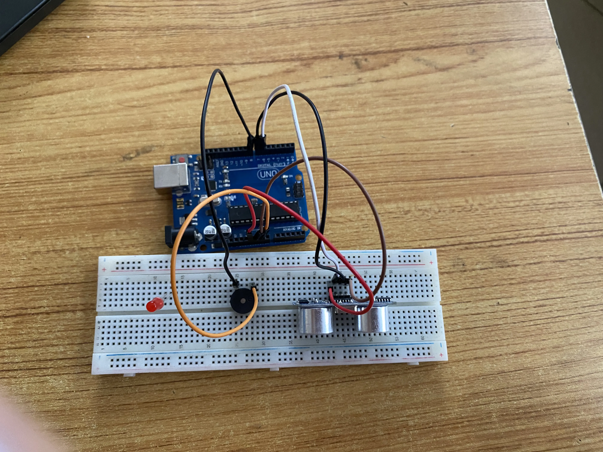
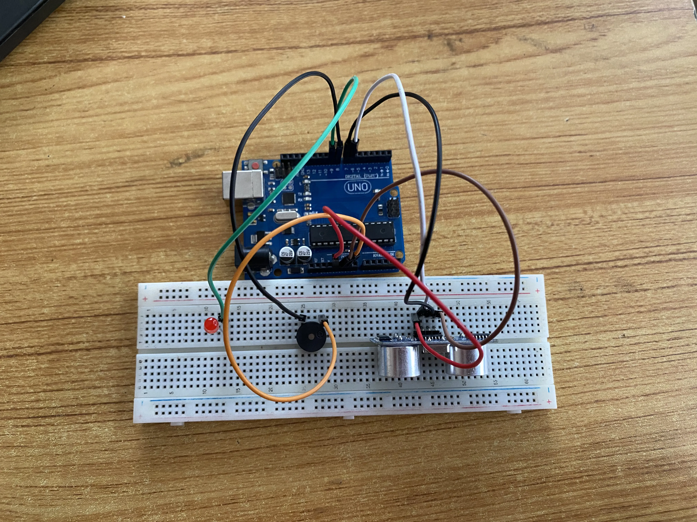
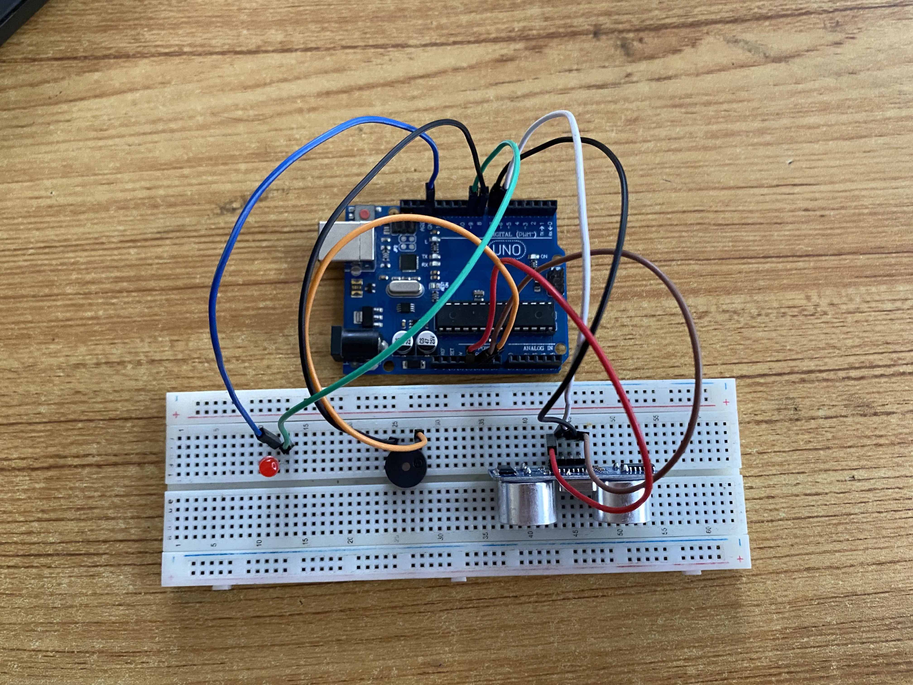

# Project 3.2.1: SMART SECURITY SYSTEM

| **Description** | This project demonstrates a smart security system using an ultrasonic sensor, a red LED, and a buzzer. The ultrasonic sensor detects nearby objects, and when movement or an object is within a set distance, the red LED turns on and the buzzer activates to provide an alert. |
|------------------|----------------------------------------------------------------|
| **Use case**     | This project can be used in parking systems to detect vehicles approaching a restricted area. When a car gets too close, the LED lights up and the buzzer sounds as a warning signal. |

## Components (Things You will need)

|  |  |  |  ||  |  |
|-------------------------|-------------------------|-------------------------|-------------------------|-------------------------|-------------------------|-------------------------|

## Building the circuit

Things Needed:

-	Arduino Uno = 1
-	Arduino USB cable = 1
-	Red LED = 1
-	Ultrasonic sensor = 1
-	Buzzer = 1
-	Red jumper wire = 1
-	Blue jumper wire = 1
-	Black jumper wires = 2
-	White jumper wire = 1
-	Orange jumper wire = 1
-	Green jumper wire = 1
-	Brown jumper wire =1


## Mounting the component on the breadboard

**Step 1:** Insert the ultrasonic sensor into the breadboard. Then place the red LED into the breadboard beside the buzzer, making sure to identify the positive (long pin) and negative (short pin) correctly.

.

## WIRING THE CIRCUIT

**Step 2:** Connect the negative pin of the LED and the negative pin of the buzzer to the GND on the Arduino Uno using jumper wires. Then connect the positive pin of the LED through a resistor to Digital Pin 3, and connect the positive pin of the buzzer to Digital Pin 4 on the Arduino Uno.

.

**Step 3:** Connect the ultrasonic sensor to the Arduino Uno by linking the VCC pin to 5V, the GND pin to GND, the TRIG pin to Digital Pin 7, and the ECHO pin to Digital Pin 6 using jumper wires as shown in the circuit setup.

.

_**NB:** Make sure you identify where the positive pin (+) and the negative pin (-) is connected to on the breadboard. The longer pin of the LED is the positive pin and the shorter one, the negative PIN_.


<!-- 
### Things Needed:

-	Red jumper wire = 1
-	Blue jumper wire = 1
-	Black jumper wires = 2
-	White jumper wire = 1
-	Orange jumper wire = 1
-	Green jumper wire = 1
-	Brown jumper wire =1


**Step 1:** Connect one end of red male-to-male jumper wire to the VCC pin of the ultrasonic sensor on the breadboard and the other end to 5v on the Arduino UNO as shown below.



**Step 2:** Connect one end of white male-to-male jumper wire to the TRIG pin of the ultrasonic sensor on the breadboard and the other end to digital pin number 6 on the Arduino UNO as shown below.

.

**Step 3:** Connect one end of black male-to-male jumper wire to the ECHO pin of the ultrasonic sensor on the breadboard and the other end to digital pin number 7 on the Arduino UNO as shown below.



**Step 4:**Connect one end of brown male-to-male jumper wire to the GND pin of the ultrasonic sensor on the breadboard and the other end to GND on the Arduino UNO as shown below.

.

**Step 5:** Connect one end of the black male-to-male jumper wire to the positive pin of the buzzer on the breadboard to digital pin number 8 on the Arduino UNO as shown below

.

**Step 6:** Connect one end of the orange male-to-male jumper wire to the negative pin of the buzzer on the bread board to GND on the Arduino UNO.

.

**Step 7:** Connect one end of the green male-to-male jumper wire to the positive pin of Red LED on the breadboard to digital pin number 9 on the Arduino UNO as shown below.

.

**Step 8:** Connect one end of the blue male-to-male jumper wire to the negative pin of Red LED on the bread board to GND on the Arduino UNO.

. -->
_make sure you connect the arduino usb use blue cable to the Arduino board_.

## PROGRAMMING

**Step 1:** Open your Arduino IDE. See how to set up here: [Getting Started](../../getting-started/overview.md).

``` cpp
// Pin definitions
const int trigPin = 6;
const int echoPin = 7;
const int redLEDPin = 9;
const int buzzerPin = 8;
const int distanceThreshold = 20; // Threshold in cm

void setup() {
 // put your setup code here, to run once:
  pinMode(trigPin, OUTPUT);
  pinMode(echoPin, INPUT);
  pinMode(redLEDPin, OUTPUT);
  pinMode(buzzerPin, OUTPUT);
  Serial.begin(9600);
}

void loop() { 
 // put your main code here, to run repeatedly:
  long duration;
  int distance;

  // Trigger ultrasonic sensor
  digitalWrite(trigPin, LOW);
  delayMicroseconds(2);
  digitalWrite(trigPin, HIGH);
  delayMicroseconds(10);
  digitalWrite(trigPin, LOW);

  // Read echo pin
  duration = pulseIn(echoPin, HIGH);
  distance = duration * 0.034 / 2;

  // Check distance and activate alarm
  if (distance < distanceThreshold) {
    digitalWrite(redLEDPin, HIGH);
    tone(buzzerPin, 1000);
  } else {
    digitalWrite(redLEDPin, LOW);
    noTone(buzzerPin);
  }

  delay(100);
  //Read the Serial monitor
  Serial.print(distance);
  Serial.println("cm");
  delay(500);
}
  ```

**Step 4:** Save your code. _See the [Getting Started](../../getting-started/overview.md) section_

**Step 5:** Select the arduino board and port _See the [Getting Started](../../getting-started/overview.md) section:Selecting Arduino Board Type and Uploading your code_.

**Step 6:** Upload your code.

## CONCLUSION
This project demonstrated how an ultrasonic sensor can be used with an Arduino Uno to detect nearby objects and trigger an LED and buzzer as alerts. It helped in understanding distance sensing, object detection, and how sensors can be used in simple security and warning systems.


