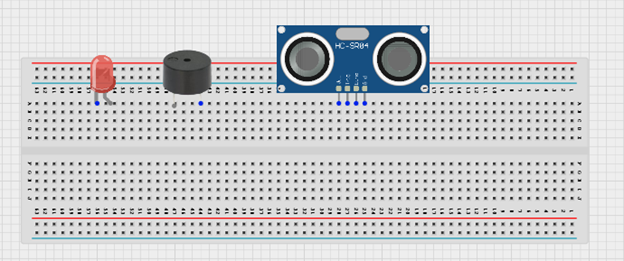

# Smart Security System

Welcome to the **Smart Security System** workspace. This project contains practical use cases and step-by-step tutorials to build and program with STEMAIDE.

Explore the lessons below to begin.

---

---

### Project Lessons

  <a href="3.2.1.Smart Security System.md" class="lesson-card">
    

      
    

    
1

    

      <h4>SMART SECURITY SYSTEM</h4>
      
This project demonstrates a smart security system using an ultrasonic sensor, a red LED, and a buzzer. The ultrasonic sensor detects nearby objects, and when movement or an object is...

      Learn More →
    

  </a>

