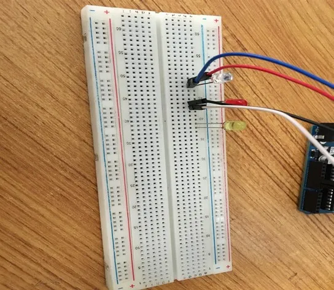
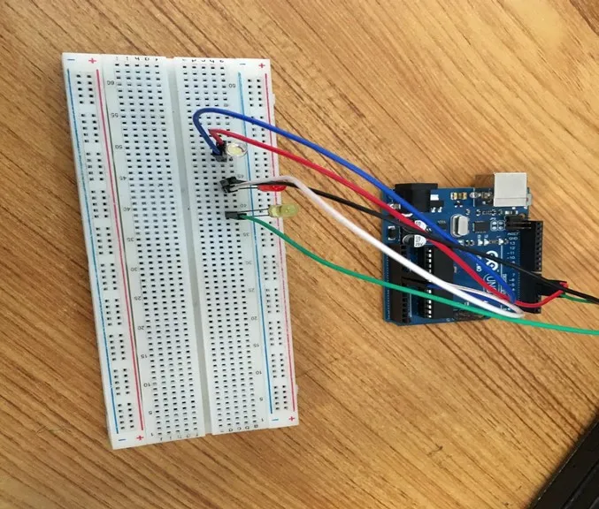
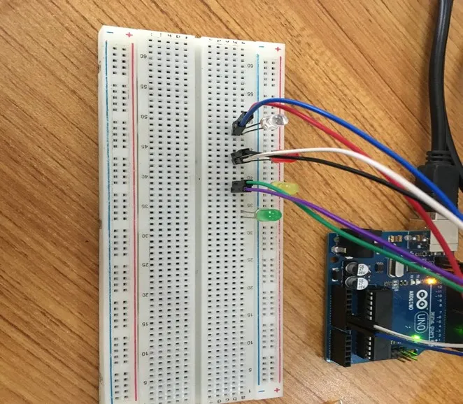
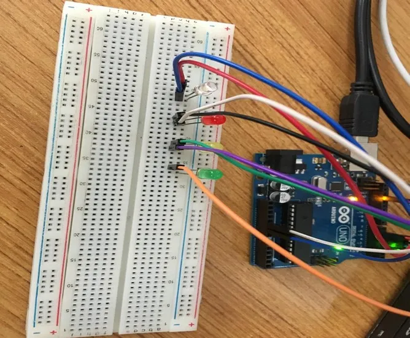
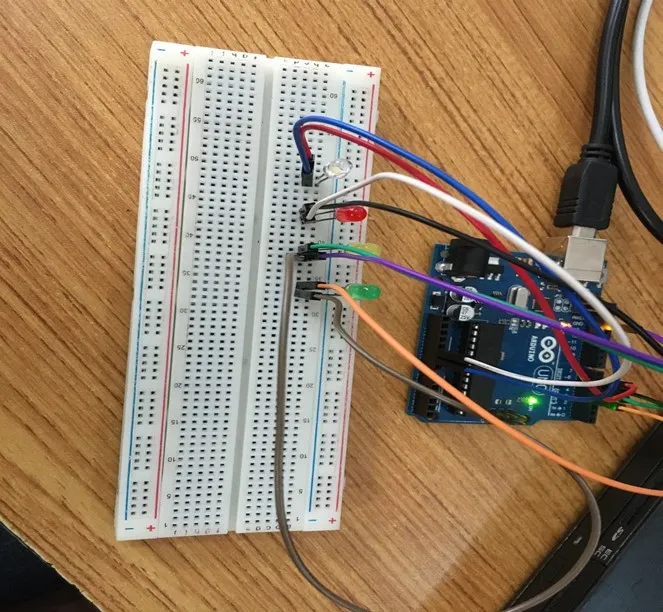
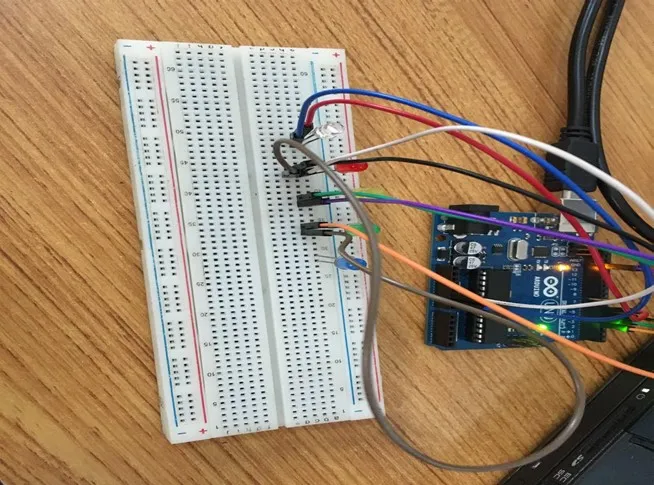
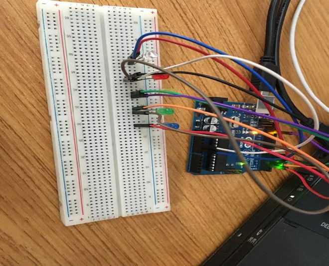
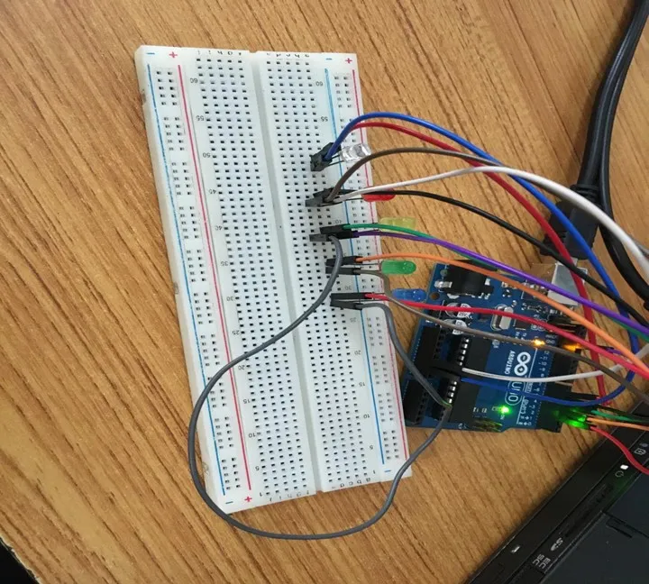
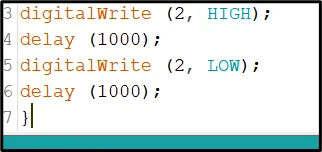

# Project 1.1.10: PARTY LIGHTNENING

| **Description** | This project is focused on turning 5 lights on and off one after the other. |
|------------------|----------------------------------------------------------------|
| **Use case**     | Entering into a party area, you might see the room glowing with five different beautiful bright lights, turning on and going off one after the other which makes the room very nice and giving it an attractive/decorative setting. |

## Components (Things You will need)

|  |  |  |  ||
|-------------------------|-------------------------|-------------------------|-------------------------|-------------------------|

## Building the circuit

Things Needed:

-	Arduino Uno = 1
-	Arduino USB cable = 1
-	White LED = 1
-	Red LED = 1
-	Yellow LED = 1
-	Green LED = 1
-	Red jumper wires = 2
-	Blue jumper wires = 1
-	Black jumper wires = 1
-	Green jumper wires = 1
-	Purple jumper wires = 1
-	Orange jumper wires = 1
-	Brown jumper wires = 1
-	Grey jumper wires = 1

## Mounting the component on the breadboard

## Mounting the component on the breadboard

**Step 1:** Take the breadboard, the white LED and insert it into the vertical connectors on the breadboard.

.

_**NB:** Make sure you identify where the positive pin (+) and the negative pin (-) is connected to on the breadboard. The longer pin of the LED is the positive pin and the shorter one, the negative PIN_.

## WIRING THE CIRCUIT


**Step 2:** Connect one end of red male-to-male jumper wire to the positive pin of the white LED on the breadboard and the other end to hole number 6 on the Arduino UNO.

.

**Step 3:** Connect one end of the blue male-to-male jumper to the negative pin of the white LED on the breadboard and the other end to GND on the Arduino UNO.

.

**Step 4:** Take the red LED and insert it into the vertical connectors on the breadboard.

.

**Step 5:** Connect one end of the black male-to-male jumper wire to the positive pin of the red LED on the breadboard and the other end to hole number 5 on the Arduino UNO.

**Step 6:** Connect one end of the black male-to-male jumper wire to the positive pin of the red LED on the breadboard and the other end to hole number 5 on the Arduino UNO.

.

**Step 7:** Connect one end of the white male-to-male jumper wire to the negative pin of the white LED on the breadboard and the other end to GND on the Arduino UNO.

.

**Step 8:** Take the yellow LED and insert it into the vertical connectors on the breadboard.

.

**Step 9:** Connect one end of the green male-to-male jumper wire to the positive pin of the yellow LED on the breadboard and the other end to hole number 4 on the Arduino UNO.

.

**Step 10:** Connect one end of the purple male-to-male jumper wire to the negative pin of the yellow LED on the breadboard and the other end to GND on the Arduino UNO.

.

**Step 11:** Take the green LED and insert it into the vertical connectors on the breadboard.

.

**Step 12:** Connect one end of the orange male-to-male jumper wire to the positive pin of the green LED on the breadboard and the other end to hole number 3 on the Arduino UNO.

.

**Step 13:** Connect one end of the brown male-to-male jumper wire to the negative pin of the green LED on the breadboard and the other end to GND on the Arduino UNO.

.

**Step 14:** Take the blue LED and insert it into the vertical connectors on the breadboard.

.

**Step 15:** Connect one end of the red male-to-male jumper wire to the positive pin of the blue LED on the breadboard and the other end to hole number 2 on the Arduino UNO.

.

**Step 16:** Connect one end of the gray male-to-male jumper wire to the negative pin of the blue LED on the breadboard and the other end to the negative pinhole of any of the any other LED’s  on the breadboard

.

_make sure you connect the arduino usb use blue cable to the Arduino board_.

## PROGRAMMING

**Step 1:** Open your Arduino IDE. See how to set up here: [Getting Started](../../getting-started/overview.md).

**Step 2:** Type the following codes in the void setup function as shown in the image below.
   
   ```
   pinMode(6,OUTPUT);
   pinMode(5,OUTPUT);
   pinMode(4,OUTPUT);
   pinMode(3,OUTPUT);
   pinMode(2,OUTPUT);
   ```

.

_**NB:** pinMode will help the Arduino board to decide which port should be activated.  The code below will turn off the three light bulbs._

**Step 3:** Type the following codes in the void loop function.as shown in the image below;
   ```
   digitalWrite (6, HIGH);
   delay (1000);
   digitalWrite (6, LOW);
   delay (1000);
   ```
.

**Step 4:** let continue by ting the following codes;
   ```
   digitalWrite (5, HIGH);
   delay (1000);
   digitalWrite (5, LOW);
   delay (1000);
   ```
.

**Step 5:** let continue by ting the following codes;
   ```
   digitalWrite (4, HIGH);
   delay (1000);
   digitalWrite (4, LOW);
   delay (1000);

   ```
.

**Step 6:** let continue by ting the following codes;
   ```
   digitalWrite (3, HIGH);
   delay (1000);
   digitalWrite (3, LOW);
   delay (1000);
   ```
.

**Step 7:** let finish by ting the following codes;
   ```
   digitalWrite (2, HIGH);
   delay (1000);
   digitalWrite (2, LOW);
   delay (1000);
   ```
.


**Step 5:** Save your code. _See the [Getting Started](../../getting-started/overview.md) section_

**Step 6:** Select the arduino board and port _See the [Getting Started](../../getting-started/overview.md) section:Selecting Arduino Board Type and Uploading your code_.

**Step 7:** Upload your code. _See the [Getting Started](../../getting-started/overview.md) section:Selecting Arduino Board Type and Uploading your code_

## CONCLUSION

In a nutshell, the project centered around five blinking LEDs offers hands-on experience in synchronized LED control. By creating a blinking pattern across all five LEDs, participants gain insights into circuit connections, loop-based programming, and coordinated timing. This endeavor serves as a stepping stone for more advanced electronics projects, highlighting the concept of repetitive actions and sparking interest in practical electronics applications.
