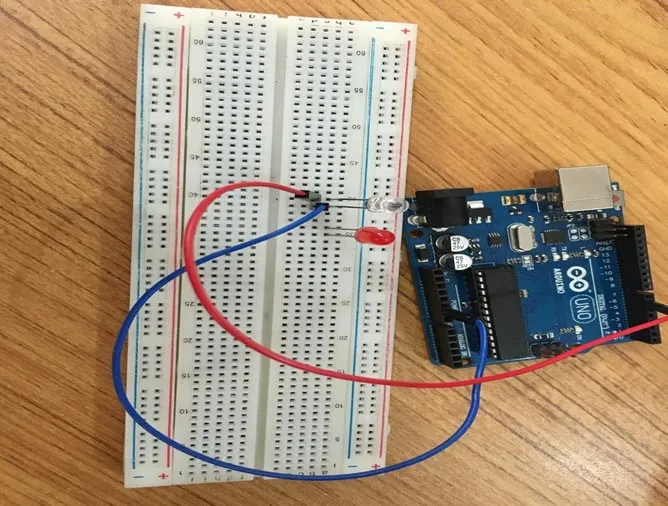
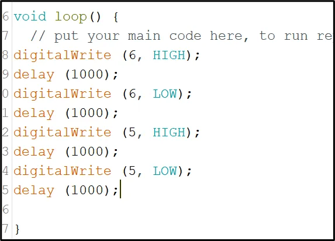

# Project 1.1.4: DOUBLE LED BLINK

| **Description** | This project shows how to make two LEDs blink one after the other using an Arduino Uno. It helps learners understand basic timing and control of multiple outputs.
|------------------|----------------------------------------------------------------|
| **Use case**     | This type of blinking pattern can be used in simple warning lights, signal systems, and effects similar to police siren lights. |

## Components (Things You will need)

|  |  |  |  | ||
|-------------------------|-------------------------|-------------------------|-------------------------|-------------------------|-------------------------|

## Building the circuit

### Things Needed:

-	Arduino Uno = 1
-	Arduino USB cable = 1
<!-- -	White LED = 1 -->
-	Red LED = 2
-	Jumper wires = 2
-  Breadboard = 1
-  Resistor = 2
## Mounting the component on the breadboard

**Step 1:** Place the two LEDs on the breadboard. For each LED, the longer leg is the positive pin, while the shorter leg is the negative pin.

.

_**NB:** Make sure you identify where the positive pin (+) and the negative pin (-) is connected to on the breadboard. The longer pin of the LED is the positive pin and the shorter one, the negative PIN_.

## WIRING THE CIRCUIT

### Things Needed:

- Jumper wires = 4

**Step 2:** Connect the positive leg of the first LED to pin 6 on the Arduino through a 220Ω resistor. Connect its negative leg to GND.

.

**Step 3:** Connect the positive leg of the second LED to pin 5 on the Arduino through a 220Ω resistor. Connect its negative leg to GND.

.

<!-- **Step 4:** Take the red LED and insert it into the vertical connectors on the breadboard.

<!-- missing image: . --> -->

<!-- **Step 5:** Connect one end of the black male-to-male jumper wire to the positive pin of the red LED on the breadboard and the other end to hole number 5 on the Arduino UNO.

**Step 6:** Connect one end of the black male-to-male jumper wire to the positive pin of the red LED on the breadboard and the other end to hole number 5 on the Arduino UNO. -->

<!-- .

**Step 7:** Connect one end of the white male-to-male jumper wire to the negative pin of the white LED on the breadboard and the other end to GND on the Arduino UNO. -->

<!-- . -->

_make sure you connect the arduino usb use blue cable to the Arduino board_.

## PROGRAMMING

**Step 1:** Open your Arduino IDE. See how to set up here: [Getting Started](../../getting-started/overview.md).

**Step 2:** Type the following codes in the void setup function as shown in the image below.
   ```
   pinMode (6, OUTPUT);
   pinMode (5, OUTPUT);
   ```

.

_**NB:** pinMode will help the Arduino board to decide which port should be activated. The code below will turn off the two light bulbs._

**Step 3:** Type the following codes in the void setup function as shown below. 

   ```
   digitalWrite (6, HIGH);
   delay (1000);
   digitalWrite (6, LOW);
   delay (1000);
   digitalWrite (5, HIGH);
   delay (1000);
   digitalWrite (5, LOW);
   delay (1000);
   ```

.

**Step 4:** Save your code. _See the [Getting Started](../../getting-started/overview.md) section_

**Step 5:** Select the arduino board and port _See the [Getting Started](../../getting-started/overview.md) section:Selecting Arduino Board Type and Uploading your code_.

**Step 6:** Upload your code. _See the [Getting Started](../../getting-started/overview.md) section:Selecting Arduino Board Type and Uploading your code_

## OBSERVATION

.

## CONCLUSION

This project helps learners understand how to control two LEDs in sequence using Arduino. It is a simple introduction to timing, blinking patterns, and multiple output control.
