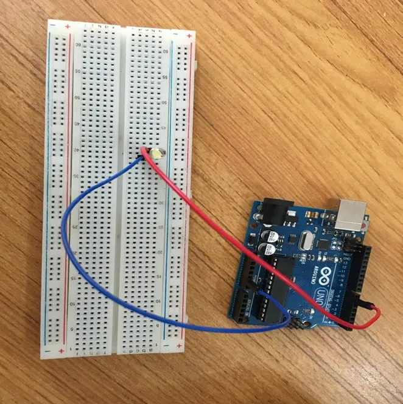
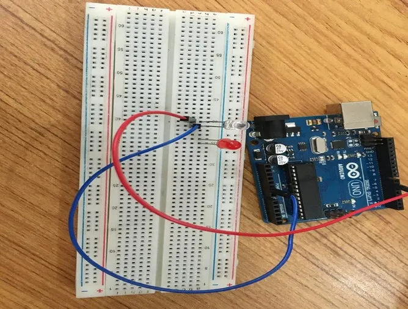
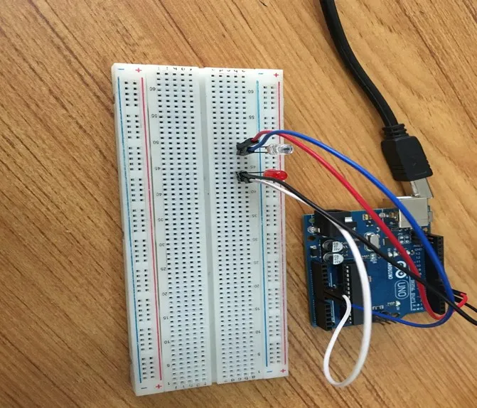
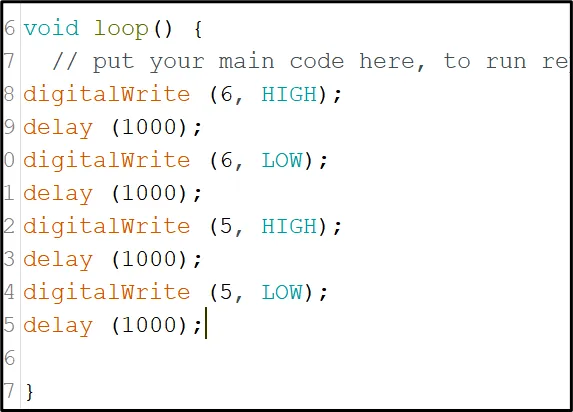
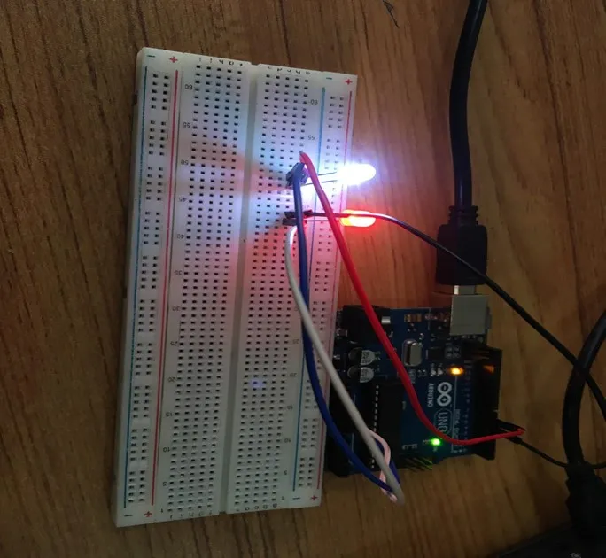

# Project 1.1.4: DOUBLE LED BLINK

| **Description** | Double LED blink is a project that gives deeper insight on programming LEDS where you will program two LEDS to turn on and off one after the other. |
|------------------|----------------------------------------------------------------|
| **Use case**     | The police siren uses two different light colors (blue and red) but one turns on for a number of mini seconds then it goes off for the other to turn on and go off. This cycle repeats itself and that’s how come we have the police light siren. |

## Components (Things You will need)

|  |  |  |  ||
|-------------------------|-------------------------|-------------------------|-------------------------|-------------------------|

## Building the circuit

### Things Needed:

-	Arduino Uno = 1
-	Arduino USB cable = 1
-	White LED = 1
-	Red LED = 1
-	Red jumper wires = 1
-	Blue jumper wires = 1

## Mounting the component on the breadboard

## Mounting the component on the breadboard

**Step 1:** Take the breadboard, the white LED and insert it into the vertical connectors on the breadboard.

.

_**NB:** Make sure you identify where the positive pin (+) and the negative pin (-) is connected to on the breadboard. The longer pin of the LED is the positive pin and the shorter one, the negative PIN_.

## WIRING THE CIRCUIT

### Things Needed:

- Red male-male-to-male jumper wires = 1
- Black male-to-male jumper wires = 1
- White male-to-male jumper wires = 1
- Blue male-to-male jumper wires = 1

**Step 2:** Connect one end of red male-to-male jumper wire to the positive pin of the white LED on the breadboard and the other end to hole number 6 on the Arduino UNO.

.

**Step 3:** Connect one end of the blue male-to-male jumper to the negative pin of the white LED on the breadboard and the other end to GND on the Arduino UNO.

.

**Step 4:** Take the red LED and insert it into the vertical connectors on the breadboard.

.

**Step 5:** Connect one end of the black male-to-male jumper wire to the positive pin of the red LED on the breadboard and the other end to hole number 5 on the Arduino UNO.

**Step 6:** Connect one end of the black male-to-male jumper wire to the positive pin of the red LED on the breadboard and the other end to hole number 5 on the Arduino UNO.

.

**Step 7:** Connect one end of the white male-to-male jumper wire to the negative pin of the white LED on the breadboard and the other end to GND on the Arduino UNO.

.

_make sure you connect the arduino usb use blue cable to the Arduino board_.

## PROGRAMMING

**Step 1:** Open your Arduino IDE. See how to set up here: [Getting Started](../../getting-started/overview.md).

**Step 2:** Type the following codes in the void setup function as shown in the image below.
   ```
   pinMode (6, OUTPUT);
   pinMode (5, OUTPUT);
   ```

.

_**NB:** pinMode will help the Arduino board to decide which port should be activated. The code below will turn off the two light bulbs._

**Step 3:** Type the following codes in the void setup function as shown below. 

   ```
   digitalWrite (6, HIGH);
   delay (1000);
   digitalWrite (6, LOW);
   delay (1000);
   digitalWrite (5, HIGH);
   delay (1000);
   digitalWrite (5, LOW);
   delay (1000);
   ```

.

**Step 4:** Save your code. _See the [Getting Started](../../getting-started/overview.md) section_

**Step 5:** Select the arduino board and port _See the [Getting Started](../../getting-started/overview.md) section:Selecting Arduino Board Type and Uploading your code_.

**Step 6:** Upload your code. _See the [Getting Started](../../getting-started/overview.md) section:Selecting Arduino Board Type and Uploading your code_

## OBSERVATION

.

## CONCLUSION

To wrap up, the two-LED blink project offers an insightful introduction to synchronized LED control. By alternately illuminating two LEDs, this project imparts understanding of basic circuitry and programming logic. This endeavor lays a solid foundation for more intricate electronics ventures while illustrating the principle of coordinated actions through programming, igniting curiosity in the realm of practical electronics applications.