# Project 1.3.1: BUTTON LIT

| **Description** | This project shows how to control an LED using a push button with an Arduino Uno. When the button is pressed, the LED turns on, and when the button is released, the LED turns off.|
|------------------|----------------------------------------------------------------|
| **Use case**     | This project can be used as a simple bedside light switch or a control system where a button is used to turn a light on and off. |

## Components (Things You will need)

|  |  |  |  | | |
|-------------------------|-------------------------|-------------------------|-------------------------|-------------------------|-------------------------|

## Building the circuit

Things Needed:

- Arduino Uno = 1
-	Arduino USB cable = 1
-	Resistor = 1
-	Push button = 1
-	Red LED = 1
-	Red jumper wires = 1
-	Black jumper wires = 1
-	Yellow jumper wires = 1
-	Blue jumper wires = 1


## Mounting the component on the breadboard

**Step 1:** Place the LED on the breadboard. The longer leg is the positive pin, while the shorter leg is the negative pin.

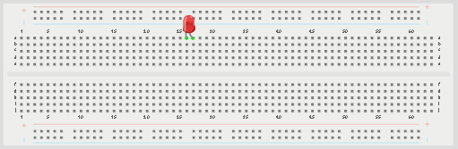.

_**NB:** Make sure you identify where the positive pin (+) and the negative pin (-) is connected to on the breadboard. 

**Step 2:** Connect the positive leg of the LED to pin 13 on the Arduino through a 220Ω resistor.

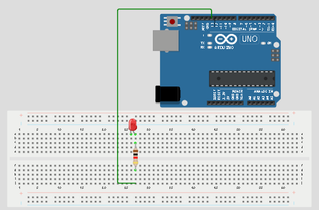.

_**NB:** Make sure you identify where the positive pin (+) and the negative pin (-) is connected to on the breadboard.

**Step 3:** Connect the negative leg of the LED to GND on the Arduino Uno.

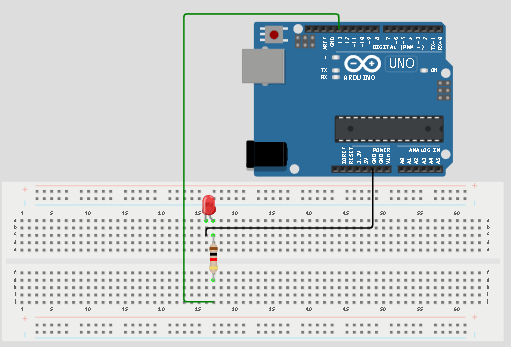.

**Step 4:** Place the push button on the breadboard.

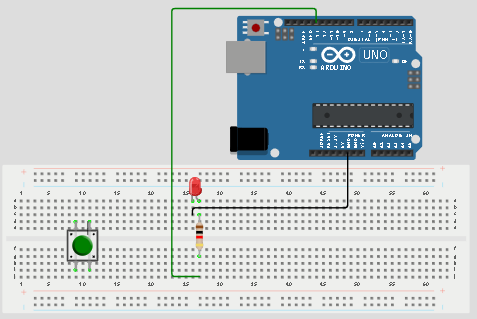.

**Step 5:** Connect one side of the push button to GND on the Arduino Uno.

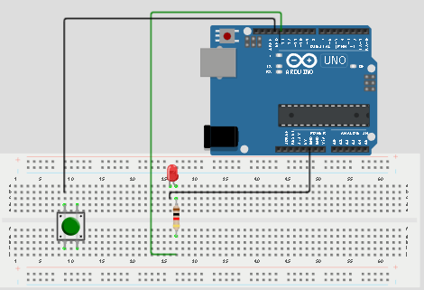.

**Step 6:** Connect the other side of the push button to pin 2 on the Arduino Uno.

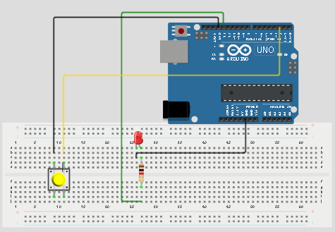.

_**NB:** This completes the circuit for the LED, allowing current to flow from the digital pin, through the LED and back to ground.

<!-- ## WIRING THE CIRCUIT

### Things Needed:

- Red male-male-to-male jumper wires = 1
- Black male-to-male jumper wires = 1
- Yellow male-to-male jumper wires = 1
- Blue male-to-male jumper wires = 1


**Step 1:** Connect red male-to-male jumper wire from the free end of the resistor to digital pin (13) on the Arduino UNO.


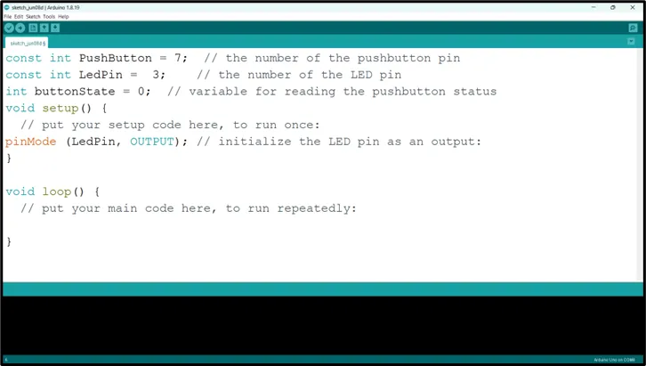

**Step 2:** Connect Black male-to-male jumper wire from the free end of the LED negative pin power GND (Ground) on the Arduino UNO.

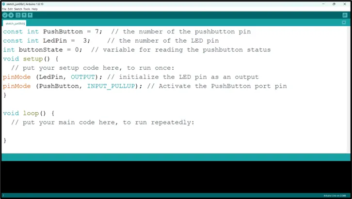

**Step 3:** Connect Yellow male-to-male jumper wire from one Pin of the Push Button as a negative to power GND (Ground) on the Arduino UNO.

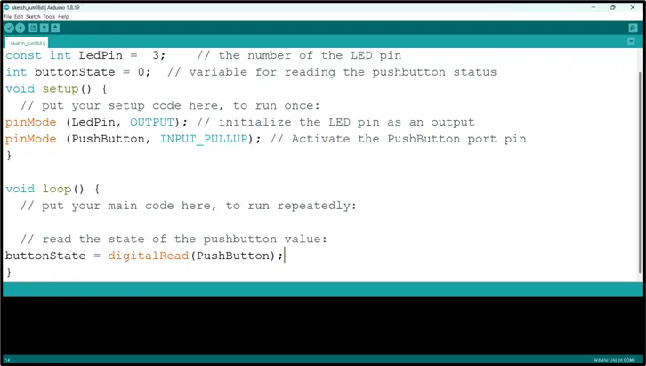

**Step 4:** Finally, connect blue male-to-male jumper wire from the other Pin of the push button (not connected to GND) to any digital pin on the Arduino UNO. Let's use digital pin 2 in this tutorial.

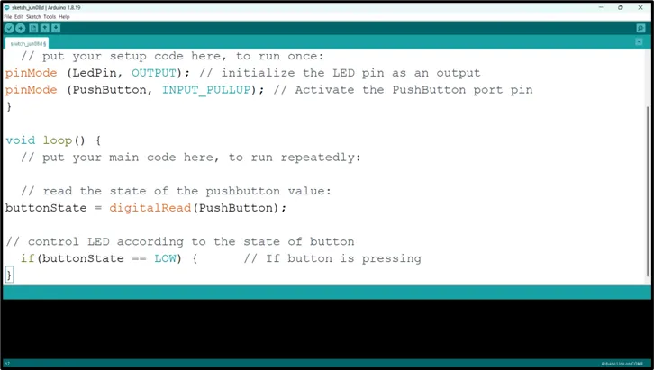 -->

_Make sure to connect the Arduino USB blue cable to the Arduino board_.


## PROGRAMMING

**Step 1:** Open your Arduino IDE. See how to set up here: [Getting Started](../../getting-started/overview.md).

**Step 2:** Type ``` const int PushButton = 2;```

<!-- 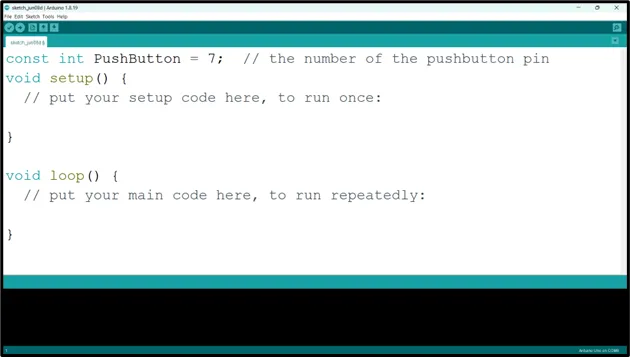. -->

<!-- **NB:** It is advisable to write a comment after each line of code as it has been done earlier.
Also, after each line of code and comment click Enter key to move to the next line or get a new space to begin your next line of code. -->

**Step 3:** Type ``` const int LedPin = 13;``` as shown in the picture below.

<!-- 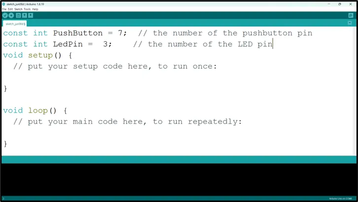.

**NB:** The code we typed earlier is for the LED as the comment tells us, so the code above is for the Push Button to be activated (Push Button and the LED variable code will be use later in the code). -->

**Step 4:** Type ``` int buttonState = 0;``` 

<!-- 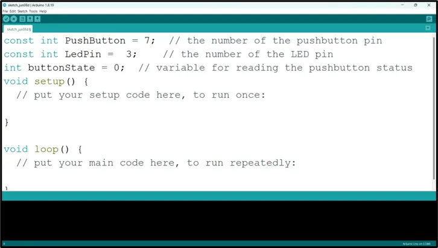.

**NB:** The is LED On is a variable that will keep track of the state of the LED. -->

**Step 5:** Type ``` pinMode (LedPin, OUTPUT);``` 
<!-- 
.

**NB:** pinMode will help the Arduino board to decide which port should be activated. -->

**Step 6:** Type ``` pinMode (PushButton, INPUT_PULLUP);``` 

<!-- .

**NB:** pinMode will help the Arduino board to decide which port should be activated. -->

**Step 7:** Type ``` buttonState = digitalRead(PushButton);``` 

<!-- . -->

**Step 8:** Type ``` if (buttonState == LOW);{}``` 
<!-- 
. -->

**Step 9:** Type ``` digitalWrite(LedPin, HIGH);``` 

<!-- 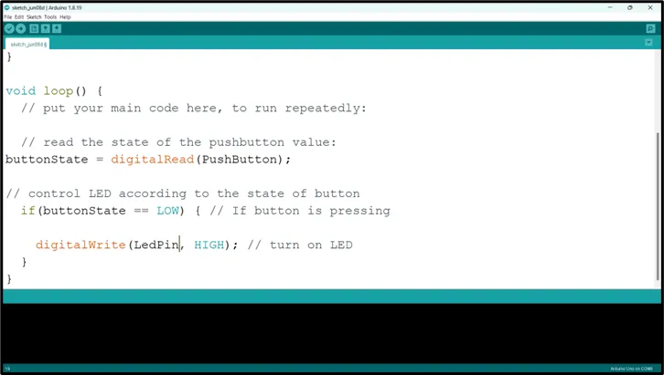. -->

**Step 10:** Type ``` else {digitalWrite (LedPin, LOW)} };``` 

<!-- 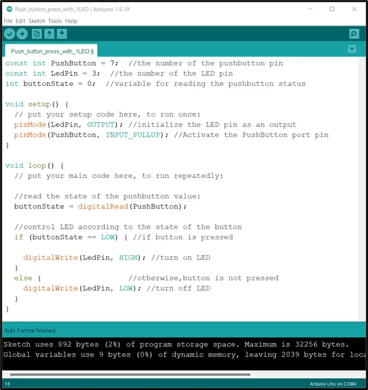. -->

**NB:** Keep your eyes on the (curly bracket).

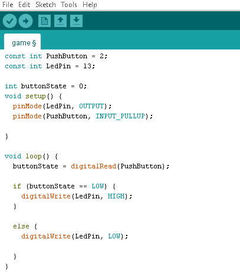.


 ## EXPLANATION
const int PushButton = 2; stores the push button pin number.
const int LedPin = 13; stores the LED pin number.
int buttonState = 0; stores the current state of the push button.
pinMode(LedPin, OUTPUT); sets the LED pin as an output pin.
pinMode(PushButton, INPUT_PULLUP); sets the push button pin as an input pin.
digitalRead(PushButton); reads the state of the push button.
digitalWrite(LedPin, HIGH); turns the LED on.
digitalWrite(LedPin, LOW); turns the LED off.


## CONCLUSION
This project helps learners understand how to use a push button to control an LED with Arduino. It introduces input devices, output devices, and simple decision-making in programming.
