# Project 1.3.1: BUTTON LIT

| **Description** | Button Lit is a simple and interactive project that employs a push button to control an LED. When the button is pressed, the LED illuminates, and when the button is released, the LED turns off. |
|------------------|----------------------------------------------------------------|
| **Use case**     | Imagine having this setup by your bedside. When you press the button, the LED lights up, providing a gentle glow in the dark. Releasing the button turns the LED off, allowing you to control the lighting without fumbling for a switch in the middle of the night. |

## Components (Things You will need)

|  |  |  |  | |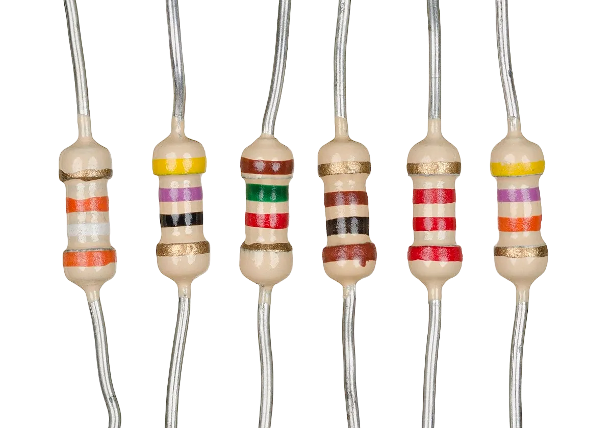 |
|-------------------------|-------------------------|-------------------------|-------------------------|-------------------------|-------------------------|

## Building the circuit

Things Needed:

- Arduino Uno = 1
-	Arduino USB cable = 1
-	Resistor = 1
-	Push button = 1
-	Red LED = 1
-	Red jumper wires = 1
-	Black jumper wires = 1
-	Yellow jumper wires = 1
-	Blue jumper wires = 1


## Mounting the component on the breadboard

**Step 1:** Take the breadboard and the red LED and insert it into the vertical connectors on the breadboard.

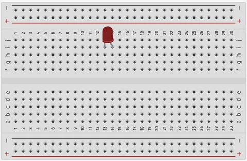.

_**NB:** Make sure you identify where the positive pin (+) and the negative pin (-) is connected to on the breadboard. 

**Step 2:** Connect the pushbutton to the breadboard but make sure the two pairs of the pins are connected on each side of the bridge.

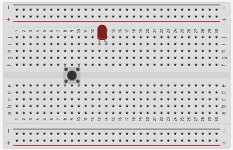.

_**NB:** Make sure you identify where the positive pin (+) and the negative pin (-) is connected to on the breadboard.

**Step 3:** Take one resistor and connect one terminal of the resistor to the longer pin of the LED positive terminal (+) on the breadboard and the other pin of the resistor into the vertical connected holes on the breadboard.

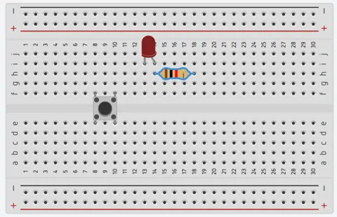.

_**NB:** This completes the circuit for the LED, allowing current to flow from the digital pin, through the LED and back to ground.

## WIRING THE CIRCUIT

### Things Needed:

- Red male-male-to-male jumper wires = 1
- Black male-to-male jumper wires = 1
- Yellow male-to-male jumper wires = 1
- Blue male-to-male jumper wires = 1


**Step 1:** Connect red male-to-male jumper wire from the free end of the resistor to digital pin (13) on the Arduino UNO.


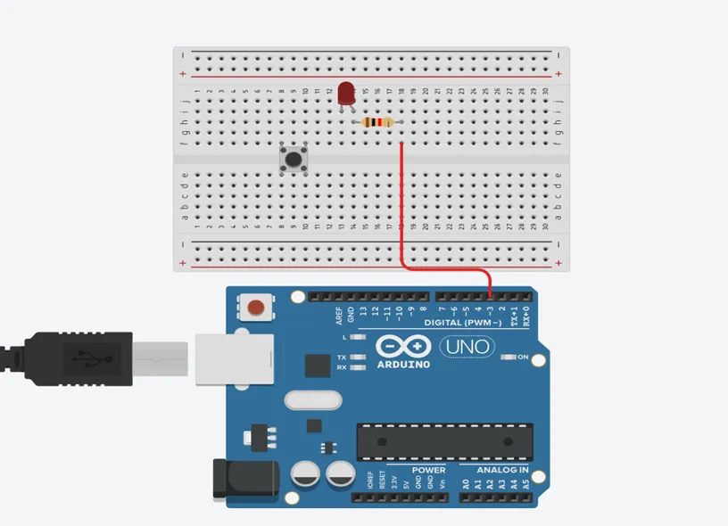

**Step 2:** Connect Black male-to-male jumper wire from the free end of the LED negative pin power GND (Ground) on the Arduino UNO.

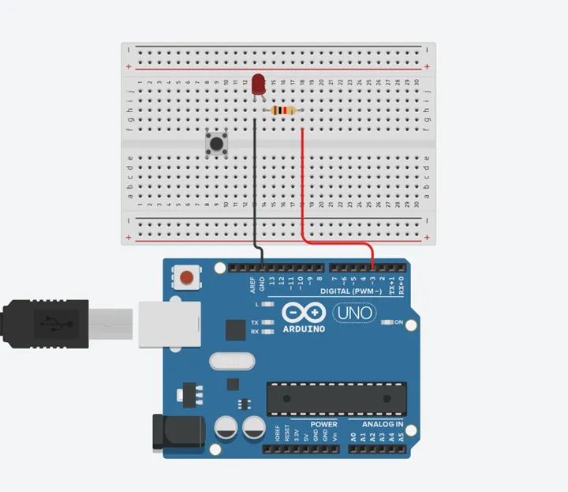

**Step 3:** Connect Yellow male-to-male jumper wire from one Pin of the Push Button as a negative to power GND (Ground) on the Arduino UNO.


**Step 4:** Finally, connect blue male-to-male jumper wire from the other Pin of the push button (not connected to GND) to any digital pin on the Arduino UNO. Let's use digital pin 2 in this tutorial.

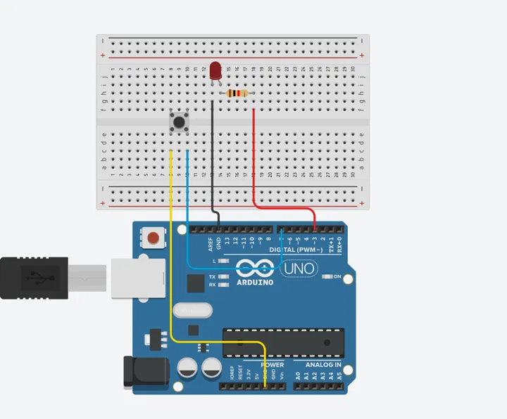

_Make sure to connect the Arduino USB blue cable to the Arduino board_.


## PROGRAMMING

**Step 1:** Open your Arduino IDE. See how to set up here: [Getting Started](../../getting-started/overview.md).

**Step 2:** Type ``` const int PushButton = 7;``` as shown in the picture below.

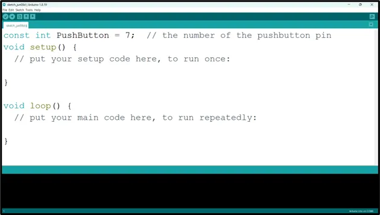.

**NB:** It is advisable to write a comment after each line of code as it has been done earlier.
Also, after each line of code and comment click Enter key to move to the next line or get a new space to begin your next line of code.

**Step 3:** Type ``` const int LedPin = 3;``` as shown in the picture below.

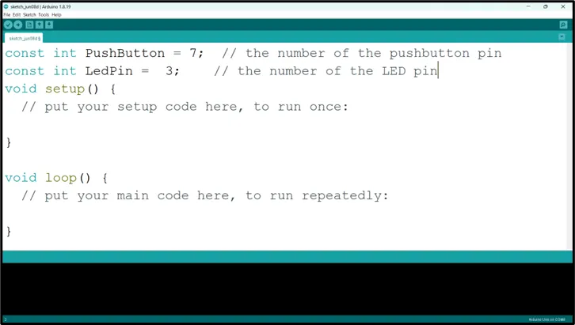.

**NB:** The code we typed earlier is for the LED as the comment tells us, so the code above is for the Push Button to be activated (Push Button and the LED variable code will be use later in the code).

**Step 4:** Type ``` int buttonState = 0;``` as shown in the picture below.

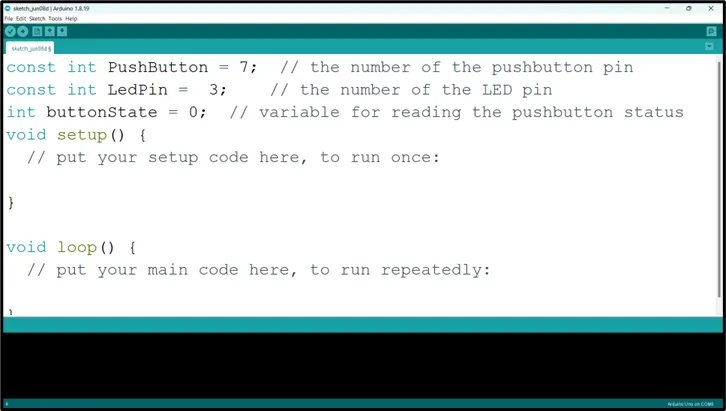.

**NB:** The is LED On is a variable that will keep track of the state of the LED.

**Step 5:** Type ``` pinMode (LedPin, OUTPUT);``` as shown in the picture below.

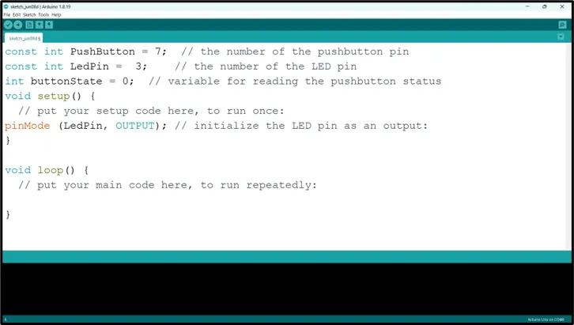.

**NB:** pinMode will help the Arduino board to decide which port should be activated.

**Step 6:** Type ``` pinMode (PushButton, INPUT_PULLUP);``` as shown in the picture below.

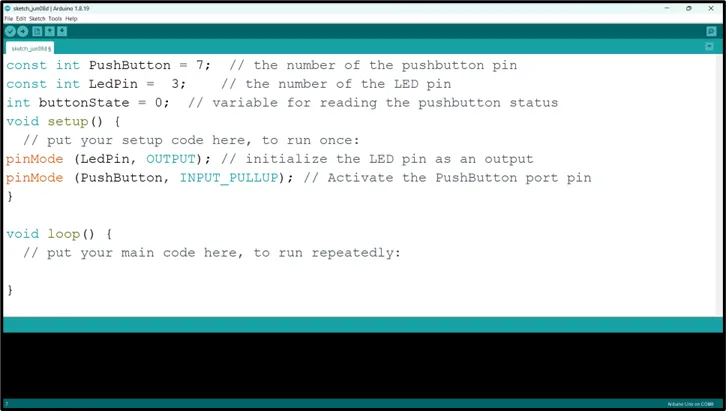.

**NB:** pinMode will help the Arduino board to decide which port should be activated.

**Step 7:** Type ``` buttonState = digitalRead(PushButton);``` as shown in the picture below.

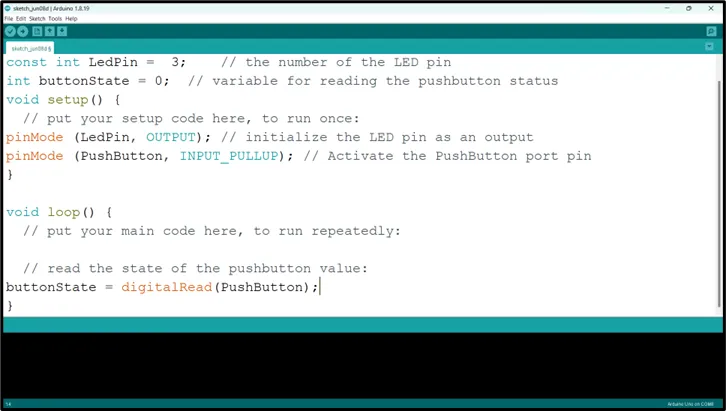.

**Step 8:** Type ``` if (buttonState == LOW);{}``` as shown in the picture below.

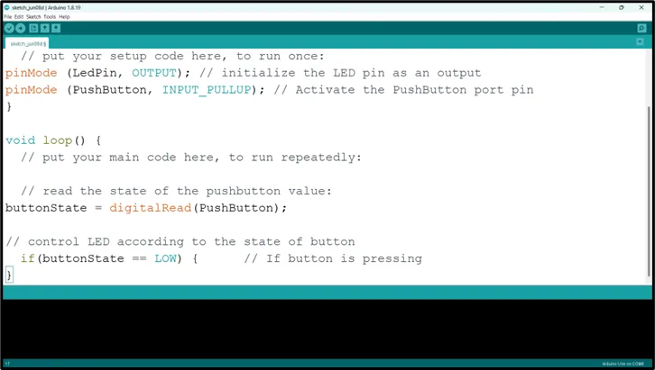.

**Step 9:** Type ``` digitalWrite(LedPin, HIGH);``` as shown in the picture below.

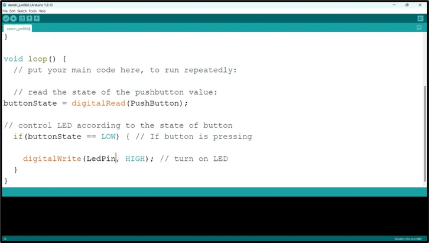.

**Step 10:** Type ``` else {digitalWrite (LedPin, LOW)} };``` as shown in the picture below.

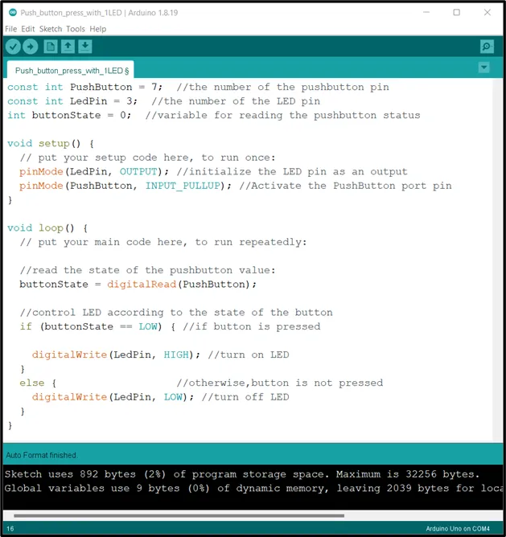.

**NB:** Keep your eyes on the (curly bracket).

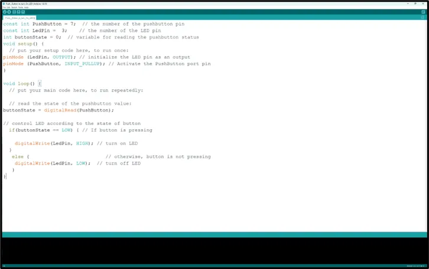.


## CONCLUSION
To sum up, the one LED blink project demonstrates a foundational concept in electronics and programming. Through this simple yet illuminating endeavor, learners grasp the essentials of hardware interfacing, coding logic, and timing control. This project lays the groundwork for more advanced explorations while showcasing the transformative power of just a single LED, sparking curiosity and creativity in the world of DIY electronics.
