# Project 1.3.3: TRI-LIGHT

| **Description** | This project shows how to control three LEDs using a push button with an Arduino Uno. When the button is pressed, all three LEDs turn on together. When the button is released, all the LEDs turn off. |
|------------------|----------------------------------------------------------------|
| **Use case**     | This project can be used as a decorative lighting system, signal indicator, or simple party light display. |

## Components (Tools You Will Need)

|  |  |  |  | |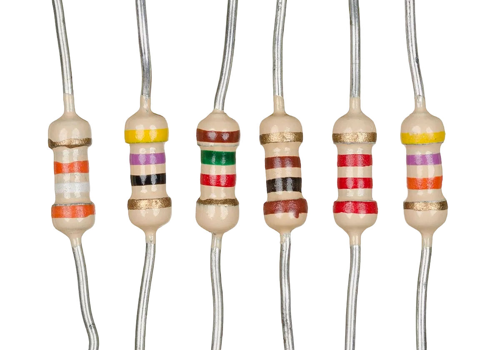 |
|-------------------------|-------------------------|-------------------------|-------------------------|-------------------------|-------------------------|

## Building The Circuit

Tools Needed:

-   Arduino Uno = 1
-	Arduino USB cable = 1
-	Resistor = 3
-	Push button = 1
-	Red LED = 1
-	Jumper Wires
- Breadboard


## Mounting the component on the breadboard

Push Button = 1

**Step 1:** Place the three LEDs on the breadboard. The longer legs are the positive pins, while the shorter legs are the negative pins.

.
LED = 3

**Step 2:** Connect the positive leg of the first LED to pin 12 on the Arduino through a 220Ω resistor.

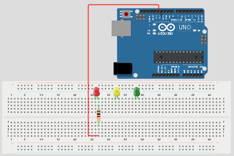.


## WIRING THE CIRCUIT

### Things Needed:

- Red male-male-to-male jumper wires = 1
- Black male-to-male jumper wires = 1
- Yellow male-to-male jumper wires = 1
- Blue male-to-male jumper wires = 1
- White male-to-male jumper wires = 1
- Green male-to-male jumper wires = 1

**Step 3:** Connect the positive leg of the second LED to pin 9 on the Arduino through a 220Ω resistor.

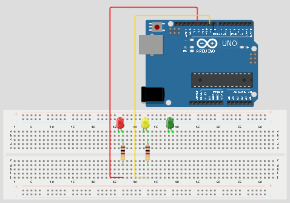

**Step 4:**  Connect the positive leg of the third LED to pin 4 on the Arduino through a 220Ω resistor.

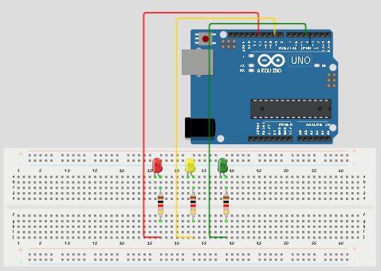

**Step 5:** Connect one jumper wire from the negative rail of the breadboard to the GND pin on the Arduino Uno.  Then connect the negative legs of all the LEDs to the negative rail of the breadboard.

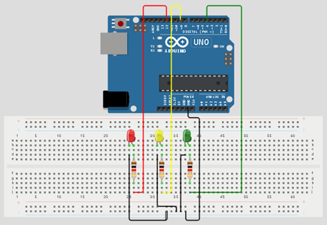

**Step 6:**Place the push button on the breadboard.

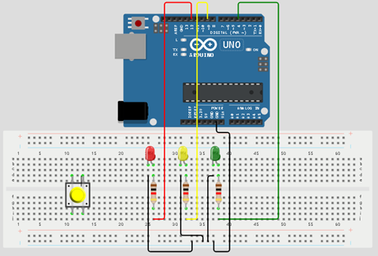

**Step 5:** Connect one side of the push button to GND on the Arduino Uno.

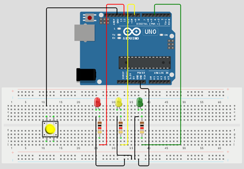

**Step 6:** Connect the other side of the push button to pin 13 on the Arduino Uno.

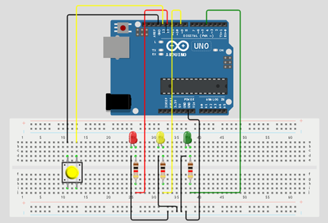

<!-- **Step 7:** Connect male-to-male jumper wire from the longer pin of the third LED as a positive to digital pin 4 on the Arduino UNO.

<!-- missing image: 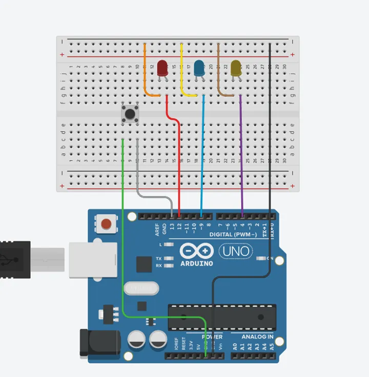 --> -->

_Make sure to connect the Arduino USB blue cable to the Arduino board_.


## PROGRAMMING

**Step 1:** Open your Arduino IDE. See how to set up here: [Getting Started](../../getting-started/overview.md).

**Step 2:** Type ``` const int ledPin1 = 12;``` as shown in the picture below.

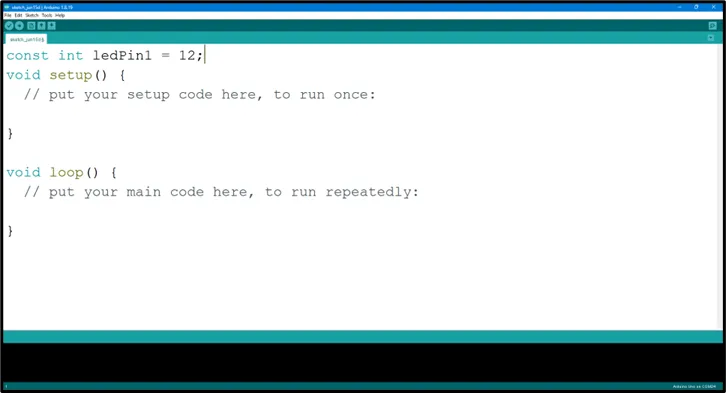.

**Step 3:** Type ``` const int ledPin2 = 9;``` as shown in the picture below.

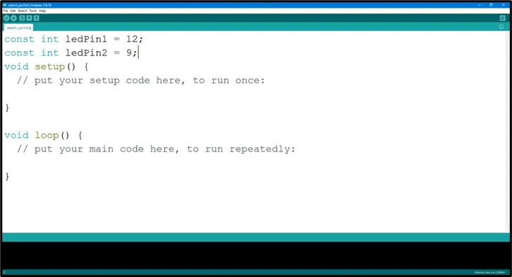.

**Step 4:** Type ``` const int ledPin3 = 4;``` as shown in the picture below.

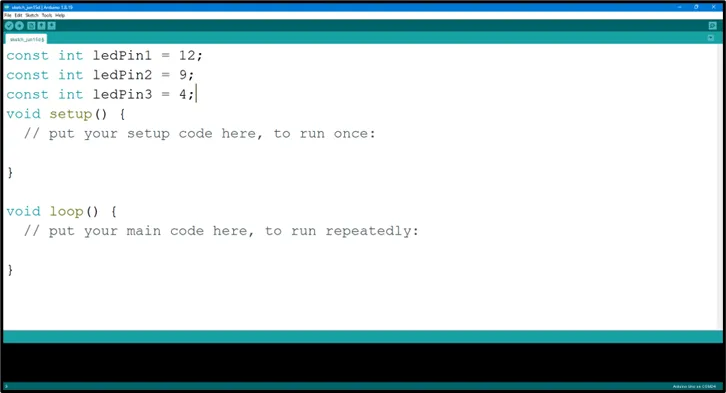.

**Step 5:** Type ``` const int buttonPin = 13;``` as shown in the picture below.

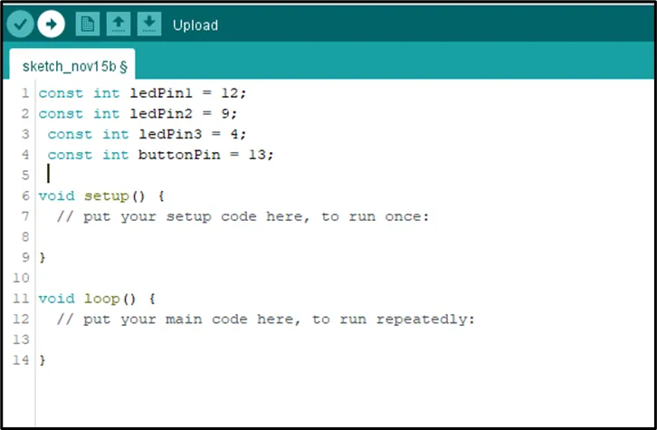.

**Step 6:** Type ``` int buttonState = 0;``` as shown in the picture below.

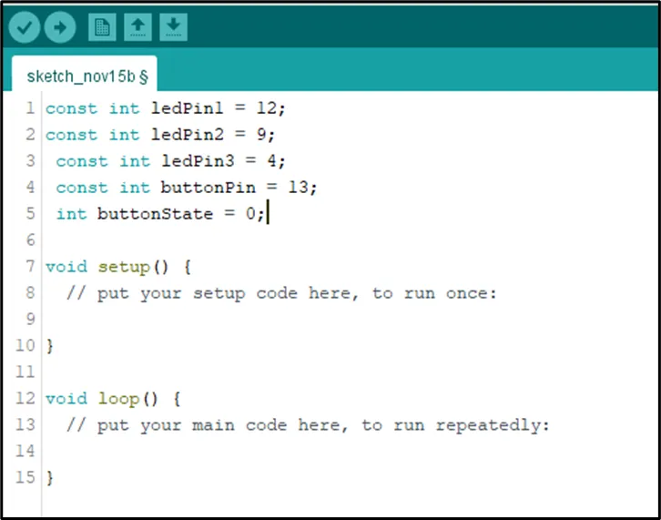.

**Step 7:** Inside the (void setup()), Type 
    ``` 
    pinMode (ledPin1, OUTPUT);
    pinMode (ledPin2, OUTPUT);
    pinMode (ledPin3, OUTPUT);
    pinMode (buttonPin INPUT_PULLUP) ;
    ``` 
  as shown in the picture below.

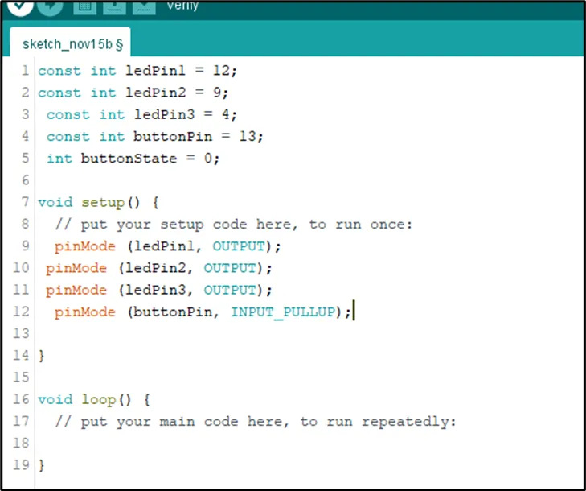.

**NB:** pinMode will help the Arduino board to decide which port should be activated. 

**Step 8:** Type ``` buttonState = digitalRead (buttonPin); ``` as shown in the picture below.

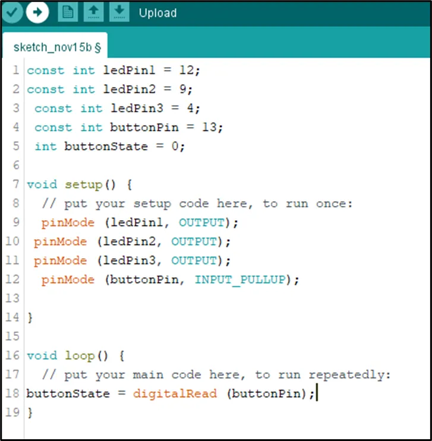.

**Step 9:** Type 
    ``` if (buttonState == LOW)
{    digitalWrite (ledPin1,  HIGH) ;
     digitalWrite (ledPin2, HIGH);
     digitalWrite (ledPin3, HIGH);
     digitalWrite (ledPin3, HIGH); }
    ``` 
  as shown in the picture below.

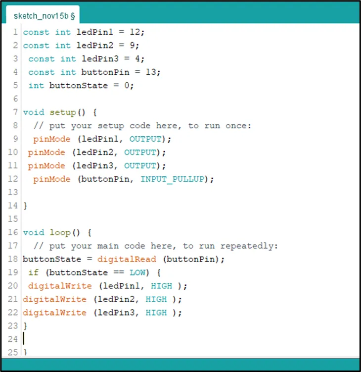.

**Step 10:** Type 
    ``` else {  digitalWrite (ledPin1,  LOW) ;
     digitalWrite (ledPin2, LOW);
     digitalWrite (ledPin3, LOW);
     digitalWrite (ledPin3, HIGH); } ``` 
  as shown in the picture below.

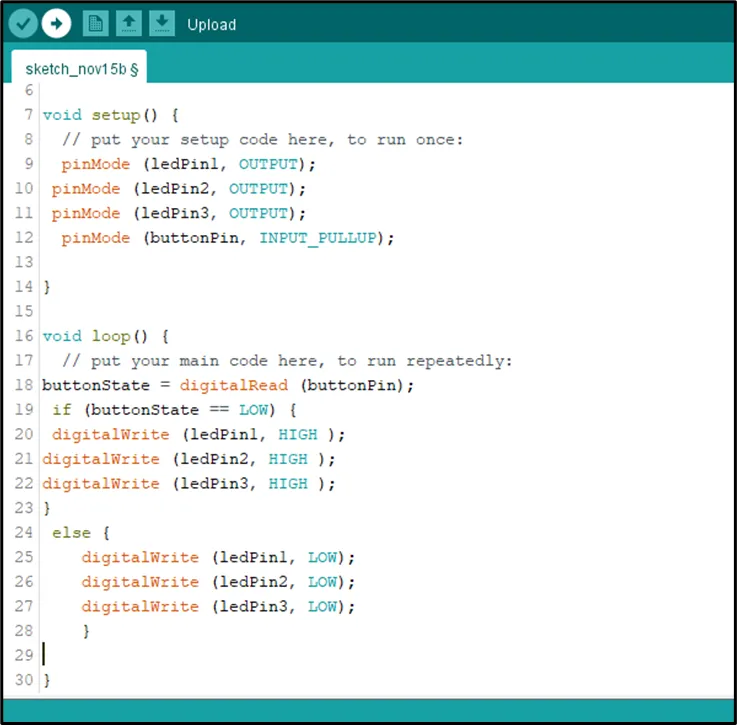.

## CONCLUSION
This project helps learners understand how to control multiple LEDs using a push button with Arduino. It introduces input devices, output devices, and simple control logic in programming.
