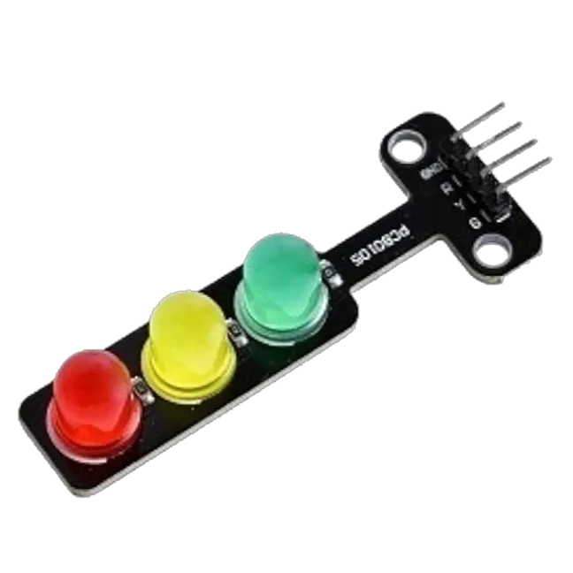
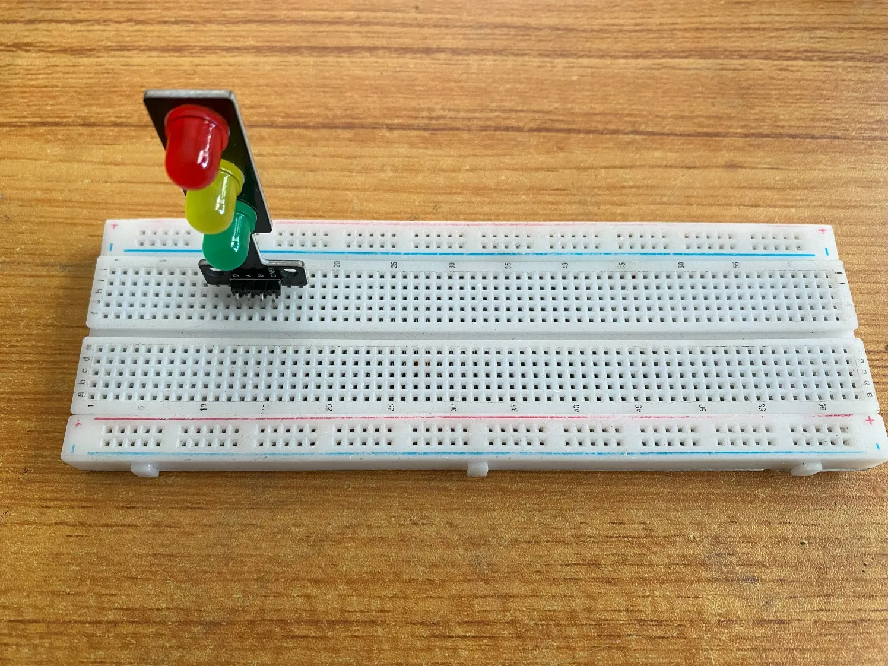
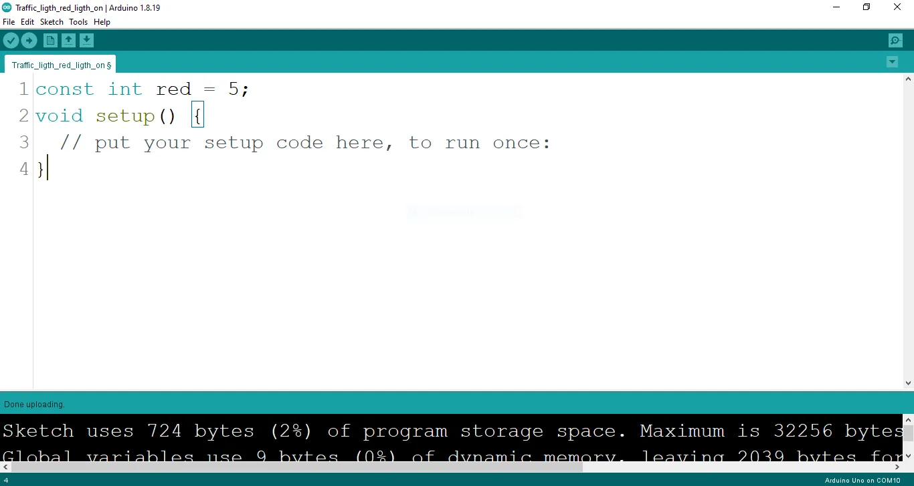

# Project 1.4.2: TRAFFIC LIGHT RED ONLY BLINK

| **Description** | This is where you get to know how to make the red LED blink.                                        |
| --------------- | --------------------------------------------------------------------------------------------------- |
| **Use case**    | Programming the red light on the traffic to blink which could be used to signal danger on the road. |

## Components (Things You will need)

|  |  |  |  |  |
| ------------------------------------------------------------------- | --------------------------------------------------- | ----------------------------------------------------------- | ----------------------------------------------------- | ------------------------------------------------------ |

## Building the circuit

Things Needed:

- Arduino Uno = 1
- Arduino USB cable = 1
- Traffic light module = 1
- Red jumper wires = 1
- White jumper wire= 1

## Mounting the component on the breadboard

**Step 1:** Take the Traffic light and the breadboard, insert the Traffic light into the horizontal connectors on the breadboard.

.

## WIRING THE CIRCUIT

### Things Needed:

- Red male-male-to-male jumper wires = 1
- White jumper wire = 1

**step 1:** Take the red jumper wire. This wire will connect the Arduino UNO the red light (red pin) of the traffic light. This pin is labeled “R” on the traffic light.

**step 2:** Connect one end of the red jumper wire to R pin of traffic light on the breadboard. Ensure you put the pin in the right hole.

**step 3:** Connect the other end of the red jumper wire to pin number 5 on the Arduino UNO.

.

**step 4:** Take the white jumper wire and connect one end to the GND pin of the traffic light.

**step 5:** Connect the other end of the white jumper wire to GND on the Arduino UNO.

.

## PROGRAMMING

**Step 1:** Open your Arduino IDE. See how to set up here: [Getting Started](../../getting-started/overview.md).

**Step 2:** Type `   const int red = 5;` before the void setup function.

.

**Step 3:** Type the following codes in the void setup function as shown below;

``` cpp
pinMode (red, OUTPUT);
```

.

**Step 4:** Type the following codes in the void loop function as shown below;

``` cpp
digitalWrite (red, HIGH);
```

.

The digitalWrite () function controls the state of the pin. The pin can either be HIGH or LOW. The HIGH state turns on the LED. As a result, the code below turns on the LED.

**Step 5:** Now, let's introduce a delay by typing `delay(400);` exactly as shown in the image below.
.

**Step 6:** : Type `digitalWrite (red, LOW);` exactly as shown in the image below.
.

**Step 7:** Now, let's finish up with a delay by typing `delay(400);` exactly as shown in the image below.
.

## Uploading the code

**Step 1:** Save your code. _See the [Getting Started](../../getting-started/overview.md) section_

**Step 2:** Select the arduino board and port _See the [Getting Started](../../getting-started/overview.md) section:Selecting Arduino Board Type and Uploading your code_.

**Step 3:** Upload your code. _See the [Getting Started](../../getting-started/overview.md) section:Selecting Arduino Board Type and Uploading your code_

## OBSERVATION

When the circuit is functioning, observe the Red LED of the tgrafic ligth blinking as expected. This indicates that the LED is receiving the signal correctly from the Arduino and is operating as intended.

## CONCLUSION

In brief, the project focusing on creating a blinking red light within a simulated traffic light system offers an engaging introduction to controlled visual signaling. By programming the red LED to blink, participants learn about timing control, code logic, and the significance of rhythmic signaling. This endeavor serves as a foundational step in electronics exploration, showcasing the concept of dynamic visual cues and sparking curiosity about practical applications, such as traffic safety and automation.
