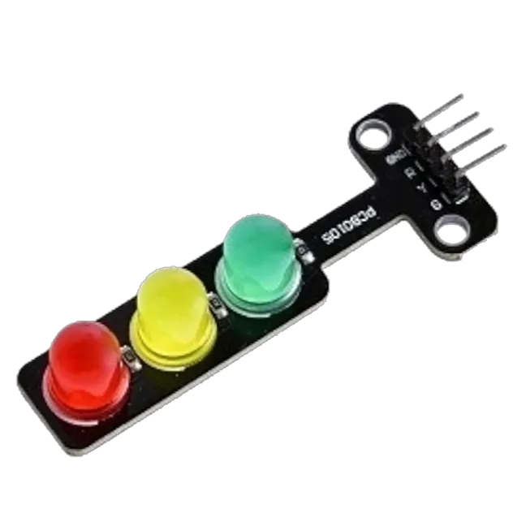
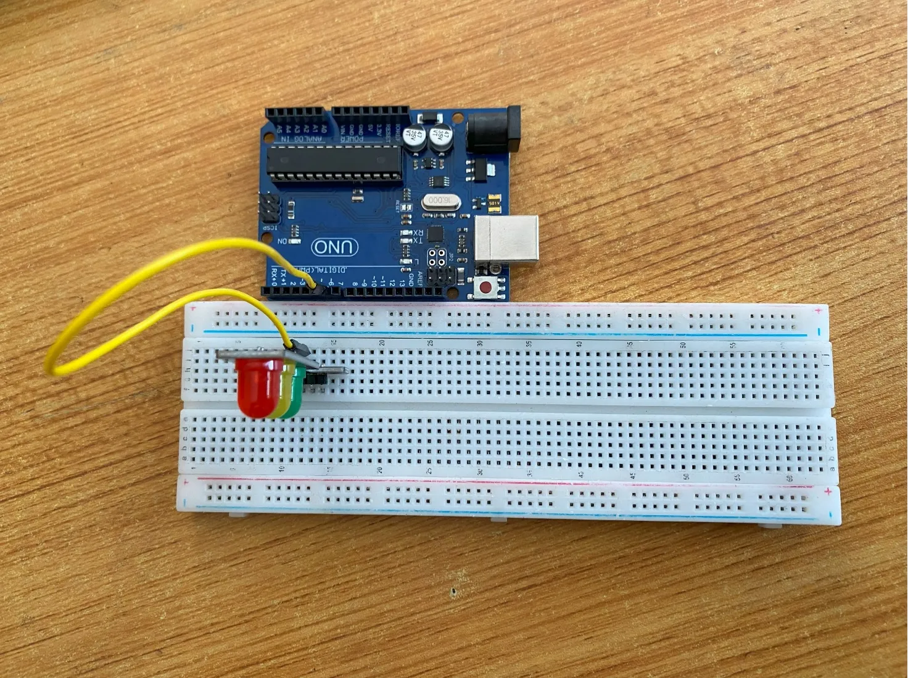
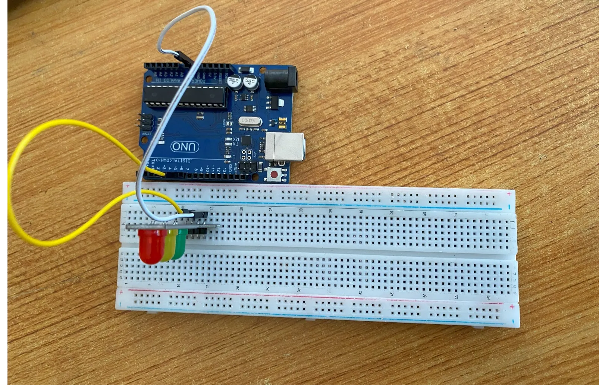
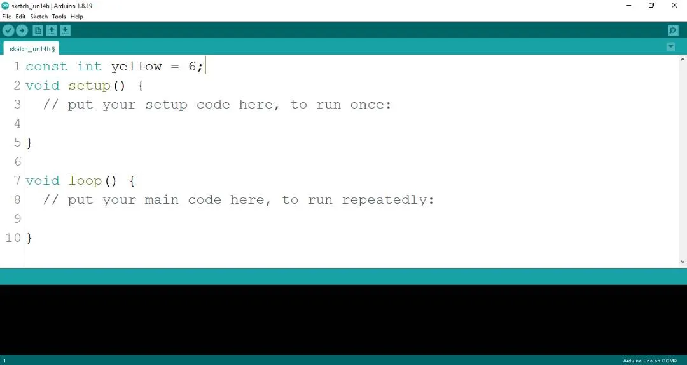
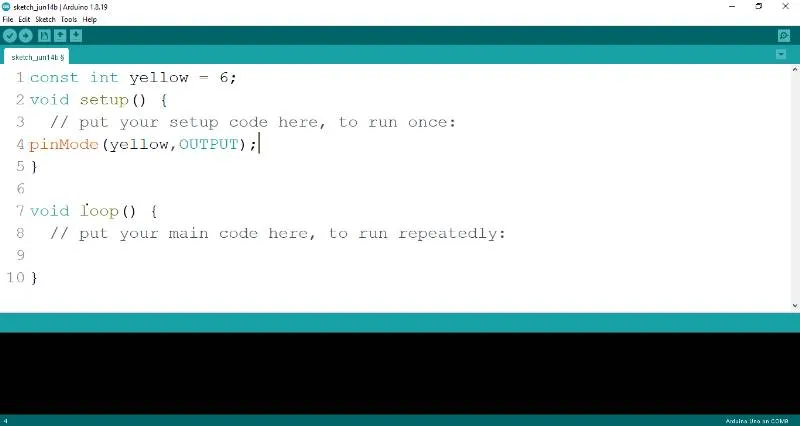
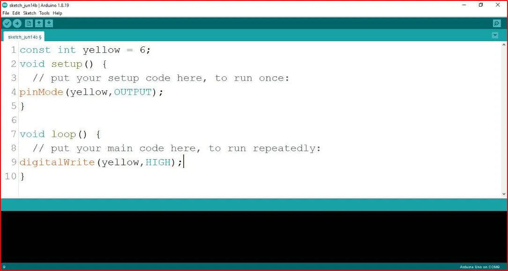
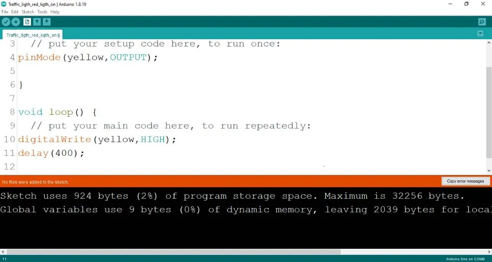
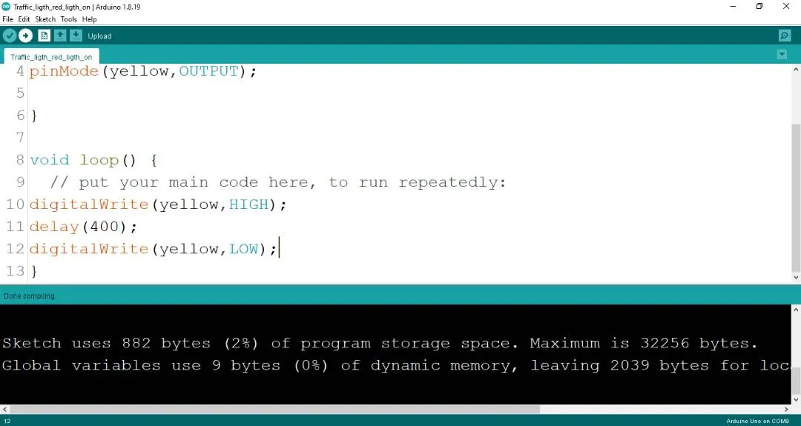
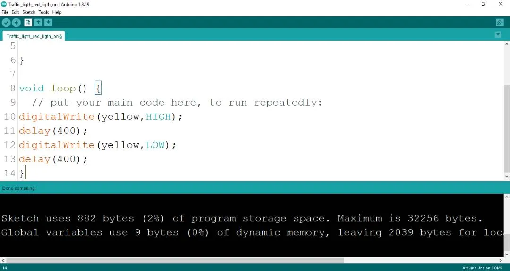

# Project 1.4.4: TRAFFIC LIGHT YELLOW ONLY BLINK

| **Description** | This is where you get to know how to make the yellow LED blink.                                                                                                                                                                                               |
| --------------- | ------------------------------------------------------------------------------------------------------------------------------------------------------------------------------------------------------------------------------------------------------------- |
| **Use case**    | Programming the yellow light on the traffic light to blink which could be used to tell that the traffic light is on standby mode. This tell drivers to be cautious. Such is mostly seen on traffic lights that’s normally at areas with lower traffic volume. |

## Components (Things You will need)

|  |  |  |  |  |
| ------------------------------------------------------------------- | --------------------------------------------------- | ----------------------------------------------------------- | ----------------------------------------------------- | ------------------------------------------------------ |

## Building the circuit

Things Needed:

- Arduino Uno = 1
- Arduino USB cable = 1
- Traffic light module = 1
- Yellow jumper wires = 1
- White jumper wire= 1

## Mounting the component on the breadboard

**Step 1:** Take the Traffic light and the breadboard, insert the Traffic light into the horizontal connectors on the breadboard.

.

## WIRING THE CIRCUIT

### Things Needed:

- yellow male-male-to-male jumper wires = 1
- White jumper wire = 1

**step 1:** Take the yellow jumper wire. This wire will connect the Arduino UNO the yellow light (yellow pin) of the traffic light. This pin is labeled “R” on the traffic light.

**step 2:** Connect one end of the yellow jumper wire to Y pin of traffic light on the breadboard. Ensure you put the pin in the right hole.

**step 3:** Connect the other end of the yellow jumper wire to pin number 6 on the Arduino UNO.

.

**step 4:** Take the white jumper wire and connect one end to the GND pin of the traffic light.

**step 5:** Connect the other end of the white jumper wire to GND on the Arduino UNO.

.

## PROGRAMMING

**Step 1:** Open your Arduino IDE. See how to set up here: [Getting Started](../../getting-started/overview.md).

**Step 2:** Type `   const int yellow = 6;` before the void setup function.

.

**Step 3:** Type the following codes in the void setup function as shown below;

``` cpp
pinMode (yellow, OUTPUT);
```

.

**Step 4:** Type the following codes in the void loop function as shown below;

``` cpp
digitalWrite (yellow, HIGH);
```

.

The digitalWrite () function controls the state of the pin. The pin can either be HIGH or LOW. The HIGH state turns on the LED. As a result, the code below turns on the LED.

**Step 5:** Now, let's introduce a delay by typing `delay(400);` exactly as shown in the image below.
.

**Step 6:** : Type `digitalWrite (yellow, LOW);` exactly as shown in the image below.
.

**Step 7:** Now, let's finish up with a delay by typing `delay(400);` exactly as shown in the image below.
.

## Uploading the code

**Step 1:** Save your code. _See the [Getting Started](../../getting-started/overview.md) section_

**Step 2:** Select the arduino board and port _See the [Getting Started](../../getting-started/overview.md) section:Selecting Arduino Board Type and Uploading your code_.

**Step 3:** Upload your code. _See the [Getting Started](../../getting-started/overview.md) section:Selecting Arduino Board Type and Uploading your code_

## OBSERVATION

When the circuit is functioning, observe the yellow LED of the tgrafic blinking light as expected. This indicates that the LED is receiving the signal correctly from the Arduino and is operating as intended.

## CONCLUSION

In summary, the project involving a blinking yellow light within a simulated traffic light system introduces participants to controlled visual signaling. By programming the yellow LED to blink, participants gain insights into timing control, code logic, and the role of dynamic signaling. This endeavor serves as a pivotal step in electronics education, showcasing the concept of rhythmic visual cues and igniting curiosity about practical applications, such as cautionary signals and automation.
