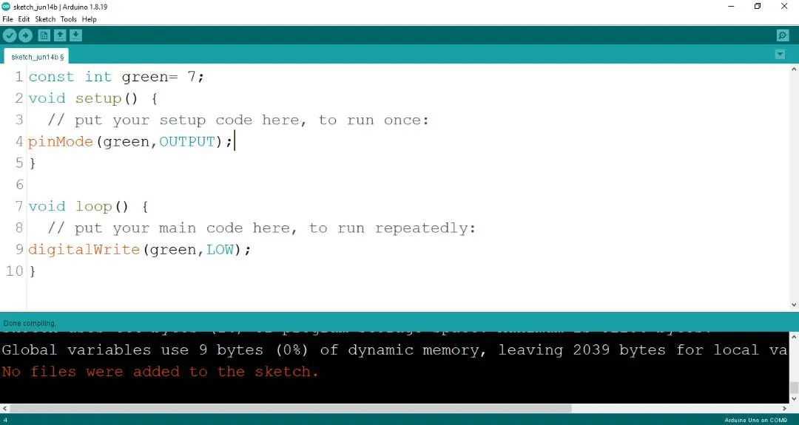

# Project 1.4.5: Green Means Go

| **Description** | This teaches you how to turn ON and also turn OFF the green light only on the traffic light module. |
| --------------- | --------------------------------------------------------------------------------------------------- |
| **Use case**    | Programming the green light on the traffic to turn ON which will signal drivers and riders to stop. |

## Components (Things You will need)

|  |  |  |  |  |
| ------------------------------------------------------------------- | --------------------------------------------------- | ----------------------------------------------------------- | ----------------------------------------------------- | ------------------------------------------------------ |

## Building the circuit

Things Needed:

- Arduino Uno = 1
- Arduino USB cable = 1
- Traffic light module = 1
- green jumper wires = 1
- White jumper wire= 1

## Mounting the component on the breadboard

**Step 1:** Take the Traffic light and the breadboard, insert the Traffic light into the horizontal connectors on the breadboard.

.

## WIRING THE CIRCUIT

### Things Needed:

- green male-male-to-male jumper wires = 1
- White jumper wire = 1

**step 1:** Take the green jumper wire. This wire will connect the Arduino UNO the green light (green pin) of the traffic light. This pin is labeled “G” on the traffic light.

**step 2:** Connect one end of the green jumper wire to G pin of traffic light on the breadboard. Ensure you put the pin in the right hole.

**step 3:** Connect the other end of the green jumper wire to pin number 5 on the Arduino UNO.

.

**step 4:** Take the white jumper wire and connect one end to the GND pin of the traffic light.

**step 5:** Connect the other end of the white jumper wire to GND on the Arduino UNO.

.

## PROGRAMMING

**Step 1:** Open your Arduino IDE. See how to set up here: [Getting Started](../../getting-started/overview.md).

**Step 2:** Type `   const int green = 7;` before the void setup function.

.

**Step 3:** Type the following codes in the void setup function as shown below;

``` cpp
pinMode (green, OUTPUT);
```

.

**Step 4:** Type the following codes in the void loop function as shown below;

``` cpp
digitalWrite (green, HIGH);
```

.

The digitalWrite () function controls the state of the pin. The pin can either be HIGH or LOW. The HIGH state turns on the LED. As a result, the code below turns on the LED.

**NB:** To turn off the green light
**Step 5:** Change the ` digitalWrite (green, HIGH);` into ` digitalWrite (green, LOW);`.
.

## Uploading the code

**Step 1:** Save your code. _See the [Getting Started](../../getting-started/overview.md) section_

**Step 2:** Select the arduino board and port _See the [Getting Started](../../getting-started/overview.md) section:Selecting Arduino Board Type and Uploading your code_.

**Step 3:** Upload your code. _See the [Getting Started](../../getting-started/overview.md) section:Selecting Arduino Board Type and Uploading your code_

## OBSERVATION

When the circuit is functioning, observe the green LED of the tgrafic ligth emitting light as expected. This indicates that the LED is receiving the signal correctly from the Arduino and is operating as intended.

## CONCLUSION

 sum up, the project focused on illuminating a green light in a simulated traffic light system offers a foundational understanding of basic electronics and visual signaling. By activating the green LED, participants grasp the concept of circuit connections, output control, and the significance of color-coded signals. This endeavor serves as an essential steppingstone in electronics exploration, emphasizing the importance of clear visual indicators and sparking interest in real-world applications like traffic flow management and safety systems.
