# Project 1.5.0: SPECIAL LED

| **Description** | This is a project that’ll teach you how to program three (3) LEDs but only one will turn on where the others all stay off. |
|------------------|----------------------------------------------------------------|
| **Use case**     | In the situation where you want only the light in your bedroom to turn on while the lights in the sitting room and corridor to stay off, you can use this approach. |

## Components (Things You will need)

|  |  |  |  ||
|-------------------------|-------------------------|-------------------------|-------------------------|-------------------------|-------------------------|

## Building the circuit

Things Needed:

-	Arduino Uno Board = 1
-	Arduino USB cable = 1
-	RGB= 1
-	Red jumper wires = 1
-	Green jumper wires = 1
-	Brown jumper wires = 1
-	Blue jumper wires = 1

## Mounting the component on the breadboard

**Step 1:** The RGB module has four pins, R pin(red), G pin(green), B pin(blue) and – pin (GND). On the middle section of the breadboard, locate each horizontal section lettered A to J. Take the RGB module and insert it into any of the lettered section (Say A) horizontally. 
_**NB:** Take note of where each of the pins of the RGB are placed on the bread board._


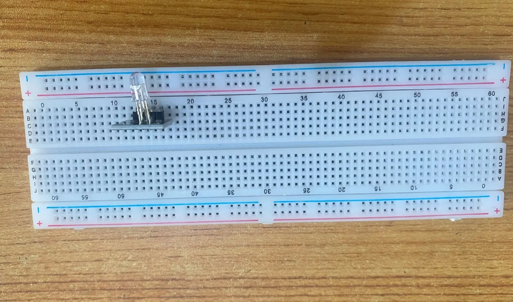.


## WIRING THE CIRCUIT

Things Needed:

-	Red jumper wires = 1
-	Green jumper wires = 1
-	Brown jumper wires = 1
-	Blue jumper wires = 1


**Step 2:** Take the Red male-to-male jumper wire and connect one end to the R pin of the RGB module and the other end to digital pin number 2 on the Arduino uno board.

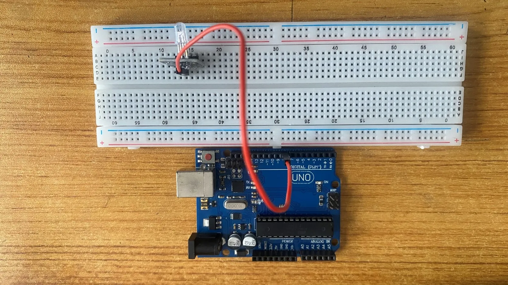.

**Step 3:** Take the Green male-to-male jumper wire and connect one end to the G pin of the RGB module and the other end to digital pin number 7 on the Arduino uno board.

.

**Step 4:** Take the Blue male-to-male jumper wire and connect one end to the B pin of the RGB module and the other end to digital pin number 10 on the Arduino uno board.

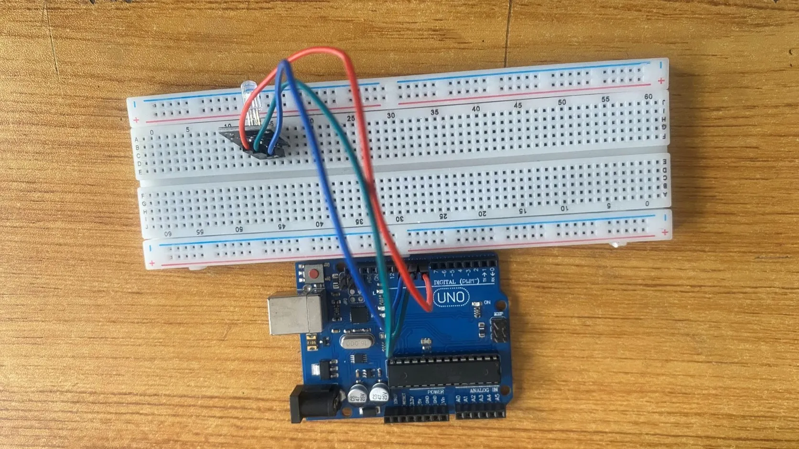.

**Step 5:** Take the Brown male-to-male jumper wire and connect one end to the - pin of the RGB module and the other end to GND on the Arduino uno board.

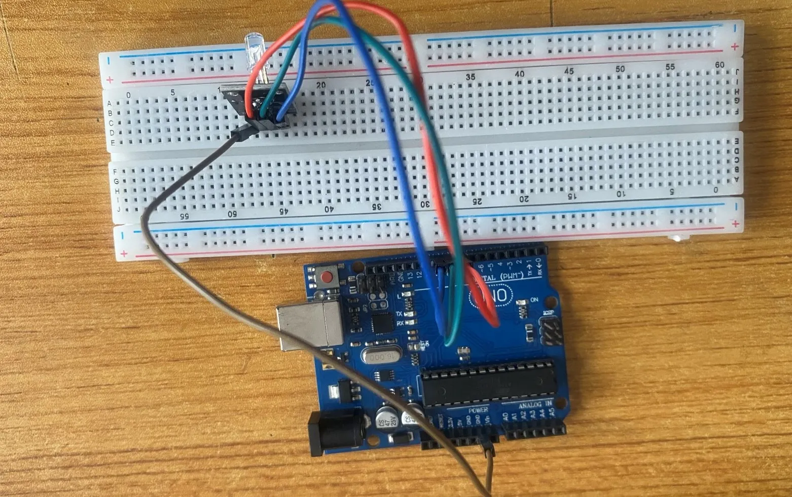.

_**NB:** Connect the USB port of the Arduino cable to the USB port of your laptop and the other side of the Arduino cable to the Arduino Uno Board._


## PROGRAMMING

**Step 1:** Open your Arduino IDE. See how to set up here: [Getting Started](../../getting-started/overview.md).

**Step 2:** Type ```int Red = 2;``` as shown in the picture below. Replace “2” with the digital pin you allocated to the red pin of the RGB.

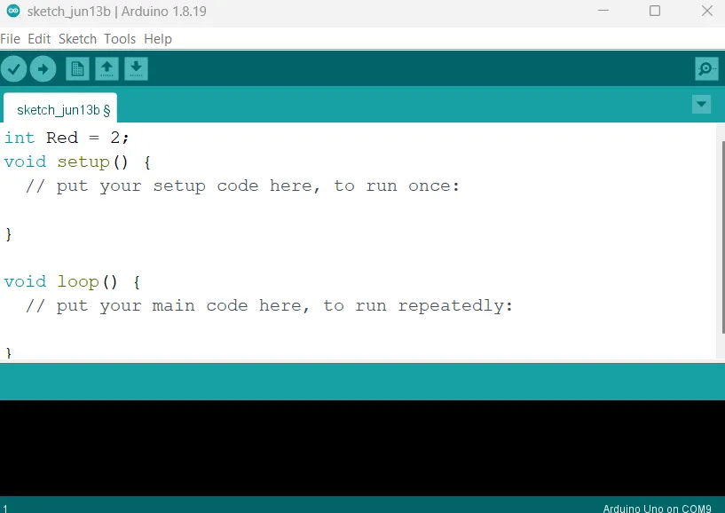.

**Step 3:** Type ```int Green = 7;``` as shown in the picture below. Replace “7” with the digital pin you allocated to the green pin of the RGB.

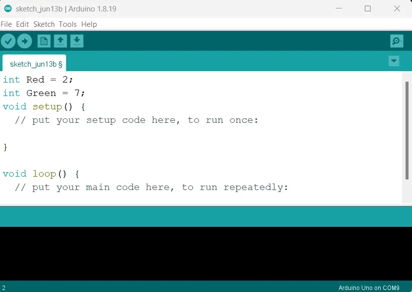.

**Step 4:** Type ```int Blue = 10;``` as shown in the picture below. Replace “10” with the digital pin you allocated to the blue pin of the RGB.

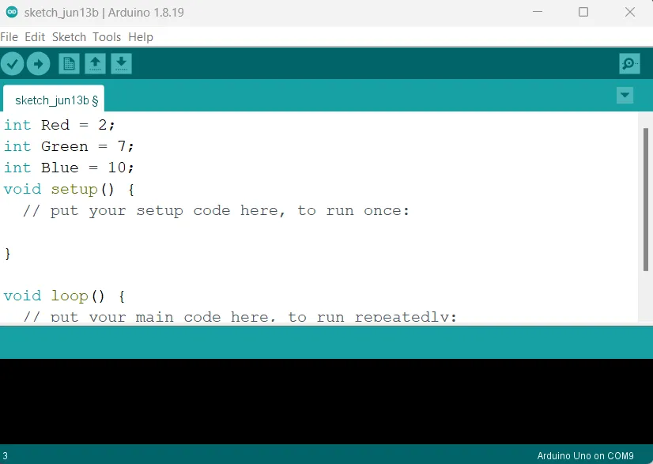.

**Step 5:** Inside the (void setup ()) type ```pinMode (Red, OUTPUT);``` as shown in the picture below.

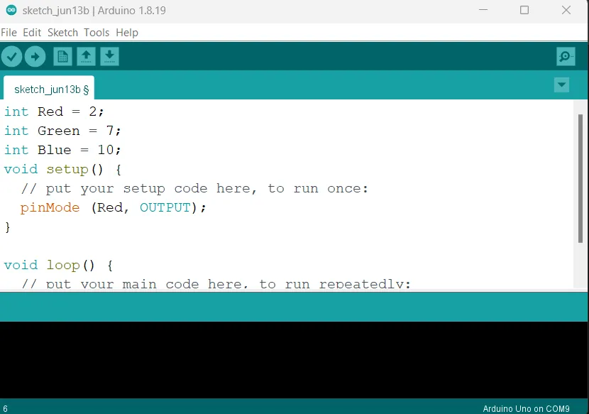.

_**NB:** pinMode will help the Arduino board to decide which port should be activated and OUTPUT because the RGB is an output device._

**Step 6:** type ```pinMode (Green, OUTPUT);``` as shown in the picture below.

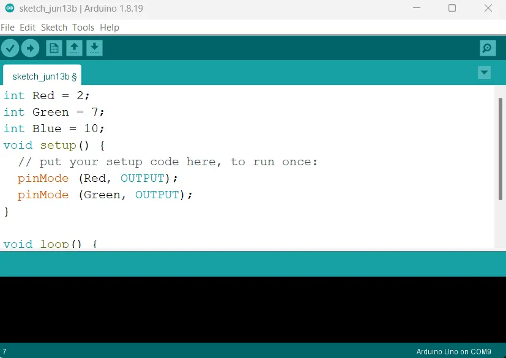.

**Step 7:** type ```pinMode (Blue, OUTPUT);``` as shown in the picture below.

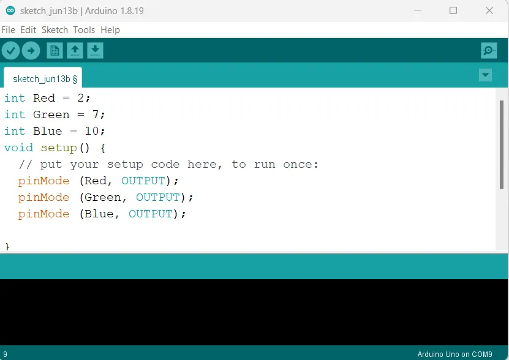.

**Step 8:** type inside "void loop()" function the code below as shown in the picture below.

   ```
   digitalWrite (Red, LOW);
   digitalWrite (Green, HIGH);
   digitalWrite (Blue, LOW);
   ```

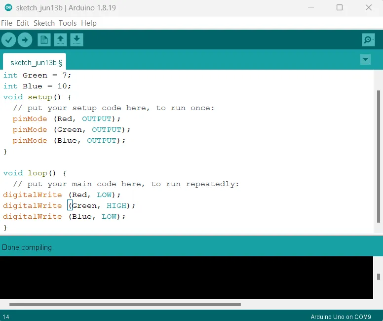.

**Step 9:** Save your code. _See the [Getting Started](../../getting-started/overview.md) section_

**Step 10:** Select the arduino board and port _See the [Getting Started](../../getting-started/overview.md) section:Selecting Arduino Board Type and Uploading your code_.

**Step 11:** Upload your code. _See the [Getting Started](../../getting-started/overview.md) section:Selecting Arduino Board Type and Uploading your code_

## CONCLUSION

In summary, the RGB introduction project provides an engaging entry point into the world of color manipulation and electronics. By experimenting with the red, green, and blue components, participants gain valuable insights into additive color mixing, coding logic, and visual representation. This undertaking lays the groundwork for further electronics exploration, demonstrating the transformative nature of RGB combinations and sparking interest in practical applications such as display technologies, creative lighting, and digital art.
