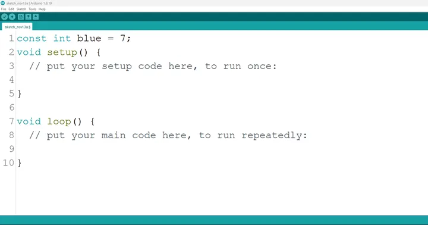
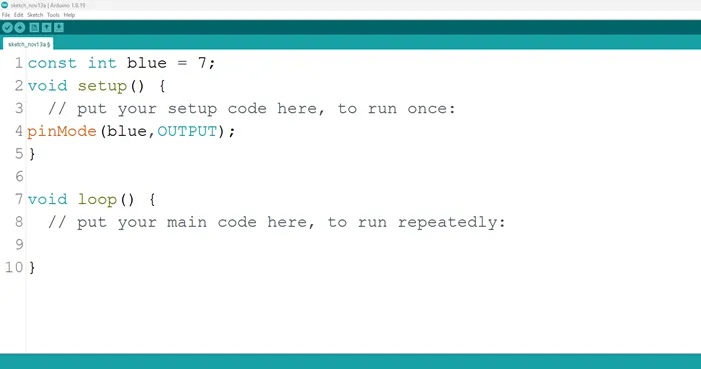
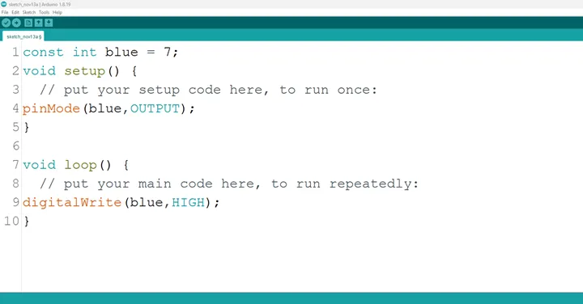
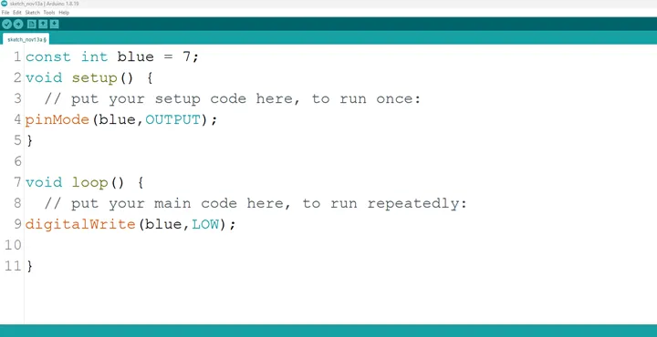

# Project 1.5.5: R -G-Blue

| **Description** | This project is one that makes emphasis on how to create a simple circuit and to control a blue light on the RGB. |
|------------------|----------------------------------------------------------------|
| **Use case**     | Having a blue LED in your room that you don’t  want to turn manually or with your hands, you can program it to come turn on. |

## Components (Things You will need)

|  |  |  |  ||
|-------------------------|-------------------------|-------------------------|-------------------------|-------------------------|-------------------------|

## Building the circuit

Things Needed:

-	Arduino Uno Board = 1
-	Arduino USB cable = 1
-	RGB= 1
-	Blue jumper wires = 1
-	White jumper wires = 1

## Mounting the component on the breadboard

**Step 1:** The RGB module has four pins, R pin(red), G pin(green), B pin(blue) and – pin (GND). On the middle section of the breadboard, locate each horizontal section lettered A to J. Take the RGB module and insert it into any of the lettered section (Say A) horizontally. 

 _**NB:** Take note of where each of the pins of the RGB are placed on the bread board._


.


## WIRING THE CIRCUIT

Things Needed:

-	Blue jumper wire = 1
-	white jumper wire = 1

**Step 2:** Take the blue jumper wire. This wire will connect the Arduino UNO and the B pin of the RGB module. 

- Connect one end of the blue jumper wire to B pin of RGB module on the breadboard. Ensure you put the pin in the right hole.

- Connect the other end of the blue jumper wire to pin number 7 on the Arduino UNO.


.

**Step 3:** Take the white jumper wire and connect one end to the GND or the - pin of the RGB module.

- Connect the other end of the white jumper wire to GND on the Arduino UNO.


.

## PROGRAMMING

**Step 1:** Open your Arduino IDE. See how to set up here: [Getting Started](../../getting-started/overview.md).

**Step 2:** Type ```const int blue = 7;``` as shown below in the image.

_**NB:** Make sure you avoid errors when typing. Do not omit any character or symbol especially the bracket { }  and semicolons ;  and put them as you see in the image. The code that comes after the two ash backslashes “//” are called comments. They are not part of the code that will be run, they only explain the lines of code. You can avoid typing them._

.

**Step 3:** Type ```pinMode (blue, OUTPUT);``` as shown below in the image.

.

_**NB:** The code below sets the pin names “blue” as an output pin. An output pin helps send signals from the microcontroller to other components in the circuit. The pinMode () function, helps determine and control the behavior of a specific pin on the board_

**Step 4:** Type ```digitalWrite (blue, HIGH);``` as shown below in the image.

.

The digitalWrite () function controls the state of the pin. The pin can either be HIGH or LOW. The HIGH state turns on the LED. As a result, the code below turns on the LED.

_**NB:** To turn off the green light,_
**Step 5:** Type ```digitalWrite (blue, LOW);``` as shown below in the image.

.

_**NB:** The LOW state turns off the LED. Hence, you can include the code below in your main code if you want to turn your light off but you are not required to do so._

**Step 8:** Save your code. _See the [Getting Started](../../getting-started/overview.md) section_

**Step 9:** Select the arduino board and port _See the [Getting Started](../../getting-started/overview.md) section:Selecting Arduino Board Type and Uploading your code_.

**Step 10:** Upload your code. _See the [Getting Started](../../getting-started/overview.md) section:Selecting Arduino Board Type and Uploading your code_

## CONCLUSION

To conclude, the project focusing on turning on the blue LED within an RGB configuration provides a fundamental understanding of color representation and electronic control. By activating the blue LED component, participants grasp the concept of color channels, circuit connections, and the visual expression of a single color. This endeavor serves as a pivotal step in comprehending RGB color manipulation, emphasizing the distinct role of each color component, and inspiring curiosity in practical applications such as display technologies and customized lighting solutions.