# Project 1.5.7: RAINBOW COLORS ON RGB

| **Description** | This programming section demonstrates how to control an RGB LED using Arduino to produce rainbow colors. By combining different values of red, green, and blue in sequence with short delays, the LED smoothly transitions through multiple colors such as red, orange, yellow, green, blue, indigo, and violet. This helps in understanding how color mixing, timing, and code functions work together to create dynamic visual effects. |
|------------------|----------------------------------------------------------------|
| **Use case**     | This can be used in real life for decorative lighting systems, such as LED mood lights, stage lighting, or smart room lighting, where smooth rainbow color transitions are used to create visual effects, set ambiance, or attract attention in displays and events. |

## Components (Things You will need)

|  |  |  |  ||
|-------------------------|-------------------------|-------------------------|-------------------------|-------------------------|-------------------------|

## Building the circuit

Things Needed:

-	Arduino Uno Board = 1
-	Arduino USB cable = 1
-	RGB= 1
-	Red jumper wires = 1
-	Green jumper wires = 1
-	Brown jumper wires = 1
-	Blue jumper wires = 1

## Mounting the component on the breadboard

**Step 1:** Insert the RGB LED module into the breadboard (middle section A–J), making sure each pin (R, G, B, and GND) is properly placed in separate rows.


_**NB:** Take note of where each of the pins of the RGB are placed on the bread board._


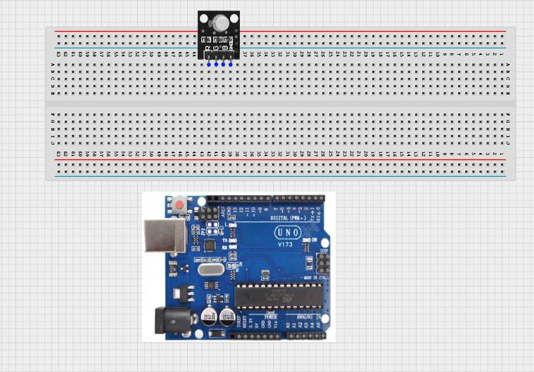.


## WIRING THE CIRCUIT

Things Needed:

-	Red jumper wires = 1
-	Green jumper wires = 1
-	Brown jumper wires = 1
-	Blue jumper wires = 1

**Step 2:** TUse jumper wires to connect:
•	R → Digital pin 8 
•	G → Digital pin 9 
•	B → Digital pin 10


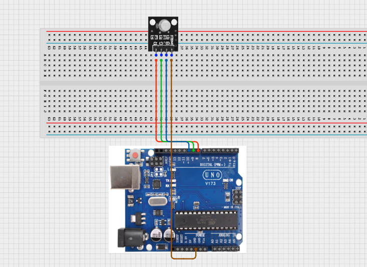.

<!-- **Step 3:** Take the Green male-to-male jumper wire and connect one end to the G pin of the RGB module and the other end to digital pin number 9 on the Arduino uno board.

<!-- missing image: 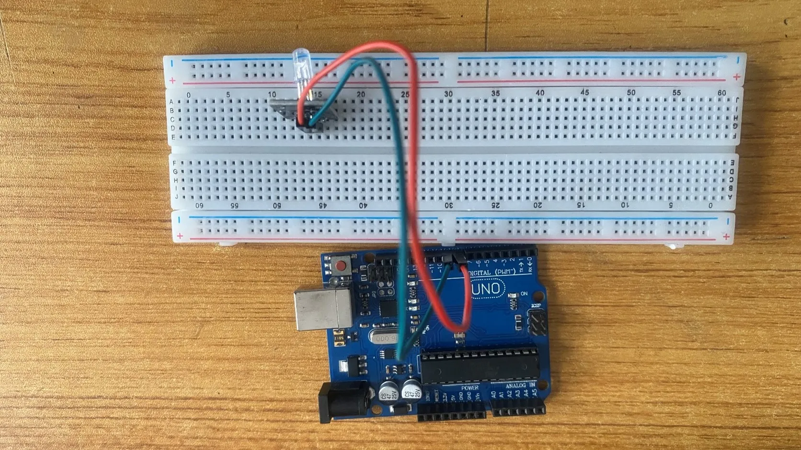. --> -->

<!-- **Step 4:** Take the Blue male-to-male jumper wire and connect one end to the B pin of the RGB module and the other end to digital pin number 10 on the Arduino uno board.

<!-- missing image: 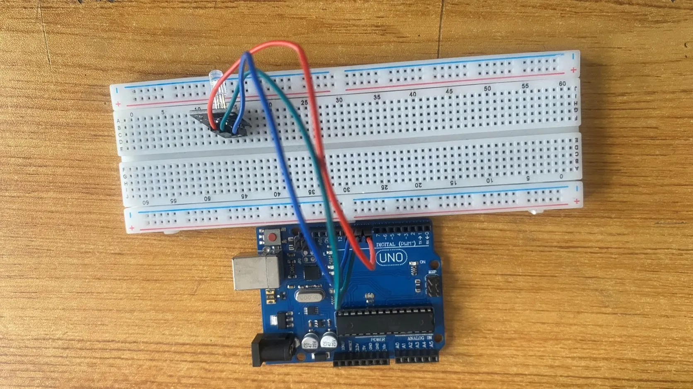. --> -->

<!-- **Step 5:** Take the Brown male-to-male jumper wire and connect one end to the - pin of the RGB module and the other end to GND on the Arduino uno board.

<!-- missing image: 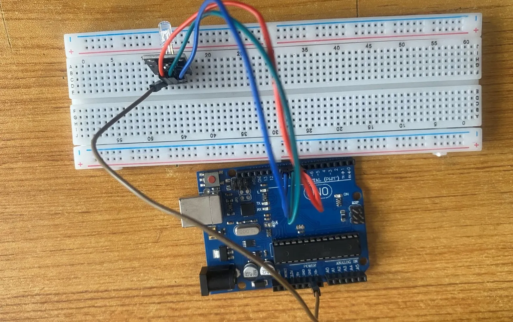. --> -->

_**NB:** Connect the USB port of the Arduino cable to the USB port of your laptop and the other side of the Arduino cable to the Arduino Uno Board._

## PROGRAMMING

**Step 1:** Open your Arduino IDE. See how to set up here: [Getting Started](../../getting-started/overview.md).

**Step 2:** Type ```const int Red = 8;``` as shown in the picture below. Replace “8” with the digital pin you allocated to the red pin of the RGB.

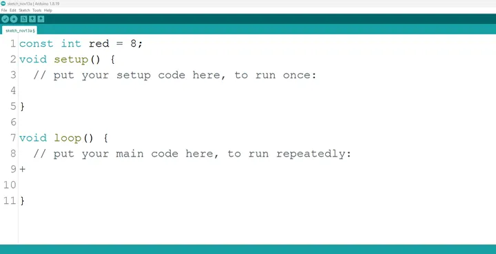.

**Step 3:** Type ```const int Green = 9;``` as shown in the picture below. Replace “9” with the digital pin you allocated to the green pin of the RGB.

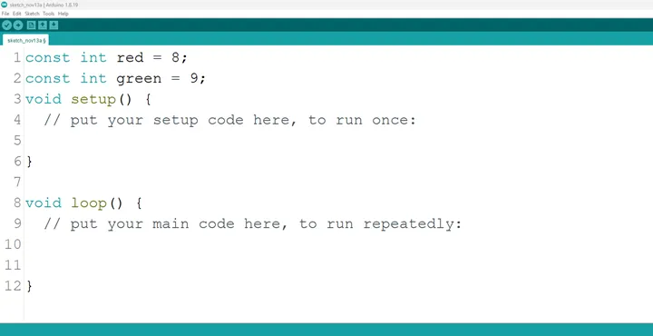.

**Step 4:** Type ```const int Blue = 10;``` as shown in the picture below. Replace “10” with the digital pin you allocated to the blue pin of the RGB.

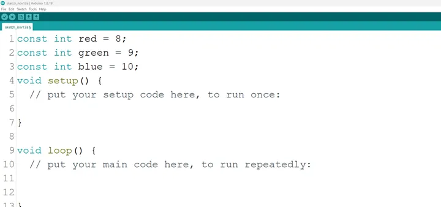.

**Step 5:** Inside the (void setup ()) type ```pinMode (red, OUTPUT);``` as shown in the picture below.

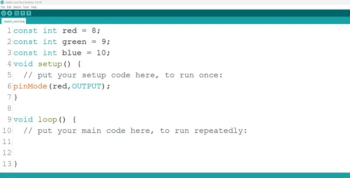.

_**NB:** pinMode will help the Arduino board to decide which port should be activated and OUTPUT because the RGB is an output device._

**Step 6:** type ```pinMode (green, OUTPUT);``` as shown in the picture below.

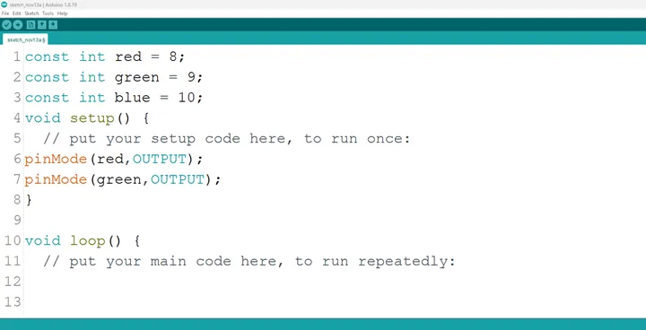.

**Step 7:** type ```pinMode (blue, OUTPUT);``` as shown in the picture below.

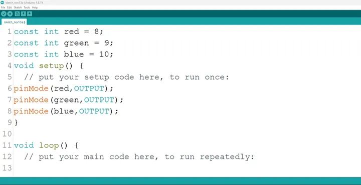.

**Step 8:** Go to the next line after the closing bracket for the area where you put your main code. Here a function will be declared so that the RGB can combine an amount of the three (3) colors to give out a unique color. 

**Step 9:** Type 
    ```
    void Setcolor (int Red, int Green, int Blue) {
        analogWrite (red, Red);
        analogWrite (green, Green);
        analogWrite (blue, Blue);
    }
    ```

as shown in the picture below.

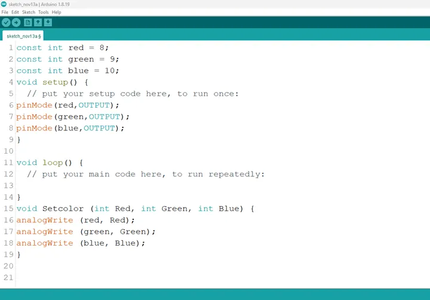.

_**NB:** The highest amount of each primary color of the RGB has a value of 255, we call the function Setcolor and apportion an amount of each of the primary colors to get a different color as demonstrated in the subsequent steps._

**Step 10 :** 

- (Red): Type ```Setcolor (255, 0, 0);``` in the area for your main code as shown in the picture below.

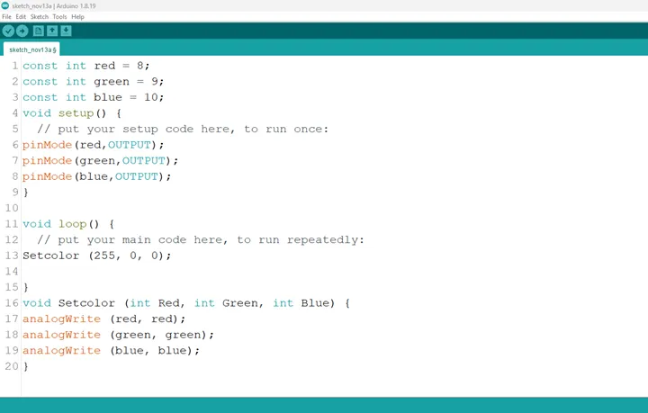.

- (Orange): Type Setcolor (255, 127, 0); in the area for your main code as shown in the picture below.

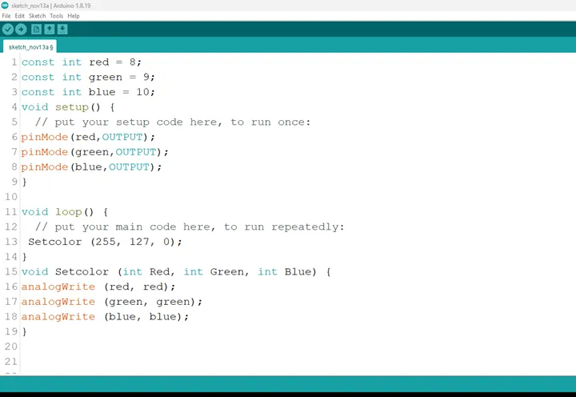.

- (Yellow): Type Setcolor (255, 255, 0); in the area for your main code as shown in the picture below.

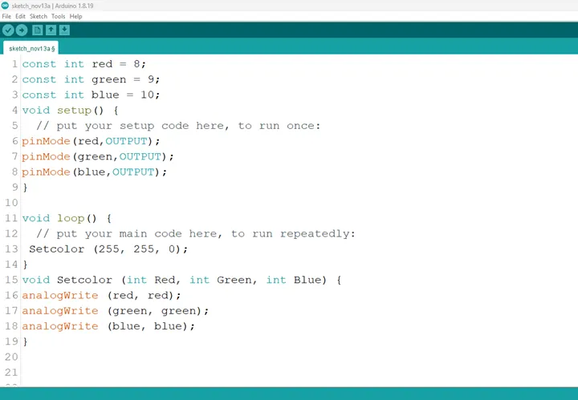.

- (Green): Type Setcolor (0, 255, 0); in the area for your main code as shown in the picture below.

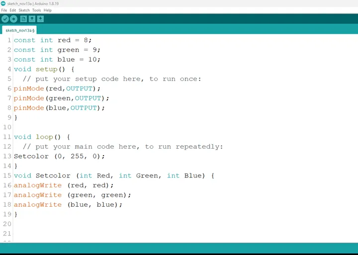.

- (Blue): Type Setcolor (0, 0, 255); in the area for your main code as shown in the picture below.

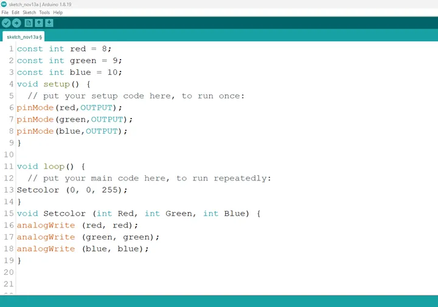.

- (Indigo): Type Setcolor (75, 0, 130); in the area for your main code as shown in the picture below.

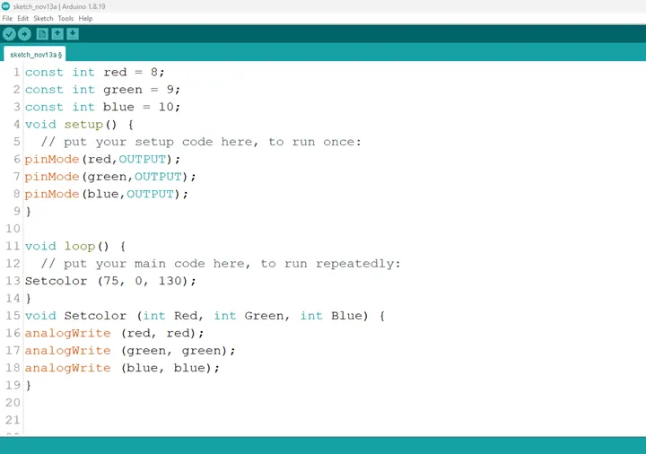.

- (Violet): Type Setcolor (148, 0, 211); in the area for your main code as shown in the picture below.

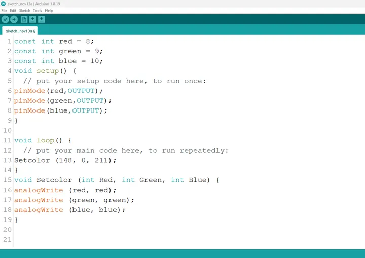.

**Step 11:** We can introduce a delay after the code for each color, so the colors come right after each other.

- This is to keep the light on for a while (1000miliseconds = 1second), before the next color comes on.

Type:
    ```
    Setcolor (255, 0, 0);
    delay (100);
    Setcolor (255, 127, 0);
    delay (100);
    Setcolor (255, 255, 0);
    delay (100);
    Setcolor (0, 255, 0);
    delay (100);
    Setcolor (0, 0, 255);
    delay (100);
    Setcolor (75, 0, 130);
    delay (100);
    Setcolor (148, 0, 211);
    ```

as shown in the picture below.

**Step 12:** Save your code. _See the [Getting Started](../../getting-started/overview.md) section_

**Step 13:** Select the arduino board and port _See the [Getting Started](../../getting-started/overview.md) section:Selecting Arduino Board Type and Uploading your code_.

**Step 14:** Upload your code. _See the [Getting Started](../../getting-started/overview.md) section:Selecting Arduino Board Type and Uploading your code_

## CONCLUSION

This project demonstrated how to create a blinking blue light using an RGB LED and Arduino. It helped in understanding basic programming, timing control, and color manipulation. The blinking blue light can be used in real-life systems as an indicator for connectivity or system status.