# Project 1.9.0: Noise Checker – Sound Sensor Threshold Detection

| **Description** | This project demonstrates how to use a sound sensor to monitor ambient noise levels in an environment. The system detects and quantifies sound levels, providing a foundation for applications like noise pollution monitoring or smart systems with sound-based triggers. |
| --------------- | -------------------------------------------------------------------------------------------------------------------------------------------------------------------------------------------------------------------------------------------------------------------------- |
| **Use case**    | Wanting to create a project that will detect or check a certain level of noise in an environment, use can use the approach from this book.                                                                                                                                 |

## Components (Things You will need)

|  |  |  | 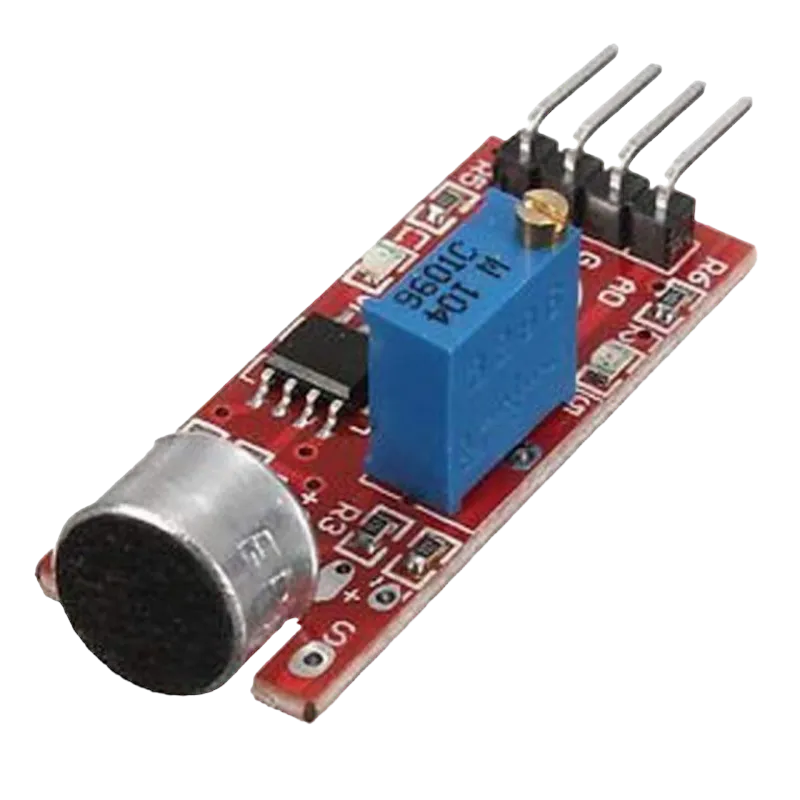 |  |
| --------------------------------------------------- | ------------------------------------------------------ | ----------------------------------------------------------- | --------------------------------------------------------- | ------------------------------------------------------ |

## Building the circuit

Things Needed:

- Arduino Uno = 1
- Arduino USB cable = 1
- Sound sensor = 1
- Red jumper wire = 1
- Black jumper wire = 1
- Green jumper wire = 1
- Breadboard = 1

## Mounting the component on the breadboard

- Breadboard = 1
- Sound sensor = 1

**Step 1:** • Insert the sound sensor into the horizontal connectors on the breadboard, ensuring the pins face outward.

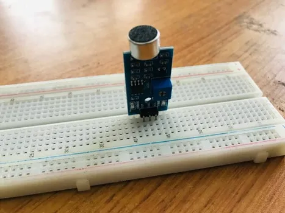.

_**NB:** Make sure you identify where the positive pin (+) and the negative pin (-) is connected to on the breadboard. The longer pin of the LED is the positive pin and the shorter one, the negative PIN_.

## WIRING THE CIRCUIT

### Things Needed:

- Arduino Uno = 1
- Red jumper wire = 1
- Black jumper wire = 1
- Green jumper wire = 1

**Step 1:** Red Wire (VCC): Connect one end of the red jumper wire to the VCC pin on the sound sensor and the other end to the 5V pin on the Arduino Uno.

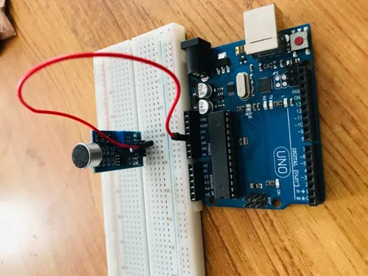.

**Step 2:** Black Wire (GND): Connect one end of the black jumper wire to the GND pin on the sound sensor and the other end to the GND pin on the Arduino Uno.

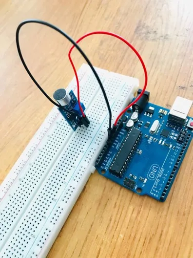.

**Step 3:** Green Wire (Signal): Connect one end of the green jumper wire to the OUT pin on the sound sensor and the other end to the A0 pin on the Arduino Uno.

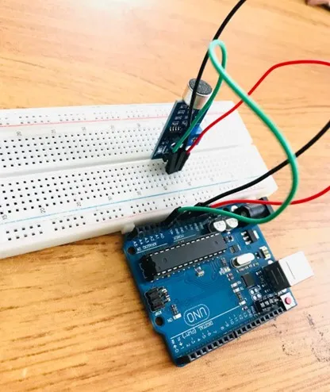.

_just as shown above, connect your USB cable to the Arduino board and to your laptop._

## PROGRAMMING

**Step 1:** Open your Arduino IDE. See how to set up here: [Getting Started](../../getting-started/overview.md).

**Step 2:** Type `const int soundSensorPin = A0;`
as shown below in the picture below: on line one before void Setup() function.

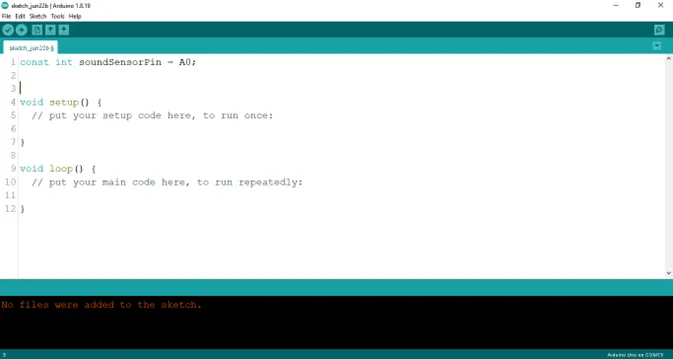.

**NB:** Make sure you avoid errors when typing. Do not omit any character or symbol especially the bracket {} and semicolons; and place them as you see in the image. The code that comes after the two ash backslashes “//” are called comments. They are not part of the code that will be run, they only explain the lines of code. You can avoid typing them.

**Step 3:** In the {} after the `void setup (), type Serial.begin (9600);` as shown below in the picture below:

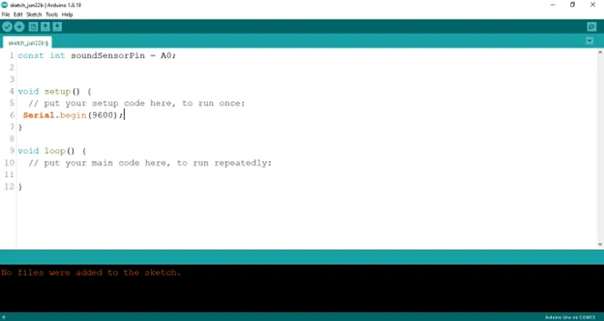.

**Step 4:** In the {} after the `void loop (), type int soundValue = analogueRead (soundSensorPin);` as shown below in the picture below:

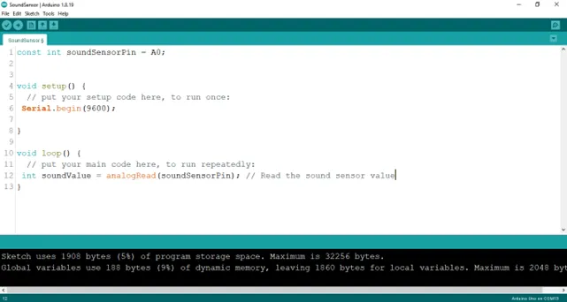.

**Step 5:** Type `Serial.printLn (soundValue) ;` as shown below in the picture below:

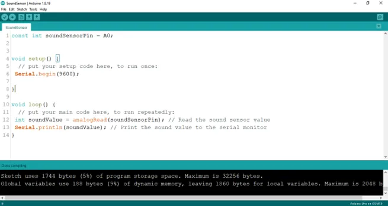.

**Step 6:** Type `delay (50) ;` as shown below in the picture below:

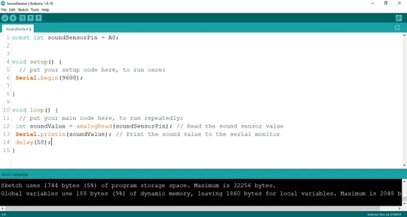.

**Step 7:** Save your code. _See the [Getting Started](../../getting-started/overview.md) section_

**Step 8:** Select the arduino board and port _See the [Getting Started](../../getting-started/overview.md) section:Selecting Arduino Board Type and Uploading your code_.

**Step 9:** Upload your code. _See the [Getting Started](../../getting-started/overview.md) section:Selecting Arduino Board Type and Uploading your code_

**Step 10:** Click on the serial monitor icon to view the amount of sound being recorded as shown in the picture below:

.

## OBSERVATION

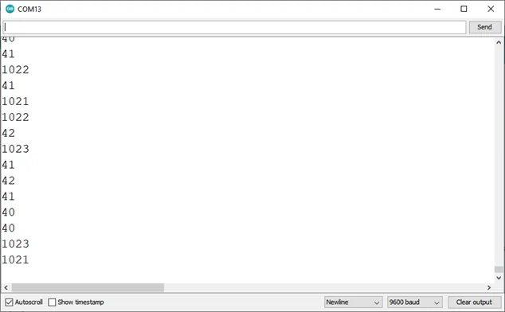.

## CONCLUSION

In conclusion, the sound sensor project aimed at measuring ambient noise levels presents a practical exploration of audio sensing and data acquisition. By utilizing the sound sensor to detect and quantify noise, participants acquire insights into analog signal processing, threshold detection, and environmental monitoring. This endeavor marks a significant milestone in electronics exploration, underscoring the importance of sensory technology in assessing noise pollution and inspiring interest in applications such as smart cities, noise control systems, and data-driven urban planning.
