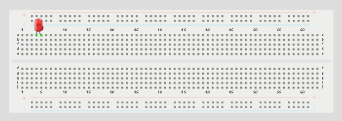
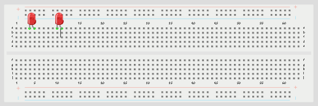
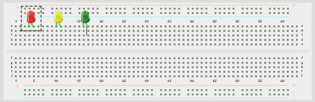
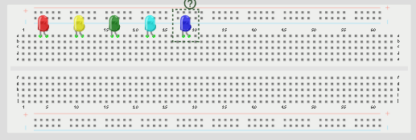
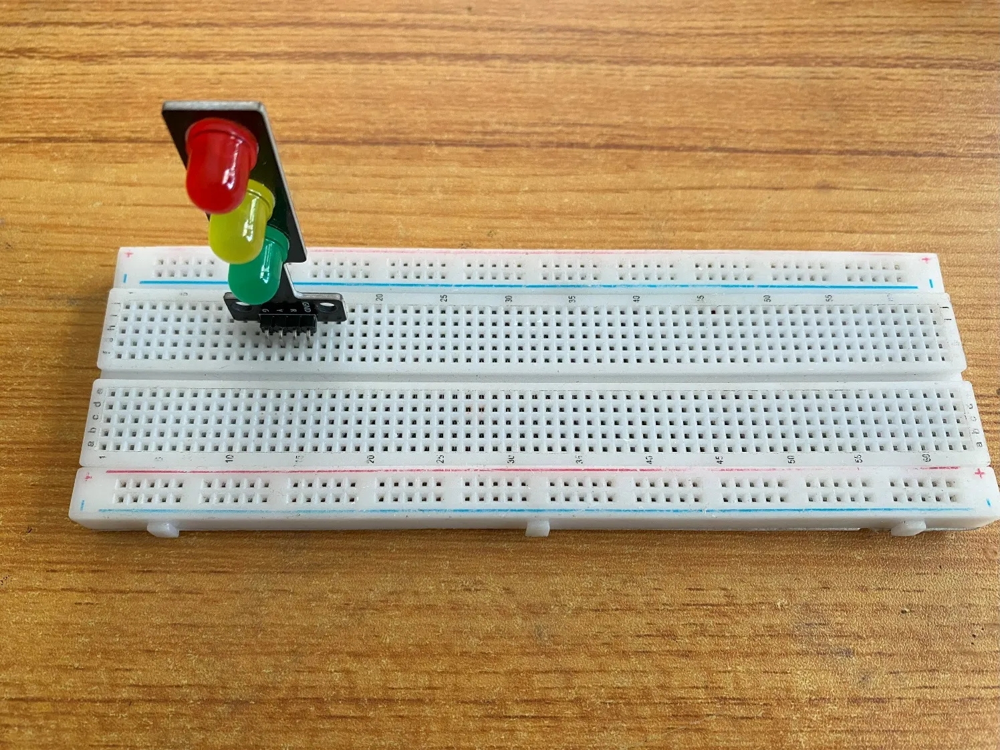

<!-- Fix: page links from /1.0/version1/ must use one level up (../1.x) while image assets require one level up (../../assets/). -->
## Manual 1.0

### 1.1 LED

  <a href="../1.1.LED/1.1.1.LED_ON/" class="lesson-card">
    

      
    

    
1

    

      <h4>LED ON</h4>
      
This project shows how to turn on an LED using an Arduino Uno. It introduces basic circuit connections and simple Arduino programming.

      Learn More →
    

  </a>
  <a href="../1.1.LED/1.1.2.One_LED_Blink/" class="lesson-card">
    

      
    

    
2

    

      <h4>CAR TRAVIGATOR BLINKING</h4>
      
This project shows how to make an LED turn on and off repeatedly using an Arduino Uno. It introduces the basic idea of blinking lights with time control.

      Learn More →
    

  </a>
  <a href="../1.1.LED/1.1.3.LEDS_ON/" class="lesson-card">
    

      
    

    
3

    

      <h4>DOUBLE LED ON</h4>
      
Double LED ON is a simple project that guides you in turning on two LEDs at the same time.

      Learn More →
    

  </a>
  <a href="../1.1.LED/1.1.4.Two_LED_Blink/" class="lesson-card">
    

      
    

    
4

    

      <h4>DOUBLE LED BLINK</h4>
      
_NB: Make sure you identify where the positive pin (+) and the negative pin (-) is connected to on the breadboard. The longer pin of the LED is the positive pin and the shorter one, ...

      Learn More →
    

  </a>
  <a href="../1.1.LED/1.1.5.Three_LEDs_ON/" class="lesson-card">
    

      
    

    
5

    

      <h4>Triple LEDS</h4>
      
This project shows how to turn on three LEDs at the same time using an Arduino Uno. It introduces the control of multiple LEDs using different Arduino pins.

      Learn More →
    

  </a>
  <a href="../1.1.LED/1.1.6.Three_LEDs_Blink/" class="lesson-card">
    

      
    

    
6

    

      <h4>TRAFFIC LIGHT</h4>
      
This project shows how to make three LEDs turn on and off one after the other using an Arduino Uno. It introduces simple sequencing and timing control.

      Learn More →
    

  </a>
  <a href="../1.1.LED/1.1.7.Four_LEDs_ON/" class="lesson-card">
    

      
    

    
7

    

      <h4>Car front and rear lights</h4>
      
This project shows how to turn on four LEDs at the same time using an Arduino Uno. It introduces the control of multiple LEDs using different Arduino pins.

      Learn More →
    

  </a>
  <a href="../1.1.LED/1.1.8.Four_LEDs_Blink/" class="lesson-card">
    

      
    

    
8

    

      <h4>PARTY LIGHTS</h4>
      
This project shows how to make four LEDs turn on and off one after the other using an Arduino Uno. It introduces simple light sequencing and timing.

      Learn More →
    

  </a>
  <a href="../1.1.LED/1.1.9.Five_LEDs_ON/" class="lesson-card">
    

      
    

    
9

    

      <h4>INCREASING BRIGHTNESS IN A ROOM</h4>
      
This project shows how to turn on five LEDs at the same time using an Arduino Uno. It introduces the control of several LEDs using different Arduino pins.

      Learn More →
    

  </a>
  <a href="../1.1.LED/1.1.10.Five_LEDs_Blink/" class="lesson-card">
    

      
    

    
10

    

      <h4>PARTY LIGHTNENING</h4>
      
This project shows how to make five LEDs turn on and off one after the other using an Arduino Uno. It introduces light sequencing and timing control.

      Learn More →
    

  </a>

---

### 1.2 Buzzer

  <a href="../1.2.Buzzer/1.2.1.Buzzer_ON_and_OFF/" class="lesson-card">
    

      
    

    
1

    

      <h4>Buzzer Control With Arduino(On and OFF)</h4>
      
This project shows how to turn on a buzzer using an Arduino Uno. The buzzer stays on continuously when power is supplied from the Arduino.

      Learn More →
    

  </a>
  <a href="../1.2.Buzzer/1.2.2.Buzzer_Beep/" class="lesson-card">
    

      
    

    
2

    

      <h4>Buzzer Control With Arduino(On and OFF)</h4>
      
This project shows how to control a buzzer using an Arduino Uno. The buzzer can be turned on and off using simple Arduino code.

      Learn More →
    

  </a>

---

### 1.3 Push Button

  <a href="../1.3.Push_Button/1.3.1.Push_Button_press_with_1_LED/" class="lesson-card">
    

      
    

    
1

    

      <h4>BUTTON LIT</h4>
      
This project shows how to control an LED using a push button with an Arduino Uno. When the button is pressed, the LED turns on, and when the button is released, the LED turns off.

      Learn More →
    

  </a>
  <a href="../1.3.Push_Button/1.3.2.Push_Button_press_with_2_LEDs/" class="lesson-card">
    

      
    

    
2

    

      <h4>TWIN LIGHT</h4>
      
This project shows how to control two LEDs using a push button with an Arduino Uno. When the button is pressed, both LEDs turn on at the same time. When the button is released, both ...

      Learn More →
    

  </a>
  <a href="../1.3.Push_Button/1.3.3.Push_Button_press_with_3_LEDs/" class="lesson-card">
    

      
    

    
3

    

      <h4>TRI-LIGHT</h4>
      
This project shows how to control three LEDs using a push button with an Arduino Uno. When the button is pressed, all three LEDs turn on together. When the button is released, all th...

      Learn More →
    

  </a>

---

### 1.4 Traffic Light Module

  <a href="../1.4.Traffic_Light/1.4.1.Traffic_Light_Red_ON/" class="lesson-card">
    

      
    

    
1

    

      <h4>RED MEANS STOP</h4>
      
This teaches you how to turn ON and also turn OFF the red light only on the traffic light module.

      Learn More →
    

  </a>
  <a href="../1.4.Traffic_Light/1.4.2.Traffic_Light_Red_BLINK/" class="lesson-card">
    

      
    

    
2

    

      <h4>TRAFFIC LIGHT RED ONLY BLINK</h4>
      
This is where you get to know how to make the red LED blink.

      Learn More →
    

  </a>
  <a href="../1.4.Traffic_Light/1.4.3.Traffic_Light_Yellow_ON/" class="lesson-card">
    

      
    

    
3

    

      <h4>YELLOW MEANS GET READY</h4>
      
This teaches you how to turn ON and also turn OFF the yellow light only on the traffic light module.

      Learn More →
    

  </a>
  <a href="../1.4.Traffic_Light/1.4.4.Traffic_Light_Yellow_Blink/" class="lesson-card">
    

      
    

    
4

    

      <h4>TRAFFIC LIGHT YELLOW ONLY BLINK</h4>
      
This is where you get to know how to make the yellow LED blink.

      Learn More →
    

  </a>
  <a href="../1.4.Traffic_Light/1.4.5.Traffic_Light_Green_ON/" class="lesson-card">
    

      
    

    
5

    

      <h4>Green Means Go</h4>
      
This teaches you how to turn ON and also turn OFF the green light only on the traffic light module.

      Learn More →
    

  </a>
  <a href="../1.4.Traffic_Light/1.4.6.Traffic_Light_Green_Blink/" class="lesson-card">
    

      
    

    
6

    

      <h4>Trafic Light Green Blink Only</h4>
      
This is where you will learn how to make the green LED blink.

      Learn More →
    

  </a>

---

### 1.5 RGB Module

  <a href="../1.5.RGB/1.5.1.RGB_Red_On/" class="lesson-card">
    

      
    

    
1

    

      <h4>RED-G-B</h4>
      
This project teaches how to connect and program an RGB LED so that only the red light turns on using an Arduino.

      Learn More →
    

  </a>
  <a href="../1.5.RGB/1.5.2.RGB_Red_Blink/" class="lesson-card">
    

      
    

    
2

    

      <h4>Red Blink</h4>
      
This project teaches how to connect and program an RGB LED so that only the red-light blinks using an Arduino.

      Learn More →
    

  </a>
  <a href="../1.5.RGB/1.5.3.RGB_Green_On/" class="lesson-card">
    

      
    

    
3

    

      <h4>TURNING ON/OFF GREEN LED ON RGB</h4>
      
This project teaches how to connect and program an RGB LED so that only the green light turns on/off using an Arduino.

      Learn More →
    

  </a>
  <a href="../1.5.RGB/1.5.4.RGB_Green_Blink/" class="lesson-card">
    

      
    

    
4

    

      <h4>GREEN LED BLINKING ON RGB</h4>
      
A blinking green LED means the system is working normally and everything is okay.

      Learn More →
    

  </a>
  <a href="../1.5.RGB/1.5.5.RGB_Blue_On/" class="lesson-card">
    

      
    

    
5

    

      <h4>R -G-Blue</h4>
      
This project teaches how to connect and program an RGB LED so that only the blue light turns on/off using an Arduino.

      Learn More →
    

  </a>
  <a href="../1.5.RGB/1.5.6.RGB_Blue_Blink/" class="lesson-card">
    

      
    

    
6

    

      <h4>BLUE LED BLINKING ON RGB</h4>
      
A blinking green LED means the system is working normally and everything is okay.

      Learn More →
    

  </a>
  <a href="../1.5.RGB/1.5.7.RGB_Rainbow_Colors/" class="lesson-card">
    

      
    

    
7

    

      <h4>RAINBOW COLORS ON RGB</h4>
      
This programming section demonstrates how to control an RGB LED using Arduino to produce rainbow colors. By combining different values of red, green, and blue in sequence with short ...

      Learn More →
    

  </a>

---

### 1.6 LDR Module

  <a href="../1.6.LDR/1.6.0.LDR_Module/" class="lesson-card">
    

      
    

    
1

    

      <h4>LIGHT INTENSITY CHECKER</h4>
      
This is a simple project that measures how bright or dark an environment is using an LDR (Light Dependent Resistor). It helps detect light levels and shows whether a place has high l...

      Learn More →
    

  </a>

---

### 1.7 Servo Motor

  <a href="../1.7.Servo_Motor/1.7.0.Servo_Motor_One_Angle/" class="lesson-card">
    

      
    

    
1

    

      <h4>ROBOT ARM-UP</h4>
      
Things Needed:

      Learn More →
    

  </a>
  <a href="../1.7.Servo_Motor/1.7.1.Servo_Motor_Sweep/" class="lesson-card">
    

      
    

    
2

    

      <h4>Car windshield wiper</h4>
      
In this project, you will learn how to control a servo motor using an Arduino to rotate to different angles with precision. This project introduces the basic concept of controlled mo...

      Learn More →
    

  </a>

---

### 1.8 Ultrasonic Sensor

---

### 1.9 Sound Sensor

  <a href="../1.9.Sound_Sensor/1.9.0.Sound_Sensor/" class="lesson-card">
    

      
    

    
1

    

      <h4>Noise Checker – Sound Sensor Threshold Detection</h4>
      
In this project, you will learn how to use a sound sensor with an Arduino to detect and monitor sound levels in the environment. This project introduces the basic concept of sound se...

      Learn More →
    

  </a>

---
