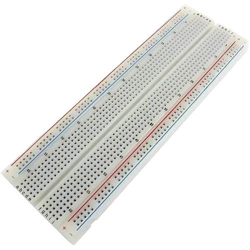
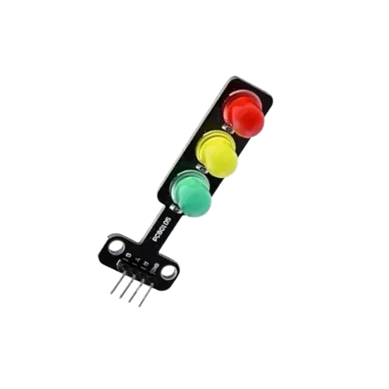

# Project 2.14.1: OPERATING A SOUND SENSOR AND LED WITH STEMAIDE

| **Description** | You will learn how to turn ON three LED's with response to sound.  |
|------------------|----------------------------------------------------------------|
| **Use case**     | Flickering lights in response to sound beats from a speaker. |

## Components (Things You will need)

|  |  |  ||||
|-------------------------|-------------------------|-------------------------|-------------------------|------------------------|--------------------------|

## Building the circuit

Things Needed:

- Arduino Uno = 1  
- Arduino USB cable = 1
- Sound Sensor  = 1
- Traffic module= 1
- Red jumper wire = 1
- Black jumper wire = 1
- Green jumper wire = 1
- Brown jumper wire = 1
- Purple jumper wire = 1
- Yellow jumper wire = 1
- Orange jumper wire = 1
- Blue jumper wire = 1
- Breadboard = 1


## Mounting the component on the breadboard

**Step 1:** Take the Sound Sensor and the breadboard, insert the Sound Sensor into the horizontal connectors on the breadboard.


**Step 2:** Take the traffic light module and insert it into the horizontal connectors on the breadboard as shown in the picture below:


## WIRING THE COMPONENTS

**Step 1:** Take the blue male-to-male jumper wire, connect one end of the wire to the AO port in front of the sound sensor and the other end to the A0 port on the Arduino Uno, as shown in the picture below:


**Step 2:** Take the purple male-to-male jumper wire, connect one end of the wire to the “G” port in front of the sound sensor and the other end to the GND on the Arduino Uno, as shown in the picture below.


**Step 3:** Take the white male-to-male jumper wire. Connect one end to the “+” port in front of the sound sensor and the other end to the 5V port on the Arduino Uno, as shown in the picture below.


**Step 4:** Take the green male-to-male jumper wire, connect one end of the wire to the “DO” port in front of the sound sensor and the other end to digital pin 4 on the Arduino Uno, as shown in the picture below.


**Step 5:** Take the green male-to-male jumper wire. Connect one end to the “G” port in front of the traffic light and the other end to digital pin 7 on the Arduino Uno, as shown in the picture below.


**Step 6:** Take the yellow male-to-male jumper wire, connect one end of the wire to the “Y” port in front of the sound sensor and the other end to digital pin 6 on the Arduino Uno, as shown in the picture below.


**Step 7:** Take the orange male-to-male jumper wire. Connect one end to the “R” port in front of the traffic light and the other end to digital pin 5 on the Arduino Uno, as shown in the picture below.


**Step 8:** Take the blue male-to-male jumper wire, connect one end of the wire to the “GND” port in front of the traffic light and the other end to the GND port on the Arduino Uno, as shown in the picture below.


## PROGRAMMING

**Step 1:** Open your Arduino IDE. See how to set up here: [Getting Started](../../getting-started/overview.md).

**Step 2:** Type ``` const int SoundSensorAPin = A0; const int SoundSensorDOPIN = 4; ``` as shown in the picture below.


_**NB:** Make sure you avoid errors when typing. Do not omit any character or symbol especially the bracket {} and semicolons; and place them as you see in the image. The code that comes after the two  backslashes “//” are called comments. They are not part of the code that will be run, they only explain the lines of code. You can avoid typing them._

**Step 3:** Type ``` const int redPin = 7; ``` as shown below in the image.


**Step 4:** Type ``` const int yellowPin = 6; ``` as shown below in the image.


**Step 5:** Type ``` const int greenPin = 7; ``` as shown below in the image.


**Step 6:** In the { } after the void setup (),
Type
``` cpp
 pinMode (redPin, OUTPUT);
pinMode (yellowPin, OUTPUT);
pinMode (greenPin, OUTPUT);
pinMode (soundSensorDOPin, INPUT); 
 ``` 
as shown below in the image.


**Step 7:** In the { } after the void setup (), Type ``` Serial.begin(9600); ``` as shown below in the image.


**Step 8:** In the {} after the void loop (), Type 

    ``` cpp
        int soundValue = analogRead (SoundSensorAPin); 
        int digitalValue= digitalRead (SoundSensorDOPin); 
    ``` as shown below in the image.


- The above code reads data from the Soundsensor Pin.

**Step 9:** Type 
        ``` cpp 
           Serial.print(“Sound Value:”);
	        Serial.printIn(soundValue);
        ``` as shown below in the image.


**Step 10:** Type ``` if (soundValue > 100) {  } ; ``` as shown below in the image.


**Step 11:** Type 
       ``` cpp
           digitalWrite (redPin, HIGH); 
           digitalWrite (yellowPin, LOW);
           digitalWrite (greenPin, LOW);
	       delay (500); 
                    ``` as shown below in the image.


**Step 12:** Type
            ``` cpp
            digitalWrite (redPin, LOW); 
            digitalWrite (yellowPin, HIGH);
            digitalWrite (greenPin, LOW);
	         delay (500); 
            ``` as shown below in the image.


**Step 13:** Type 
        ``` cpp
           digitalWrite (yellowPin, LOW); 
           digitalWrite (greenPin, HIGH);
           digitalWrite (redPin, LOW);
	       delay (500); 
         ``` as shown below in the image.


**Step 14:** Type 
        ``` cpp
          else {
             digitalWrite (BLUE_PIN, HIGH);
             digitalWrite (RED_PIN, LOW);
             digitalWrite (GREEN_PIN, LOW);  }
        ``` as shown below in the image.


## CONCLUSION
If you encounter any problem when trying to upload your code to the board, run through your code again to check for any errors or missing lines of code. If you do not encounter any problem and the program runs as expected, Congratulations on a job well done. 
