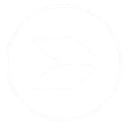

# Ultrasonic & Buzzer

Welcome to the **Ultrasonic & Buzzer** workspace. This project contains practical use cases and step-by-step tutorials to build and program with STEMAIDE.

Explore the lessons below to begin.

---

---

### Project Lessons

  <a href="2.2.2.Ultrasonic_sensor_and_buzzer.md" class="lesson-card">
    

      
    

    
1

    

      <h4>Ultrasonic Sensor With Buzzer</h4>
      
Learn step-by-step how to construct and code this project.

      Learn More →
    

  </a>

