# Project 2.4.1: Smart lightening system with RGB module.

| **Description** | This smart lighting system illustrate the potential of using Arduino, LEDs and ultrasonic sensor in infrastructure and street light planning. |
| --------------- | --------------------------------------------------------------------------------------------------------------------------------------------- |
| **Use case**    | Implementing a lightening system that include different LEDs with adaptable colours to different distance.                                    |

## Components (Things You will need)

|  | 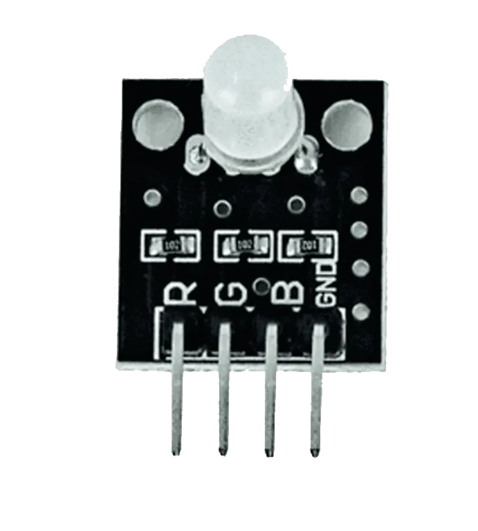 |  |  | 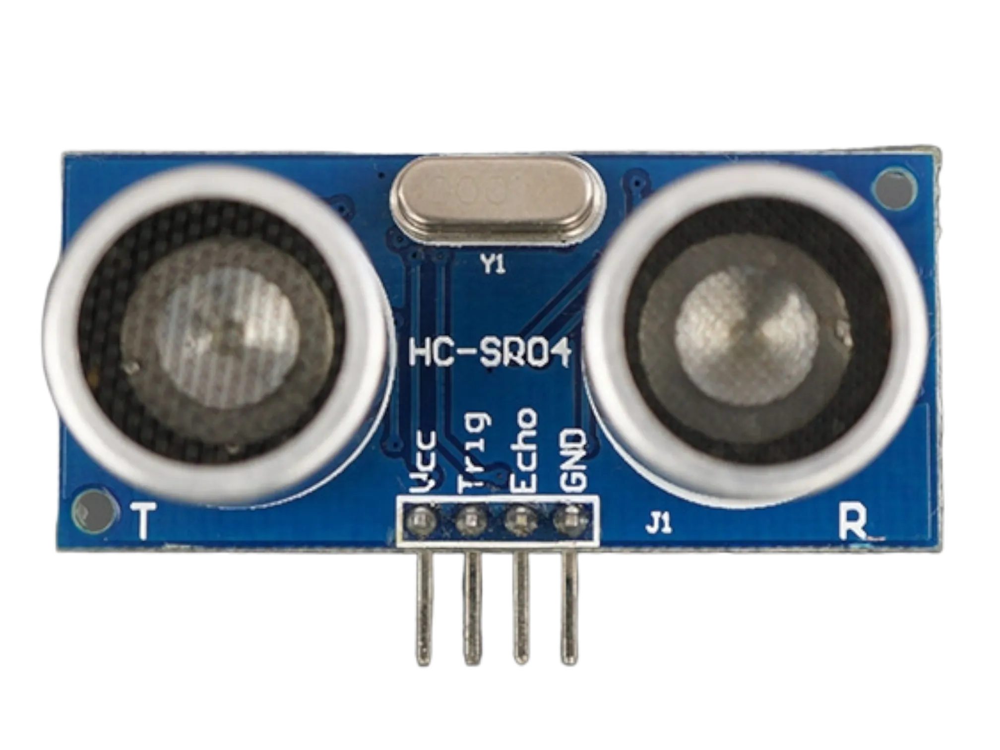 | 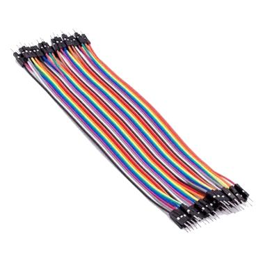 |
| --------------------------------------------------- | ------------------------------------------------------ | ----------------------------------------------------------- | --------------------------------------------------------- | ------------------------------------------------------ | ------------------------------------------------------ |

## Building the circuit

Things Needed:

- Arduino Uno = 1
- Arduino USB cable = 1
- Jumper wires
- ultrasonic Sensor = 1
- Breadboard = 1
- RGB Module = 1

## Mounting the component on the breadboard

- Breadboard = 1
- RGB Module = 1
- Ultrasonic sensor = 1

**Step 1:** • The ultrasonic distance sensor has four pins (Echo, Trig, VCC and GND), On the middle section of the breadboard, locate each horizontal section lettered A to J. Take the ultrasonic distance sensor and insert it into any of the lettered section (Say A) horizontally.

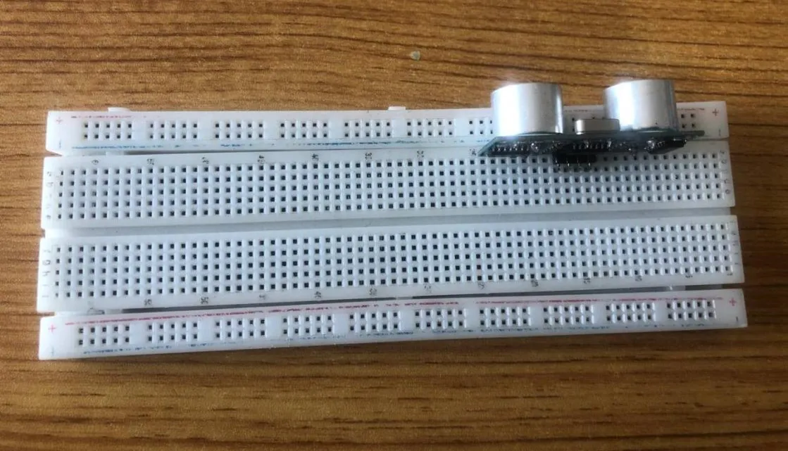

**Step 2:** The RGB has four pins (Red, Green, Blue and GND). On the middle section of the breadboard, locate each horizontal section lettered A to J. Take the RGB module and insert it into any of the lettered sections (Say A) horizontally.

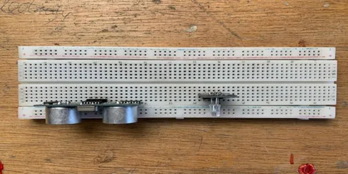.

**NB:**Take note of where each of the pins are placed on the bread board.

## WIRING THE CIRCUIT

### Things Needed:

- Red male-male-to-male jumper wires = 2
- White male-to-male jumper wires = 2
- Green male-to-male jumper wires = 2
- Yellow male-to-male jumper wires = 2
- Arduino Uno Board

**Step 1:** Take the Red male-to-male jumper wire and place one side of the wire pin under the Echo pin of the ultrasonic distance sensor and the other side of the wire pin to the digital pin 2 on the Arduino uno board.

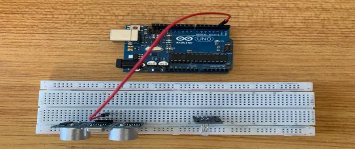.

**NB:**Take note of the digital pin you allocated to the Echo pin.

**Step 2:** Take the Green male-to-male jumper wire and place one side of the wire pin under the Trig pin of the ultrasonic distance sensor and the other side of the wire pin to the digital pin 3 on the Arduino uno board.

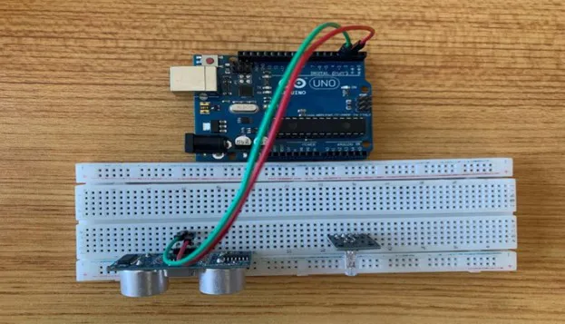.

**NB:**Take note of the digital pin you allocated to the trig pin.

**Step 3:** Take the Blue male-to-male jumper wire and place one side of the wire pin under the VCC pin of the ultrasonic distance sensor and the other side of the wire pin to the 5V pin on the Arduino uno board.

.

**Step 4:** Finally, Take the White male-male-to-male jumper wire and place one side of the wire pin under the GND pin of the ultrasonic distance sensor and the other side of the wire pin to the GND port on the Arduino Uno Board.

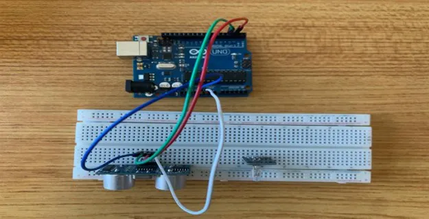.

**Step 5:** Take the Red male-to-male jumper wire and place one side of the wire pin under the Red pin of the RGB module and the other side of the wire pin to the digital pin 4 on the Arduino uno board.

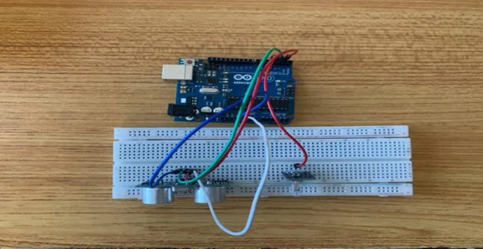.

**NB:**Take note of the digital pin you allocated to the Positive pin.

**Step 6:** Take the Green male-to-male jumper wire and place one side of the wire pin under the Green pin of the RGB module and the other side of the wire pin to the digital pin 5 on the Arduino uno board.

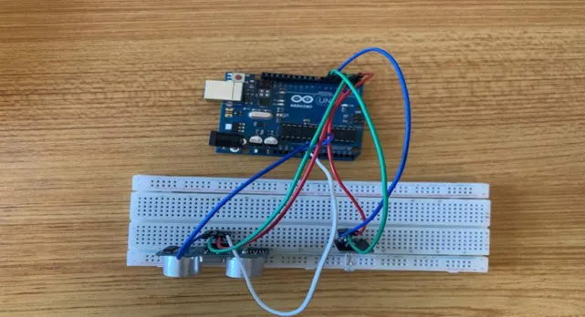.

**Step 7:** Take the Blue male-to-male jumper wire and place one side of the wire pin under the Blue pin of the RGB module and the other side of the wire pin to the digital pin 6 on the Arduino uno board.

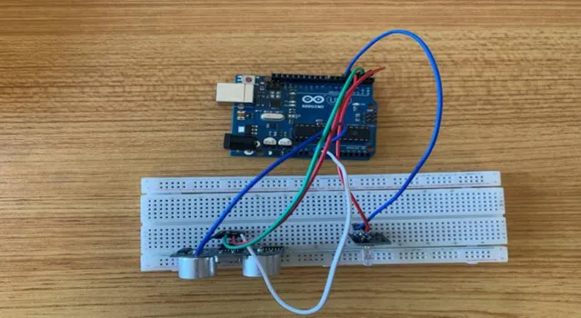.

**Step 8:** Finally, Take the White male-male-to-male jumper wire and place one side of the wire pin under the GND pin of the module and the other side of the wire pin to the GND port on the Arduino Uno Board.

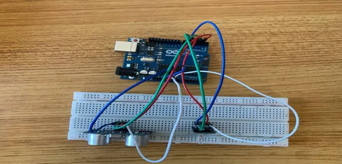.

**Step 9:** Connect the USB port of the Arduino cable to the USB port of your laptop and the other side to the Arduino Uno Board.

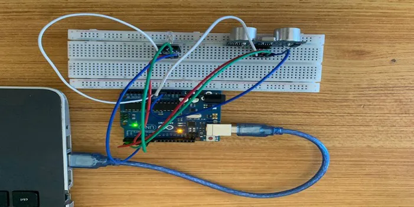.

## PROGRAMMING

**Step 1:** Open your Arduino IDE. See how to set up here: [Getting Started](../../getting-started/overview.md).

**Step 2:** Type `const int Echo = 2; `
as shown below in the picture below: on line one before void Setup() function.

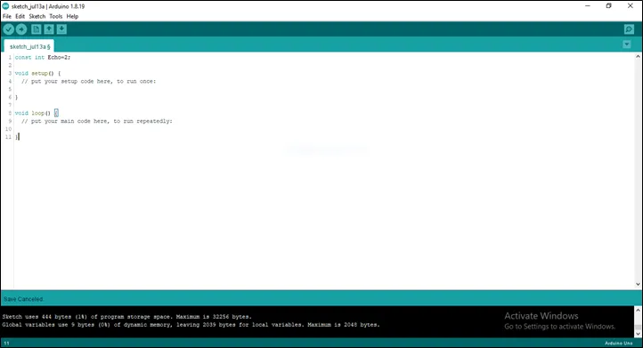.

**Step 3:** Type `int Trig = 3;  `
as shown below in the picture below: on line one before void Setup() function.

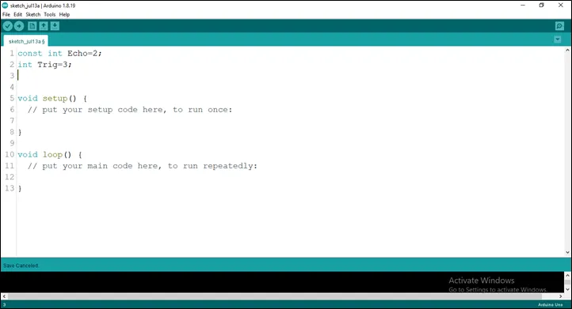.

**Step 4:** Type `int Red = 4; `
as shown below in the picture below: on line one before void Setup() function.

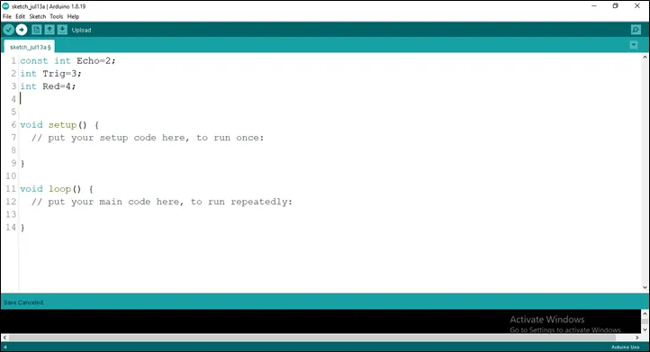.

**Step 5:** Type `int Green  = 5; `
as shown below in the picture below: on line one before void Setup() function.

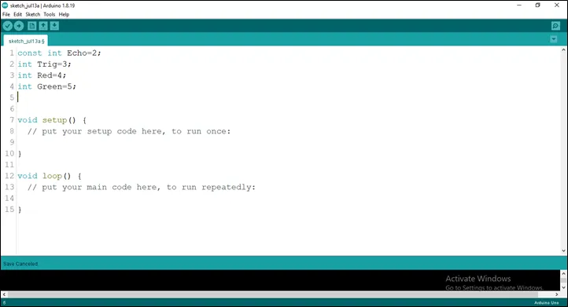.

**Step 6:** Type `int Blue = 6; `
as shown below in the picture below: on line one before void Setup() function.

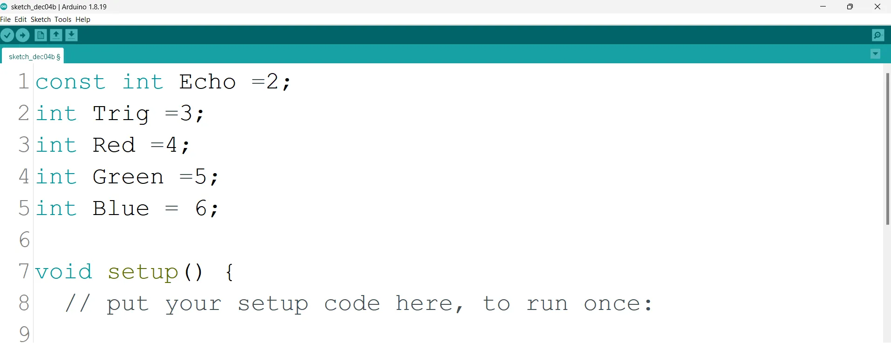.

**Step 7:** Type `long duration; ` and Type ` long duration;`
as shown below in the picture below: on line one before void Setup() function.

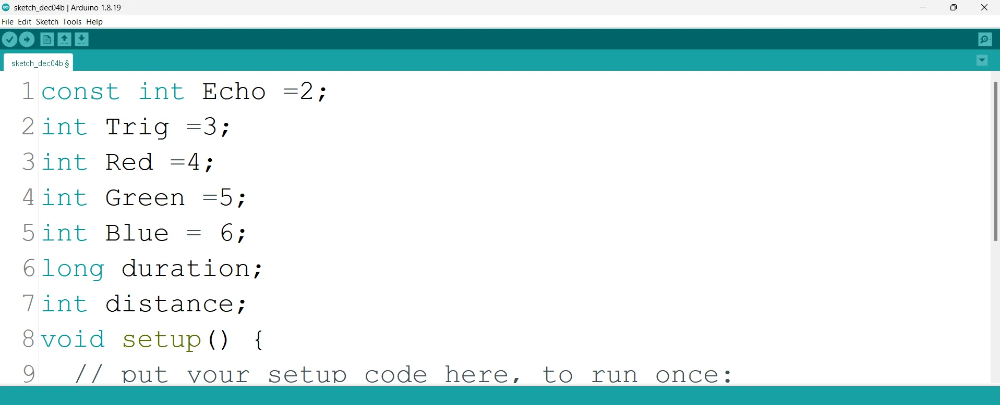.

**Step 8:** Type
`const int dis_threshold = 15;`

as shown below in the picture below: on line one before void Setup() function.

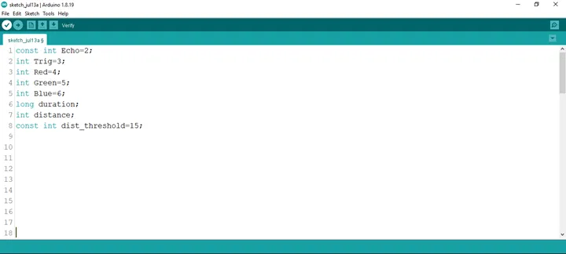.

**NB:** Make sure you avoid errors when typing. Do not omit any character or symbol especially the bracket {} and semicolons; and place them as you see in the image. The code that comes after the two ash backslashes “//” are called comments. They are not part of the code that will be run, they only explain the lines of code. You can avoid typing them.

**Step 9:** In the {} after the
`pinMode (Echo, INTPUT);`
`pinMode (Trig, OUTPUT); `
`Serial.begin (9600);`
`pinMode (Red, OUTPUT);`
`pinMode (Yellow, OUTPUT);`
`pinMode (Green, OUTPUT);`

as shown below in the picture below:

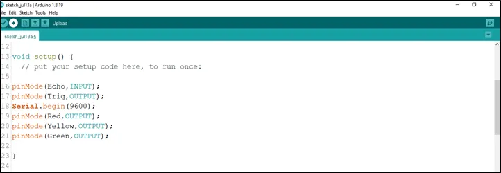.

**Step 10:** In the {} after the
`digitalWrite (Trig, LOW); `
`delay (200);`
`digitalWrite (Trig, HIGH); `
`delay (100);`
`digitalWrite (Trig, LOW);`
`duration = pulseIn (Echo, HIGH);`
`distance = duration * 0.034/2;`
as shown below in the picture below:

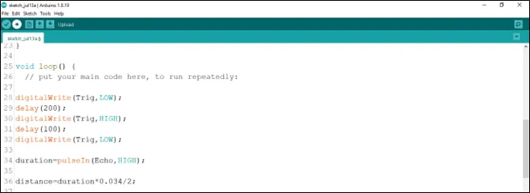.

**Step 11:** Type This Function as shown in the image below.

`if (distance < dis_threshold) {`
`digitalWrite (Red, HIGH); `
`delay(200)`
`digitalWrite (Red, LOW); `
`delay(200)`
`digitalWrite (Blue, HIGH); `
`delay(200)`
`digitalWrite (Blue, LOW); `
`delay(200)`
`digitalWrite (Green, HIGH); `
`delay(200)`
`digitalWrite (Green, LOW); `
`else{`
`digitalWrite (Red, LOW);`
`digitalWrite (Blue, LOW);`
`digitalWrite (Green, LOW);`
`}`
`Serial.print (distance);`
`Serial.println (“cm”);`
`delay (100);`
`distance = duration * 0.034/2;} `
as shown in the picture below.

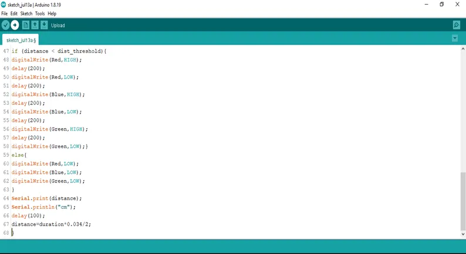.

**Step 12:** Save your code. _See the [Getting Started](../../getting-started/overview.md) section_

**Step 13:** Select the arduino board and port _See the [Getting Started](../../getting-started/overview.md) section:Selecting Arduino Board Type and Uploading your code_.

**Step 14:** Upload your code. _See the [Getting Started](../../getting-started/overview.md) section:Selecting Arduino Board Type and Uploading your code_

**Step 15:** Click on the serial monitor icon to view the amount of sound being recorded as shown in the picture below:

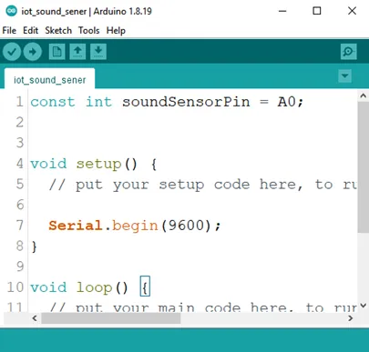.

## OBSERVATION

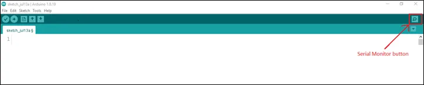

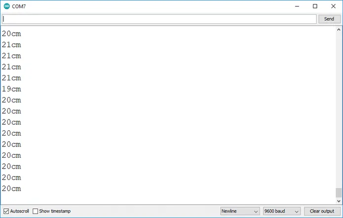

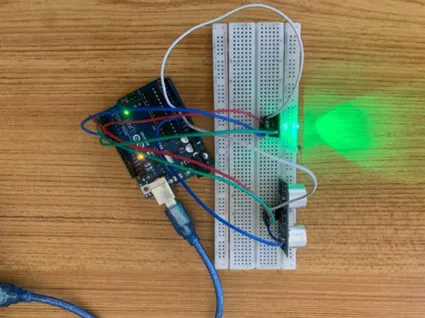

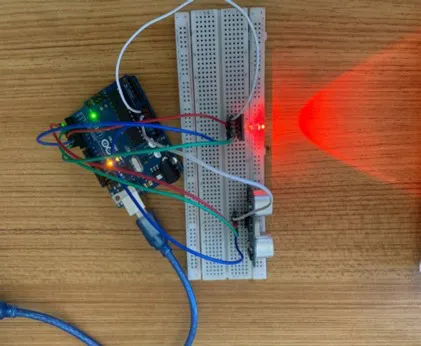

## CONCLUSION

If you encounter any problems when trying to upload your code to the board, run through your code again to check for any errors or missing lines of code. If you did not encounter any problems and the program ran as expected, Congratulations on a job well done.
