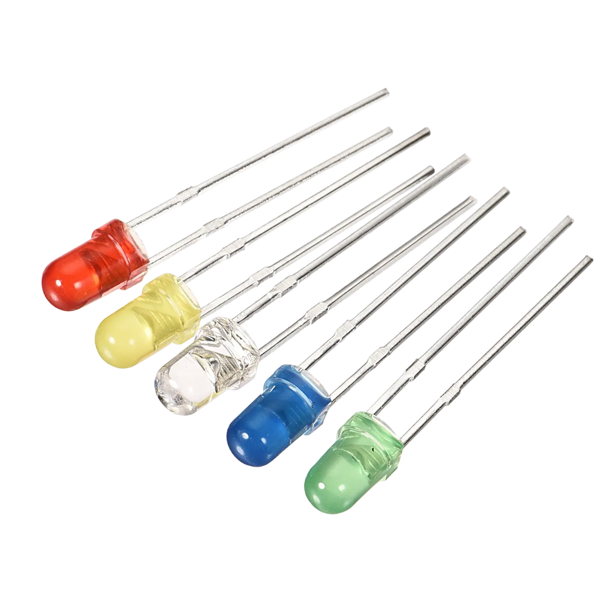
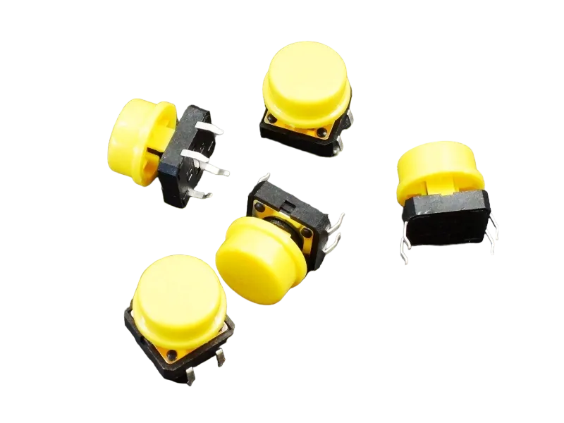

# Project 2.5.2: LED Control with Arduino and Push Button

| **Description** | You will learn how to create a simple circuit using an Arduino microelectronic and a push button.                                                                           |
| --------------- | -------------------------------------------------------------------------------------------------------------------------------------------------------------------------------------------------------------- |
| **Use case**    | Imagine you want to create an interactive lighting system for your living room using Arduino and push buttons. You want to control the ambiance by turning on specific lights with a simple press of a button |

## Components (Things You will need)

|  |  |  |  |  |  |
| ---------------------------------------- | --------------------------------------------------- | ----------------------------------------------------------- | ----------------------------------------------------- | ------------------------------------------------------ | ------------------------------------------------------- |

## Building the circuit

Things Needed:

- Arduino Uno = 1
- Arduino USB cable = 1
- Resistor = 1
- Push button = 1
- Red LED = 1
- Blue jumper wire= 1
- Yellow jumper wire= 1
- Black jumper wire= 1
- Red jumper wire= 1

## Mounting the component on the breadboard

**Step 1:** Take the breadboard and the red LED and insert the red LED into the vertical connectors on the breadboard.
.

**step 2:** Connect the pushbutton on the breadboard but make sure the two pair of the pins are connected on each side of the bridge.
.

**step 3:** Take one resistor and connect one terminal of the resistor to the longer pin of the LED positive terminal (+) on the breadboard and the other pin of the resistor into the vertical connected wholes on the breadboard.
.

**Note:** NB: This completes the circuit for the LED, allowing current to flow from the digital pin, through the LED and back to ground.

## WIRING THE CIRCUIT

### Things Needed:

- Blue jumper wire= 1
- Yellow jumper wire= 1
- Black jumper wire= 1
- Red jumper wire= 1

**step 1:** Connect red male-to-male jumper wire from the free end of the resistor to digital pin (13) on the Arduino UNO.
.

**step 2:** Connect Black male-to-male jumper wire from the free end of the LED negative pin power GND (Ground) on the Arduino UNO.
.

**step 3:** Connect Yellow male-to-male jumper wire from one Pin of the Push Button as a negative to power GND (Ground) on the Arduino UNO.
.

**step 4:** Finally, connect blue male-to-male jumper wire from the other Pin of the push button (not connected to GND) to any digital pin on the Arduino UNO. Let's use digital pin 2 in this tutorial.
.

## PROGRAMMING

**Step 1:** Open your Arduino IDE. See how to set up here: [Getting Started](../../getting-started/overview.md).

**Step 2:** Type the following codes before the void setup function.

```
const int ledPin1 = 3;
const int buttonPin = 2;
bool isBlinking = false;
```

.

**Step 3:** After the void setup ()within the curly brackets type the following codes.

``` cpp
pinMode (LedPin1, OUTPUT); 

```

.

**Step 4:** : After the (void loop ()) within the curly brackets type

``` cpp
  if (digitalRead(buttonPin) == LOW && !isBlinking) {
    isBlinking = true;
    while (digitalRead(buttonPin) == LOW) {
      digitalWrite(ledPin1, HIGH);
      delay(500);
      digitalWrite(ledPin1, LOW);
      delay(500);
    }
    isBlinking = false;
  }
```
.

## Uploading the code

**Step 1:** Save your code. _See the [Getting Started](../../getting-started/overview.md) section_

**Step 2:** Select the arduino board and port _See the [Getting Started](../../getting-started/overview.md) section:Selecting Arduino Board Type and Uploading your code_.

**Step 3:** Upload your code. _See the [Getting Started](../../getting-started/overview.md) section:Selecting Arduino Board Type and Uploading your code_

## OBSERVATION

.
.


## CONCLUSION
