# Project 2.7.1:Push Button with Traffic Light Module

| **Description** | In this project, you will learn how to build a simple traffic light control. When the push button is pressed, it triggers the traffic light to change in sequence, simulating a real pedestrian crossing system. |
|------------------|----------------------------------------------------------------|
| **Use case**     | In this project, the system can be used as a pedestrian crossing control where a person presses a push button to request safe crossing. Once activated, the traffic lights change in sequence to stop vehicles and allow pedestrians to cross safely. |

## Components (Things You will need)

|  |  |  |  ||  |
|-------------------------|-------------------------|-------------------------|-------------------------|-------------------------|-------------------------|

## Building the circuit

Things Needed:

-	Arduino Uno = 1
-	Arduino USB cable = 1
-	Traffic Light= 1
-	Breadboard = 1
-	Pushbutton = 1


## Mounting the component on the breadboard
Things Needed:

-   Traffic Light Module = 1
-   Push Button = 1
-   Breadboard = 1


**Step 1:** 
Insert the push button into the breadboard by placing two pins on one side and the other two pins on the opposite side of the middle section. Then insert the traffic light module into the breadboard, ensuring all four pins (Red, Yellow, Green, and GND) are properly placed and securely fixed.


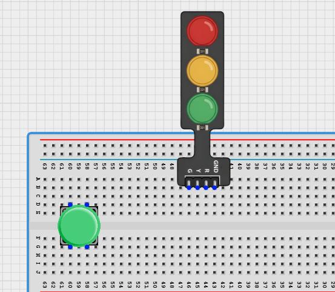.


## WIRING THE CIRCUIT


**Step 2:** 
Connect brown jumper wire from the pin on row d of the push button to Digital Pin 2 on the Arduino Uno. Then connect the other pin on row d to GND on the Arduino Uno using the white jumper wire. 


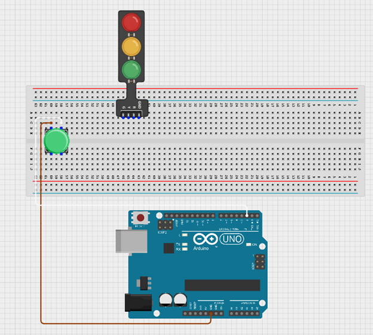.


**Step 3:**  Connect the traffic light module to the Arduino Uno by linking the Red pin to Digital Pin 3, the Yellow pin to Digital Pin 5, and the Green pin to Digital Pin 4 using jumper wires. Finally, connect the GND pin of the module to the GND port on the Arduino Uno.
.

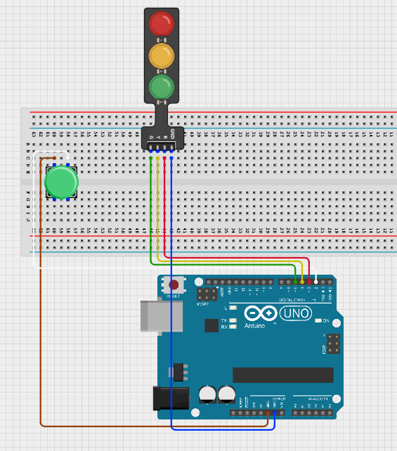

<!-- **Step 4:**  Take the White male-male-to-male jumper wire and place one side of the wire pin under the other pin located on the lettered section ‘d’ and the other side of the wire pin to GND on the Arduino uno board. 

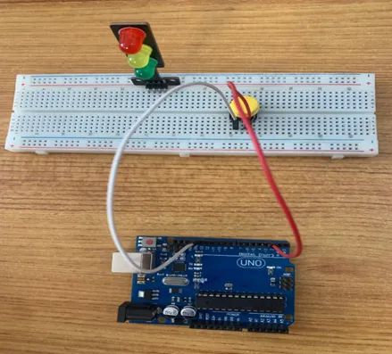. -->

<!-- **Step 5:**  Take the Red male-to-male jumper wire and place one side of the wire pin under the Red pin of the traffic light module and the other side of the wire pin to the digital pin 3 on the Arduino uno board.

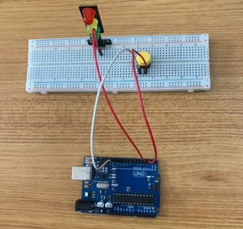. -->

<!-- **Step 6:**  Take the Yellow male-to-male jumper wire and place one side of the wire pin under the yellow pin of the traffic light module and the other side of the wire pin to the digital pin 5 on the Arduino uno board.


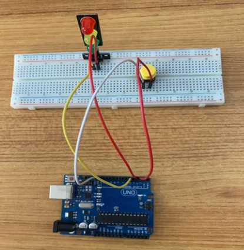. -->

<!-- **Step 7:**  Take the Green male-to-male jumper wire and place one side of the wire pin under the Green pin of the traffic light module and the other side of the wire pin to the digital pin 4 on the Arduino uno board. 


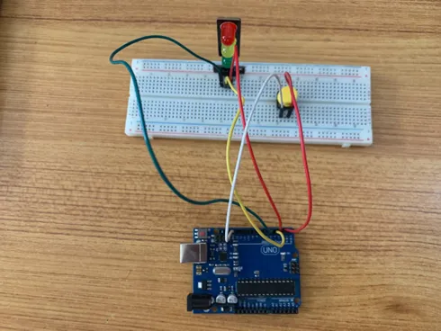. -->
<!-- 
**Step 8:**  Finally, Take the White male-male-to-male jumper wire and place one side of the wire pin under the GND pin of the module and the other side of the wire pin to the GND port on the Arduino Uno Board.


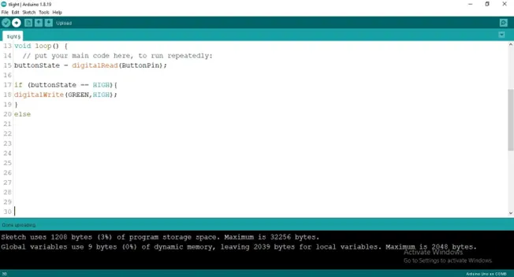. -->


## Connecting The Arduino Uno Board To Your Laptop.

Arduino Uno Board
Arduino cable

**Step 7:**	 Connect the USB port of the Arduino cable to the USB port of your laptop and the other side to the Arduino Uno Board.


## PROGRAMMING

**Step 1:** Open your Arduino IDE. See how to set up here: [Getting Started](../../getting-started/overview.md).


**Step 2:** Type ``` const int Button = 2;``` as shown in the picture below.

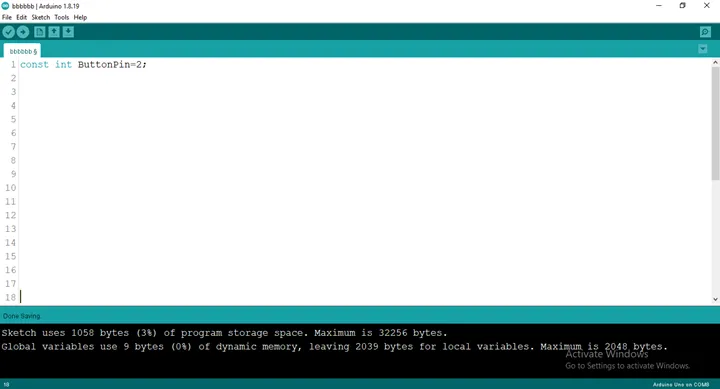.

**Step 3:** Type ```int RED = 3;``` as shown in the picture below. 

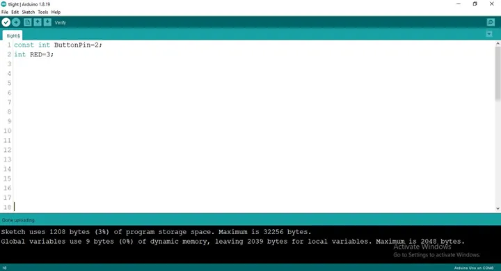.

**Step 4:** Type ```int YELLOW = 3;``` as shown in the picture below. 

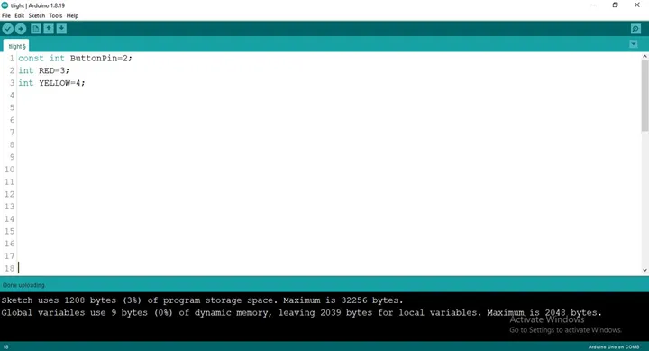.

**Step 5:** Type ```int GREEN = 3;``` as shown in the picture below. 

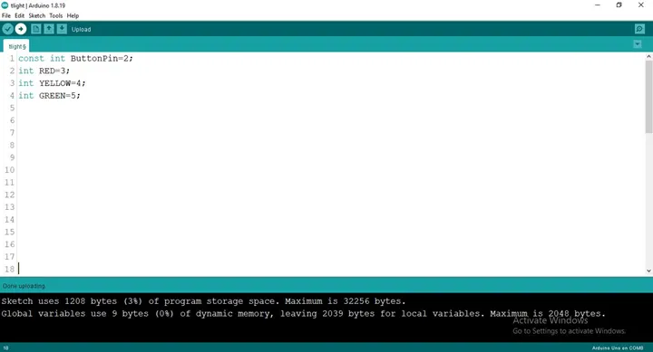.

**Step 6:** Type ```int buttonState= 0;``` as shown in the picture below. 

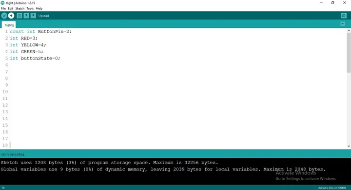.

**Step 7:** After the (void setup ()) within the curly brackets type
``` cpp
pinMode (ButtonPin, INTPUT_PULLUP); 
pinMode (RED, OUTPUT);
pinMode (YELLOW, OUTPUT);
pinMode (GREEN, OUTPUT);

```

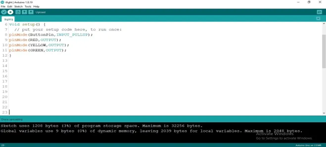.

**Step 8:** After the (void loop ()) within the curly brackets type as shown below 
``` cpp
buttonState = digitalRead (ButtonPin); 
```


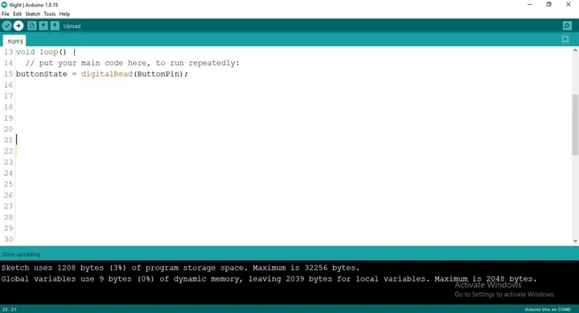.

**Step 9:**  Type Function
``` cpp
 if (buttonState == HIGH) {
digitalWrite (GREEN, HIGH); 
} else
```

.

**Step 10:** Type Function
``` cpp
if (buttonState == LOW) {
digitalWrite (GREEN, HIGH); 
delay (1000);
digitalWrite (GREEN, LOW); 
delay (1000);
digitalWrite (YELLOW, HIGH); 
delay (2000);
digitalWrite (YELLOW, LOW); 
delay (1000);
digitalWrite (RED, LOW); 
delay (5000);
digitalWrite (RED, LOW); 
delay (1000);
digitalWrite (GREEN, LOW); 
} 
```


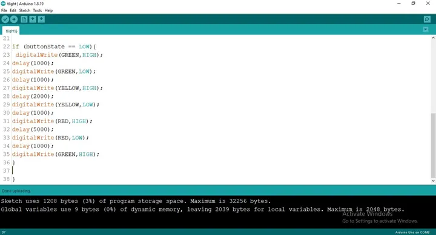.


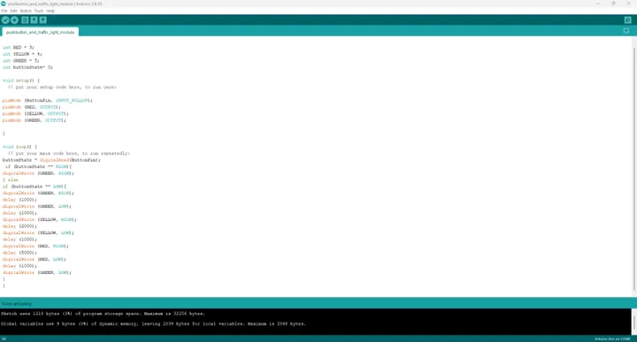.

**Step 11:** Save your code. _See the [Getting Started](../../getting-started/overview.md) section_

**Step 12:** Select the arduino board and port _See the [Getting Started](../../getting-started/overview.md) section:Selecting Arduino Board Type and Uploading your code_.

**Step 13:** Upload your code. _See the [Getting Started](../../getting-started/overview.md) section:Selecting Arduino Board Type and Uploading your code_

## CONCLUSION

This project demonstrated how a push button can be used to control a traffic light system using an Arduino Uno. It helped in understanding how input and output components work together to simulate a real-life pedestrian crossing system. Through this project, you learned how button presses can trigger a sequence of traffic light changes, improving knowledge of circuit wiring, programming logic, and practical automation systems.

