# Project 2.9.2: SMART STREET LIGHT (2 LEDs)

| **Description** | You will learn how use the detection of the presence or absence of light to turn on or turn off LEDs. |
| --------------- | ----------------------------------------------------------------------------------------------------- |
| **Use case**    | Controlling visibility of light in streetlights at different times of the day.                        |

## Components (Things You will need)

|  |  |  |  |  |  |
| --------------------------------------- | --------------------------------------------------- | ----------------------------------------------------------- | ----------------------------------------------------- | ------------------------------------------------------ | ---------------------------------------------- |

## Building the circuit

Things Needed:

- 1 Arduino Uno
- 1 Arduino USB cable
- 1 Light dependent resistor
- 1 Green LED
- 1 Red LED
- 1 Breadboard
- 1 Red jumper wire
- 1 Black jumper wire
- 1 Green jumper wire
- 1 Brown jumper wire
- 1 White jumper wire
- 2 Violet jumper wire
- 1 Yellow jumper wire
- 1 Orange jumper wire

## Mounting the component on the breadboard

### Things needed:

- 1 Light dependent resistor
- 1 Green LED
- 1 Red LED
- 1 Breadboard

**Step 1:** Take the light dependent resistor and the breadboard, insert the light dependent resistor into the horizontal connectors on the breadboard.

.

**Step 2:** Insert the red LED into the horizontal connectors on the breadboard beside the ultrasonic sensor and take note of where the positive pin (long pin) is and where the negative pin (short pin) is as shown in the picture below.

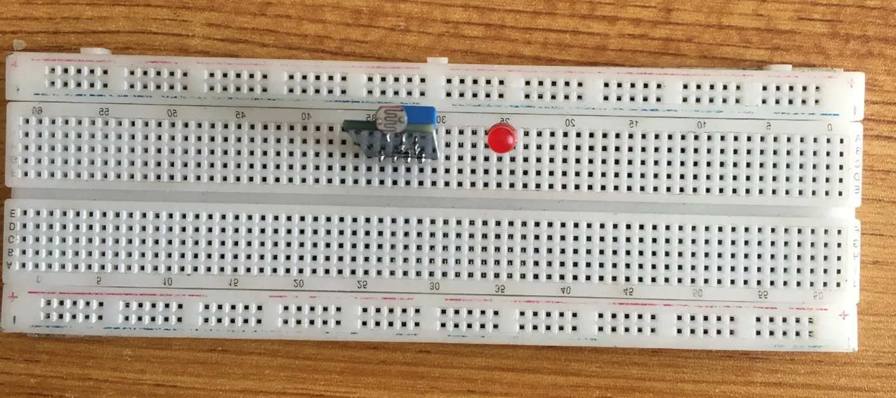.

**Step 3:** Insert the LED green into the horizontal connectors on the breadboard on the other side of the ultrasonic sensor and take note of where the positive pin (long pin) is and where the negative pin (short pin) is as shown in the picture below.

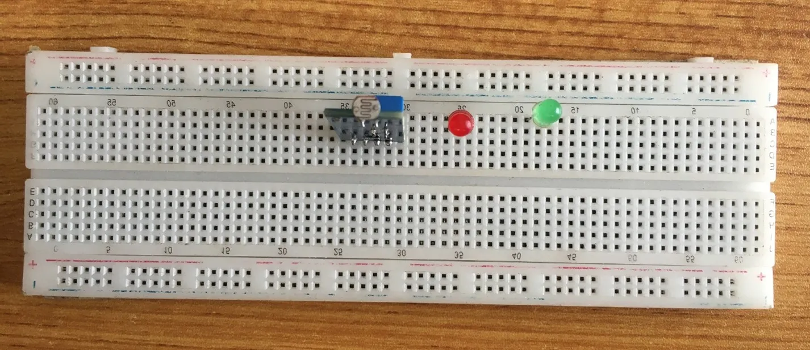.

## WIRING THE CIRCUIT

### Things Needed:

- 1 Red male-to-male jumper wire
- 1 Black male-to-male jumper wire
- 1 White male-to-male jumper wire
- 1 Yellow male-to-male jumper wire
- 1 Brown male-to-male jumper wire
- 2 Green male-to-male Jumper Wire
- 2 Violet male-to-male Jumper Wire
- 1 Orange male-to-male Jumper Wire
- 1 Grey male-to-male Jumper Wire
- 1 Blue male-to-male Jumper Wire

**Step 1:** Take the green jumper wire. Connect one end of the wire to the “VCC” port on the LDR module and the other end to the “5V” port on the Arduino UNO board. As shown in the picture below.

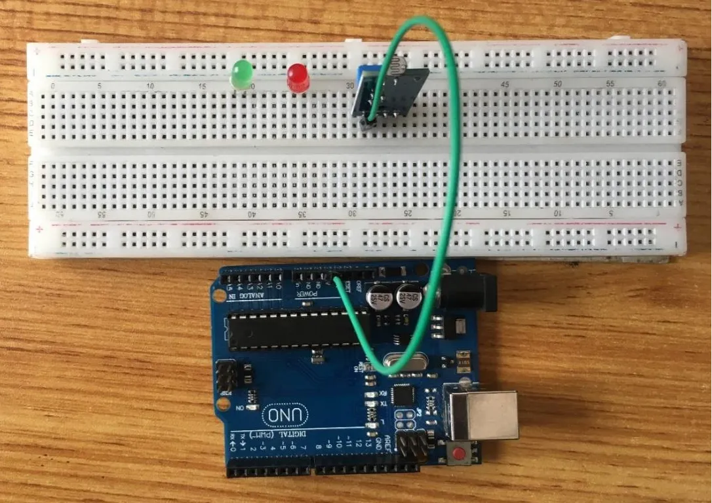.

**Step 2:** Take the black jumper wire, connect one end of the wire to the “GND” port on the Arduino UNO board and the other end to the “GND” port on the LDR module. As shown in the picture below

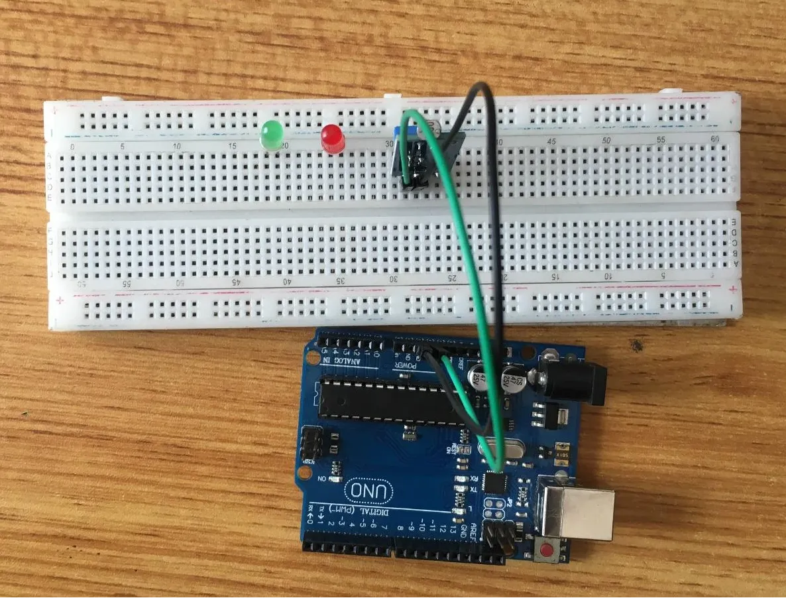.

**Step 3:** Take the violet jumper wire, connect one end of the wire to the “DO” pin of the LDR module and the other end to the digital pin 8 on the Arduino UNO board. As shown in the picture below.

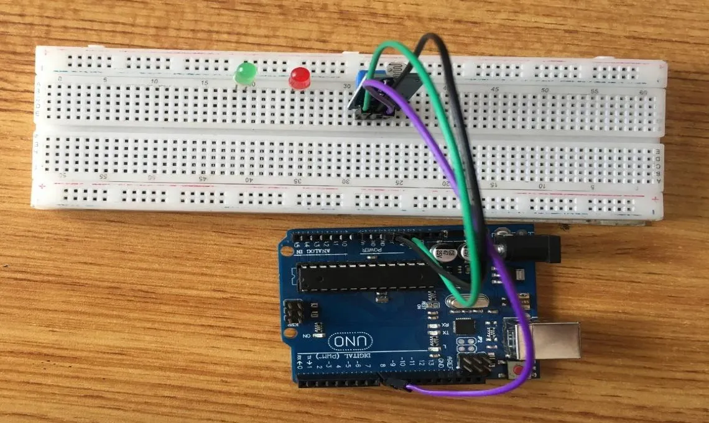.

**Step 4:** Take the brown jumper wire, connect one end of the wire to the “AO” port on the Arduino UNO board and the other end of the pin to the “AO” pin of the LDR module.

.

**Step 5:** Take the orange jumper wire. Connect one end of the wire to the negative pin of the red LED and connect the other end to GND pin on the Arduino UNO board. As shown in the picture below.

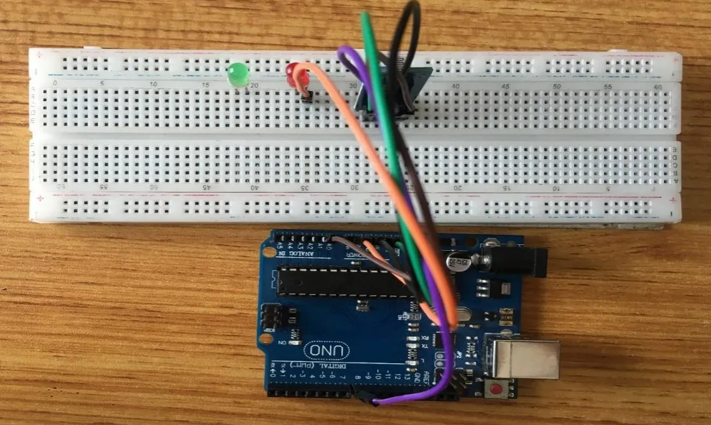.

**Step 6:** Take the red jumper wire, connect one end of the wire to the positive pin of the red LED and connect the other end to digital pin 5 on the Arduino UNO board. As shown in the picture below.

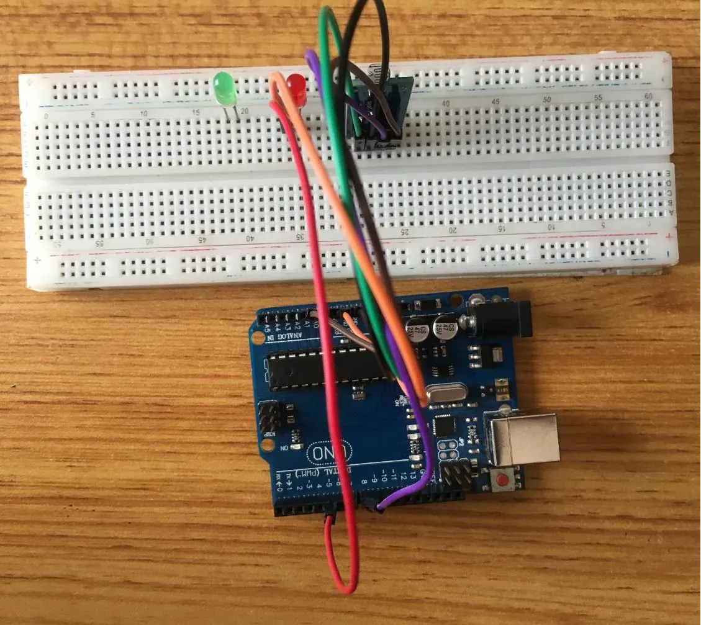.

**Step 7:** Take the white jumper wire, connect one end of the wire to the negative pin of the green LED and connect the other end to the GND pin on the Arduino UNO. As shown in the picture below.
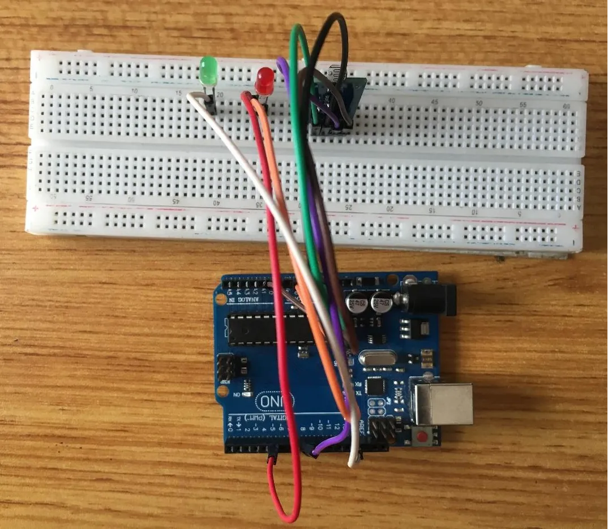.

**Step 8:** Take the yellow jumper wire, connect one end of the wire to the positive pin of the green LED and connect the other end to the digital pin 7 on the Arduino UNO board. As shown in the picture below.

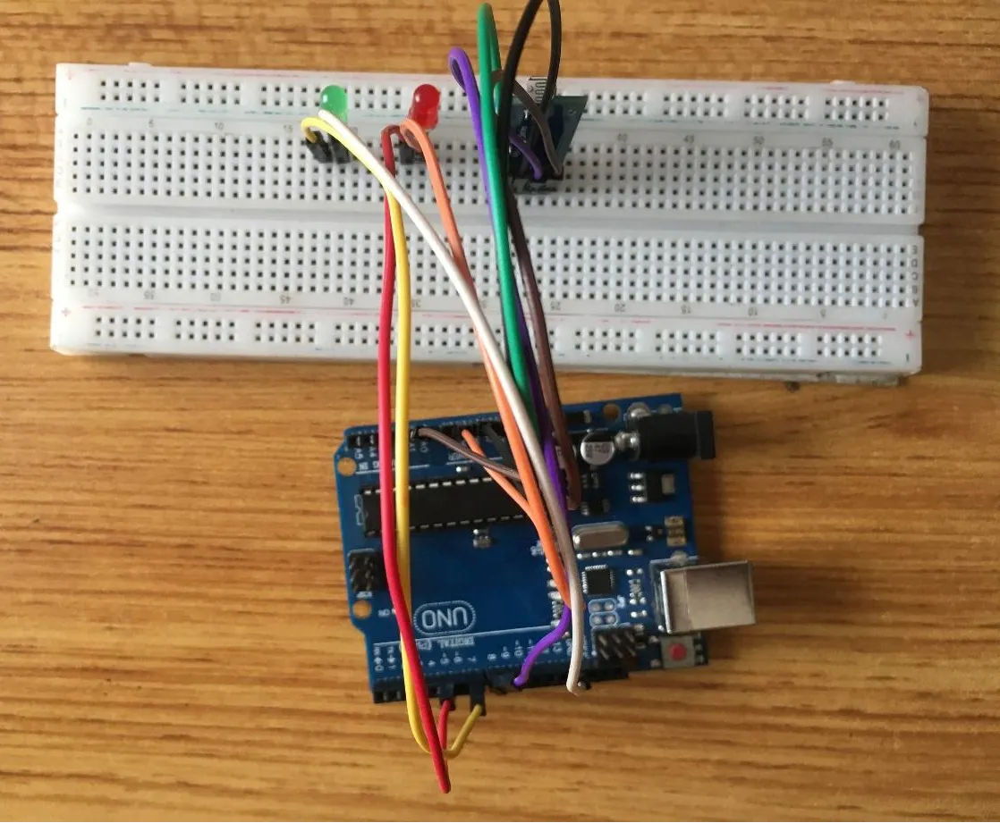.

## PROGRAMMING

**Step 1:** Open your Arduino IDE. See how to set up here: [Getting Started](../../getting-started/overview.md).

**Step 2:** Type ` const int LDR_PIN = A0.` as shown below in the image
_**NB:** Make sure you avoid errors when typing. Do not omit any character or symbol especially the bracket { } and semicolons ; and place them as you see in the image . The code that comes after the two ash backslashes “//” are called comments. They are not part of the code that will be run, they only explain the lines of code. You can avoid typing them._

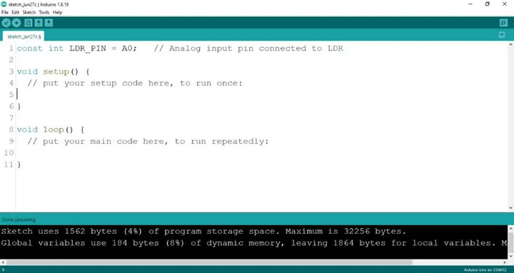.

**Step 3:** Type `const int DO_PIN = 8;` as shown below in the image

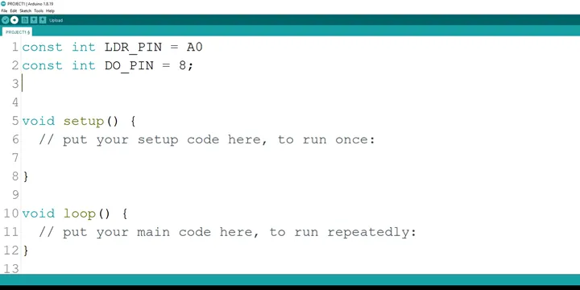.

**Step 4:** Type `const int Red = 5;` as shown below in the image

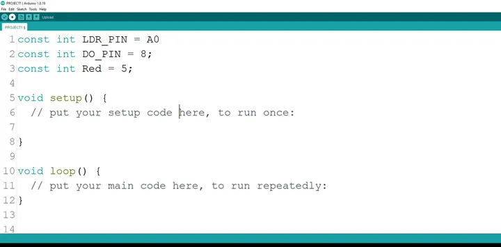.

**Step 5:** Type `const int Green = 7;` as shown below in the image

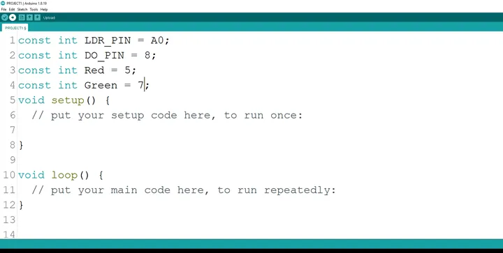.

**Step 8:** Type `int ldrValue;  ` as shown below in the image
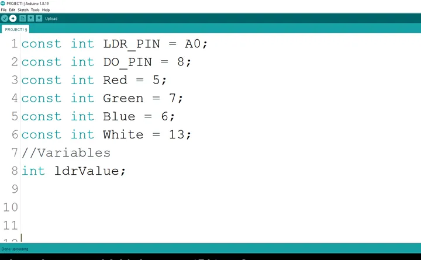.

**Step 9:** Type `int digitalValue; ` as shown below in the image
.

**Step 10:** Type the following code as shown below in the image

``` cpp
pinMode(DO_PIN, INPUT);
Serial.begin(9600);
pinMode(Red, OUTPUT);
pinMode(Green, OUTPUT);

```

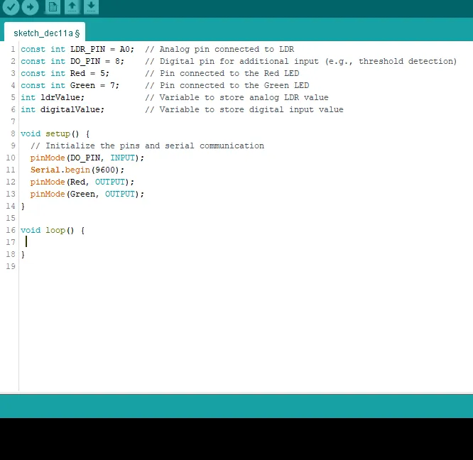.

**Step 11:** NOW let finish up by tying the followi ng codes in the void loop function shown below in the image

``` cpp
ldrValue = analogRead(LDR_PIN);

  // Read the digital input value
  digitalValue = digitalRead(DO_PIN);

  // Print the LDR and digital values to the Serial Monitor
  Serial.print("LDR Value: ");
  Serial.print(ldrValue);
  Serial.print("  Digital Input: ");
  Serial.println(digitalValue);

  // Control the LEDs based on LDR value and digital input
  if (ldrValue < 500 && digitalValue == HIGH) {
    digitalWrite(Red, HIGH);   // Turn on the Red LED
    digitalWrite(Green, LOW);  // Turn off the Green LED
  } else {
    digitalWrite(Red, LOW);    // Turn off the Red LED
    digitalWrite(Green, HIGH); // Turn on the Green LED
  }

  // Small delay to stabilize readings
  delay(200);

```

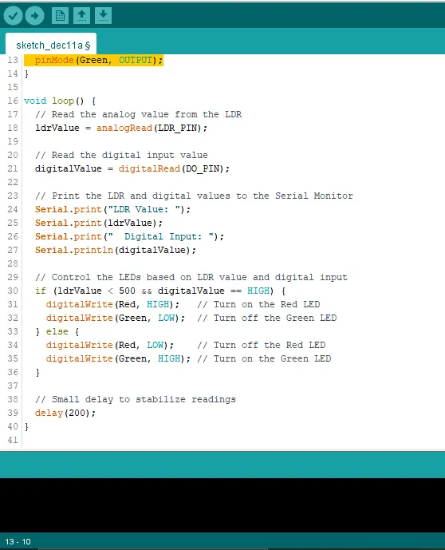.

**Step 21:** Save your code. _See the [Getting Started](../../getting-started/overview.md) section_

**Step 22:** Select the arduino board and port _See the [Getting Started](../../getting-started/overview.md) section:Selecting Arduino Board Type and Uploading your code_.

**Step 23:** Upload your code. _See the [Getting Started](../../getting-started/overview.md) section:Selecting Arduino Board Type and Uploading your code_

## Conclusion

If you encounter any problems when trying to upload your code to the board, run through your code again to check for any errors or missing lines of code. If you did not encounter any problems and the program ran as expected Congratulations on a job well done.
