# Project 3.1.1: LED and Ultrasonic Sensor Control 

| **Description** | Double LED ON is a simple project that guides you in turning on two LEDs at the same time.  |
|------------------|----------------------------------------------------------------|
| **Use case**     | This project finds utility in basic signaling setups. For instance, it could be applied in an easier and basic lighting system, where two LEDs turning on together provide ample brightness when someone enters a room. |


## Components (Things You will need)

|  | 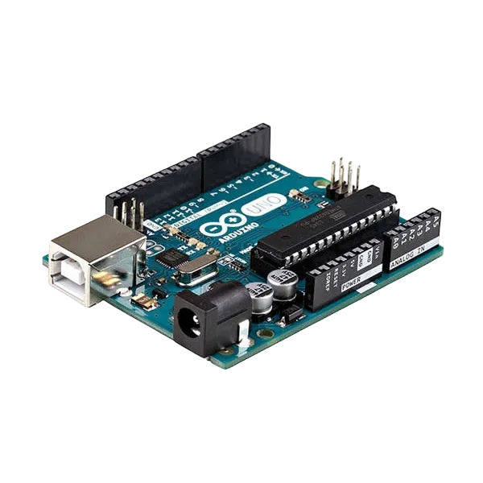 |  |  || |
|-------------------------|-------------------------|-------------------------|-------------------------|-------------------------|-------------------------|


## Building the circuit

Things Needed:

-	Arduino Uno Board: 1
-	Arduino USB cable: 1
-	Breadboard: 1
-	Red LED = 1
-	Green LED = 1
-	Ultrasonic sensor = 1
-	Jumper Wires.


## Mounting the component on the breadboard

### Things needed:
-	Ultrasonic Sensor = 1
-	Breadboard =1
- 	Red LED = 1
- 	Green LED = 1

**Step 1:** Take the breadboard, the ultrasonic sensor and insert it into the vertical connectors on the breadboard.

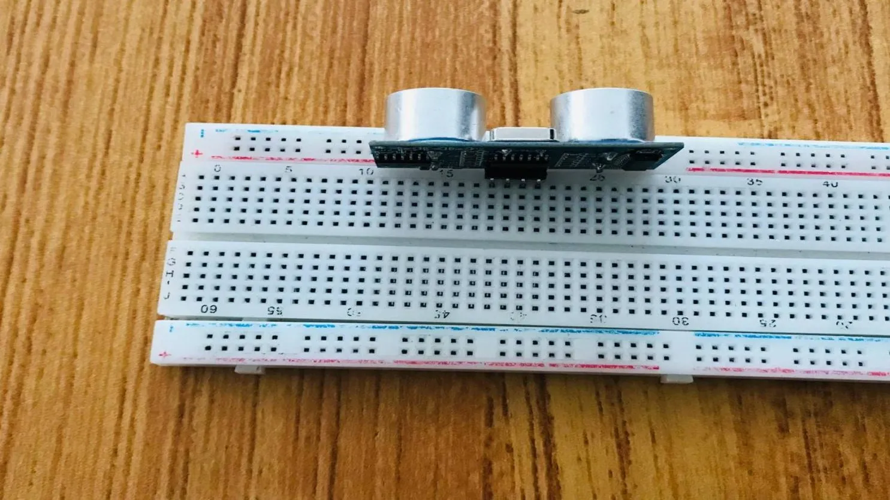.

**Step 2:** Take the Red and green LED and insert it into the vertical connectors on the breadboard beside the ultrasonic sensor as shown below.
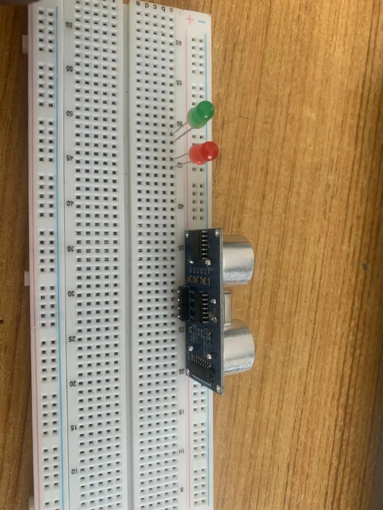.

**Step 3:** Connect a resistor to the positive pin of Red LED and another to the positive pin of the Green LED on the vertical connectors on the breadboard as shown below.
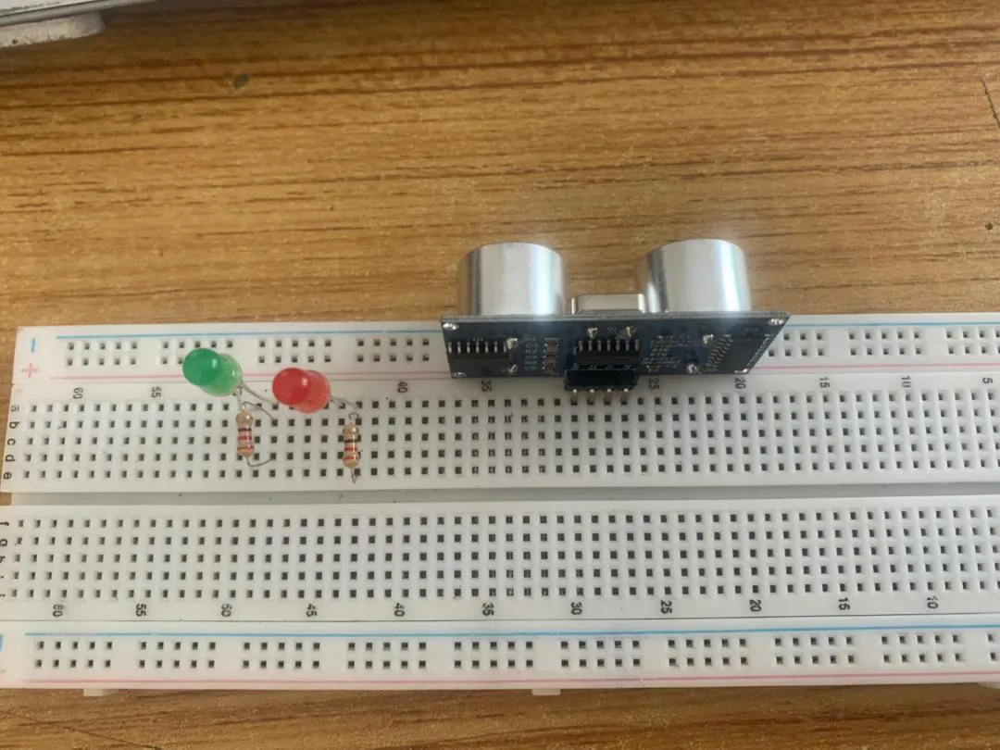.

## WIRING THE CIRCUIT

### Things Needed:

-	Red male-to-male jumper wire: 1
-	Black male-to-male jumper wire: 1
-	White male-to-male jumper wire: 1
-	Blue male-to-male jumper wire: 1
-	Brown jumper wire: 1
-	Green Jumper Wire: 1

**Step 1:** Connect one end of red male-to-male jumper wire to the VCC pin of the ultrasonic sensor on the breadboard and the other end to 5v on the Arduino UNO as shown below.
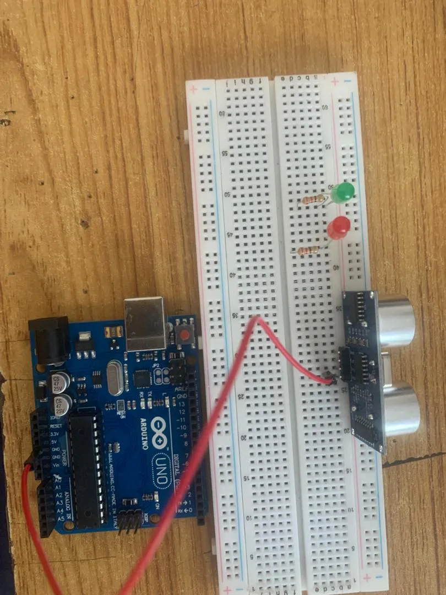

**Step 2:** Connect one end of black  male-to-male jumper wire to the TRIG pin of the ultrasonic sensor on the breadboard and the other end to digital pin number 9 on the Arduino UNO as shown below.

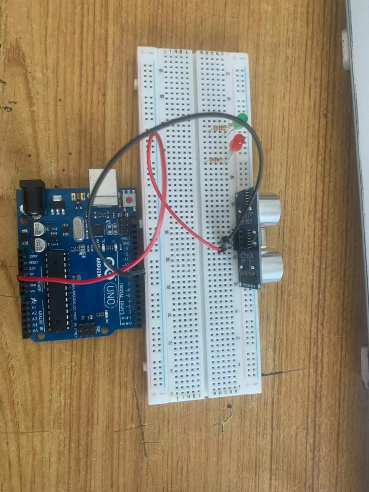.

**Step 3:** Connect one end of white  male-to-male jumper wire to the ECHO pin of the ultrasonic sensor on the breadboard and the other end to digital pin number 10 on the Arduino UNO as shown below.

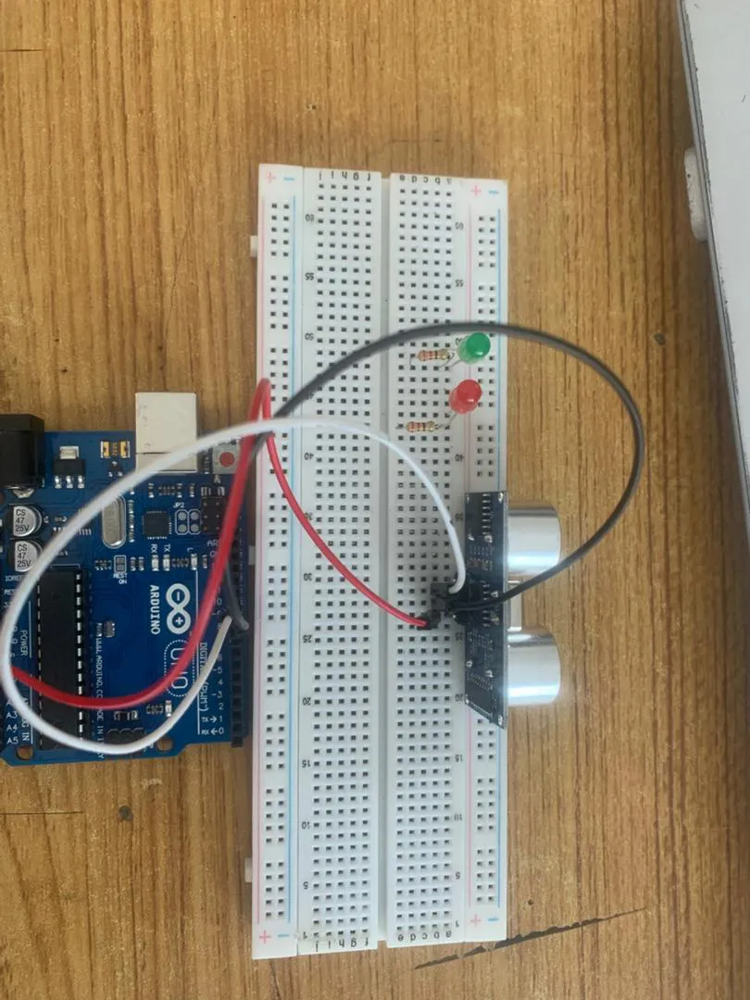.

**Step 4:**Connect one end of blue male-to-male jumper wire to the GND pin of the ultrasonic sensor on the breadboard and the other end to GND on the Arduino UNO as shown below.

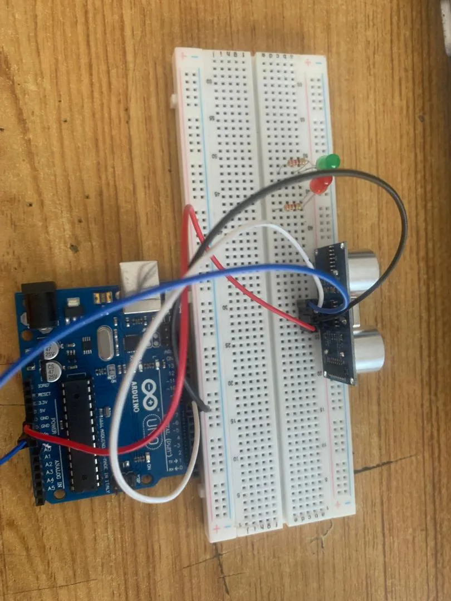.

**Step 5:** Connect one end of the green male-to-male jumper wire to the positive pin of the LED and the other end to digital pin 13 on the Arduino Uno board as shown in the picture below.

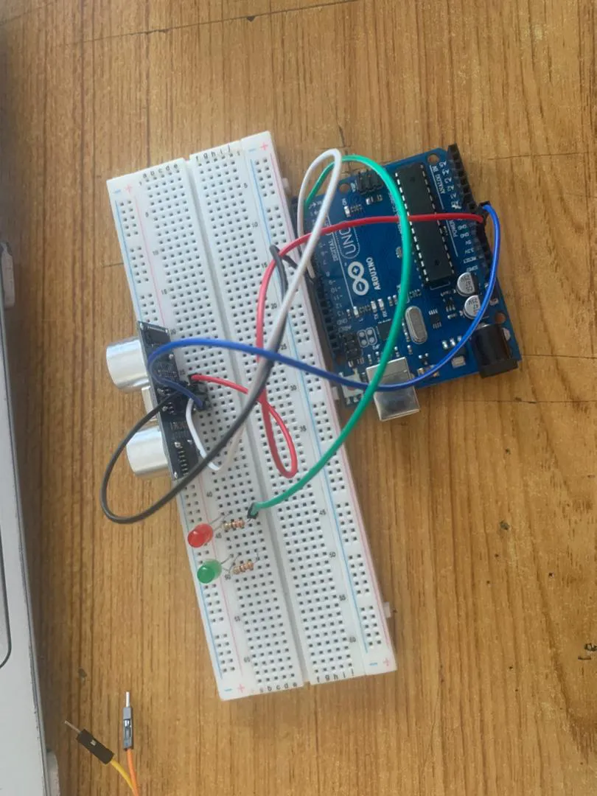.

**Step 6:** Connect one end of the brown  male-to-male jumper wire to the negative pin of Red LED on the bread board to GND on the Arduino UNO.

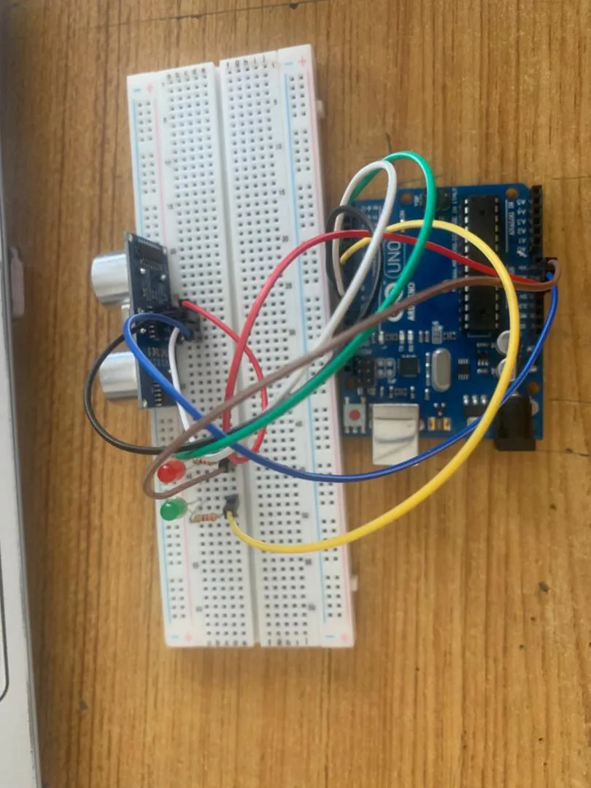.

**Step 7:** Connect one end of the yellow  male-to-male jumper wire to the positive pin of Green LED on the bread board to digital pin number 7 on the Arduino UNO through the resistor as shown below.

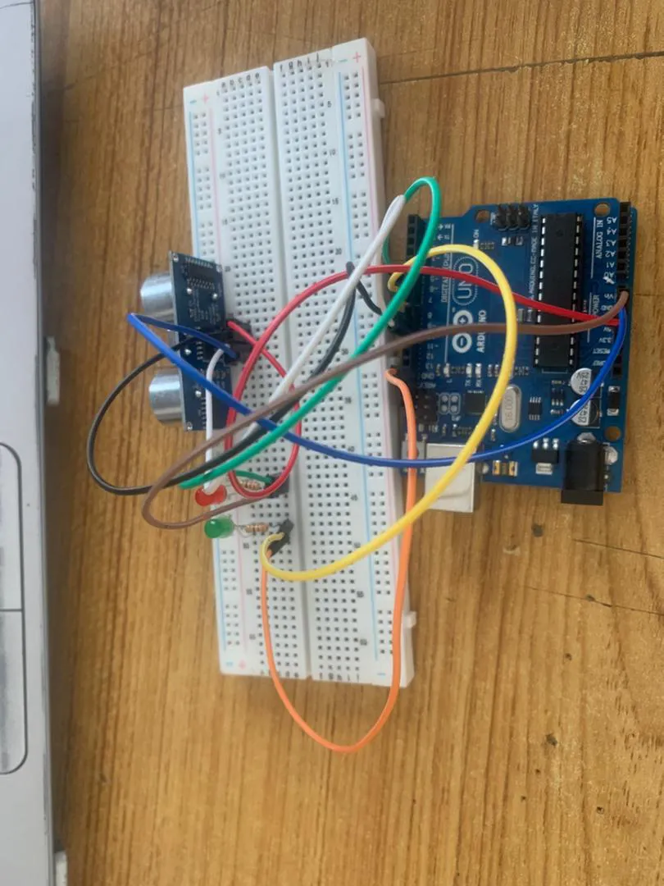.

**Step 8:** Connect one end of the orange male-to-male jumper wire to the negative pin of Red LED on the bread board to GND on the Arduino UNO.

.


## PROGRAMMING

**Step 1:** Open your Arduino IDE. See how to set up here: [Getting Started](../../getting-started/overview.md).

**Step 2:** type the following codes below.
``` cpp
// Include comments to explain the code
const int trigPin = 9;    // Trigger pin of ultrasonic sensor
const int echoPin = 10;   // Echo pin of ultrasonic sensor
const int redLed = 6;     // Pin connected to Red LED
const int greenLed = 7;   // Pin connected to Green LED

long duration;  // Variable to store duration of sound wave travel
int distance;   // Variable to store distance calculated

void setup() {
  // Set up the pins as input or output
  pinMode(trigPin, OUTPUT);
  pinMode(echoPin, INPUT);
  pinMode(redLed, OUTPUT);
  pinMode(greenLed, OUTPUT);

  // Start serial communication
  Serial.begin(9600);
}

void loop() {
  // Clear the trigPin by setting it LOW
  digitalWrite(trigPin, LOW);
  delayMicroseconds(2);

  // Set the trigPin HIGH for 10 microseconds
  digitalWrite(trigPin, HIGH);
  delayMicroseconds(10);
  digitalWrite(trigPin, LOW);

  // Read the echoPin, and calculate the distance
  duration = pulseIn(echoPin, HIGH);
  distance = duration * 0.034 / 2;  // Convert to distance in cm

  // Print the distance to the Serial Monitor
  Serial.print("Distance: ");
  Serial.print(distance);
  Serial.println(" cm");

  // LED control based on distance
  if (distance < 10) {  // If object is within 10 cm
    digitalWrite(redLed, HIGH);  // Turn on Red LED
    digitalWrite(greenLed, LOW); // Turn off Green LED
  } else {
    digitalWrite(redLed, LOW);   // Turn off Red LED
    digitalWrite(greenLed, HIGH); // Turn on Green LED
  }

  // Delay to allow for stable readings
  delay(500);
}

```

**Step 4:** Save your code. _See the [Getting Started](../../getting-started/overview.md) section_

**Step 5:** Select the arduino board and port _See the [Getting Started](../../getting-started/overview.md) section:Selecting Arduino Board Type and Uploading your code_.

**Step 6:** Upload your code. _See the [Getting Started](../../getting-started/overview.md) section:Selecting Arduino Board Type and Uploading your code_


## CONCLUSION
To sum up, the one LED blink project demonstrates a foundational concept in electronics and programming. Through this simple yet illuminating endeavor, learners grasp the essentials of hardware interfacing, coding logic, and timing control. This project lays the groundwork for more advanced explorations while showcasing the transformative power of just a single LED, sparking curiosity and creativity in the world of DIY electronics.
