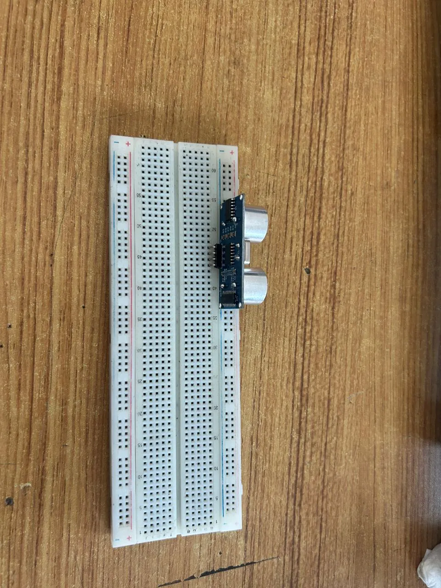
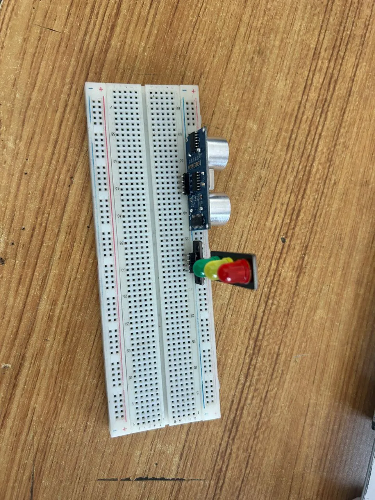
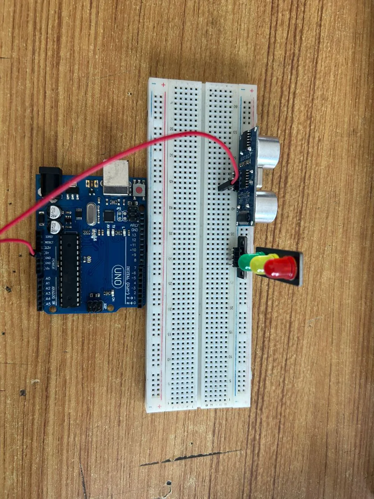
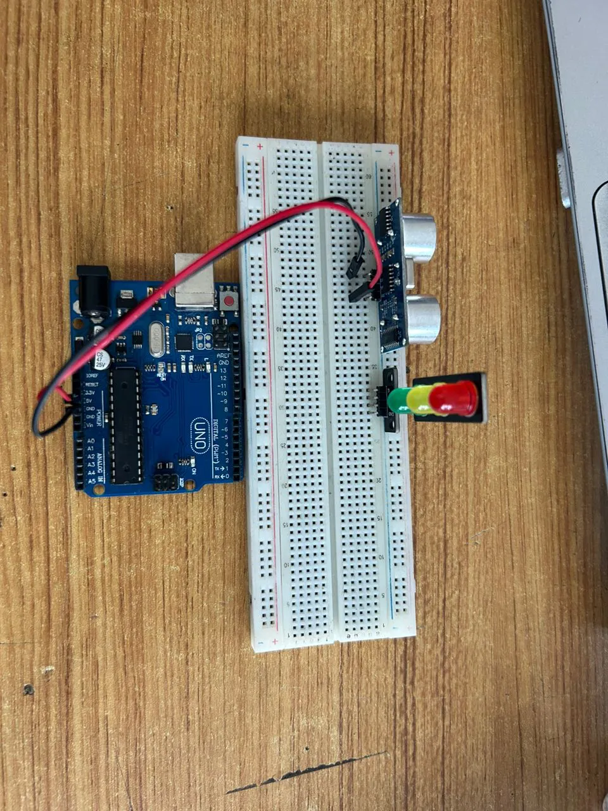
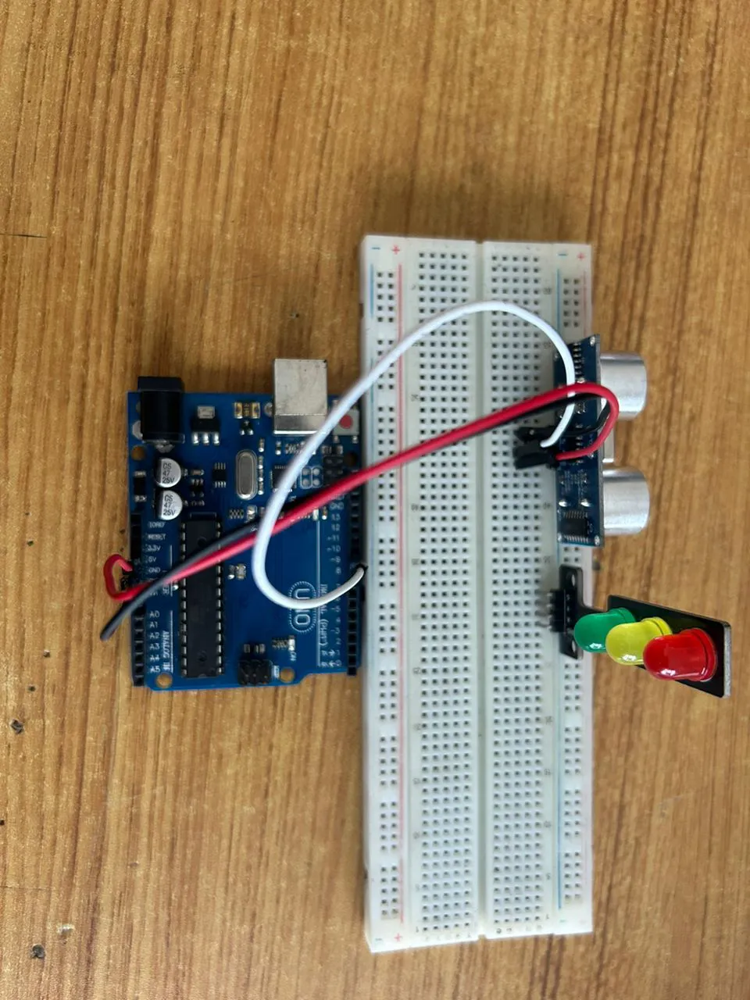
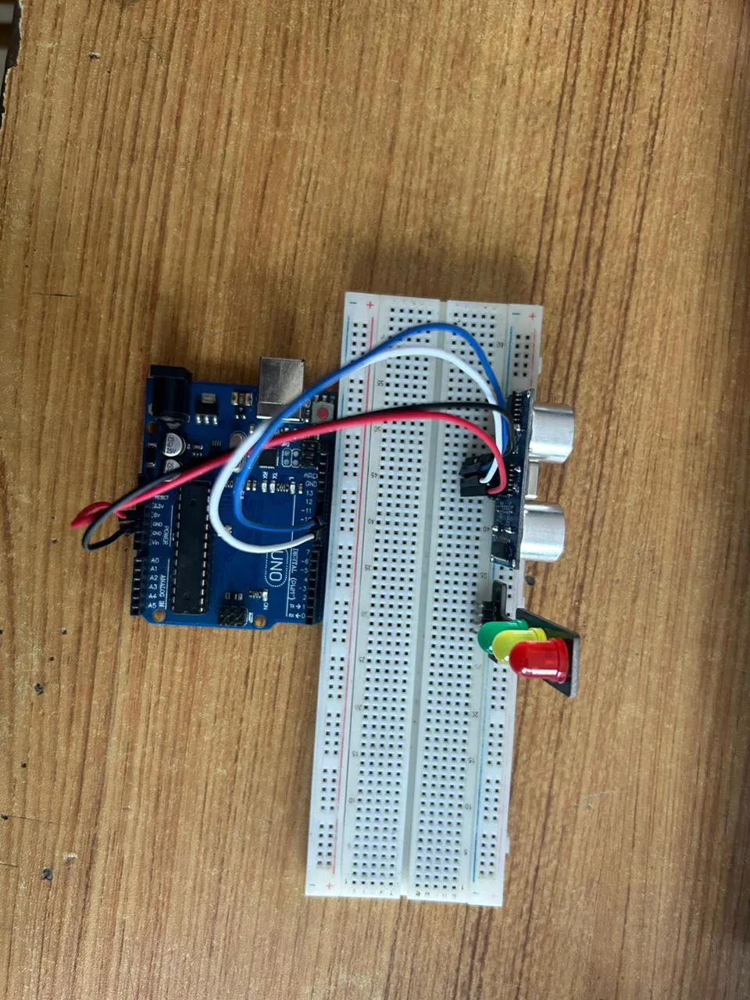
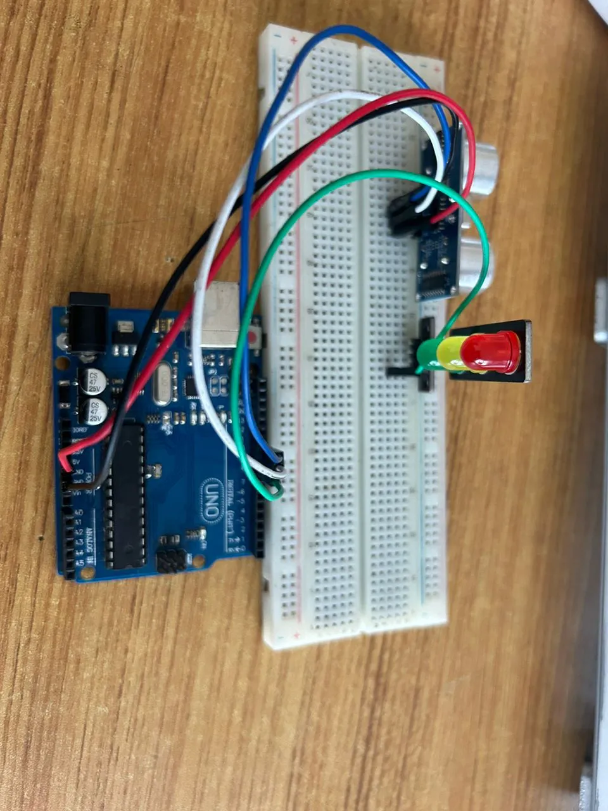
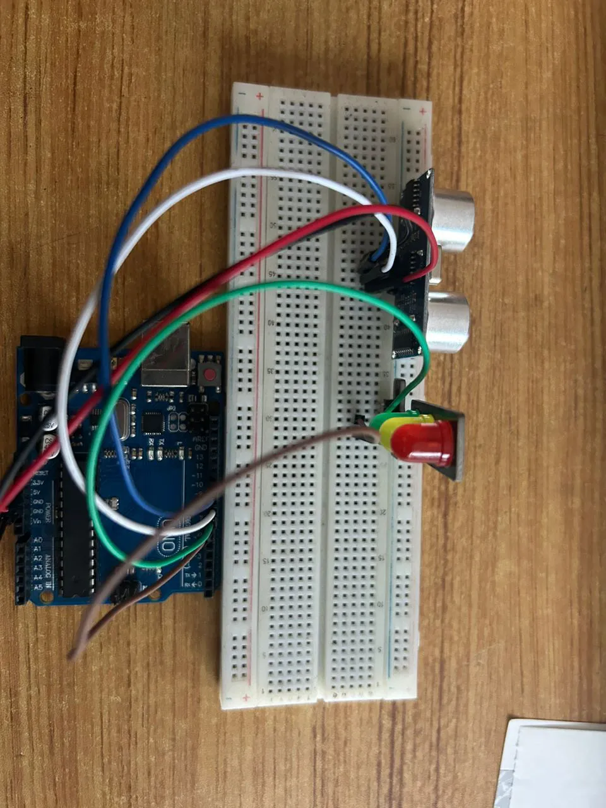
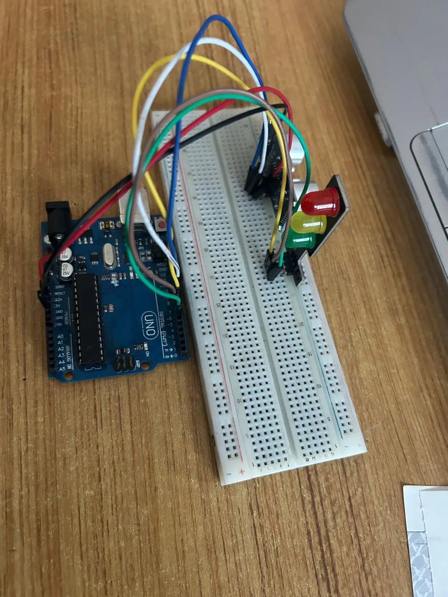
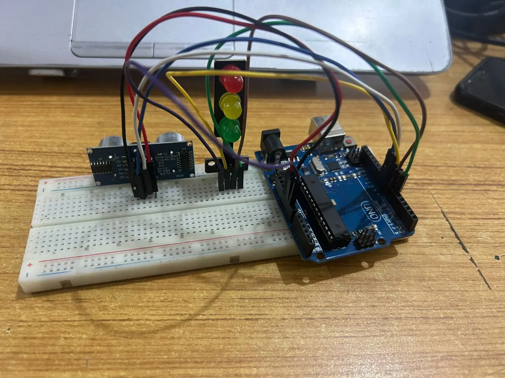

# Project 3.3.1: Smart Trafic Light System. 

| **Description** | You will learn how to create a simple circuit using a microcontroller, Trafic Light and an Ultrasonic Sensor. |
|------------------|----------------------------------------------------------------|
| **Use case**     | Imagine you want to cross the road and you need a smart Trafic Light System|

## Components (Things You will need)

|  |  |  |  || |
|-------------------------|-------------------------|-------------------------|-------------------------|-------------------------|-------------------------|

## Building the circuit

Things Needed:

-	Arduino Uno Board: 1
-	Arduino USB cable: 1
-	Breadboard: 1
-	Traffic Light 1
-	Jumper Wire: 1
-	Ultrasonic sensor: 1

## Mounting the component on the breadboard

### Things needed:

**Step 1:** Insert the ultrasonic sensor into the horizontal connectors of the breadboard.
.

**Step 2:** Do the same for the traffic light as shown below.

.

## WIRING THE CIRCUIT

### Things Needed:

-	Red male-to-male jumper wire: 1
-	Black male-to-male jumper wire: 1
-	White male-to-male jumper wire: 1
-	Blue male-to-male jumper wire: 1
-	Brown jumper wire: 1
-	Green Jumper Wire: 1

**Step 1:** Connect one end of the red male-to-male jumper wire to the VCC pin of the Ultrasonic sensor and the other end to the 5V pin on the Arduino Uno board as shown in the picture below.

.

**Step 2:** Connect one end of the black male-to-male jumper wire to the GND pin of the Ultrasonic sensor and the other end to the GND pin on the Arduino Uno board as shown in the picture below.

.

**Step 3:** Connect one end of the white male-to-male jumper wire to the Trig pin of the Ultrasonic sensor and the other end to digital pin 9 on the Arduino Uno board as shown in the picture below.

.

**Step 4:** Connect one end of the blue male-to-male jumper wire to the Echo pin of the Ultrasonic sensor and the other end to digital pin 10 on the Arduino Uno board as shown in the picture below.

.

**Step 5:** Connect one end of the green male-to-male jumper wire to the RED LED of the traffic light model, labeled (R) pin, and the other end to digital pin 6 on the Arduino Uno board, as shown in the picture below.

.

**Step 6:** Connect one end of the brown male-to-male jumper wire to the Yellow LED of the traffic light model, labeled (Y) pin, and the other end to digital pin 7 on the Arduino Uno board, as shown in the picture below.
.

**Step 7:** Connect one end of the yellow male-to-male jumper wire to the Green LED of the traffic light model, labeled (G) pin, and the other end to digital pin 8 on the Arduino Uno board, as shown in the picture below.

.

**Step 8:** Connect one end of the purpule male-to-male jumper wire to the GND of the traffic light model, labeled (GND) pin, and the other end to digital pin GND on the Arduino Uno board, as shown in the picture below.

.

## PROGRAMMING

**Step 1:** Open your Arduino IDE. See how to set up here: [Getting Started](../../getting-started/overview.md).

**Step 2:**  Write the following codes as flows.
``` cpp
const int trigPin = 9;    // Ultrasonic Sensor Trig Pin
const int echoPin = 10;   // Ultrasonic Sensor Echo Pin
const int redLed = 6;     // Red Light
const int yellowLed = 7;  // Yellow Light
const int greenLed = 8;   // Green Light

// Variables for Distance Measurement
long duration;
int distance;

void setup() {
  // Initialize Sensor Pins
  pinMode(trigPin, OUTPUT);
  pinMode(echoPin, INPUT);

  // Initialize Traffic Light Pins
  pinMode(redLed, OUTPUT);
  pinMode(yellowLed, OUTPUT);
  pinMode(greenLed, OUTPUT);

  // Begin Serial Communication (for debugging)
  Serial.begin(9600);
}

void loop() {
  // Measure distance using the ultrasonic sensor
  digitalWrite(trigPin, LOW);
  delayMicroseconds(2);
  digitalWrite(trigPin, HIGH);
  delayMicroseconds(10);
  digitalWrite(trigPin, LOW);
  
  // Calculate the distance in cm
  duration = pulseIn(echoPin, HIGH);
  distance = duration * 0.034 / 2;

  // Print the distance to the Serial Monitor
  Serial.print("Distance: ");
  Serial.print(distance);
  Serial.println(" cm");

  // Control the Traffic Light Based on Distance
  if (distance <= 10) { // Vehicle detected close to the intersection
    digitalWrite(redLed, HIGH);   // Red Light ON
    digitalWrite(yellowLed, LOW);
    digitalWrite(greenLed, LOW);
    delay(5000); // Wait for 5 seconds

  } else { // No vehicle detected or vehicle is far
    digitalWrite(redLed, LOW);
    digitalWrite(yellowLed, LOW);
    digitalWrite(greenLed, HIGH); // Green Light ON
    delay(5000); // Wait for 5 seconds
    
    digitalWrite(greenLed, LOW);
    digitalWrite(yellowLed, HIGH); // Yellow Light ON
    delay(2000); // Wait for 2 seconds
    digitalWrite(yellowLed, LOW);
  }
}

```

**Step 19:** Save your code. _See the [Getting Started](../../getting-started/overview.md) section_

**Step 20:** Select the arduino board and port _See the [Getting Started](../../getting-started/overview.md) section:Selecting Arduino Board Type and Uploading your code_.

**Step 21:** Upload your code. _See the [Getting Started](../../getting-started/overview.md) section:Selecting Arduino Board Type and Uploading your code_


## CONCLUSION
The Smart Traffic Light System demonstrates how an ultrasonic sensor and Arduino can dynamically control traffic signals based on distance detection. This project enhances traffic management and road safety while providing hands-on experience with circuit building and coding.
