# Project 3.5.1: SMART CAR PARKING SYSTEM 

| **Description** | Double LED ON is a simple project that guides you in turning on two LEDs at the same time.  |
|------------------|----------------------------------------------------------------|
| **Use case**     | This project finds utility in basic signaling setups. For instance, it could be applied in an easier and basic lighting system, where two LEDs turning on together provide ample brightness when someone enters a room. |

## Components (Things You will need)

|  |  |  | 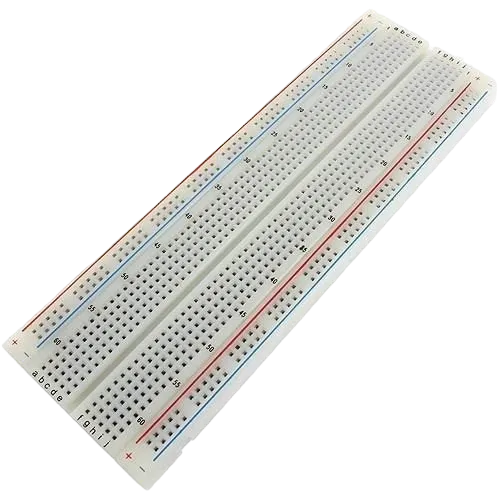 || | 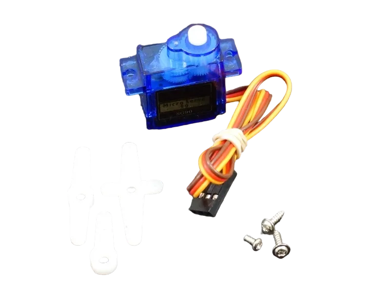|
|-------------------------|-------------------------|-------------------------|-------------------------|-------------------------|-------------------------|-------------------------|

## Building the circuit

Things Needed:

-	Arduino Uno
-	Ultrasonic sensor 
-	RGB module
-	Servo motor
-	Breadboard
-	Jumper wires

## Mounting the component on the breadboard

**Step 1:** Take the breadboard, the ultrasonic sensor and insert it into the vertical connectors on the breadboard.

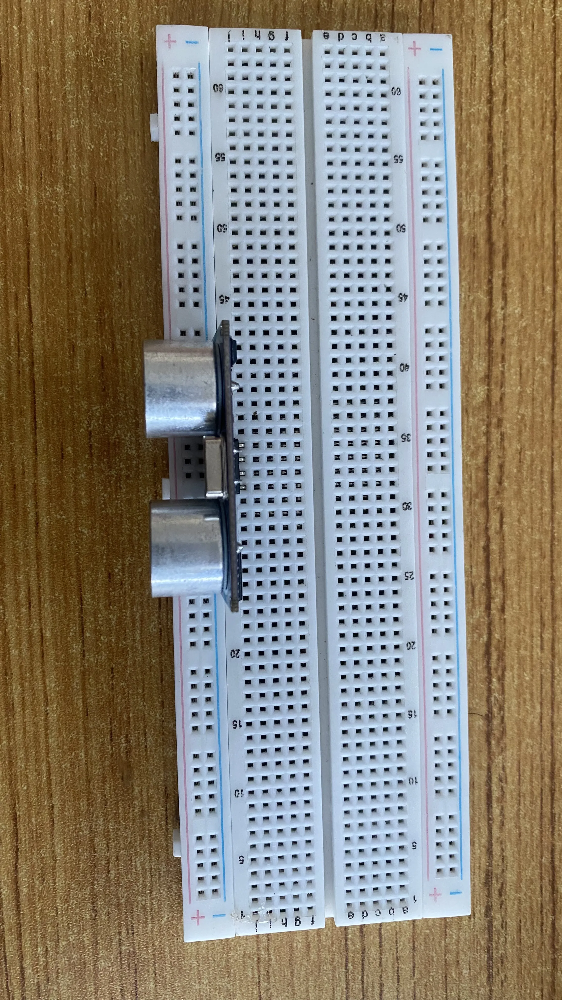.

**Step 2:** Connect red, orange and brown jumper wires to the servo motor connetors as shown in the picture below.

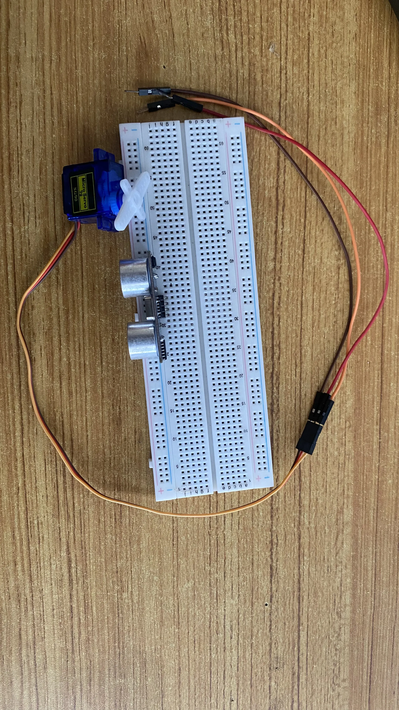.

**Step 3:** Insert the RGB module to the vertical connectors on the breadboard.

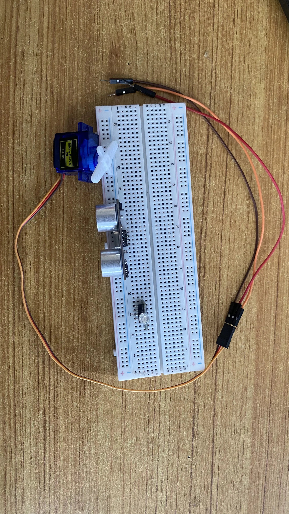.

## WIRING THE CIRCUIT

### Things Needed:

-	Red male-to-male jumper wire: 2
-	Black male-to-male jumper wire: 2
-	White male-to-male jumper wire: 1
-	Blue male-to-male jumper wire: 2
-	Green Jumper Wire: 1

**Step 1:** Connect one end of the white male-to-male jumper wire to the VCC pin of the Ultrasonic sensor and the other end to the 5V pin on the Arduino Uno board as shown in the picture below.

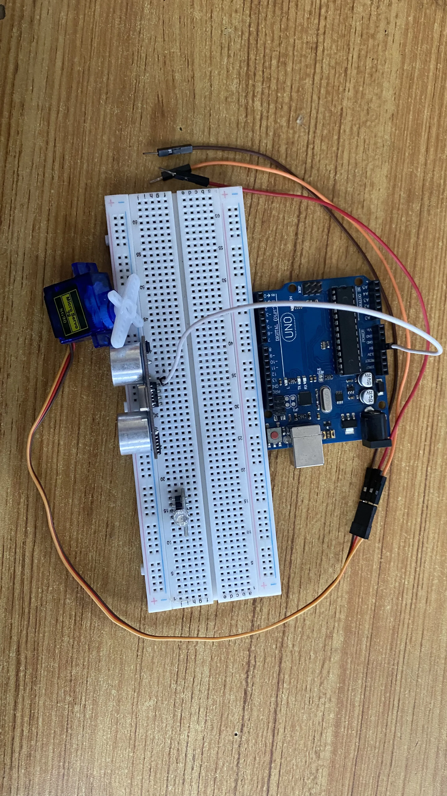

**Step 2:** Connect one end of the yellow male-to-male jumper wire to the Trig pin of the Ultrasonic sensor and the other end to digital pin 6 on the Arduino Uno board as shown in the picture below.

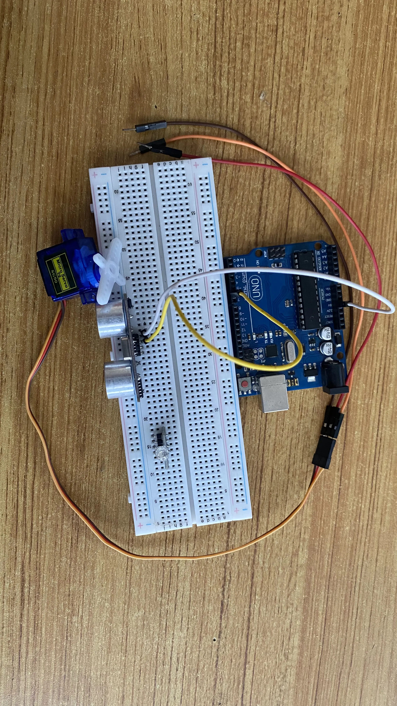.

**Step 3:** Connect one end of the blue male-to-male jumper wire to the Echo pin of the Ultrasonic sensor and the other end to digital pin 7 on the Arduino Uno board as shown in the picture below.

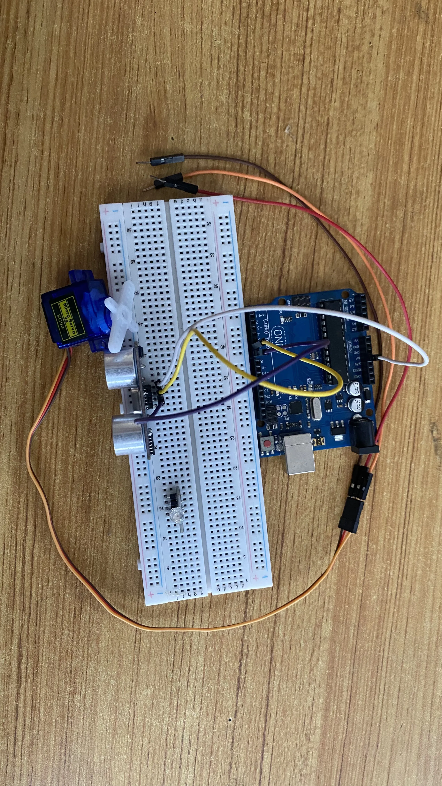.

**Step 4:** Connect one end of the black male-to-male jumper wire to the GND pin of the Ultrasonic sensor and the other end to the GND pin on the Arduino Uno board as shown in the picture below.

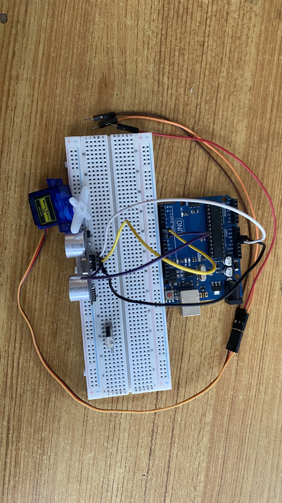.

**Step 5:** Connect the other end of the orange male-to-male jumper wire from the servo motor to digital pin 8 on the Arduino Uno board as shown in the picture below.

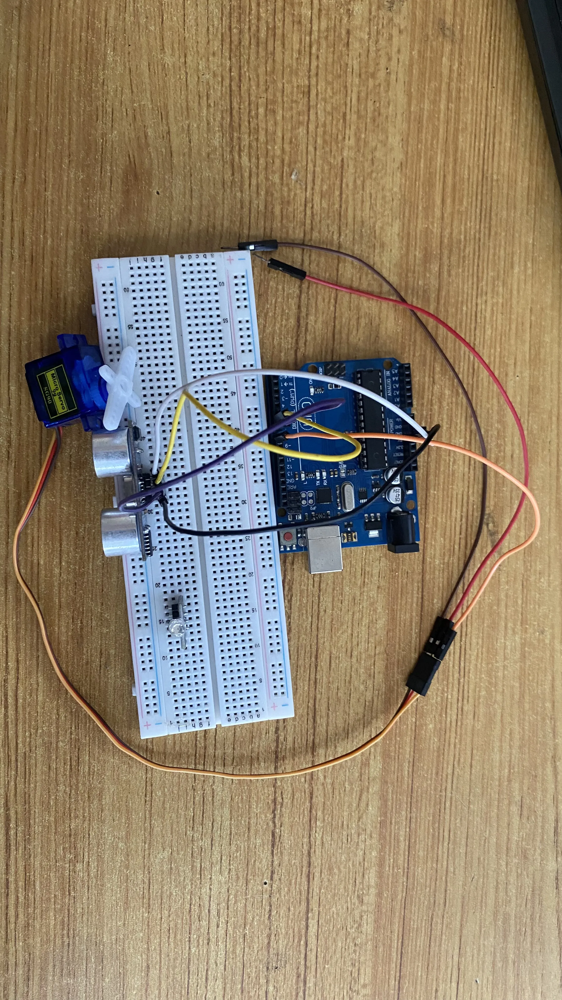.

**Step 6:** Connect the other end of the brown male-to-male jumper wire from the servo motor to the GND pin on the Arduino Uno board as shown in the picture below. Then, connect the other end of the red male-to-male jumper wire from the servo motor to the an empty pin on the breadboard where the white male-to-male jumper wire was connected to the VCC pin of the ultrasonic sensor as shown in the picture below.

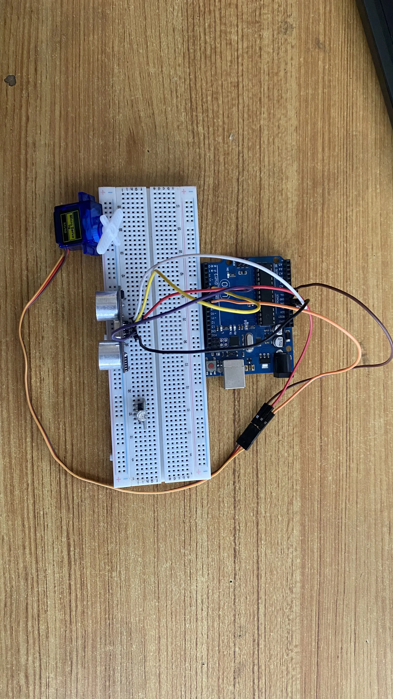.

**Step 7:** Connect one end of a red male-to-male jumper wire to the R pin of the RGB module on the breadboard and the other end to digital pin 9 on the arduino board as shown in the picture below.

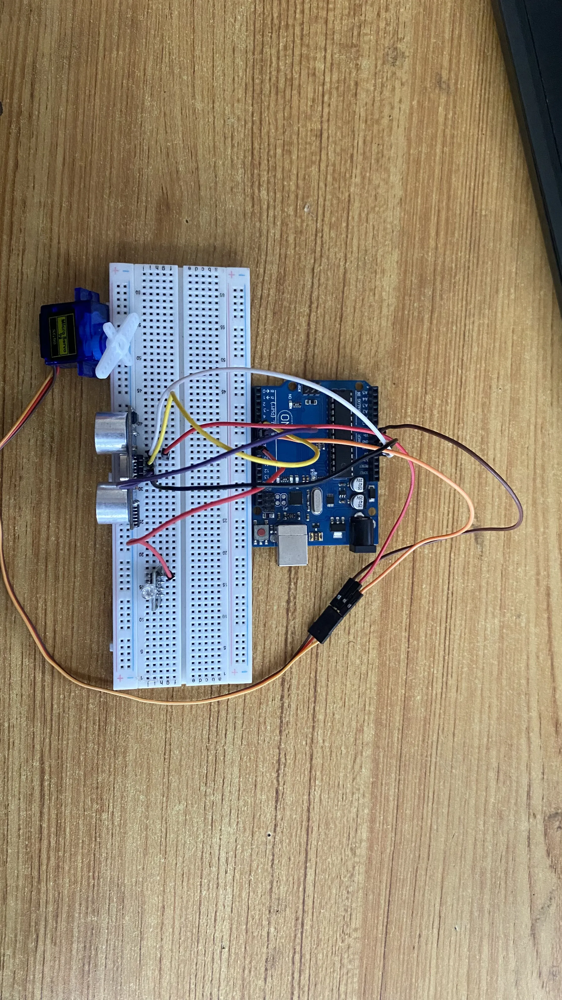.

**Step 8:** Connect one end of a green male-to-male jumper wire to the G pin of the RGB module on the breadboard and the other end to digital pin 10 on the arduino board as shown in the picture below.

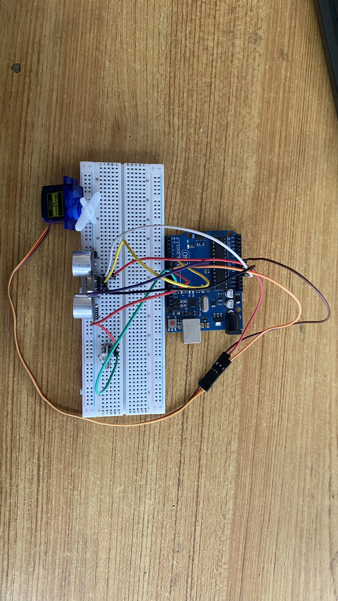.

**Step 9:** Connect one end of a blue male-to-male jumper wire to the B pin of the RGB module on the breadboard and the other end to digital pin 11 on the arduino board as shown in the picture below.

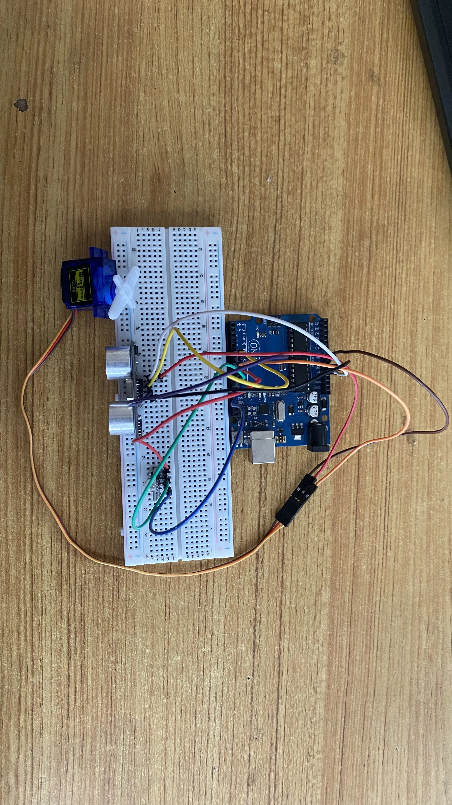.

**Step 10:** Connect one end of a black male-to-male jumper wire to the B pin of the RGB module on the breadboard and the other end to GND on the arduino board as shown in the picture below.

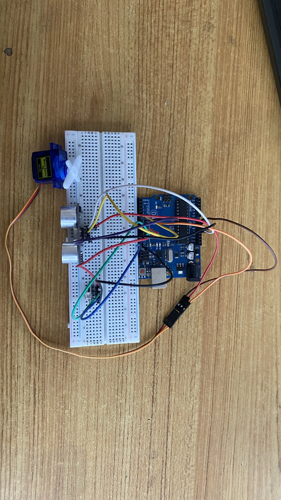.

## PROGRAMMING

**Step 1:** Open your Arduino IDE. See how to set up here: [Getting Started](../../getting-started/overview.md).

**Step 2:** Type the following code in your arduino IDE at the top of "void setup() { }" function as shown in the picture below.
   ``` cpp
   #include <Servo.h>
   // Pin Definitions
   const int trig  = 6;
   const int echo = 7;
   const int motor = 8;
   const int red = 9;
   const int green = 10;
   const int blue = 11;

   // Objects and Variables
   Servo barrierServo;
   long duration;
   int distance;
   bool parkingAvailable = true;
   ```

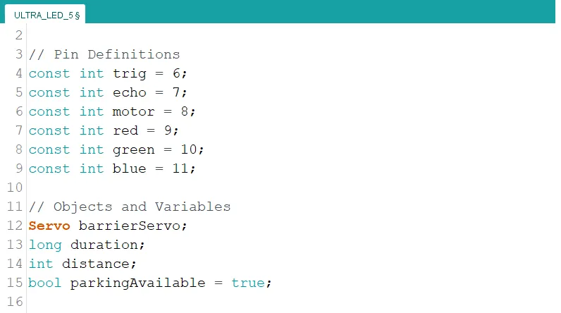

**Step 3:** Type the following code inside of the "void setup() { }" function to initialize the pin modes

   ``` cpp
   // Pin Modes
   pinMode(trig, OUTPUT);
   pinMode(echo, INPUT);
   pinMode(red, OUTPUT);
   pinMode(green, OUTPUT);
   pinMode(blue, OUTPUT);

   // Initialize Servo
   barrierServo.attach(servoPin);
   barrierServo.write(90); // Barrier closed position

   Serial.begin(9600); // For debugging
   ```

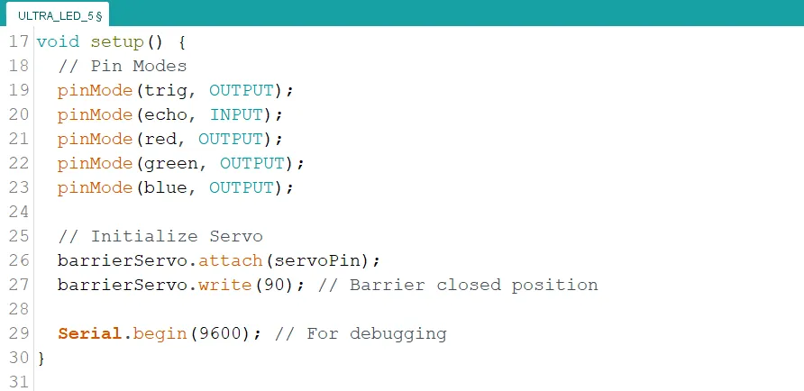

**Step 4:** Type the following code under "void loop() { }" function. This code is a function to calculate the distance of objects from the ultrasonic sensor.

   ``` cpp
   // Function to get distance from ultrasonic sensor
   int getDistance() {
      digitalWrite(trigPin, LOW);
      delayMicroseconds(2);
      digitalWrite(trigPin, HIGH);
      delayMicroseconds(10);
      digitalWrite(trigPin, LOW);

      duration = pulseIn(echoPin, HIGH);
      return duration * 0.034 / 2; // Convert to cm
   }
   ```

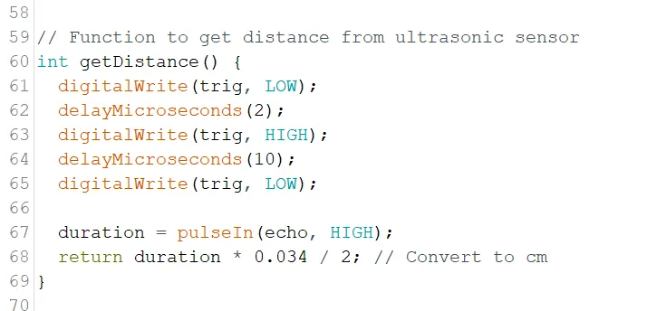

**Step 5:** Type the following code under the new function. This code is a function to control the color of the RGB module to indicate parking availability.

   ``` c++
   // Function to signal parking status
   void signalParkingStatus(bool available) {
      if (available) {
         // Green LED for available parking
         analogWrite(red, 0);
         analogWrite(green, 255);
         analogWrite(blue, 0);
      } else {
         // Red LED for occupied parking
         analogWrite(red, 255);
         analogWrite(green, 0);
         analogWrite(blue, 0);
      }
   }
   ```

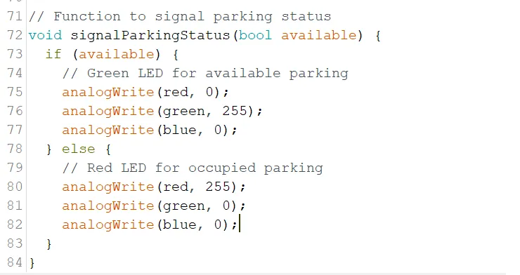

**Step 6:** Type the following code inside of the "void loop() { }" function.

   ``` cpp
   // Get distance from ultrasonic sensor
   distance = getDistance();

   if (parkingAvailable) {
      if (distance < 20 && distance > 0) { // Car detected
         parkingAvailable = false;
         signalParkingStatus(false);
         barrierServo.write(0); // Open barrier
         delay(5000); // Wait for the car to park
         barrierServo.write(90); // Close barrier
      } else {
         signalParkingStatus(true);
      }
   } else {
      signalParkingStatus(false);
   }

   delay(200); // Loop delay
   ```

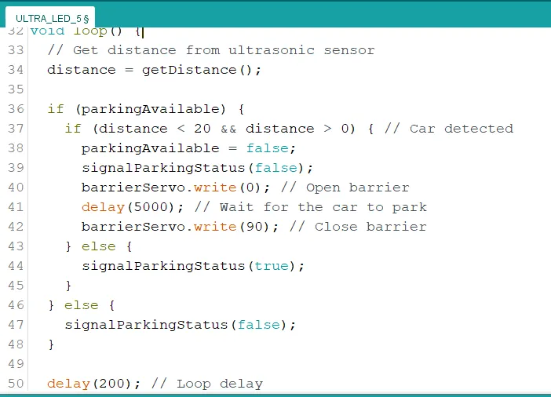

**Step 7:** Save your code. _See the [Getting Started](../../getting-started/overview.md) section_

**Step 8:** Select the arduino board and port _See the [Getting Started](../../getting-started/overview.md) section:Selecting Arduino Board Type and Uploading your code_.

**Step 9:** Upload your code. _See the [Getting Started](../../getting-started/overview.md) section:Selecting Arduino Board Type and Uploading your code_


## CONCLUSION
The Smart Car Parking System project showcases the integration of sensors, actuators, and logic to address real-world challenges in automation. By utilizing an ultrasonic sensor, RGB module, and servo motor, this system effectively detects car presence, indicates parking status, and operates a barrier—all while maintaining simplicity in design. This project serves as a practical demonstration of how basic components can be combined to create innovative solutions, paving the way for further advancements in robotics, IoT, and smart systems.
