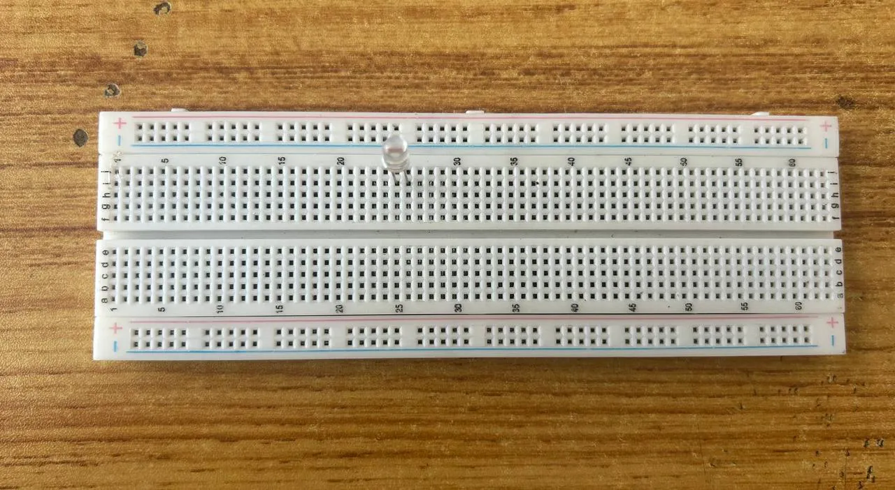
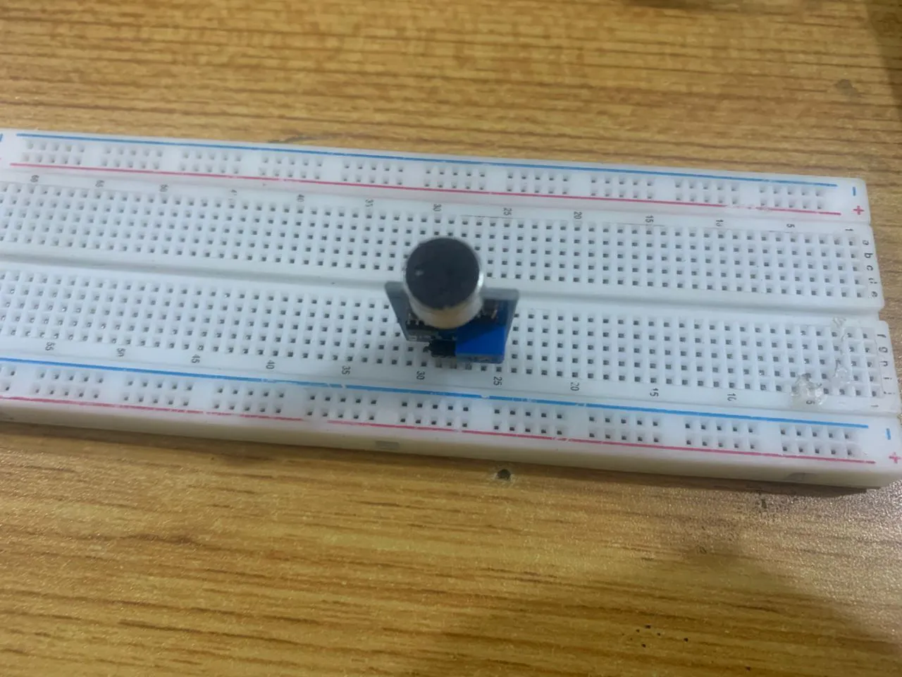

## Manual 3.0

### 3.1 Smart Guage

  <a href="../3.1.Smart_Guage/3.1.1.Smart Guage/" class="lesson-card">
    

      
    

    
1

    

      <h4>LED and Ultrasonic Sensor Control</h4>
      
This project demonstrates how to build a water level monitoring system using an ultrasonic sensor, LEDs, and a buzzer. The ultrasonic sensor measures the water level, the LEDs indica...

      Learn More →
    

  </a>

---

### 3.2 Smart Security System

  <a href="../3.2.Smart_Security_System/3.2.1.Smart Security System/" class="lesson-card">
    

      
    

    
1

    

      <h4>SMART SECURITY SYSTEM</h4>
      
This project demonstrates a smart security system using an ultrasonic sensor, a red LED, and a buzzer. The ultrasonic sensor detects nearby objects, and when movement or an object is...

      Learn More →
    

  </a>

---

### 3.3 Smart Traffic light System

  <a href="../3.3.Smart_Traffic_light_system/3.3.1.Smart Traffic light system/" class="lesson-card">
    

      
    

    
1

    

      <h4>Smart Trafic Light System.</h4>
      
This project demonstrates a smart pedestrian traffic light system using an ultrasonic sensor and a traffic light module. The ultrasonic sensor detects the presence of pedestrians nea...

      Learn More →
    

  </a>

---

### 3.4 Smart Car Parking System

  <a href="../3.4.Smart_Bed_Light/3.4.1.Smart_Bed_Light/" class="lesson-card">
    

      
    

    
1

    

      <h4>SMART STREET LIGHT SYSTEM</h4>
      
Components Required:

      Learn More →
    

  </a>

---

### 3.5 Smart Clap Device

  <a href="../3.5.Smart_Car_Parking_System/3.5.1.Smart_Car_Parking_System/" class="lesson-card">
    

      
    

    
1

    

      <h4>SMART CAR PARKING SYSTEM</h4>
      
This project demonstrates a smart car parking system using an ultrasonic sensor, RGB, a servo motor, and an Arduino Uno. The ultrasonic sensor detects approaching vehicles and checks...

      Learn More →
    

  </a>

---

### 3.6 Smart Bed Light

  <a href="../3.6.Smart_Clap_Device/3.6.1.Smart_Clap_device/" class="lesson-card">
    

      
    

    
1

    

      <h4>SMART CLAP DEVICE Control</h4>
      
Double LED ON is a simple project that guides you in turning on two LEDs at the same time.

      Learn More →
    

  </a>

---
