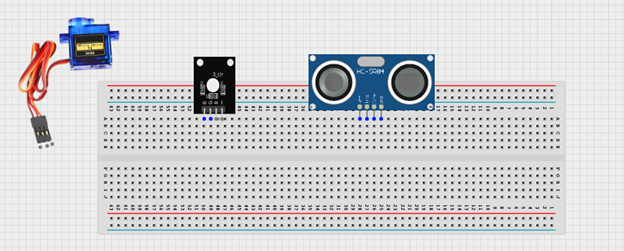
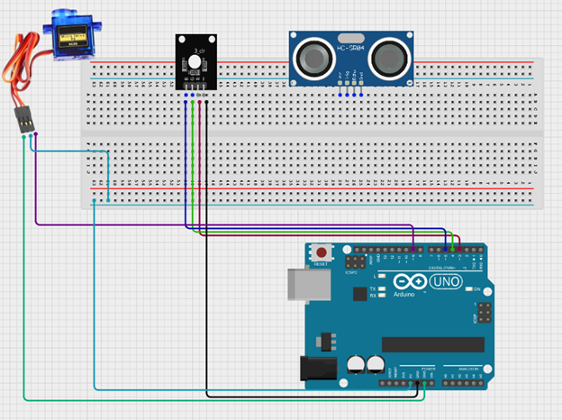
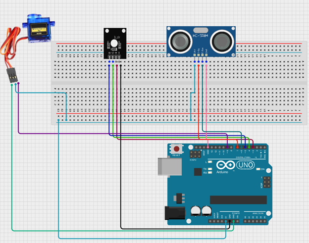
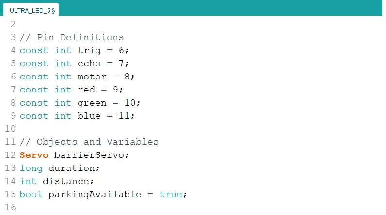
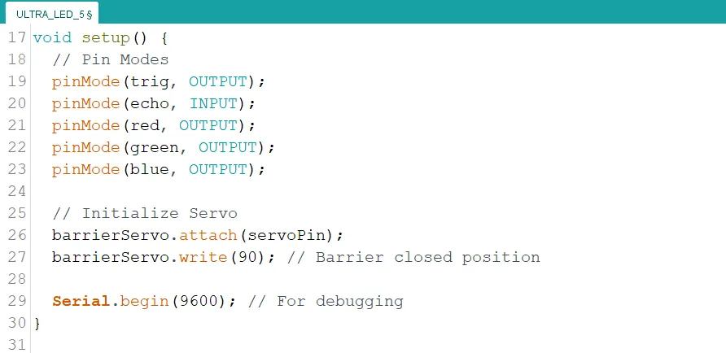
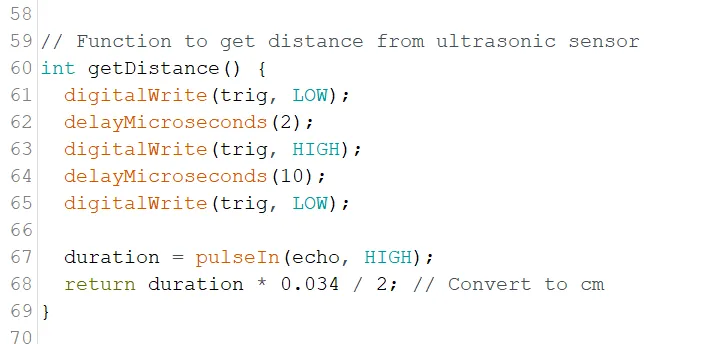
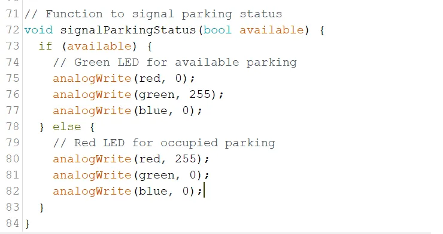
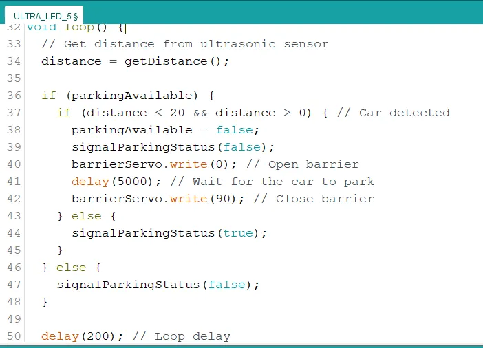

# Project 3.5.1: SMART CAR PARKING SYSTEM 

| **Description** | This project demonstrates a smart car parking system using an ultrasonic sensor, RGB, a servo motor, and an Arduino Uno. The ultrasonic sensor detects approaching vehicles and checks parking space availability, the LEDs indicate the parking status, and the servo motor automatically controls the opening and closing of the parking gate.  |
|------------------|----------------------------------------------------------------|
| **Use case**     | This project can be used in automated parking lots where the system detects incoming vehicles, shows available parking spaces using RGB, and automatically opens or closes the gate using a servo motor for controlled access. |

## Components (Things You will need)

|  |  |  |  || | |
|-------------------------|-------------------------|-------------------------|-------------------------|-------------------------|-------------------------|-------------------------|

## Building the circuit

Things Needed:

-	Arduino Uno
-	Ultrasonic sensor 
-	RGB module
-	Servo motor
-	Breadboard
-	Jumper wires

## Mounting the component on the breadboard

**Step 1:** Insert the ultrasonic sensor into the breadboard. Then place the traffic light module beside it, ensuring all the pins are properly inserted and firmly connected.

.

## WIRING THE CIRCUIT

**Step 2:** Connect the RGB module to the Arduino Uno by linking the Red pin to Digital Pin 3, the Green pin to Digital Pin 4, the Blue pin to Digital Pin 5, and the GND pin to GND using jumper wires. Then connect the servo motor by attaching its signal pin to Digital Pin 9, the VCC pin to 5V, and the GND pin to GND on the Arduino Uno.

.

**Step 3:** Connect the ultrasonic sensor to the Arduino Uno by linking the VCC pin to 5V, the GND pin to GND, the TRIG pin to Digital Pin 7, and the ECHO pin to Digital Pin 6 using jumper wires as shown in the circuit setup.

.

## PROGRAMMING

**Step 1:** Open your Arduino IDE. See how to set up here: [Getting Started](../../Getting Started/Arduino_IDE_Setup.md).

**Step 2:** Type the following code in your arduino IDE at the top of "void setup() { }" function as shown in the picture below.
   ``` cpp
   #include <Servo.h>
   // Pin Definitions
   const int trig  = 6;
   const int echo = 7;
   const int motor = 8;
   const int red = 9;
   const int green = 10;
   const int blue = 11;

   // Objects and Variables
   Servo barrierServo;
   long duration;
   int distance;
   bool parkingAvailable = true;
   ```



**Step 3:** Type the following code inside of the "void setup() { }" function to initialize the pin modes

   ``` cpp
   // Pin Modes
   pinMode(trig, OUTPUT);
   pinMode(echo, INPUT);
   pinMode(red, OUTPUT);
   pinMode(green, OUTPUT);
   pinMode(blue, OUTPUT);

   // Initialize Servo
   barrierServo.attach(servoPin);
   barrierServo.write(90); // Barrier closed position

   Serial.begin(9600); // For debugging
   ```



**Step 4:** Type the following code under "void loop() { }" function. This code is a function to calculate the distance of objects from the ultrasonic sensor.

   ``` cpp
   // Function to get distance from ultrasonic sensor
   int getDistance() {
      digitalWrite(trigPin, LOW);
      delayMicroseconds(2);
      digitalWrite(trigPin, HIGH);
      delayMicroseconds(10);
      digitalWrite(trigPin, LOW);

      duration = pulseIn(echoPin, HIGH);
      return duration * 0.034 / 2; // Convert to cm
   }
   ```



**Step 5:** Type the following code under the new function. This code is a function to control the color of the RGB module to indicate parking availability.

   ``` c++
   // Function to signal parking status
   void signalParkingStatus(bool available) {
      if (available) {
         // Green LED for available parking
         analogWrite(red, 0);
         analogWrite(green, 255);
         analogWrite(blue, 0);
      } else {
         // Red LED for occupied parking
         analogWrite(red, 255);
         analogWrite(green, 0);
         analogWrite(blue, 0);
      }
   }
   ```



**Step 6:** Type the following code inside of the "void loop() { }" function.

   ``` cpp
   // Get distance from ultrasonic sensor
   distance = getDistance();

   if (parkingAvailable) {
      if (distance < 20 && distance > 0) { // Car detected
         parkingAvailable = false;
         signalParkingStatus(false);
         barrierServo.write(0); // Open barrier
         delay(5000); // Wait for the car to park
         barrierServo.write(90); // Close barrier
      } else {
         signalParkingStatus(true);
      }
   } else {
      signalParkingStatus(false);
   }

   delay(200); // Loop delay
   ```



**Step 7:** Save your code. _See the [Getting Started](../../Getting Started/Arduino_IDE_Setup.md) section_

**Step 8:** Select the arduino board and port _See the [Getting Started](../../Getting Started/Arduino_IDE_Setup.md) section:Selecting Arduino Board Type and Uploading your code_.

**Step 9:** Upload your code. _See the [Getting Started](../../Getting Started/Arduino_IDE_Setup.md) section:Selecting Arduino Board Type and Uploading your code_


## CONCLUSION
This project demonstrated how an ultrasonic sensor, RGB LED, and servo motor can be used together to create a smart car parking system. It helped in understanding how distance detection can control visual indicators and automate a gate system, improving parking management and efficiency.
