# Project 3.3.1: Smart Trafic Light System. 

| **Description** | This project demonstrates a smart pedestrian traffic light system using an ultrasonic sensor and a traffic light module. The ultrasonic sensor detects the presence of pedestrians near the crossing area, and the traffic lights respond automatically to allow safe crossing and improve pedestrian safety. |
|------------------|----------------------------------------------------------------|
| **Use case**     | This project can be used at pedestrian crossings where the ultrasonic sensor detects people waiting to cross the road and automatically changes the traffic lights to allow safe pedestrian movement.|

## Components (Things You will need)

| 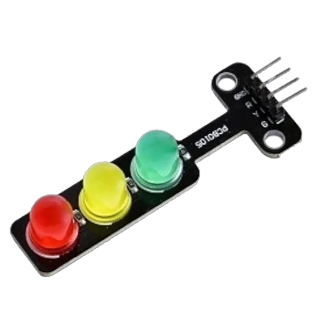 | 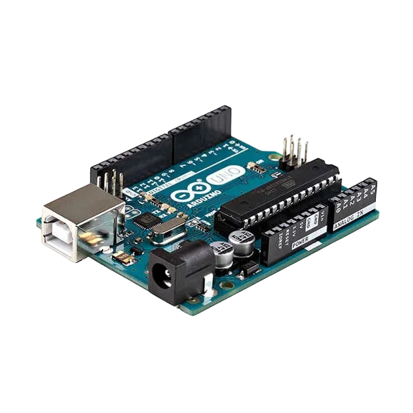 |  | 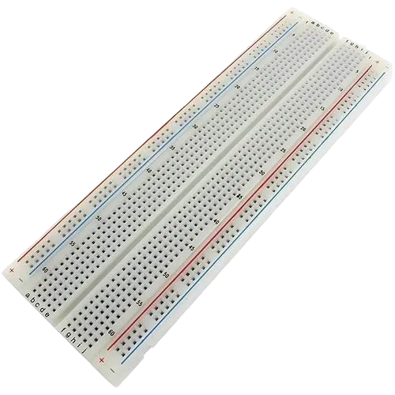 |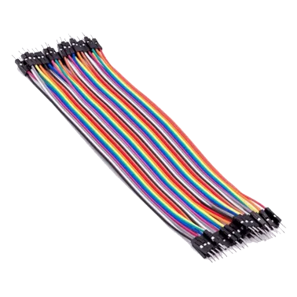| 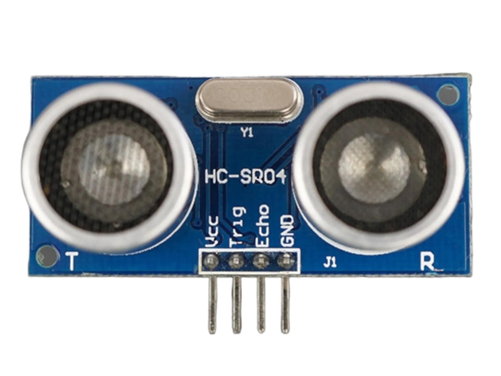|
|-------------------------|-------------------------|-------------------------|-------------------------|-------------------------|-------------------------|

## Building the circuit

Things Needed:

-	Arduino Uno Board: 1
-	Arduino USB cable: 1
-	Breadboard: 1
-	Traffic Light 1
-	Jumper Wire: 1
-	Ultrasonic sensor: 1

## Mounting the component on the breadboard

### Things needed:

**Step 1:** Insert the ultrasonic sensor into the breadboard. Then place the traffic light module beside it, ensuring all the pins are properly inserted and firmly connected.

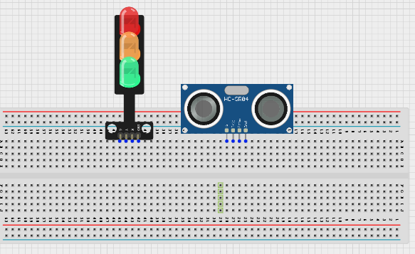.

## WIRING THE CIRCUIT

**Step 2:** DConnect the GND pin of the traffic light module to the GND on the Arduino Uno using a jumper wire. Then connect the Red pin to Digital Pin 3, the Yellow pin to Digital Pin 4, and the Green pin to Digital Pin 5 on the Arduino Uno using jumper wires.

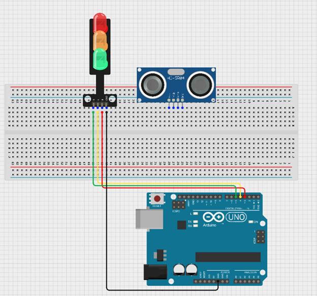.


**Step 3:** Connect the ultrasonic sensor to the Arduino Uno by linking the VCC pin to 5V, the GND pin to GND, the TRIG pin to Digital Pin 7, and the ECHO pin to Digital Pin 6 using jumper wires as shown in the circuit setup.

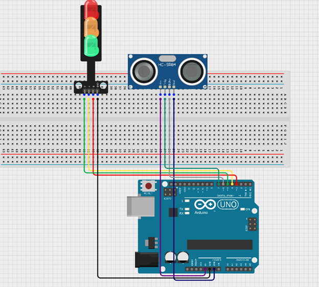.

<!-- **Step 2:** Connect one end of the black male-to-male jumper wire to the GND pin of the Ultrasonic sensor and the other end to the GND pin on the Arduino Uno board as shown in the picture below.

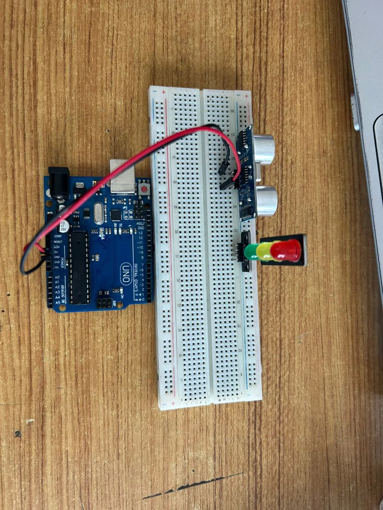.

**Step 3:** Connect one end of the white male-to-male jumper wire to the Trig pin of the Ultrasonic sensor and the other end to digital pin 9 on the Arduino Uno board as shown in the picture below.

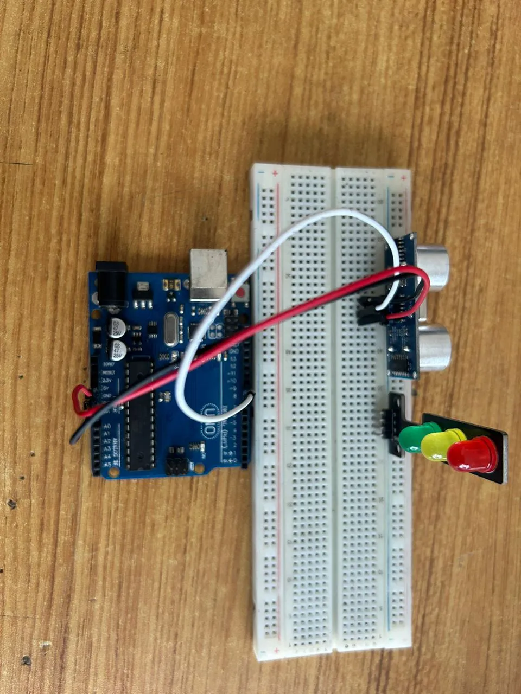.

**Step 4:** Connect one end of the blue male-to-male jumper wire to the Echo pin of the Ultrasonic sensor and the other end to digital pin 10 on the Arduino Uno board as shown in the picture below.

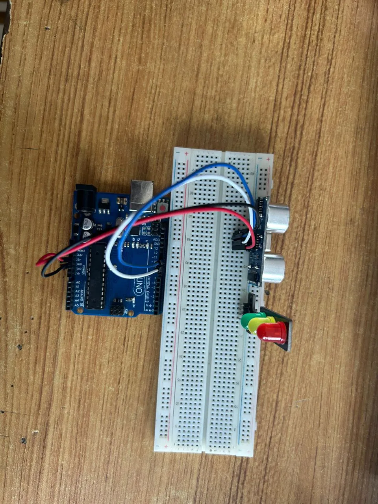.

**Step 5:** Connect one end of the green male-to-male jumper wire to the RED LED of the traffic light model, labeled (R) pin, and the other end to digital pin 6 on the Arduino Uno board, as shown in the picture below.

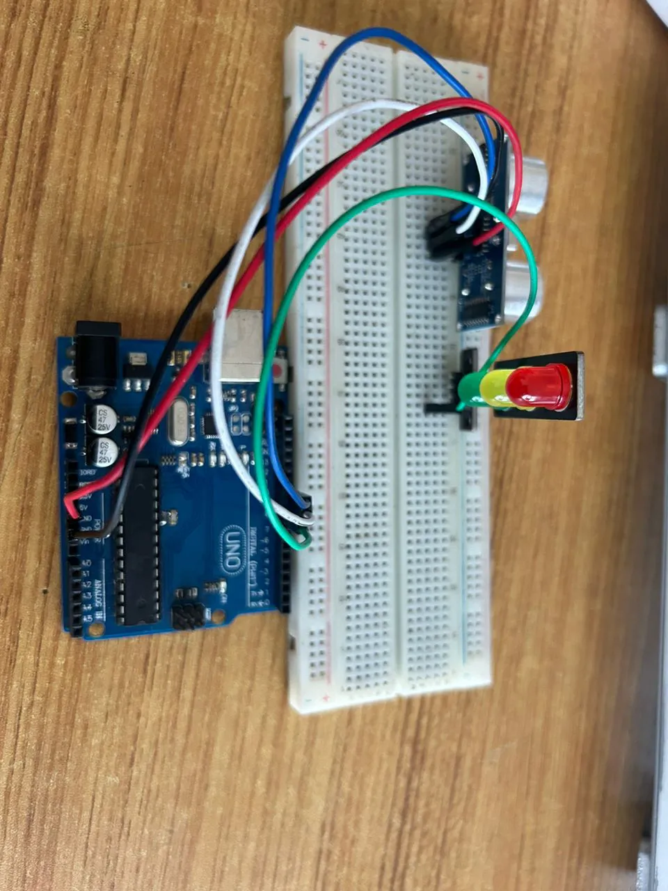.

**Step 6:** Connect one end of the brown male-to-male jumper wire to the Yellow LED of the traffic light model, labeled (Y) pin, and the other end to digital pin 7 on the Arduino Uno board, as shown in the picture below.
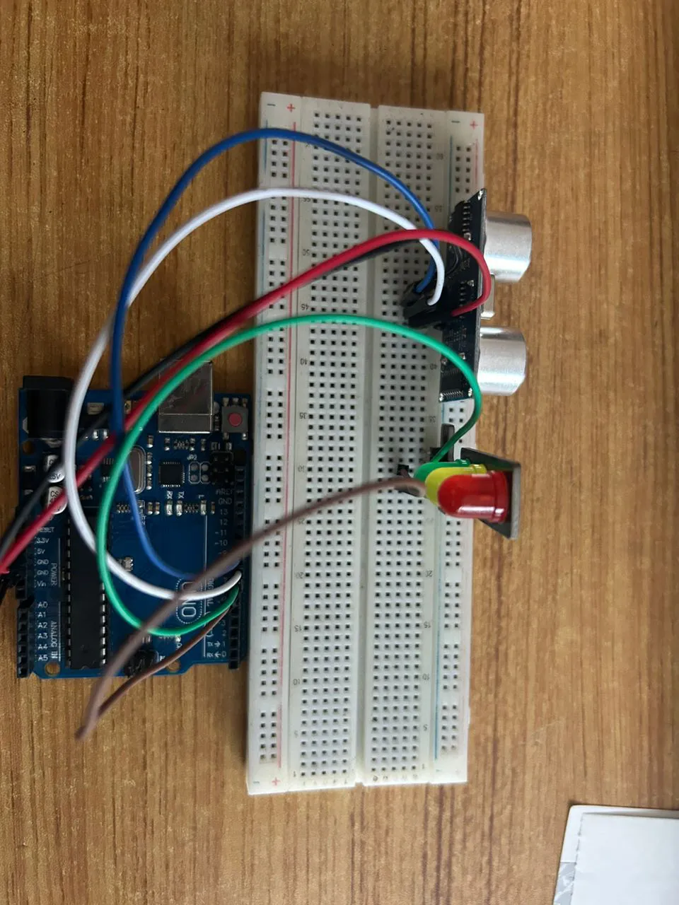.

**Step 7:** Connect one end of the yellow male-to-male jumper wire to the Green LED of the traffic light model, labeled (G) pin, and the other end to digital pin 8 on the Arduino Uno board, as shown in the picture below.

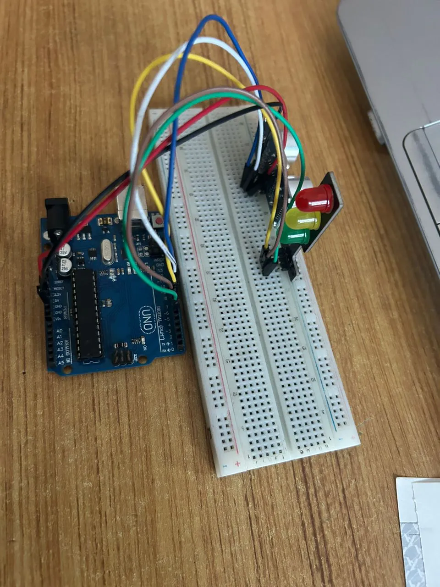.

**Step 8:** Connect one end of the purpule male-to-male jumper wire to the GND of the traffic light model, labeled (GND) pin, and the other end to digital pin GND on the Arduino Uno board, as shown in the picture below.

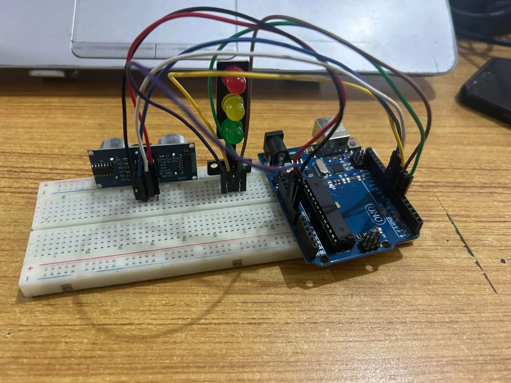. -->

## PROGRAMMING

**Step 1:** Open your Arduino IDE. See how to set up here: [Getting Started](../../Getting Started/Arduino_IDE_Setup.md).

**Step 2:**  Write the following codes as flows.
``` cpp
const int trigPin = 9;    // Ultrasonic Sensor Trig Pin
const int echoPin = 10;   // Ultrasonic Sensor Echo Pin
const int redLed = 6;     // Red Light
const int yellowLed = 7;  // Yellow Light
const int greenLed = 8;   // Green Light

// Variables for Distance Measurement
long duration;
int distance;

void setup() {
  // Initialize Sensor Pins
  pinMode(trigPin, OUTPUT);
  pinMode(echoPin, INPUT);

  // Initialize Traffic Light Pins
  pinMode(redLed, OUTPUT);
  pinMode(yellowLed, OUTPUT);
  pinMode(greenLed, OUTPUT);

  // Begin Serial Communication (for debugging)
  Serial.begin(9600);
}

void loop() {
  // Measure distance using the ultrasonic sensor
  digitalWrite(trigPin, LOW);
  delayMicroseconds(2);
  digitalWrite(trigPin, HIGH);
  delayMicroseconds(10);
  digitalWrite(trigPin, LOW);
  
  // Calculate the distance in cm
  duration = pulseIn(echoPin, HIGH);
  distance = duration * 0.034 / 2;

  // Print the distance to the Serial Monitor
  Serial.print("Distance: ");
  Serial.print(distance);
  Serial.println(" cm");

  // Control the Traffic Light Based on Distance
  if (distance <= 10) { // Vehicle detected close to the intersection
    digitalWrite(redLed, HIGH);   // Red Light ON
    digitalWrite(yellowLed, LOW);
    digitalWrite(greenLed, LOW);
    delay(5000); // Wait for 5 seconds

  } else { // No vehicle detected or vehicle is far
    digitalWrite(redLed, LOW);
    digitalWrite(yellowLed, LOW);
    digitalWrite(greenLed, HIGH); // Green Light ON
    delay(5000); // Wait for 5 seconds
    
    digitalWrite(greenLed, LOW);
    digitalWrite(yellowLed, HIGH); // Yellow Light ON
    delay(2000); // Wait for 2 seconds
    digitalWrite(yellowLed, LOW);
  }
}

```

**Step 19:** Save your code. _See the [Getting Started](../../Getting Started/Arduino_IDE_Setup.md) section_

**Step 20:** Select the arduino board and port _See the [Getting Started](../../Getting Started/Arduino_IDE_Setup.md) section:Selecting Arduino Board Type and Uploading your code_.

**Step 21:** Upload your code. _See the [Getting Started](../../Getting Started/Arduino_IDE_Setup.md) section:Selecting Arduino Board Type and Uploading your code_


## CONCLUSION
This project demonstrated how an ultrasonic sensor can be used with a traffic light module and an Arduino Uno to create a smart pedestrian traffic light system. It helped in understanding object detection, automatic traffic control, and how sensors can improve pedestrian safety in real-life applications.
