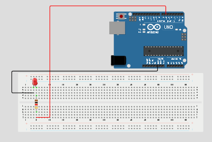
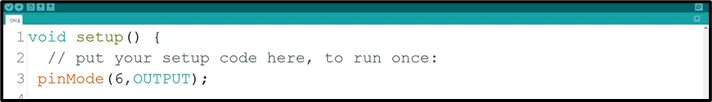

# Project 1.1.1: LED ON

| **Description** |This project shows how to turn on an LED using an Arduino Uno. It introduces basic circuit connections and simple Arduino programming. |
|------------------|----------------------------------------------------------------|
| **Use case**     | This project finds utility in basic signaling setups. For instance, it could be applied in an easier and basic lighting system, where LEDs turning on together provide ample brightness when someone enters a room. |

## Components (Things You will need)

|  |  |  |  | |
|-------------------------|-------------------------|-------------------------|-------------------------|-------------------------|

## Building the circuit

Things Needed:

- Arduino Uno = 1
- Arduino USB cable = 1
<!-- - White LED = 1 -->
- Red LED = 1
- Red jumper wires = 1
- Blue jumper wires = 1
- 220Ω resistor 

## Mounting the component on the breadboard

**Step 1:** Place the LED on the breadboard. The longer leg is the positive pin, while the shorter leg is the negative pin.

.

_**NB:** Make sure you identify where the positive pin (+) and the negative pin (-) is connected to on the breadboard. The longer pin of the LED is the positive pin and the shorter one, the negative PIN_.

## WIRING THE CIRCUIT

### Things Needed:

- Red male-male-to-male jumper wires = 1
- Blue male-to-male jumper wires = 1


**Step 2:** Connect the positive leg of the LED to pin 6 on the Arduino through a 220Ω resistor. Connect the negative leg of the LED to GND on the Arduino using a jumper wire.




## PROGRAMMING

**Step 1:** Open your Arduino IDE. See how to set up here: [Getting Started](../../Getting Started/Arduino_IDE_Setup.md).

**Step 2:** Type ``` pinMode (6, OUTPUT);```

.

**Step 3:** Type ``` digitalWrite (6, HIGH);```

.

as shown in the picture above.

**NB:** pinMode will help the Arduino board to decide which port should be activated. The code below will turn off the light bulb.

**Step 4:** Save your code. _See the [Getting Started](../../Getting Started/Arduino_IDE_Setup.md) section_

**Step 5:** Select the arduino board and port _See the [Getting Started](../../Getting Started/Arduino_IDE_Setup.md) section:Selecting Arduino Board Type and Uploading your code_.

**Step 6:** Upload your code.

## CONCLUSION
This project helps learners understand how to connect and control an LED using Arduino. It is a simple introduction to electronic circuits and programming.

