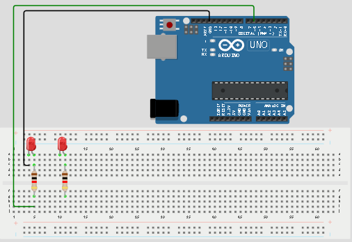
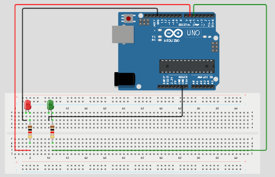
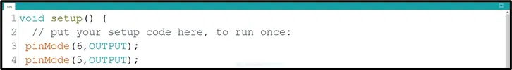

# Project 1.1.3: DOUBLE LED ON

| **Description** | Double LED ON is a simple project that guides you in turning on two LEDs at the same time. |
|------------------|----------------------------------------------------------------|
| **Use case**     | This project finds utility in basic signaling setups. For instance, it could be applied in an easier and basic lighting system, where two LEDs turning on together provide ample brightness when someone enters a room. |

## Components (Things You will need)

|  |  |  |  || |
|-------------------------|-------------------------|-------------------------|-------------------------|-------------------------|-------------------------|

## Building the circuit

Things Needed:

-	Arduino Uno = 1                                                                                                                            
-	Arduino USB cable = 1
-	White LED = 1
-	Red LED = 1
-	Red jumper wires = 1
-	Blue jumper wires = 1
-  Resistor = 2

## Mounting the component on the breadboard

**Step 1:** Place the two LEDs on the breadboard. For each LED, the longer leg is the positive pin, while the shorter leg is the negative pin.

.

_**NB:** Make sure you identify where the positive pin (+) and the negative pin (-) is connected to on the breadboard. The longer pin of the LED is the positive pin and the shorter one, the negative PIN_.

## WIRING THE CIRCUIT

### Things Needed:

- Red male-male-to-male jumper wires = 1
- Black male-to-male jumper wires = 2
- Green male-to-male jumper wires = 1

**Step 2:** Connect the positive leg of the first LED to pin 6 on the Arduino through a 220Ω resistor. Connect its negative leg to GND.

.

**Step 3:** Connect the positive leg of the second LED to pin 5 on the Arduino through a 220Ω resistor. Connect its negative leg to GND.

.


_make sure you connect the arduino usb use blue cable to the Arduino board_.

## PROGRAMMING

**Step 1:** Open your Arduino IDE. See how to set up here: [Getting Started](../../Getting Started/Arduino_IDE_Setup.md).

**Step 2:** Type the following codes in the void setup function as shown in the image below.
   ```
   pinMode (6, OUTPUT);
   pinMode (5, OUTPUT);
   ```

.

**Step 3:** Type the following code in the void loop function as shown below in the image below.
   ```
   digitalWrite (6, HIGH);
   digitalWrite (5, HIGH);
   ```

.

_**NB:** pinMode will help the Arduino board to decide which port should be activated. The code below will turn off the two light bulbs._

**Step 4:** Save your code. _See the [Getting Started](../../Getting Started/Arduino_IDE_Setup.md) section_

**Step 5:** Select the arduino board and port _See the [Getting Started](../../Getting Started/Arduino_IDE_Setup.md) section:Selecting Arduino Board Type and Uploading your code_.

**Step 6:** Upload your code. _See the [Getting Started](../../Getting Started/Arduino_IDE_Setup.md) section:Selecting Arduino Board Type and Uploading your code_

## OBSERVATION

.

## CONCLUSION

This project helps learners understand how to control more than one LED with Arduino. It is a simple introduction to multiple outputs, circuit connection, and synchronized control.