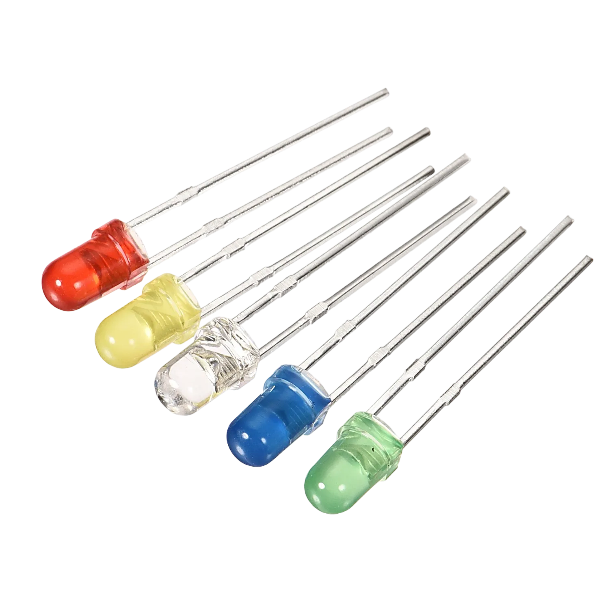
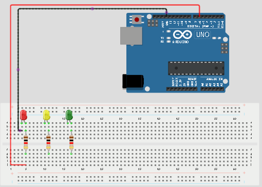
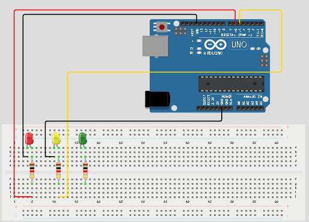
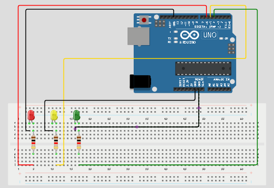
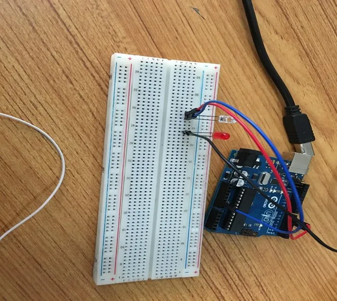
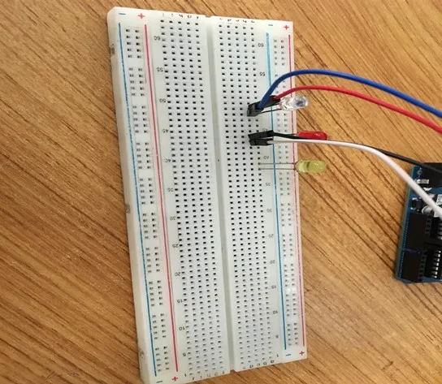
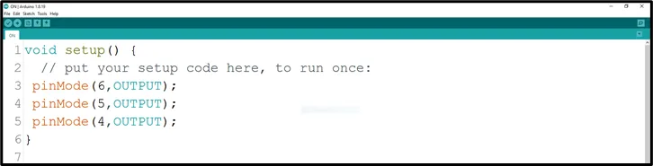
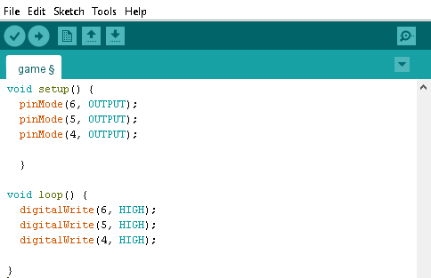

# Project 1.1.5: Triple LEDS

| **Description** | This project shows how to turn on three LEDs at the same time using an Arduino Uno. It introduces the control of multiple LEDs using different Arduino pins.|
|------------------|----------------------------------------------------------------|
| **Use case**     | This project can represent simple lighting systems, such as streetlights where many lights turn on together. |

## Components (Things You will need)

|  |  |  |  ||! [Resistor](../../../assets/components/resistors.webp) |
|-------------------------|-------------------------|-------------------------|-------------------------|-------------------------|-------------------------|

## Building the circuit

Things Needed:

-	Arduino Uno = 1
-	Arduino USB cable = 1
-	Led = 3
-	Jumper wire = 6
-  Resistor = 3
## Mounting the component on the breadboard

**Step 1:** Place the three LEDs on the breadboard. For each LED, the longer leg is the positive pin, while the shorter leg is the negative pin.

.

_**NB:** Make sure you identify where the positive pin (+) and the negative pin (-) is connected to on the breadboard. The longer pin of the LED is the positive pin and the shorter one, the negative PIN_.

## WIRING THE CIRCUIT

### Things Needed:

- Jumper wire = 4

**Step 2:** Connect the positive leg of the first LED to pin 6 on the Arduino through a 220Ω resistor. Connect its negative leg to GND.

.

**Step 3:** Connect the positive leg of the second LED to pin 5 on the Arduino through a 220Ω resistor. Connect its negative leg to GND.

.

**Step 4:** Connect the positive leg of the third LED to pin 4 on the Arduino through a 220Ω resistor. Connect its negative leg to GND.

.

<!-- **Step 5:** Connect one end of the black male-to-male jumper wire to the positive pin of the red LED on the breadboard and the other end to hole number 5 on the Arduino UNO.

**Step 6:** Connect one end of the black male-to-male jumper wire to the positive pin of the red LED on the breadboard and the other end to hole number 5 on the Arduino UNO. -->

<!-- . -->
<!-- 
**Step 7:** Connect one end of the white male-to-male jumper wire to the negative pin of the white LED on the breadboard and the other end to GND on the Arduino UNO. -->
<!-- 
. -->

<!-- **Step 8:** Take the yellow LED and insert it into the vertical connectors on the breadboard.

. -->

<!-- **Step 9:** Connect one end of the green male-to-male jumper wire to the positive pin of the yellow LED on the breadboard and the other end to hole number 4 on the Arduino UNO.

. -->
<!-- 
**Step 10:** Connect one end of the purple male-to-male jumper wire to the negative pin of the yellow LED on the breadboard and the other end to GND on the Arduino UNO.

. -->

_make sure you connect the arduino usb use blue cable to the Arduino board_.

## PROGRAMMING

**Step 1:** Open your Arduino IDE. See how to set up here: [Getting Started](../../Getting Started/Arduino_IDE_Setup.md).

**Step 2:** Type the following codes in the void setup function as shown in the image below.
   ```
   pinMode(6, OUTPUT); sets pin 6 as an output pin for the first LED.
pinMode(5, OUTPUT); sets pin 5 as an output pin for the second LED.
pinMode(4, OUTPUT); sets pin 4 as an output pin for the third LED.

   ```

.

_**NB:** pinMode will help the Arduino board to decide which port should be activated.  The code below will turn off the three light bulbs._

**Step 3:** Type the following codes in the void loop function.as shown in the image below;
   ```
   digitalWrite(6, HIGH); turns on the first LED.
digitalWrite(5, HIGH); turns on the second LED.
digitalWrite(4, HIGH); turns on the third LED.

   ```
.

_**NB:** To turn this LEDS off, you can change the “HIGH” in the ode into “LOW” _

**Step 4:** Save your code. _See the [Getting Started](../../Getting Started/Arduino_IDE_Setup.md) section_

**Step 5:** Select the arduino board and port _See the [Getting Started](../../Getting Started/Arduino_IDE_Setup.md) section:Selecting Arduino Board Type and Uploading your code_.

**Step 6:** Upload your code. _See the [Getting Started](../../Getting Started/Arduino_IDE_Setup.md) section:Selecting Arduino Board Type and Uploading your code_

## OBSERVATION

.

## CONCLUSION

This project helps learners understand how to control three LEDs using Arduino. It is a simple introduction to multiple outputs, basic lighting systems, and synchronized LED control.