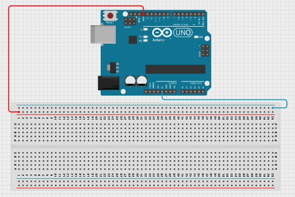
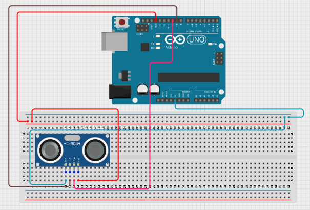
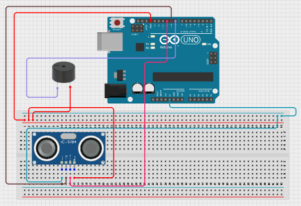
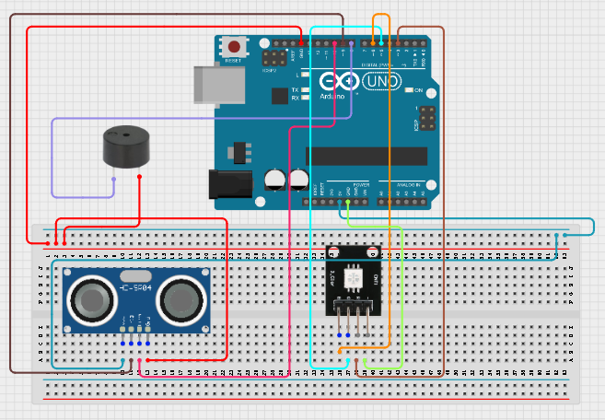
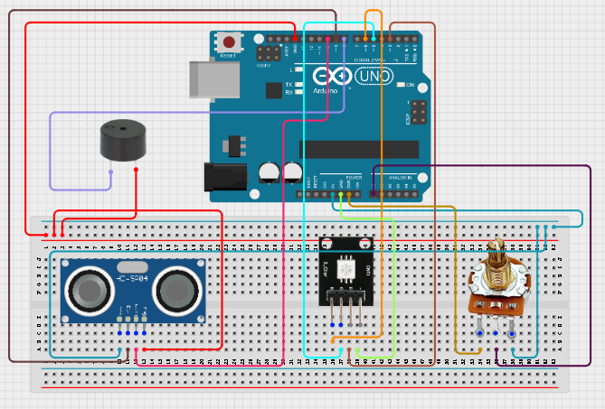
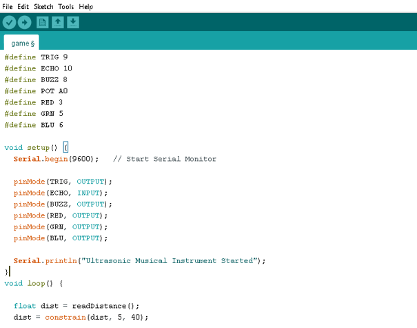
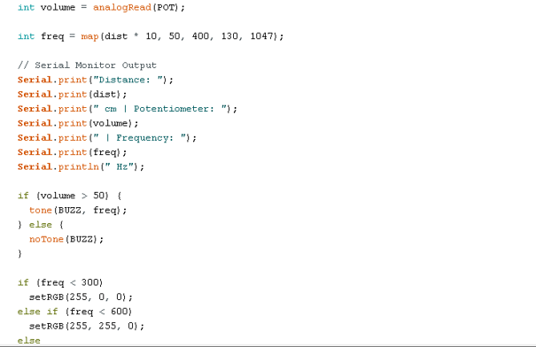
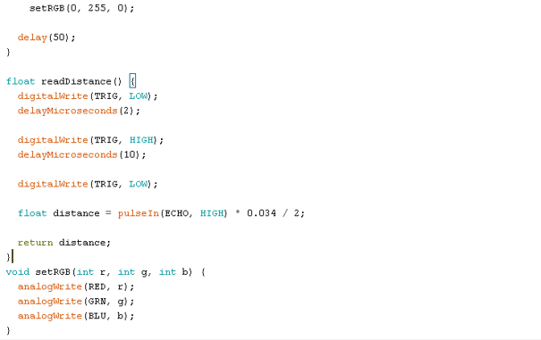

# Project 2.11: Distance Theremin (Potentiometer & Buzzer)

| **Description** | Distance Theremin (Pitch Instrument) |
| --------------- | -------------------------------------------------------------------------------------------------------------------------------------------------------------------------------------------------------------------------------------------------------------------------- |
| **Use case**    | Musical instruments, sound experiments, STEM demonstrations, wave and frequency learning.                                                                                                                               |

## Components (Things You will need)

|  |  |  |  |  |  |  |
| --------------------------------------------------- | ------------------------------------------------------ | ----------------------------------------------------------- | --------------------------------------------------------- | ------------------------------------------------------ | ------------------------------------------------------ | ------------------------------------------------------ |

## Building the circuit

Things Needed:

- Arduino Uno = 1
- Arduino USB cable = 1
- Breadboard = 1
- Sound Sensor Module = 1
- RGB LED = 1
- Potentiometer = 1
- Jumper Wires = multiple

## WIRING THE CIRCUIT

**Step 1:** Connect one jumper wire from the 5V pin on the Arduino Uno to the BLUE RAIL of the breadboard and connect another jumper wire from the GND pin on the Arduino Uno to the RED RAIL of the breadboard.

.

**Step 2:** Place the ultrasonic sensor on the breadboard
Connect the ultrasonic sensor:
•	VCC → 5V 
•	GND → GND 
•	Trig → Pin 9 
•	Echo → Pin 10 

.

**Step 3:** Connect the buzzer:
•	Positive (+) → Pin 8 
•	Negative (-) → GND 

.

**Step 4:** Place the RGB LED on the breadboard
Connect the RGB LED:
•	Red → Pin 3 
•	Green → Pin 5 
•	Blue → Pin 6 

.

**Step 5:**
Place the potentiometer on the breadboard
Connect the potentiometer:
•	Left pin → 5V 
•	Right pin → GND 
•	Middle pin → A0 

.

**Step 5:** After completing the wiring, connect the Arduino Uno to the computer using the USB cable.

## PROGRAMMING

Below is the Arduino code to make the Sound-Controlled Desk Lamp work.

**Step 1:** Open your Arduino IDE. See how to set up here: [Getting Started](../../Getting Started/Arduino_IDE_Setup.md).

**Step 2:** Copy and paste the following code into a new sketch:
.

.

.

**Step 3:** Save your code. _See the [Getting Started](../../Getting Started/Arduino_IDE_Setup.md) section_.

**Step 4:** Select Arduino Uno from Tools → Board.

**Step 5:** Select the correct COM port from Tools → Port.

**Step 6:** Click Upload.

## OBSERVATION

•	Moving your hand closer changes the pitch. 
•	The buzzer produces different musical tones. 
•	The RGB LED changes colour according to pitch level. 

## CONCLUSION

This project demonstrates ultrasonic sensing, frequency generation, sound production, and RGB LED control.
