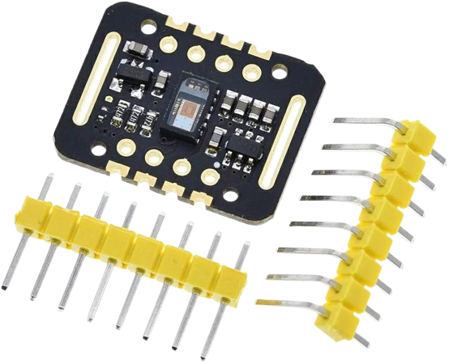
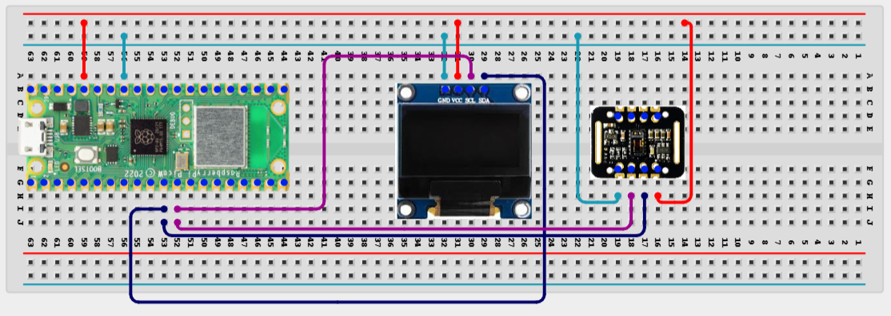

# Project 3.1.10: Heart Rate Monitor

## Overview

The Pico samples an analog pulse sensor, estimates beats per minute, and shows the live reading on an OLED display.

Wearable and wellness devices need careful validation because raw biological signals are noisy and easy to misread.

A Pico 2 W prototype with a pulse sensor, OLED display, and simple beat-detection logic.

Signal thresholding, rolling BPM estimation, and honest discussion of medical-device limitations.

## Required Components

|  |  |  |  |
| --- | --- | --- | --- |
| <br>Raspberry Pi Pico 2 W | <br>MAX30102 module | <br>128x64 I2C OLED display | <br>Breadboard |
| <br>Jumper wires |  |  |  |

## Circuit Connections

| Component Pin | Connects To | Pico GPIO / Physical Pin Number | Notes |
| --- | --- | --- | --- |
| MAX30102 VIN | 3.3V output | Physical pin 36 | Sensor power |
| MAX30102 GND | GND | Physical pin 38 | Common ground |
| MAX30102 SDA | GPIO 8 | GPIO 8 / physical pin 11 | Shared I2C data line |
| MAX30102 SCL | GPIO 9 | GPIO 9 / physical pin 12 | Shared I2C clock line |
| OLED VCC | 3.3V output | Physical pin 36 | Display power |
| OLED GND | GND | Physical pin 38 | Common ground |
| OLED SDA | GPIO 8 | GPIO 8 / physical pin 11 | Same SDA line as MAX30102 |
| OLED SCL | GPIO 9 | GPIO 9 / physical pin 12 | Same SCL line as MAX30102 |

## Wiring Diagram



```
3.3V   -> MAX30102 VIN and OLED VCC
GND    -> MAX30102 GND and OLED GND
GPIO 8 -> MAX30102 SDA and OLED SDA
GPIO 9 -> MAX30102 SCL and OLED SCL
```

## Step-by-Step Assembly

1. Connect the MAX30102 to Pico 3.3V, GND, GPIO 8 (SDA), and GPIO 9 (SCL).
2. Connect the OLED to the same 3.3V, GND, GPIO 8, and GPIO 9 lines (shared I2C).
3. Upload `ssd1306.py` and the `max30102` library files to the Pico root folder.
4. Place the sensor on a finger and remain still during calibration so the waveform can settle.

## Testing Individual Components

Before running the full project, test each subsystem separately. This makes it easier to find wiring, library, or logic problems before full integration.

1. **Hardware setup:** Assemble the Pico, sensor, indicator, and load wiring exactly as shown in the connection table before applying power.
2. **Test the I2C bus:** Run an I2C scanner to confirm both the MAX30102 (usually `0x57`) and OLED are detected.
3. **Test the output device:** Run a short OLED test so the display path is known to work before mixing in pulse logic.
4. **Test the MAX30102:** Print raw IR values from the sensor to verify it responds to finger placement.
5. **Run the full system:** Run the full system for at least thirty seconds and compare the displayed BPM with a manual pulse count.
6. **Validate the prototype:** Repeat the test with different finger pressure and hand movement to see how the signal quality changes.
7. **Save the project:** Save the validated program on the Pico as `main.py` and keep a copy on the computer for future edits.

## Full Project Code

After completing and checking the circuit connections, open Thonny IDE, copy and paste this code into a new file or upload the project file to the Raspberry Pi Pico 2 W, then run it from Thonny.

Upload and run this code after the individual tests work correctly.

```python
from machine import Pin, SoftI2C
from max30102 import MAX30102, MAX30105_PULSE_AMP_MEDIUM
import ssd1306
import time

i2c = SoftI2C(sda=Pin(8), scl=Pin(9), freq=400000)
oled = ssd1306.SSD1306_I2C(128, 64, i2c)
sensor = MAX30102(i2c=i2c)
sensor.setup_sensor()
sensor.set_active_leds_amplitude(MAX30105_PULSE_AMP_MEDIUM)

print("Heart-rate monitor ready")

while True:
    sensor.check()
    if sensor.available():
        ir_val = sensor.pop_ir_from_storage()
        # Simplified BPM logic would follow here.
        oled.fill(0)
        oled.text("Pulse Active", 0, 0)
        oled.text("IR: {}".format(ir_val), 0, 20)
        oled.show()
    time.sleep_ms(10)
```

## How the Code Works

| Code Section | What It Does | Why It Matters | What to Modify During Testing |
| --- | --- | --- | --- |
| I2C Initialization | Configures the `SoftI2C` bus on GPIO 8 and 9 for shared sensor and display communication. | The project stays useful even in serial mode while the display is being debugged. | Verify the OLED library and I2C wiring if the display remains blank. |
| `sensor.check()` | Polls the MAX30102 FIFO buffer to see if new heart-rate samples are available. | Biological signals are noisy, so smoothing improves threshold decisions. | Adjust the sample count if the signal is too jittery or too slow. |
| `pop_ir_from_storage` | Retrieves the infrared light-intensity value used to detect blood-volume changes (the pulse). | This turns a raw waveform into a safer BPM estimate. | Tune `THRESHOLD` and `HYSTERESIS` after observing your own raw signal. |
| Rolling BPM output | Keeps a short history of BPM values and prints the average. | A rolling average is easier to interpret than a single interval reading. | Increase or decrease the history length if the display is too jumpy or too slow to respond. |

## Expected Result

The serial monitor reports the current reading or state clearly.

The hardware output responds when the decision logic changes state.

Subsystem behavior matches the thresholds, timing, or rules described in the document.

### Validation Checks

- **Normal condition test:** Place the sensor correctly and confirm the raw waveform changes with each pulse.
- **Sensor reading validation:** Count beats manually for 15 seconds and compare the estimate with the displayed BPM.
- **Calibration test:** Adjust `THRESHOLD` only after watching the raw signal values in the serial monitor.
- **False trigger test:** Move your hand slightly and note how quickly motion creates incorrect beats.
- **Limitation test:** Explain why this simple threshold method cannot replace a certified medical device.

### Deployment and Limitations

- This prototype works well for classroom demonstrations and local monitoring pilots.
- Before deployment, it needs calibration records, protective mounting, and regular validation checks.
- Display-only systems still depend on correct sensor placement and trained users.

## Troubleshooting

| Problem | Possible Cause | Solution |
| --- | --- | --- |
| BPM stays at zero | Finger not detected or library path for MAX30102 is incorrect | Verify the `lib/max30102/` folder exists and the finger is placed firmly on the sensor. |
| BPM jumps wildly | Motion noise or false threshold crossings are occurring | Hold the sensor still and increase `HYSTERESIS` or improve the mounting. |
| OLED is blank | I2C bus conflict or incorrect pins (GPIO 8/9 not used) | Ensure SDA is on GPIO 8 and SCL is on GPIO 9 for both modules. |
| Signal looks flat | Sensor power or ground is unstable | Recheck the analog wiring and make sure the sensor is powered from 3.3V. |
