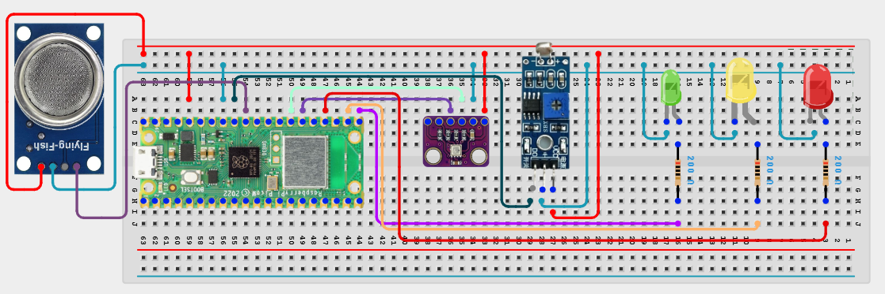

# Project 3.1.13: Iot Prototyping Board

**Advanced Embedded Systems Project Using Raspberry Pi Pico 2 W and MicroPython**

---
## Overview

The Pico integrates gas, light, and climate sensing into one reusable prototyping board that reports subsystem health locally.

Students often need one reusable platform for testing multiple sensors before building a larger connected system.

A Pico 2 W prototype with gas, light, and a BME280 sensor plus a three-LED subsystem health display.

Reusable sensor integration, board-level validation, and honest local prototyping before cloud expansion.


## Required Components

|  |  |  |  |
| --- | --- | --- | --- |
| <br>Raspberry Pi Pico 2 W | <br>BME280 | <br>Breadboard | <br>Jumper wires |
| <br>LED | <br>Resistor | <br>Gas sensor | <br>LDR |


## Circuit Connections

| Component terminal | Connect to | Pico physical pin | Notes |
|---|---|---|---|
| MQ-135 AO | GPIO 26 ADC0 | GPIO 26 / physical pin 31 | Air-quality proxy |
| LDR divider midpoint | GPIO 27 ADC1 | GPIO 27 / physical pin 32 | Light-level input |
| BME280 VCC | 3.3V output | Physical pin 36 | Sensor power |
| BME280 GND | GND | Physical pin 38 | Common ground |
| BME280 SDA | GPIO 20 | GPIO 20 / physical pin 26 | I2C0 SDA |
| BME280 SCL | GPIO 21 | GPIO 21 / physical pin 27 | I2C0 SCL |
| Green LED anode | 220 ohm resistor to GPIO 16 | GPIO 16 / physical pin 21 | NORMAL |
| Yellow LED anode | 220 ohm resistor to GPIO 17 | GPIO 17 / physical pin 22 | WARNING |
| Red LED anode | 220 ohm resistor to GPIO 18 | GPIO 18 / physical pin 24 | CRITICAL |

---

## Wiring Diagram



```
  MQ-135 AO -> GPIO 26
  LDR divider midpoint -> GPIO 27
  BME280 SDA -> GPIO 20
  BME280 SCL -> GPIO 21
  BME280 VCC -> 3.3V
  BME280 GND -> GND
  GPIO 16 -> green LED
  GPIO 17 -> yellow LED
  GPIO 18 -> red LED
```

---

## Step-by-Step Assembly

1. Connect the MQ-135 analog output to GPIO 26.
2. Build the LDR divider and connect its midpoint to GPIO 27.
3. Connect the BME280 to Pico 3.3V, GND, GPIO 20 (SDA), and GPIO 21 (SCL).
4. Connect the three LEDs to GPIO 16, GPIO 17, and GPIO 18 through 220 ohm resistors.
5. Warm up the gas sensor before using the full board status logic.

---

## Testing Individual Components

Before running the full project, test each subsystem separately. This makes it easier to find wiring, library, or logic problems before full integration.

1. **Hardware setup**: Assemble the Pico, sensor, indicator, and load wiring exactly as shown in the connection table before applying power.
2. **Test the input sensor**: Test each sensor by itself so you know the raw board inputs are wired correctly.
3. **Test the output device**: Test each LED output separately before using combined board-state logic.
4. **Test the decision logic**: Confirm that moderate sensor stress produces WARNING and stronger combined stress produces CRITICAL.
5. **Run the full system**: Run the full board and compare the raw readings with the LED status state.
6. **Validate the prototype**: Move one sensor or disconnect it intentionally to see how easy the board is to debug.
7. **Save the project**: Save the validated program on the Pico as main.py and keep a copy on the computer for future edits.

---

## Full Project Code

After completing and checking the circuit connections, open Thonny IDE, copy and paste this code into a new file or upload the project file to the Raspberry Pi Pico 2 W, then run it from Thonny.

```python
from machine import ADC, I2C, Pin
import bme280
import time

GAS_PIN = 26
LIGHT_PIN = 27
BME_SDA_PIN = 20
BME_SCL_PIN = 21
GREEN_PIN = 16
YELLOW_PIN = 17
RED_PIN = 18

gas = ADC(GAS_PIN)
light = ADC(LIGHT_PIN)
i2c = I2C(0, sda=Pin(BME_SDA_PIN), scl=Pin(BME_SCL_PIN), freq=400000)
bme_sensor = bme280.BME280(i2c=i2c)
green = Pin(GREEN_PIN, Pin.OUT)
yellow = Pin(YELLOW_PIN, Pin.OUT)
red = Pin(RED_PIN, Pin.OUT)

print("IoT prototyping board ready")

while True:
    gas_value = gas.read_u16()
    light_value = light.read_u16()
    try:
        values = bme_sensor.values
        temperature = float(values[0].replace('C', ''))
        humidity = float(values[2].replace('%', ''))
    except Exception:
        temperature = 0
        humidity = 0

    warning = gas_value > 18000 or light_value < 12000 or humidity > 75
    critical = gas_value > 30000 or temperature > 35 or humidity > 85

    green.value(1 if not warning and not critical else 0)
    yellow.value(1 if warning and not critical else 0)
    red.value(1 if critical else 0)

    status = "CRITICAL" if critical else ("WARNING" if warning else "NORMAL")
    print("Gas:{} Light:{} Temp:{}C Hum:{}% Status:{}".format(gas_value, light_value, temperature, humidity, status))
    time.sleep(2)
```

---

## How the Code Works

| Code Section | What It Does | Why It Matters | What to Modify During Testing |
|--------------|--------------|----------------|------------------------------|
| Board sensor setup | Creates one shared board interface for gas, light, and climate sensing | A reusable IoT board needs consistent pin mapping before expansion | Change the pin map only if the physical board layout changes too |
| Warning and critical rules | Combines several sensor thresholds into a single board state | This teaches how simple data fusion can support system-level health checks | Tune the thresholds after collecting baseline values from your real setup |
| LED status mapping | Uses green, yellow, and red LEDs to show board health | A local visual panel makes debugging faster than reading serial values alone | Keep the color semantics stable if other students will use the board |
| Main loop | Prints each raw reading and the combined board status | This gives both low-level and high-level visibility during testing | If one sensor is unstable, fix that hardware path before changing the overall logic |

---

## Expected Result

The serial monitor reports the current reading or state clearly.

The hardware output responds when the decision logic changes state.

Subsystem behavior matches the thresholds, timing, or rules described in the document.

### Validation Checks

- **Normal condition test**: confirm the system stays in its safe or idle state under baseline conditions
- **Warning condition test**: move the input close to the chosen threshold and confirm the transition is sensible
- **Critical condition test**: trigger the strongest alert or control state and confirm the output response is correct
- **Calibration test**: compare the sensor or timing against a known reference or repeated trial
- **Limitation test**: deliberately create an awkward or noisy condition and note how the prototype behaves

### Deployment and Limitations

- This prototype is useful for local indicator boards and classroom control panels
- Before deployment, labeling, enclosure design, and user training need improvement
- Status tools only work well when users trust the meaning of each state and keep the system updated

---

## Troubleshooting

| Problem | Possible Cause | Solution |
|---------|----------------|----------|
| Board is always in warning | Thresholds are too strict for the room baseline | Record the baseline values and adjust the warning thresholds |
| One LED never lights | That LED path or pin mapping is incorrect | Test the LED directly from a short output script |
| Gas values dominate the board state | The MQ-135 is not warmed up or the threshold is too low | Allow full warm-up and then recalibrate the gas thresholds |
| Climate readings fail often | The BME280 read or I2C wiring is failing | Check the SDA and SCL connections and retest the sensor on its own |

---
