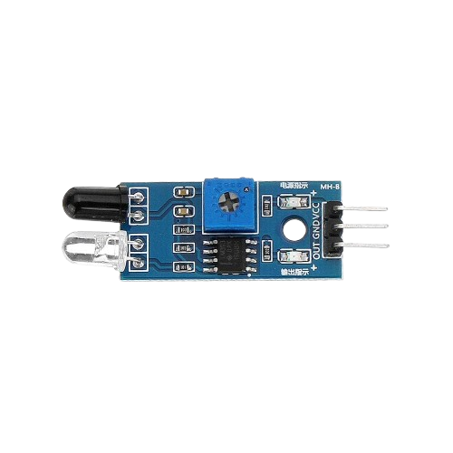
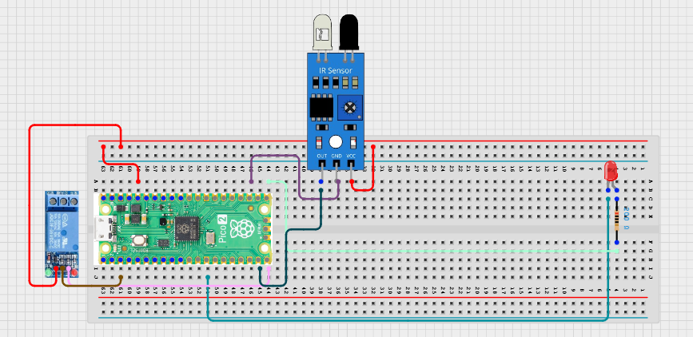

# Project 3.1.26: Sanitizer Dispenser

**Advanced Embedded Systems Project Using Raspberry Pi Pico 2 W and MicroPython**

---
## Overview

The Pico watches an IR hand-detection sensor and runs a small pump or valve for a fixed sanitizer dose.

Touch-free hygiene stations reduce contamination and waste less fluid when the dose is timed.

A Pico 2 W prototype with an IR sensor, relay output, LED, and a timed dispensing cycle.

Reliable hand detection, timed dosing, cooldown protection, and safe actuator testing around liquids.


## Required Components

|  |  |  |  |
| --- | --- | --- | --- |
| <br>Raspberry Pi Pico 2 W | <br>Ir Sensor | <br>Breadboard | <br>Jumper wires |
| <br>LED | <br>Resistor | <br>Relay module |   |


## Circuit Connections

| Component terminal | Connect to | Pico physical pin | Notes |
|---|---|---|---|
| IR sensor VCC | 3.3V output | Physical pin 36 | Check that the module supports 3.3V |
| IR sensor GND | GND | Physical pin 38 | Common ground |
| IR sensor OUT | GPIO 14 | GPIO 14 / physical pin 19 | Active-low hand detect input |
| Relay IN | GPIO 15 | GPIO 15 / physical pin 20 | Relay control |
| Relay VCC | External 5V or module-rated supply | Not a Pico GPIO pin | Use the correct module supply |
| Relay GND | GND | Physical pin 38 | Share ground unless fully isolated |
| LED anode | 220 ohm resistor to GPIO 16 | GPIO 16 / physical pin 21 | Dispense LED |
| LED cathode | GND | Physical pin 23 or 38 | Ground return |

---

## Wiring Diagram



```
  3.3V                 -> IR sensor VCC
  GND                  -> IR sensor GND, relay GND, LED cathode
  IR sensor OUT        -> GPIO 14
  GPIO 15              -> relay IN
  GPIO 16              -> 220 ohm resistor -> LED anode
  External supply      -> relay-switched pump or valve
```

---

## Step-by-Step Assembly

1. Connect the IR sensor module to Pico 3.3V, GND, and GPIO 14.
2. Connect the relay input to GPIO 15 and power the relay module correctly.
3. Wire the LED to GPIO 16 through a 220 ohm resistor and connect the LED cathode to GND.
4. Verify dry relay switching before connecting the real pump or valve.
5. Only connect liquid tubing after the electronics have passed the timed dry-run test.

---

## Testing Individual Components

Before running the full project, test each subsystem separately. This makes it easier to find wiring, library, or logic problems before full integration.

1. **Hardware setup**: Assemble the Pico, sensor, indicator, and load wiring exactly as shown in the connection table before applying power.
2. **Test the input sensor**: Print the IR sensor state and move a hand into and out of the detection area to confirm the module's active-low behavior.
3. **Test the output device**: Test the relay and LED output first without the pump or valve attached.
4. **Test the decision logic**: Confirm that one hand event creates one timed dispense cycle and that repeated detections during the cooldown are ignored.
5. **Run the full system**: Run the full system and observe whether the dispense time stays consistent across several trials.
6. **Validate the prototype**: Measure the fluid delivered in repeated tests and note whether the amount changes as the bottle level drops.
7. **Save the project**: Save the validated program on the Pico as main.py and keep a copy on the computer for future edits.

---

## Full Project Code

After completing and checking the circuit connections, open Thonny IDE, copy and paste this code into a new file or upload the project file to the Raspberry Pi Pico 2 W, then run it from Thonny.

```python
from machine import Pin
import time

IR_PIN = 14
RELAY_PIN = 15
LED_PIN = 16
DISPENSE_MS = 1200
COOLDOWN_MS = 3000

ir = Pin(IR_PIN, Pin.IN, Pin.PULL_UP)
relay = Pin(RELAY_PIN, Pin.OUT)
led = Pin(LED_PIN, Pin.OUT)

relay.off()
led.off()
last_state = 1
dispense_active = False
dispense_start_ms = 0
last_trigger_ms = -COOLDOWN_MS

print("Sanitizer dispenser ready")

while True:
    now = time.ticks_ms()
    current_state = ir.value()
    detected = current_state == 0
    new_detection = last_state == 1 and current_state == 0

    if new_detection and not dispense_active and time.ticks_diff(now, last_trigger_ms) >= COOLDOWN_MS:
        dispense_active = True
        dispense_start_ms = now
        last_trigger_ms = now
        relay.on()
        led.on()
        print("Dispensing sanitizer")

    if dispense_active and time.ticks_diff(now, dispense_start_ms) >= DISPENSE_MS:
        dispense_active = False
        relay.off()
        led.off()
        print("Dispense cycle complete")

    last_state = current_state
    time.sleep_ms(50)
```

---

## How the Code Works

| Code Section | What It Does | Why It Matters | What to Modify During Testing |
|--------------|--------------|----------------|------------------------------|
| Pin setup | Defines the IR input, relay output, and LED output | The hardware roles are simple, but the timing around them matters | Change pin numbers only if the wiring table changes too |
| Edge and cooldown logic | Detects a new hand event and blocks repeated triggers for a short time | This stops the pump from chattering and wasting sanitizer | Adjust COOLDOWN_MS if users need more or less time between doses |
| Timed dispense state | Runs the relay and LED for a fixed dispense duration | A fixed time creates a repeatable prototype dose | Measure real output volume before changing DISPENSE_MS |
| Main loop | Updates state and prints dispense events for validation | The serial log helps students compare user action and system response | Shorten or lengthen the loop delay only if the sensor misses events |

---

## Expected Result

The serial monitor reports the current reading or state clearly.

The hardware output responds when the decision logic changes state.

Subsystem behavior matches the thresholds, timing, or rules described in the document.

### Validation Checks

- **Normal condition test**: confirm the system stays in its safe or idle state under baseline conditions
- **Warning condition test**: move the input close to the chosen threshold and confirm the transition is sensible
- **Critical condition test**: trigger the strongest alert or control state and confirm the output response is correct
- **Calibration test**: compare the sensor or timing against a known reference or repeated trial
- **Limitation test**: deliberately create an awkward or noisy condition and note how the prototype behaves

### Deployment and Limitations

- This prototype could be used in school, farm, or sanitation demonstrations with safe low-voltage loads
- Before deployment, the load wiring, enclosure, and power design need careful review
- Actuator systems need maintenance planning because relay wear and sensor drift affect reliability

---

## Troubleshooting

| Problem | Possible Cause | Solution |
|---------|----------------|----------|
| Pump runs continuously | IR sensor logic is inverted or cooldown logic is bypassed | Confirm whether the sensor is active low and recheck the edge-detection code |
| Hand is not detected | Sensor alignment or distance is poor | Reposition the IR sensor closer to the hand path and retest the raw output state |
| Dose amount changes too much | Pump flow varies or tubing height changes | Keep tubing consistent and calibrate DISPENSE_MS against measured volume |
| Relay works but liquid does not flow | Pump supply or tubing path is incorrect | Test the pump from its external supply and check for kinks or empty tubing |

---
