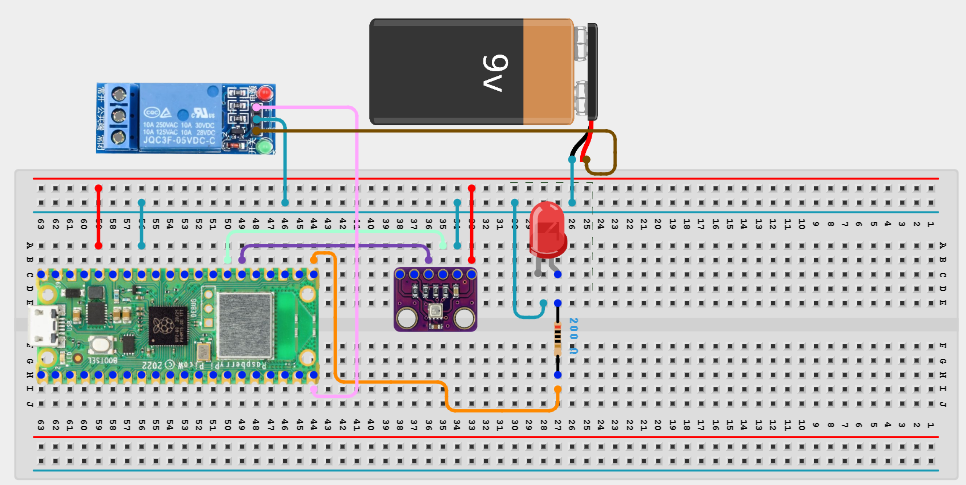

# Project 3.1.30: Ventilation Fan

**Advanced Embedded Systems Project Using Raspberry Pi Pico 2 W and MicroPython**

---
## Overview

The Pico reads temperature and humidity and turns a relay-driven fan on only when the room exceeds the chosen comfort limits.

Washrooms and sanitation spaces often need ventilation only when heat or humidity rises beyond a useful threshold.

A Pico 2 W prototype with a BME280 environmental sensor, relay output, fan load, and LED status indicator.

Environmental sensing, relay hysteresis, and safer fan control using an external supply.


## Required Components

|  |  |  |  |
| --- | --- | --- | --- |
| <br>Raspberry Pi Pico 2 W | <br>BME280 | <br>Breadboard | <br>Jumper wires |
| <br>LED | <br>Resistor | <br>Relay |   |


## Circuit Connections

| Component terminal | Connect to | Pico physical pin | Notes |
|---|---|---|---|
| BME280 VCC | 3.3V output | Physical pin 36 | Sensor power |
| BME280 GND | GND | Physical pin 38 | Common ground |
| BME280 SDA | GPIO 20 | GPIO 20 / physical pin 26 | I2C0 SDA |
| BME280 SCL | GPIO 21 | GPIO 21 / physical pin 27 | I2C0 SCL |
| Relay IN | GPIO 15 | GPIO 15 / physical pin 20 | Relay control |
| Relay VCC | External 5V or module-rated supply | Not a Pico GPIO pin | Use the proper module supply |
| Relay GND | GND | Physical pin 38 | Share ground unless fully isolated |
| LED anode | 220 ohm resistor to GPIO 16 | GPIO 16 / physical pin 21 | Fan state LED |
| LED cathode | GND | Physical pin 23 or 38 | Ground return |

---

## Wiring Diagram


```
  3.3V                 -> BME280 VCC
  GND                  -> BME280 GND, relay GND, LED cathode
  BME280 SDA           -> GPIO 20
  BME280 SCL           -> GPIO 21
  GPIO 15              -> relay IN
  GPIO 16              -> 220 ohm resistor -> LED anode
  External supply      -> relay-switched fan
```

---

## Step-by-Step Assembly

1. Connect the BME280 to Pico 3.3V, GND, GPIO 20 (SDA), and GPIO 21 (SCL).
2. Connect the relay input to GPIO 15 and power the relay module correctly.
3. Wire the LED to GPIO 16 through a 220 ohm resistor and connect the LED cathode to GND.
4. Dry-test the relay and LED before connecting the real fan load.
5. Attach the fan to its own supply only after the sensor and relay logic have been validated.

---

## Testing Individual Components

Before running the full project, test each subsystem separately. This makes it easier to find wiring, library, or logic problems before full integration.

1. **Hardware setup**: Assemble the Pico, sensor, indicator, and load wiring exactly as shown in the connection table before applying power.
2. **Test the input sensor**: Read temperature and humidity in the serial monitor and compare them with expected room conditions.
3. **Test the output device**: Toggle the relay and LED manually first so the output path is proven before the sensor makes decisions.
4. **Test the decision logic**: Warm the sensor or increase humidity slightly and confirm the fan turns on only when the chosen threshold is crossed.
5. **Run the full system**: Run the full system and confirm that the fan stays on until the lower off threshold is reached.
6. **Validate the prototype**: Observe how long the system takes to cool or dry the area and decide whether the thresholds are practical.
7. **Save the project**: Save the validated program on the Pico as main.py and keep a copy on the computer for future edits.

---

## Full Project Code

After completing and checking the circuit connections, open Thonny IDE, copy and paste this code into a new file or upload the project file to the Raspberry Pi Pico 2 W, then run it from Thonny.

```python
from machine import I2C, Pin
import bme280
import time

BME_SDA_PIN = 20
BME_SCL_PIN = 21
RELAY_PIN = 15
LED_PIN = 16
TEMP_ON_C = 30
TEMP_OFF_C = 28
HUMIDITY_ON = 75
HUMIDITY_OFF = 65

i2c = I2C(0, sda=Pin(BME_SDA_PIN), scl=Pin(BME_SCL_PIN), freq=400000)
sensor = bme280.BME280(i2c=i2c)
relay = Pin(RELAY_PIN, Pin.OUT)
led = Pin(LED_PIN, Pin.OUT)
fan_on = False

relay.off()
led.off()
print("Ventilation fan controller ready")

while True:
    try:
        values = sensor.values
        temperature = float(values[0].replace('C', ''))
        pressure = float(values[1].replace('hPa', ''))
        humidity = float(values[2].replace('%', ''))

        if not fan_on and (temperature >= TEMP_ON_C or humidity >= HUMIDITY_ON):
            fan_on = True
        elif fan_on and temperature <= TEMP_OFF_C and humidity <= HUMIDITY_OFF:
            fan_on = False

        relay.value(1 if fan_on else 0)
        led.value(1 if fan_on else 0)
        print("Temp: {} C | Humidity: {} % | Fan: {}".format(temperature, humidity, "ON" if fan_on else "OFF"))
    except Exception:
        print("BME280 read error")

    time.sleep(2)
```

---

## How the Code Works

| Code Section | What It Does | Why It Matters | What to Modify During Testing |
|--------------|--------------|----------------|------------------------------|
| Sensor and relay setup | Defines the BME280 input, relay output, and LED output | This connects the environmental measurement to a real actuator path | Verify the BME280 data pin and relay wiring before changing thresholds |
| Threshold constants | Sets separate on and off points for temperature and humidity | Hysteresis prevents relay chatter near the decision boundary | Tune TEMP_ON_C, TEMP_OFF_C, HUMIDITY_ON, and HUMIDITY_OFF after testing your room |
| Main control logic | Reads the sensor and updates the fan state based on the thresholds | The fan should respond to uncomfortable conditions without switching too often | Change the thresholds before changing the relay logic itself |
| Error handling | Catches read errors and continues safely | Sensors sometimes fail briefly, so the code must handle that cleanly | If errors happen often, improve wiring before changing the exception handling |

---

## Expected Result

The serial monitor reports the current reading or state clearly.

The hardware output responds when the decision logic changes state.

Subsystem behavior matches the thresholds, timing, or rules described in the document.

### Validation Checks

- **Normal condition test**: confirm the system stays in its safe or idle state under baseline conditions
- **Warning condition test**: move the input close to the chosen threshold and confirm the transition is sensible
- **Critical condition test**: trigger the strongest alert or control state and confirm the output response is correct
- **Calibration test**: compare the sensor or timing against a known reference or repeated trial
- **Limitation test**: deliberately create an awkward or noisy condition and note how the prototype behaves

### Deployment and Limitations

- This prototype could be used in school, farm, or sanitation demonstrations with safe low-voltage loads
- Before deployment, the load wiring, enclosure, and power design need careful review
- Actuator systems need maintenance planning because relay wear and sensor drift affect reliability

---

## Troubleshooting

| Problem | Possible Cause | Solution |
|---------|----------------|----------|
| Fan chatters on and off | On and off thresholds are too close | Increase the hysteresis gap between the on and off values |
| Sensor keeps failing | BME280 I2C wiring or timing is unstable | Shorten the I2C wires and confirm the sensor has proper power and ground |
| Fan never turns on | Thresholds are too high for the test room | Lower the on thresholds temporarily and confirm the relay path with a manual test |
| Relay switches but the fan does not spin | External power or load wiring is wrong | Test the fan separately from the relay and confirm the supply voltage |

---
