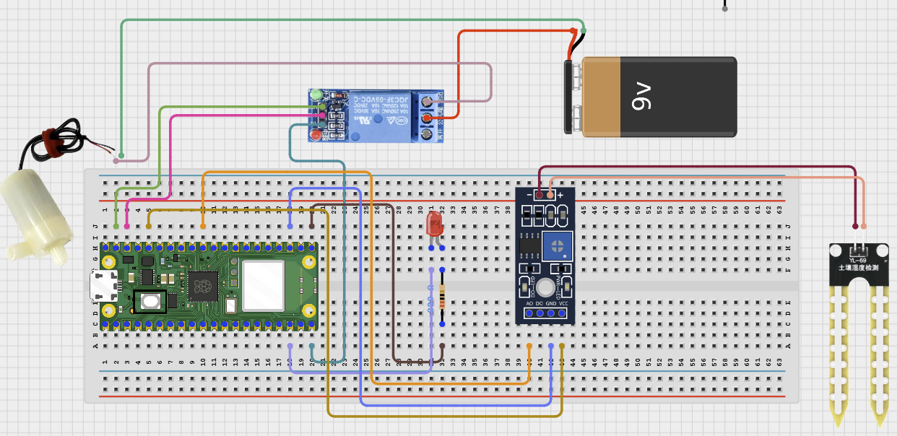

# Project 3.1.31: Wearable Alert

**Advanced Embedded Systems Project Using Raspberry Pi Pico 2 W and MicroPython**

---
## Overview

The Pico reads an SOS button and sends a local Wi-Fi alert message when the user requests help.

Field workers, sanitation staff, or student teams may need a simple way to raise an alert during a safety incident.

This Pico 2 W prototype uses a button, status LED, and Wi-Fi transmission to a local endpoint.

It demonstrates event triggering, local-network alerting, and clear fallback behavior when Wi-Fi is unavailable. It is not a finished emergency platform.


## Required Components

|  |  |  |  |
| --- | --- | --- | --- |
| <br>Raspberry Pi Pico 2 W | <br>Breadboard | <br>Jumper wires |
| <br>LED | <br>Resistor | <br>Push button |   |


## Circuit Connections

| Component terminal | Connect to | Pico physical pin | Notes |
|---|---|---|---|
| SOS button leg 1 | GPIO 14 | GPIO 14 / physical pin 19 | Use with an internal pull-down or pull-up design |
| SOS button leg 2 | 3.3V output | Physical pin 36 | High when pressed in this design |
| LED anode | 220 ohm resistor to GPIO 15 | GPIO 15 / physical pin 20 | Status LED |
| LED cathode | GND | Physical pin 23 or 38 | Ground return |

---

## Wiring Diagram



```text
Button          -> GPIO 14 and 3.3V
GPIO 15         -> 220 ohm resistor -> LED anode
Common GND      -> LED cathode
Wi-Fi uses the Pico 2 W radio and needs no extra wiring
```

---

## Step-by-Step Assembly

1. Wire the SOS button between GPIO 14 and 3.3V so the pin reads high when pressed.
2. Connect the LED to GPIO 15 through a 220 ohm resistor and connect the LED cathode to GND.
3. Check that all connections are secure before connecting the Pico to USB power.

---

## Testing Individual Components

Before running the full project, test each subsystem separately. This makes it easier to find wiring, network, or logic problems before full integration.

1. **Hardware setup**: Assemble the Pico, SOS button, and status LED exactly as shown in the connection table before applying power.
2. **Test the input button**: Print button state changes to confirm that GPIO 14 reads high when the button is pressed.
3. **Test the status LED**: Blink the LED with a short test script so the user-feedback path is known to work.
4. **Test the decision logic**: Press the button with Wi-Fi disabled and confirm that the code still creates and prints a local alert payload.
5. **Run the full system**: Connect to a local HTTP test server and confirm the alert payload is received when the button is pressed.
6. **Save the project**: Save the validated program on the Pico as `main.py` and keep a copy on the computer for future edits.

---

## Full Project Code

After completing and checking the circuit connections, open Thonny IDE, copy and paste this code into a new file or upload the project file to the Raspberry Pi Pico 2 W, then run it from Thonny.

```python
import network
import socket
import time
import ujson as json
from machine import Pin

BUTTON_PIN = 14
LED_PIN = 15
ALERT_COOLDOWN_MS = 10000
WIFI_SSID = 'YOUR_WIFI'
WIFI_PASSWORD = 'YOUR_PASSWORD'
SERVER_HOST = '192.168.1.50'
SERVER_PORT = 8000
SERVER_PATH = '/alerts'

button = Pin(BUTTON_PIN, Pin.IN, Pin.PULL_DOWN)
led = Pin(LED_PIN, Pin.OUT)
last_button_state = 0
last_alert_ms = -ALERT_COOLDOWN_MS


def connect_wifi(timeout_s=15):
    wlan = network.WLAN(network.STA_IF)
    if wlan.isconnected():
        return wlan

    wlan.active(True)
    wlan.connect(WIFI_SSID, WIFI_PASSWORD)

    for _ in range(timeout_s):
        if wlan.isconnected():
            return wlan
        time.sleep(1)

    return None


def send_alert(payload):
    address = socket.getaddrinfo(SERVER_HOST, SERVER_PORT)[0][-1]
    body = json.dumps(payload)
    request = 'POST {} HTTP/1.1\r\nHost: {}\r\nContent-Type: application/json\r\nContent-Length: {}\r\nConnection: close\r\n\r\n{}'.format(SERVER_PATH, SERVER_HOST, len(body), body)

    sock = socket.socket()
    try:
        sock.connect(address)
        sock.send(request.encode())
        sock.recv(128)
        return True
    finally:
        sock.close()


def blink(times):
    for _ in range(times):
        led.on()
        time.sleep_ms(150)
        led.off()
        time.sleep_ms(150)


print('Wearable alert prototype ready')

while True:
    now = time.ticks_ms()
    button_state = button.value()
    new_press = button_state == 1 and last_button_state == 0

    if new_press and time.ticks_diff(now, last_alert_ms) >= ALERT_COOLDOWN_MS:
        payload = {
            'device': 'wearable_255',
            'event': 'SOS',
            'uptime_s': time.ticks_ms() // 1000,
        }

        wlan = connect_wifi()
        success = send_alert(payload) if wlan is not None else False

        print('Alert payload:', payload)
        print('Alert sent' if success else 'Alert stored locally only')
        blink(2 if success else 5)
        last_alert_ms = now

    last_button_state = button_state
    time.sleep_ms(50)
```

---

## How the Code Works

| Code Section | What It Does | Why It Matters | What to Modify During Testing |
|--------------|--------------|----------------|------------------------------|
| Input setup | Configures the SOS button and status LED | The alert begins with a deliberate user action | Verify button wiring before testing Wi-Fi |
| Wi-Fi and HTTP send | Connects to the local network and posts the alert payload to a test endpoint | This turns the project into a communication prototype instead of a serial-only demo | Change the server host, port, and path to match your local test service |
| Alert fallback | Keeps the payload visible in the Shell when Wi-Fi is missing | A prototype should fail visibly instead of pretending the alert worked | Adjust the LED blink pattern if you want different feedback for success and failure |
| Alert cooldown | Limits how often a press can send an alert | Prevents accidental repeated alerts | Adjust `ALERT_COOLDOWN_MS` for testing |

---

## Expected Result

The serial monitor reports the current reading or state clearly.

The hardware output responds when the decision logic changes state.

Subsystem behavior matches the thresholds, timing, or rules described in the document.

### Validation Checks

- **Normal condition test**: power the device and confirm no alert is sent until the button is pressed
- **Button validation**: confirm that one button press is detected once and creates one SOS payload
- **Communication validation**: connect to a local test server and confirm that one press produces one HTTP alert payload
- **Fallback test**: disable Wi-Fi and confirm the code still prints the unsent payload locally
- **Limitation test**: confirm that the prototype only sends alerts while it can reach the configured local Wi-Fi network and endpoint

### Deployment and Limitations

- This prototype is suitable for local pilots where sensor data must be logged or transmitted over short periods
- Before deployment, network reliability, power backup, and endpoint security need attention
- The system should keep useful local behavior even when communication fails

---

## Troubleshooting

| Problem | Possible Cause | Solution |
|---------|----------------|----------|
| Button presses do nothing | Button wiring or cooldown logic is wrong | Check that the button drives GPIO 14 high when pressed |
| Status LED does not blink | LED wiring or polarity is wrong | Check the LED polarity, resistor, and GPIO 15 connection |
| Wi-Fi never connects | SSID, password, or 2.4 GHz network settings are wrong | Confirm the credentials and test the Pico W with a simpler Wi-Fi example first |
| Server never receives alerts | HTTP host, port, or endpoint path is incorrect | Run a local test server and verify the destination values in the code |

---
