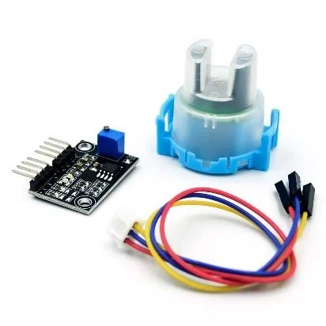

# Project 3.1.4: Contaminated Water Alert

**Advanced Embedded Systems Project Using Raspberry Pi Pico 2 W and MicroPython**

---
## Overview

The Pico reads a TDS sensor, estimates dissolved-solids concentration, and raises a local alert when the reading enters an elevated range.

Communities often need low-cost prototype tools to compare water samples and decide when more formal testing is needed.

A Pico 2 W prototype with an analog TDS sensor, LED, buzzer, and proxy contamination thresholds.

Sample comparison, threshold-based warning logic, and honest language about what TDS can and cannot prove.

## Required Components

|  |  |  |  |
| --- | --- | --- | --- |
| <br>Raspberry Pi Pico 2 W | <br>TDS sensor | <br>Breadboard | <br>Jumper wires |
| <br>LED | <br>Resistor | <br>Buzzer |   |


## Circuit Connections

| Component terminal | Connect to | Pico physical pin | Notes |
|---|---|---|---|
| TDS module VCC | 3.3V output | Physical pin 36 | Use a safe analog output board |
| TDS module GND | GND | Physical pin 38 | Common ground |
| TDS module AO | GPIO 26 ADC0 | GPIO 26 / physical pin 31 | Analog TDS input |
| LED anode | 220 ohm resistor to GPIO 15 | GPIO 15 / physical pin 20 | Warning LED |
| Buzzer positive | GPIO 16 | GPIO 16 / physical pin 21 | Critical alert |

---

## Wiring Diagram

```
  3.3V -> TDS VCC
  GND -> TDS GND, LED cathode, buzzer negative
  TDS AO -> GPIO 26
  GPIO 15 -> 220 ohm resistor -> LED anode
  GPIO 16 -> buzzer positive
```

---

## Step-by-Step Assembly

1. Connect the TDS sensor module to Pico 3.3V, GND, and GPIO 26.
2. Connect the LED to GPIO 15 through a 220 ohm resistor and the LED cathode to GND.
3. Connect the buzzer positive pin to GPIO 16 and its negative pin to GND.
4. Keep the sample cup physically separate from the Pico board during testing.

---

## Testing Individual Components

Before running the full project, test each subsystem separately. This makes it easier to find wiring, library, or logic problems before full integration.

1. **Hardware setup**: Assemble the Pico, sensor, indicator, and load wiring exactly as shown in the connection table before applying power.
2. **Test the input sensor**: Read several clean and mineral-rich samples so the alert thresholds come from real comparisons.
3. **Test the output device**: Test the LED and buzzer outputs separately before linking them to the TDS thresholds.
4. **Test the decision logic**: Confirm the LED turns on at the warning level and the buzzer activates only at the critical level.
5. **Run the full system**: Run the full system on repeated sample tests and compare the raw and estimated ppm values with the reported state.
6. **Validate the prototype**: Rinse the probe between samples and see how much residue or sample handling affects the reading.
7. **Save the project**: Save the validated program on the Pico as main.py and keep a copy on the computer for future edits.

---

## Full Project Code

After completing and checking the circuit connections, open Thonny IDE, copy and paste this code into a new file or upload the project file to the Raspberry Pi Pico 2 W, then run it from Thonny.

```python
from machine import ADC, Pin
import time

TDS_PIN = 26
LED_PIN = 15
BUZZER_PIN = 16
WARNING_PPM = 500
CRITICAL_PPM = 800

tds = ADC(TDS_PIN)
led = Pin(LED_PIN, Pin.OUT)
buzzer = Pin(BUZZER_PIN, Pin.OUT)


def read_tds_ppm(samples=10):
    total = 0
    for _ in range(samples):
        total += tds.read_u16()
        time.sleep_ms(20)

    raw = total / samples
    voltage = raw * 3.3 / 65535
    ppm = max(0, (133.42 * voltage ** 3 - 255.86 * voltage ** 2 + 857.39 * voltage) * 0.5)
    return raw, ppm


print("Contaminated water alert ready")

while True:
    raw, ppm = read_tds_ppm()

    if ppm >= CRITICAL_PPM:
        status = "CRITICAL"
        led.on()
        buzzer.on()
    elif ppm >= WARNING_PPM:
        status = "WARNING"
        led.on()
        buzzer.off()
    else:
        status = "NORMAL"
        led.off()
        buzzer.off()

    print("Raw: {:.0f} | TDS: {:.0f} ppm | Status: {}".format(raw, ppm, status))
    time.sleep(2)
```

---

## How the Code Works

| Code Section | What It Does | Why It Matters | What to Modify During Testing |
|--------------|--------------|----------------|------------------------------|
| Signal conversion | Converts the analog TDS reading into an estimated ppm value | Students need to understand that the alert is based on a proxy model, not direct contamination proof | Recalibrate the conversion only after comparing several real samples |
| Averaging | Uses multiple ADC samples to smooth out noise | Stable readings make sample comparison fairer and more believable | Increase the sample count if the value jumps too much |
| Threshold logic | Maps the ppm estimate into NORMAL, WARNING, or CRITICAL | A graded alert is better than claiming all high readings are automatically unsafe | Tune WARNING_PPM and CRITICAL_PPM to fit your local learning scenario |
| Outputs | Uses LED for warning and buzzer for critical samples | This gives an immediate local response for screening demonstrations | Keep the buzzer reserved for the highest level if the room needs quieter testing |

---

## Expected Result

The serial monitor reports the current reading or state clearly.

The hardware output responds when the decision logic changes state.

Subsystem behavior matches the thresholds, timing, or rules described in the document.

### Validation Checks

- **Normal condition test**: use a lower-mineral or filtered sample and record the baseline ppm
- **Warning condition test**: compare a more mineral-rich sample and confirm the LED turns on first
- **Critical condition test**: use a stronger test sample and confirm both LED and buzzer activate
- **Calibration test**: repeat the same sample several times and confirm the ppm estimate stays reasonably close
- **Limitation test**: explain why TDS alone does not detect every contaminant or pathogen

### Deployment and Limitations

- This prototype can be used for local warning demonstrations and early field trials
- Before deployment, it needs enclosure protection, calibration records, and a clear response procedure
- Alert systems should always be treated as decision-support tools unless they are certified for the application

---

## Troubleshooting

| Problem | Possible Cause | Solution |
|---------|----------------|----------|
| TDS never changes | Probe wiring is wrong or the probe is not immersed properly | Check the AO wire and fully immerse the sensing tip in the sample |
| All samples trigger alerts | Thresholds are too low for your water set | Measure baseline values and raise the thresholds after calibration |
| Readings are unstable | Probe is moving or residue remains on the sensor | Hold the probe still and rinse it between samples |
| Buzzer never turns on | Critical threshold is too high or the buzzer is miswired | Lower CRITICAL_PPM temporarily and verify the buzzer with a direct test |

---
