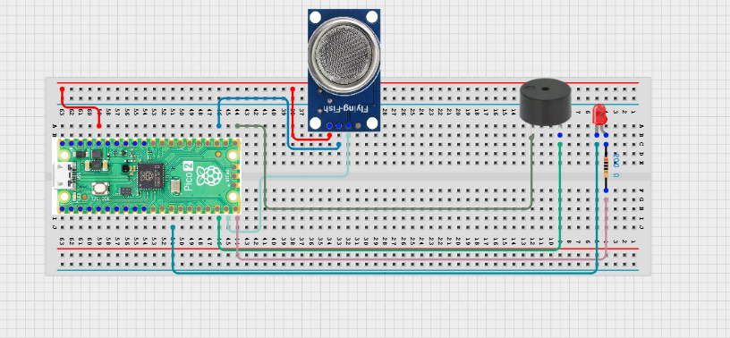

# Project 3.1.6: Fire Alert

**Advanced Embedded Systems Project Using Raspberry Pi Pico 2 W and MicroPython**

---
## Overview

The Pico watches a flame sensor and triggers both visual and audible alarms when a flame is detected.

Sanitation sites, waste areas, and storage points need early warning when a small fire starts nearby.

A Pico 2 W prototype with a flame sensor module, LED, and buzzer for local fire indication.

Reliable alarm behavior, short alarm latching, and honest limits around prototype fire sensing.

## Required Components

|  |  |  |  |
| --- | --- | --- | --- |
| <br>Raspberry Pi Pico 2 W | <br>Gas sensor | <br>Breadboard | <br>Jumper wires |
| <br>LED | <br>Resistor | <br>Buzzer |   |


## Circuit Connections

| Component terminal | Connect to | Pico physical pin | Notes |
|---|---|---|---|
| Flame sensor VCC | 3.3V output | Physical pin 36 | Sensor supply |
| Flame sensor GND | GND | Physical pin 38 | Common ground |
| Flame sensor DO | GPIO 14 | GPIO 14 / physical pin 19 | Digital detection input |
| LED anode | 220 ohm resistor to GPIO 15 | GPIO 15 / physical pin 20 | Alarm LED |
| LED cathode | GND | Physical pin 18 or 38 | Ground return |
| Buzzer positive | GPIO 16 | GPIO 16 / physical pin 21 | Audible alert output |
| Buzzer negative | GND | Physical pin 23 or 38 | Common ground |

---

## Wiring Diagram



```
  3.3V                 -> flame sensor VCC
  GND                  -> flame sensor GND, LED cathode, buzzer negative
  Flame sensor DO      -> GPIO 14
  GPIO 15              -> 220 ohm resistor -> LED anode
  GPIO 16              -> buzzer positive
```

---

## Step-by-Step Assembly

1. Connect the flame sensor module to Pico 3.3V and GND.
2. Connect the sensor digital output pin to GPIO 14.
3. Wire the LED to GPIO 15 through a 220 ohm resistor and connect the LED cathode to GND.
4. Connect the active buzzer positive pin to GPIO 16 and the negative pin to GND.
5. Point the flame sensor away from bright room lights during calibration so you can observe false triggers more clearly.

---

## Testing Individual Components

Before running the full project, test each subsystem separately. This makes it easier to find wiring, library, or logic problems before full integration.

1. **Hardware setup**: Assemble the Pico, sensor, indicator, and load wiring exactly as shown in the connection table before applying power.
2. **Test the input sensor**: Print the flame sensor digital value while moving a small test flame into and out of the sensor field of view.
3. **Test the output device**: Verify that the LED and buzzer both respond to a short manual Pin test before using the flame sensor.
4. **Test the decision logic**: Confirm that the alarm stays latched for a short time after detection instead of flickering off immediately.
5. **Run the full system**: Run the full system with repeated short flame exposures and check that the serial output matches the visible alarm state.
6. **Validate the prototype**: Change the angle, distance, and ambient lighting to see how sensitive the module is to non-fire events.
7. **Save the project**: Save the validated program on the Pico as main.py and keep a copy on the computer for future edits.

---

## Full Project Code

After completing and checking the circuit connections, open Thonny IDE, copy and paste this code into a new file or upload the project file to the Raspberry Pi Pico 2 W, then run it from Thonny.

```python
from machine import Pin
import time

SENSOR_PIN = 14
LED_PIN = 15
BUZZER_PIN = 16
ALARM_ACTIVE_LEVEL = 0
ALARM_LATCH_MS = 5000

sensor = Pin(SENSOR_PIN, Pin.IN, Pin.PULL_UP)
led = Pin(LED_PIN, Pin.OUT)
buzzer = Pin(BUZZER_PIN, Pin.OUT)

last_alarm_ms = None

print("Fire alert ready")

while True:
    now = time.ticks_ms()
    detected = sensor.value() == ALARM_ACTIVE_LEVEL

    if detected:
        last_alarm_ms = now

    alarm_active = last_alarm_ms is not None and time.ticks_diff(now, last_alarm_ms) < ALARM_LATCH_MS

    led.value(1 if alarm_active else 0)
    buzzer.value(1 if alarm_active else 0)

    print("Status: FIRE ALERT" if alarm_active else "Status: NORMAL")
    time.sleep_ms(200)
```

---

## How the Code Works

| Code Section | What It Does | Why It Matters | What to Modify During Testing |
|--------------|--------------|----------------|------------------------------|
| Pin setup | Defines the flame sensor input and the LED and buzzer outputs | Accurate pin mapping makes the hazard response predictable | Only change pin numbers if you also update the wiring table |
| Detection logic | Reads the sensor and stores the last alarm time | This avoids missing a short flame event | Adjust ALARM_ACTIVE_LEVEL only if your module idles low instead of high |
| Alarm latch | Keeps the alarm active for five seconds after the latest detection | Alarm latching makes the prototype easier to validate and explain | Change ALARM_LATCH_MS if the alarm feels too brief or too long |
| Output update | Turns the LED and buzzer on only during the active alarm window | Students can immediately compare sensor state and output state | Change the loop delay if you want faster or slower serial updates |

---

## Expected Result

The LED and buzzer turn on when the flame sensor detects a test flame.

The alarm remains active briefly even if the flame is moved away quickly.

The serial monitor prints NORMAL during safe conditions and FIRE ALERT during alarm conditions.

### Validation Checks

- **Normal condition test**: point the sensor at the room with no flame present and confirm NORMAL
- **Warning condition test**: use reflected light or a distant flame and see whether the module begins to respond
- **Critical condition test**: bring a small controlled flame into the detection zone and confirm LED and buzzer alarm
- **False trigger test**: move bright room lights or sunlight across the sensor and note any false alarms
- **Limitation test**: move the flame to different angles and distances to observe the narrow field of view of the sensor

### Deployment and Limitations

- This prototype is suitable for classroom demonstrations of local hazard detection and alarm design
- A real deployment would need certified fire sensors, a louder alarm path, backup power, and safety approvals
- Environmental light, smoke type, and enclosure design strongly affect reliability in the field

---

## Troubleshooting

| Problem | Possible Cause | Solution |
|---------|----------------|----------|
| Alarm never triggers | Sensor orientation or active level is wrong | Turn the sensor toward the test flame and confirm whether your module output is active low or active high |
| Alarm is always on | Digital output level is inverted or the sensor sees a strong light source | Move away from direct sunlight and flip the ALARM_ACTIVE_LEVEL constant if needed |
| Buzzer is weak | Buzzer current rating is too high for direct GPIO drive | Use a low-current active buzzer module or a transistor driver |
| False alarms occur indoors | The sensor is too sensitive to ambient light | Reduce glare, reposition the sensor, or add a simple shade around the sensor head |

---
