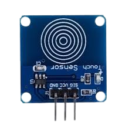
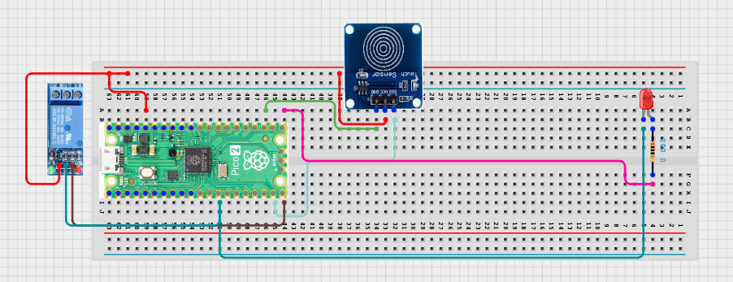

# Project 3.1.9: Handwash Timer

**Advanced Embedded Systems Project Using Raspberry Pi Pico 2 W and MicroPython**

---
## Overview

The Pico starts a timed handwashing cycle when a touch sensor is activated and keeps an output active for the full wash interval.

Handwashing stations work better when users receive a clear timed prompt instead of guessing how long to wash.

A Pico 2 W prototype with a touch sensor, relay output, and LED indicator for a twenty-second wash cycle.

Reliable cycle timing, output control, and validation of how a timed hygiene system behaves in practice.


## Required Components

|  |  |  |  |
| --- | --- | --- | --- |
| <br>Raspberry Pi Pico 2 W | <br>Touch sensor | <br>Breadboard | <br>Jumper wires |
| <br>LED | <br>Resistor | <br>Relay | <br>IR Low voltage load |


## Circuit Connections

| Component terminal | Connect to | Pico physical pin | Notes |
|---|---|---|---|
| TTP223 VCC | 3.3V output | Physical pin 36 | Sensor power |
| TTP223 GND | GND | Physical pin 38 | Common ground |
| TTP223 OUT | GPIO 14 | GPIO 14 / physical pin 19 | Touch input |
| Relay IN | GPIO 15 | GPIO 15 / physical pin 20 | Relay control signal |
| Relay VCC | External 5V or module-rated supply | Not a Pico GPIO pin | Check module trigger requirements |
| Relay GND | GND | Physical pin 38 | Share ground unless fully isolated |
| LED anode | 220 ohm resistor to GPIO 16 | GPIO 16 / physical pin 21 | Cycle indicator |
| LED cathode | GND | Physical pin 23 or 38 | Ground return |

---

## Wiring Diagram



```
  3.3V                 -> TTP223 VCC
  GND                  -> TTP223 GND, LED cathode, relay GND
  TTP223 OUT           -> GPIO 14
  GPIO 15              -> relay IN
  GPIO 16              -> 220 ohm resistor -> LED anode
  External supply      -> relay-switched load
```

---

## Step-by-Step Assembly

1. Connect the touch sensor module to Pico 3.3V, GND, and GPIO 14.
2. Connect the relay control input to GPIO 15 and wire the relay ground correctly.
3. Power the relay module according to its specification and do not draw that power from a Pico GPIO pin.
4. Connect the LED to GPIO 16 through a 220 ohm resistor and connect the LED cathode to GND.
5. Leave the real pump or valve disconnected until the relay clicks correctly in dry testing.

---

## Testing Individual Components

Before running the full project, test each subsystem separately. This makes it easier to find wiring, library, or logic problems before full integration.

1. **Hardware setup**: Assemble the Pico, sensor, indicator, and load wiring exactly as shown in the connection table before applying power.
2. **Test the input sensor**: Print the touch sensor state and confirm that a clear press is detected once per touch without constant noise.
3. **Test the output device**: Toggle the relay and LED with a simple test script before connecting any real load to the relay contacts.
4. **Test the decision logic**: Time the countdown with a stopwatch and confirm that a second touch does not start a second cycle while one is already active.
5. **Run the full system**: Run several full wash cycles and confirm that the output turns off at the end of each one.
6. **Validate the prototype**: Invite another student to use the prototype and note whether the timing and indicator are easy to understand.
7. **Save the project**: Save the validated program on the Pico as main.py and keep a copy on the computer for future edits.

---

## Full Project Code

After completing and checking the circuit connections, open Thonny IDE, copy and paste this code into a new file or upload the project file to the Raspberry Pi Pico 2 W, then run it from Thonny.

```python
from machine import Pin
import time

TOUCH_PIN = 14
RELAY_PIN = 15
LED_PIN = 16
WASH_DURATION_MS = 20000
REARM_DELAY_MS = 3000

touch = Pin(TOUCH_PIN, Pin.IN, Pin.PULL_DOWN)
relay = Pin(RELAY_PIN, Pin.OUT)
led = Pin(LED_PIN, Pin.OUT)

cycle_active = False
cycle_start_ms = 0
last_cycle_end_ms = -REARM_DELAY_MS
last_touch_state = 0
last_printed_second = -1

relay.off()
led.off()
print("Handwash timer ready")

while True:
    now = time.ticks_ms()
    touch_state = touch.value()

    new_touch = touch_state == 1 and last_touch_state == 0
    can_start = not cycle_active and time.ticks_diff(now, last_cycle_end_ms) >= REARM_DELAY_MS

    if new_touch and can_start:
        cycle_active = True
        cycle_start_ms = now
        last_printed_second = -1
        relay.on()
        led.on()
        print("Wash cycle started")

    if cycle_active:
        elapsed = time.ticks_diff(now, cycle_start_ms)
        remaining_ms = WASH_DURATION_MS - elapsed

        if remaining_ms <= 0:
            cycle_active = False
            relay.off()
            led.off()
            last_cycle_end_ms = now
            print("Wash cycle complete")
        else:
            remaining_s = (remaining_ms + 999) // 1000
            if remaining_s != last_printed_second:
                last_printed_second = remaining_s
                print("Seconds remaining:", remaining_s)

    last_touch_state = touch_state
    time.sleep_ms(50)
```

---

## How the Code Works

| Code Section | What It Does | Why It Matters | What to Modify During Testing |
|--------------|--------------|----------------|------------------------------|
| Pin setup | Defines the touch input and the relay and LED outputs | The relay and indicator must respond together during the timed cycle | Change pin numbers only if you also update the wiring table |
| Cycle state variables | Stores whether the system is active and how long the current cycle has been running | This is the core state-machine logic that makes the timer reliable | Adjust WASH_DURATION_MS and REARM_DELAY_MS to suit your hygiene workflow |
| Touch event logic | Detects a new touch and starts a cycle only when the system is ready | Edge detection prevents repeated triggers while the user keeps touching the pad | If the sensor is too sensitive, improve mounting before changing the code |
| Active-cycle timing | Counts down the wash interval and turns the outputs off at the correct time | This validates the real-world behavior of the hygiene timer | Use a stopwatch to confirm the duration before changing the timing constants |

---

## Expected Result

A touch starts one timed wash cycle and the LED and relay stay on for about twenty seconds.

The serial monitor prints the remaining seconds during the active cycle.

The relay and LED turn off automatically when the cycle finishes.

### Validation Checks

- **Normal condition test**: touch the pad once and confirm a full twenty-second cycle
- **Output response validation**: test the relay first without the high-power load attached
- **Calibration test**: compare the countdown with a stopwatch to confirm the timer length
- **False trigger test**: leave the sensor untouched and confirm the cycle does not start by itself
- **Limitation test**: ask two users to try the system and check whether the touch pad is practical for real handwashing flow

### Deployment and Limitations

- This prototype could be used as a classroom or clinic demonstration of timed handwashing support
- Real deployment needs waterproofing, safe load isolation, and a cleaning plan for the user interface
- User training matters because the timer only helps if people understand what the cycle means

---

## Troubleshooting

| Problem | Possible Cause | Solution |
|---------|----------------|----------|
| Cycle starts repeatedly | Touch sensor is noisy or mounted badly | Improve grounding and sensor mounting, then recheck the edge-detection logic |
| Relay clicks but load does not run | Relay contacts or external load supply are wired incorrectly | Test the relay with a safe low-power lamp first and recheck the contact wiring |
| Cycle length feels wrong | Timer was not validated with a stopwatch | Measure the duration and adjust WASH_DURATION_MS only after confirming the actual timing |
| Touch pad does nothing | Sensor is powered wrongly or output pin is not connected | Confirm TTP223 VCC, GND, and OUT wiring and test the sensor with a simple print loop |

---
