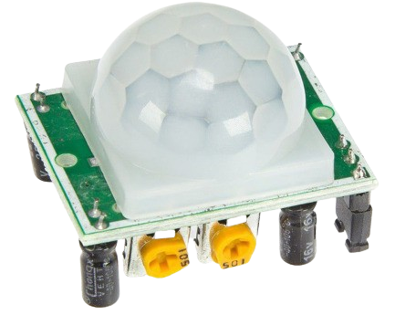
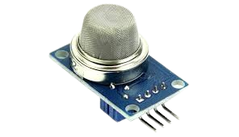
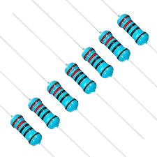

# Project 286
## SMART SANITATION ANALYTICS PLATFORM

**Advanced Embedded Systems Project Using Raspberry Pi Pico 2 W and MicroPython**


## Contents

- [Overview](#overview)
- [Learning Objectives](#learning-objectives)
- [Required Components](#required-components)
- [Before You Begin](#before-you-begin)
- [Circuit Connections](#circuit-connections)
- [Wiring Diagram](#wiring-diagram)
- [Step-by-Step Assembly](#step-by-step-assembly)
- [Testing Individual Components](#testing-individual-components)
- [Full Project Code](#full-project-code)
- [How the Code Works](#how-the-code-works)
- [Expected Result](#expected-result)
- [Troubleshooting](#troubleshooting)
- [Challenge Extensions](#challenge-extensions)
- [Reflection Questions](#reflection-questions)
- [Save Your Work](#save-your-work)
- [Next Project](#next-project)

---

## Overview

The Pico counts sanitation-stall usage, tracks gas-alert events, and shows a local service-needed dashboard.

Sanitation spaces are harder to maintain when teams have no local data about traffic levels or odor warning events.

A Pico 2 W prototype with a PIR sensor, MQ-135 gas sensor, and OLED used as a local sanitation analytics prototype.

Event counting, local analytics, service thresholds, and honest correction of platform overclaims.

### Project Story

**Advanced Project**: This advanced project is designed to help learners move beyond basic wiring and coding into complete system thinking. The learner should build the prototype, test each subsystem, validate the data, explain the design decisions, and propose improvements for real-world deployment.

Maintenance teams often need simple evidence that a sanitation space is busy or requires attention. This project helps students turn motion and gas-proxy data into a local analytics prototype without pretending the code already creates a full cloud platform.

---

## Learning Objectives

- Count usage events with edge logic instead of repeated level counting
- Track gas-alert events separately from human traffic
- Build a local analytics data model with visits, alerts, and service state
- Display maintenance-oriented metrics on a simple local dashboard
- Explain why a local prototype is not the same as a full analytics platform
- Discuss calibration and hygiene-data limitations honestly

---

## Required Components


|  |  |  |  |
| --- | --- | --- | --- |
| <br>PIR motion sensor](../../../assets/aider/components/PIR_SENSOR__MOTION_SENSOR.png)<br><br>PIR motion sensor | <br>](../../../assets/aider/components/<br>.png)<br><br> | <br> | <br> |


---

## Before You Begin

Before starting this project, make sure you have completed the foundational sections at the beginning of the manual:

- **Software Installation and Setup**
- **Safety Guidelines**
- **Breadboard Basics**
- **Reading Circuit Diagrams**

### Project-Specific Setup Notes

- Upload ssd1306.py to the root folder of the Pico file system in Thonny before running the full project.
- In the Thonny Shell, run `import os` and `print(os.listdir())` to confirm that ssd1306.py is present on the Pico.
- This project demonstrates a local analytics prototype and data structure that could later feed a dashboard or platform. The current build stays local.

### Project-Specific Safety Note

Gas sensor readings are for learning and prototype use only and should not be treated as certified safety measurements.

Many MQ sensor modules use a 5V heater and can output up to 5V on the analog pin. Use a resistor divider or a 3.3V-safe conditioning board before connecting the analog output to the Pico ADC.

Public hygiene or compliance outputs in this project are prototype indicators only and should not replace trained human inspection.

Treat the gas reading as a prototype odor proxy only and never as a certified sanitation or health instrument.

---

## Circuit Connections


|  |  |  |  |
| --- | --- | --- | --- |
| <br>PIR motion sensor](../../../assets/aider/components/PIR_SENSOR__MOTION_SENSOR.png)<br><br>PIR motion sensor | <br>](../../../assets/aider/components/<br>.png)<br><br> | <br> | <br> |

| --- | --- | --- | --- |
<br>Raspberry Pi Pico 2 W | <br>PIR motion sensor | <br>MQ-135 gas sensor module | <br>Voltage divider resistors
<br>128x64 I2C OLED display | <br> | <br> | <br>

|---------------|-------------|---------------------------------|-------|
| PIR OUT | GPIO 14 | GPIO 14 / physical pin 19 | Visit detection input |
| MQ-135 AO | GPIO 26 ADC0 | GPIO 26 / physical pin 31 | Odor proxy input with safe ADC scaling |
| OLED SDA | GPIO 20 | GPIO 20 / physical pin 26 | I2C0 SDA |
| OLED SCL | GPIO 21 | GPIO 21 / physical pin 27 | I2C0 SCL |

---

## Wiring Diagram

```
  PIR OUT -> GPIO 14
  MQ-135 AO -> GPIO 26 through a safe divider if required
  GPIO 20 -> OLED SDA
  GPIO 21 -> OLED SCL
  Common GND -> PIR, MQ-135, and OLED
```

---

## Step-by-Step Assembly

1. Connect the PIR output to GPIO 14 and allow the sensor to warm up before counting events.
2. Connect the MQ-135 analog output to GPIO 26 through a 3.3V-safe path.
3. Connect the OLED to Pico 3.3V, GND, GPIO 20, and GPIO 21.
4. Upload ssd1306.py and verify that it appears in the Pico file list.
5. Warm up the gas sensor fully before choosing the gas-alert threshold.

---

## Testing Individual Components

Before running the full project, test each subsystem separately. This makes it easier to find wiring, library, or logic problems before full integration.

1. **Hardware setup**: Assemble the Pico, sensor, indicator, and load wiring exactly as shown in the connection table before applying power.
2. **Test the input sensor**: Test the PIR edge behavior and the MQ-135 baseline separately before combining the data streams.
3. **Test the output device**: Run an OLED hello-world test so the display path is stable before adding analytics data.
4. **Test the decision logic**: Confirm that visits and gas alerts increment only on new events, not on every loop.
5. **Run the full system**: Run the full dashboard and compare the local counters with your manual observations.
6. **Validate the prototype**: Discuss how false motion counts or gas drift could mislead maintenance decisions.
7. **Save the project**: Save the validated program on the Pico as main.py and keep a copy on the computer for future edits.

---

## Full Project Code

After completing and checking the circuit connections, open Thonny IDE, copy and paste this code into a new file or upload the project file to the Raspberry Pi Pico 2 W, then run it from Thonny.

```python
from machine import ADC, I2C, Pin
import time

try:
    from ssd1306 import SSD1306_I2C
    HAS_OLED = True
except ImportError:
    HAS_OLED = False

PIR_PIN = 14
GAS_PIN = 26
I2C_SDA_PIN = 20
I2C_SCL_PIN = 21
VISIT_LOCKOUT_MS = 5000
GAS_ALERT = 18000
SERVICE_VISITS = 20
SERVICE_ALERTS = 3

pir = Pin(PIR_PIN, Pin.IN, Pin.PULL_DOWN)
gas = ADC(GAS_PIN)
i2c = I2C(0, sda=Pin(I2C_SDA_PIN), scl=Pin(I2C_SCL_PIN), freq=400000)
if HAS_OLED:
    oled = SSD1306_I2C(128, 64, i2c)

visit_count = 0
gas_alerts = 0
last_visit_ms = -VISIT_LOCKOUT_MS
last_pir = 0
gas_in_alert = False


def status_label(visits, alerts):
    if alerts >= SERVICE_ALERTS or visits >= SERVICE_VISITS:
        return 'SERVICE'
    if alerts >= 1 or visits >= SERVICE_VISITS // 2:
        return 'WATCH'
    return 'NORMAL'


print('Sanitation analytics prototype ready')

while True:
    now = time.ticks_ms()
    pir_value = pir.value()
    new_visit = (pir_value == 1 and last_pir == 0 and
                 time.ticks_diff(now, last_visit_ms) >= VISIT_LOCKOUT_MS)
    if new_visit:
        visit_count += 1
        last_visit_ms = now

    last_pir = pir_value
    gas_value = gas.read_u16()
    if gas_value >= GAS_ALERT and not gas_in_alert:
        gas_alerts += 1
        gas_in_alert = True
    elif gas_value < GAS_ALERT - 2000:
        gas_in_alert = False

    status = status_label(visit_count, gas_alerts)
    print('Visits:{} Gas:{} Alerts:{} Status:{}'.format(
        visit_count,
        gas_value,
        gas_alerts,
        status,
    ))

    if HAS_OLED:
        oled.fill(0)
        oled.text('Sanitation', 0, 0)
        oled.text('Visits:{}'.format(visit_count), 0, 16)
        oled.text('Alerts:{}'.format(gas_alerts), 0, 30)
        oled.text(status, 0, 46)
        oled.show()

    time.sleep_ms(200)
```

---

## How the Code Works

| Code Section | What It Does | Why It Matters | What to Modify During Testing |
|--------------|--------------|----------------|------------------------------|
| Edge-based visit counting | Counts only new PIR motion events outside the lockout window | This avoids one visit being counted many times | Adjust the lockout after observing real movement patterns |
| Gas alert edge detection | Counts only new gas-alert entries instead of every loop above the threshold | Alert-event counting is more useful than endless repeated increments | Tune GAS_ALERT after warm-up and baseline testing |
| status_label | Maps visit and alert totals into NORMAL, WATCH, or SERVICE | This turns raw activity into a maintenance-oriented state | Change the service thresholds to match your classroom scenario |
| OLED dashboard | Shows the current local sanitation analytics view | A local dashboard demonstrates platform thinking without overclaiming a real cloud system | If the display is blank, test the OLED separately before changing the counting logic |

---

## Expected Result

The OLED and serial monitor show visit count, gas-alert count, and a sanitation service state.

One visit produces one count, and one gas-threshold crossing produces one alert event.

The status moves from NORMAL to WATCH or SERVICE as counts increase.

### Validation Checks

- **Normal condition test**: allow the PIR to warm up and confirm that the system remains stable with no movement
- **Usage validation**: walk through the sensor zone several times and compare the printed visit count with your manual tally
- **Gas alert validation**: warm up the MQ-135 and trigger a controlled threshold change only if your classroom procedure allows it
- **Calibration test**: record the gas baseline after warm-up before setting GAS_ALERT
- **False trigger test**: stand within the PIR zone after one count and confirm the lockout prevents rapid over-counting
- **Limitation test**: explain why this local prototype does not by itself create a sanitation analytics platform

### Deployment and Limitations

- This prototype is suitable for classroom sanitation studies and local maintenance demonstrations
- Before deployment, the gas-sensor calibration, enclosure, and service workflow need further development
- A real platform would also need networking, data retention, privacy planning, and staff training

---

## Troubleshooting

| Problem | Possible Cause | Solution |
|---------|----------------|----------|
| Visit count increases too quickly | The lockout is too short or the PIR covers too much area | Increase VISIT_LOCKOUT_MS and narrow the detection zone |
| Gas alerts never appear | The threshold is too high or the analog path is wrong | Print the raw gas value after warm-up and confirm the ADC signal path |
| Status never changes | The visit or alert thresholds are too high for the test scenario | Lower the watch and service limits during classroom validation |
| OLED is blank | The display library or I2C wiring is wrong | Verify ssd1306.py and recheck GPIO 20 and GPIO 21 |

---


## Save Your Work

Save the file to your computer as:

```
project_286_smart_sanitation_analytics_platform.py
```

If you want the program to run automatically when the Pico powers on, save the final version to the Pico as:

```
main.py
```

---

## Next Project

**Project 287: Smart Greenhouse Autonomous Controller**