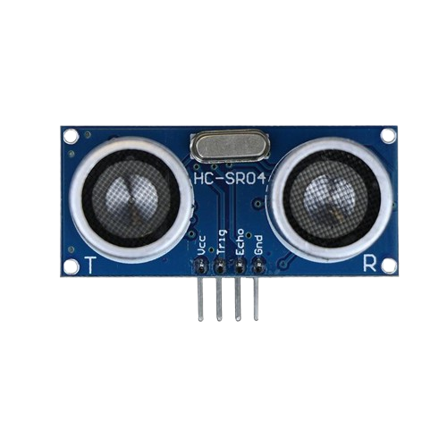

# Project 304
## SMART FLOOD PREDICTION DASHBOARD

**Advanced Embedded Systems Project Using Raspberry Pi Pico 2 W and MicroPython**


## Contents

- [Overview](#overview)
- [Learning Objectives](#learning-objectives)
- [Required Components](#required-components)
- [Before You Begin](#before-you-begin)
- [Circuit Connections](#circuit-connections)
- [Wiring Diagram](#wiring-diagram)
- [Step-by-Step Assembly](#step-by-step-assembly)
- [Testing Individual Components](#testing-individual-components)
- [Full Project Code](#full-project-code)
- [How the Code Works](#how-the-code-works)
- [Expected Result](#expected-result)
- [Troubleshooting](#troubleshooting)
- [Challenge Extensions](#challenge-extensions)
- [Reflection Questions](#reflection-questions)
- [Save Your Work](#save-your-work)
- [Next Project](#next-project)

---

## Overview

The Pico measures water-surface distance, tracks its recent trend, and shows whether flood risk is stable, rising, or high on a local dashboard.

A single water-level reading does not reveal whether water is rising quickly enough to become dangerous soon.

A Pico 2 W prototype with an ultrasonic sensor and OLED used as a local flood trend dashboard.

Distance calibration, history-based flood trend interpretation, and honest prediction wording.

### Project Story

**Advanced Project**: This advanced project is designed to help learners move beyond basic wiring and coding into complete system thinking. The learner should build the prototype, test each subsystem, validate the data, explain the design decisions, and propose improvements for real-world deployment.

Flood monitoring is more useful when people can see whether water is rising steadily toward danger instead of only reading one distance at a time. This prototype helps students turn ultrasonic data into a local trend dashboard while staying honest that it is not a full flood forecast model.

---

## Learning Objectives

- Read and validate live sensor data
- Interpret a threshold or category instead of only reading raw numbers
- Use a local display or serial output as a simple dashboard
- Check library setup and wiring before running the full system
- Discuss calibration limits before real deployment

---

## Required Components


|  |  |  |  |
| --- | --- | --- | --- |
| <br>HC-SR04 ultrasonic sensor](../../../assets/aider/components/Ultrasonic_sensor__HC-SR04.png)<br><br>HC-SR04 ultrasonic sensor | <br> | <br> | <br> |


---

## Before You Begin

Before starting this project, make sure you have completed the foundational sections at the beginning of the manual:

- **Software Installation and Setup**
- **Safety Guidelines**
- **Breadboard Basics**
- **Reading Circuit Diagrams**

### Project-Specific Setup Notes

- Upload ssd1306.py to the root folder of the Pico file system in Thonny before running the full project.
- In the Thonny Shell, run `import os` and `print(os.listdir())` to confirm that ssd1306.py is present on the Pico.
- This project predicts local flood trend direction from distance history only. It does not implement rainfall forecasting or watershed modeling.

```python
import os
print(os.listdir())
```

### Project-Specific Safety Note

Keep electronics away from water and dry the work area before powering the Pico.

Many HC-SR04 ultrasonic modules output 5V on the Echo pin. Raspberry Pi Pico GPIO pins are 3.3V only. Use a voltage divider on the Echo line or use a 3.3V-safe ultrasonic sensor.

Mount the ultrasonic sensor above splash level and keep the Pico itself far from standing water.

---

## Circuit Connections


|  |  |  |  |
| --- | --- | --- | --- |
| <br>HC-SR04 ultrasonic sensor](../../../assets/aider/components/Ultrasonic_sensor__HC-SR04.png)<br><br>HC-SR04 ultrasonic sensor | <br> | <br> | <br> |

| --- | --- | --- | --- |
<br>Raspberry Pi Pico 2 W | <br>HC-SR04 ultrasonic sensor | <br>Voltage divider resistors | <br>128x64 I2C OLED display

|---------------|-------------|---------------------------------|-------|
| HC-SR04 TRIG | GPIO 14 | GPIO 14 / physical pin 19 | Trigger output |
| HC-SR04 ECHO | GPIO 13 through a voltage divider | GPIO 13 / physical pin 17 | 3.3V-safe Echo input |
| OLED SDA | GPIO 20 | GPIO 20 / physical pin 26 | I2C0 SDA |
| OLED SCL | GPIO 21 | GPIO 21 / physical pin 27 | I2C0 SCL |

---

## Wiring Diagram

```
  GPIO 14 -> HC-SR04 TRIG
  HC-SR04 ECHO -> voltage divider -> GPIO 13
  GPIO 20 -> OLED SDA
  GPIO 21 -> OLED SCL
  Common GND -> sensor and OLED
```

---

## Step-by-Step Assembly

1. Connect TRIG to GPIO 14.
2. Connect ECHO to GPIO 13 through a resistor divider or use a 3.3V-safe ultrasonic module.
3. Connect the OLED to Pico 3.3V, GND, GPIO 20, and GPIO 21.
4. Upload ssd1306.py and confirm it appears on the Pico before running the dashboard.
5. Mount the ultrasonic sensor above the water and away from direct splashes.

---

## Testing Individual Components

Before running the full project, test each subsystem separately. This makes it easier to find wiring, library, or logic problems before full integration.

1. **Hardware setup**: Assemble the Pico, sensor, indicator, and load wiring exactly as shown in the connection table before applying power.
2. **Test the input sensor**: Measure known distances first so the ultrasonic subsystem is calibrated before you interpret flood trend.
3. **Test the output device**: Run an OLED hello-world test so the display path is verified.
4. **Test the decision logic**: Move the target closer in steps and confirm the trend label changes from STABLE to RISING and eventually HIGH RISK.
5. **Run the full system**: Run the full dashboard and compare the current distance with the trend label.
6. **Validate the prototype**: Test odd angles and splash conditions to see how bad echoes affect the trend.
7. **Save the project**: Save the validated program on the Pico as main.py and keep a copy on the computer for future edits.

---

## Full Project Code

After completing and checking the circuit connections, open Thonny IDE, copy and paste this code into a new file or upload the project file to the Raspberry Pi Pico 2 W, then run it from Thonny.

```python
from machine import I2C, Pin
import time

try:
    from ssd1306 import SSD1306_I2C
    HAS_OLED = True
except ImportError:
    HAS_OLED = False

TRIG_PIN = 14
ECHO_PIN = 13
I2C_SDA_PIN = 20
I2C_SCL_PIN = 21
HIGH_RISK_CM = 25
HISTORY_LENGTH = 6

trig = Pin(TRIG_PIN, Pin.OUT)
echo = Pin(ECHO_PIN, Pin.IN)
i2c = I2C(0, sda=Pin(I2C_SDA_PIN), scl=Pin(I2C_SCL_PIN), freq=400000)
if HAS_OLED:
    oled = SSD1306_I2C(128, 64, i2c)

history = []


def measure_distance_cm():
    trig.low()
    time.sleep_us(2)
    trig.high()
    time.sleep_us(10)
    trig.low()

    timeout_start = time.ticks_us()
    while echo.value() == 0:
        if time.ticks_diff(time.ticks_us(), timeout_start) > 30000:
            return None

    pulse_start = time.ticks_us()
    while echo.value() == 1:
        if time.ticks_diff(time.ticks_us(), pulse_start) > 30000:
            return None

    pulse_width = time.ticks_diff(time.ticks_us(), pulse_start)
    return (pulse_width * 0.0343) / 2


def trend_label(values):
    if len(values) < 2:
        return 'STABLE'
    if values[-1] <= HIGH_RISK_CM:
        return 'HIGH RISK'
    if values[0] - values[-1] >= 5:
        return 'RISING'
    return 'STABLE'


print('Flood prediction dashboard ready')

while True:
    distance = measure_distance_cm()
    if distance is None:
        print('Ultrasonic timeout')
        time.sleep(1)
        continue

    history.append(distance)
    history = history[-HISTORY_LENGTH:]
    label = trend_label(history)
    print('Distance:{:.1f}cm Trend:{}'.format(distance, label))

    if HAS_OLED:
        oled.fill(0)
        oled.text('Flood Trend', 0, 0)
        oled.text('Dist:{:.1f}cm'.format(distance), 0, 18)
        oled.text(label[:16], 0, 38)
        oled.show()

    time.sleep(2)
```

---

## How the Code Works

| Code Section | What It Does | Why It Matters | What to Modify During Testing |
|--------------|--------------|----------------|------------------------------|
| measure_distance_cm | Reads the ultrasonic sensor with timeout protection | Flood trend logic is only useful if distance measurement is reliable and non-blocking | Verify known distances before changing the high-risk threshold |
| History window | Stores recent distances so the dashboard can describe direction of change | Trend is what makes the project more advanced than a simple level display | Adjust HISTORY_LENGTH only after testing stability |
| trend_label | Maps the recent distances to STABLE, RISING, or HIGH RISK | Students can explain why the dashboard label changed from visible rules | Tune the rise amount and high-risk threshold after physical tests |
| OLED dashboard | Shows the current distance and local flood trend label | A visible dashboard makes the prototype easier to validate with known distances | If the OLED is blank, verify ssd1306.py and the I2C wiring first |

---

## Expected Result

The serial monitor reports the current reading or state clearly.

The hardware output responds when the decision logic changes state.

Subsystem behavior matches the thresholds, timing, or rules described in the document.

### Validation Checks

- **Ultrasonic validation**: test at 5 cm, 10 cm, 20 cm, and 30 cm and confirm the measured values are reasonably close
- **Normal condition test**: keep the target far from the sensor and confirm the dashboard stays at STABLE
- **Trend test**: move the target closer in several steps and confirm the label changes to RISING
- **Critical condition test**: move the target inside the high-risk distance and confirm the label changes to HIGH RISK
- **False trigger test**: tilt the target or add splash-like disturbances and note how the reading behaves
- **Limitation test**: explain why distance trend alone is not a full flood prediction model

### Deployment and Limitations

- This prototype works well for classroom demonstrations and local monitoring pilots
- Before deployment, it needs calibration records, protective mounting, and regular validation checks
- Display-only systems still depend on correct sensor placement and trained users

---

## Troubleshooting

| Problem | Possible Cause | Solution |
|---------|----------------|----------|
| The distance never appears | TRIG or ECHO wiring is wrong | Check the trigger wire, the Echo divider, and the sensor orientation |
| The trend never changes | The target is not moving enough or the rising threshold is too large | Move the target more clearly or lower the trend threshold slightly |
| Random high-risk labels appear | Bad echoes or splash interference are causing false low distances | Reposition the sensor and reduce reflective interference around the target area |
| OLED is blank | The display library or I2C wiring is wrong | Confirm ssd1306.py is present and recheck GPIO 20 and GPIO 21 |

---


## Save Your Work

Save the file to your computer as:

```
project_304_smart_flood_prediction_dashboard.py
```

If you want the program to run automatically when the Pico powers on, save the final version to the Pico as:

```
main.py
```

---

## Next Project

**Project 305: Smart Environment Decision Engine**