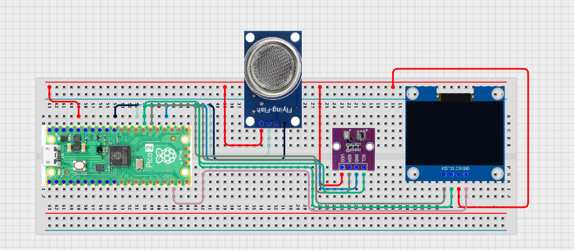

# Project 3.4.9: Environmental Monitoring Kit

**Advanced Embedded Systems Project Using Raspberry Pi Pico 2 W and MicroPython**

---
## Overview

The Pico combines environmental measurements into a local score or compliance-style label shown on an OLED dashboard.

Environmental decisions are harder to justify when learners only see separate readings instead of one documented score or status.

A Pico 2 W prototype with an MQ-5 Liquefied Petroleum/Methane Gas Sensor, BME280, and OLED dashboard.

Environmental scoring, dashboard interpretation, and calibration-aware decision making.


## Required Components

|  |  |  |  |
| --- | --- | --- | --- |
| <br>Raspberry Pi Pico 2 W | <br>Gas sensor | <br>Breadboard | <br>Jumper wires |
| <br>BME280 | <br>OLED display |   |   |


## Circuit Connections

| Component terminal | Connect to | Pico physical pin | Notes |
|---|---|---|---|
| BME280 VCC | 3.3V output | Physical pin 36 | Sensor power |
| BME280 GND | GND | Physical pin 38 | Common ground |
| BME280 SDA | GPIO 20 | GPIO 20 / physical pin 26 | I2C0 SDA shared with OLED if present |
| BME280 SCL | GPIO 21 | GPIO 21 / physical pin 27 | I2C0 SCL shared with OLED if present |
| MQ-5 AO | GPIO 26 ADC0 | GPIO 26 / physical pin 31 | LPG/methane gas proxy input |
| OLED SDA | GPIO 20 | GPIO 20 / physical pin 26 | I2C0 SDA |
| OLED SCL | GPIO 21 | GPIO 21 / physical pin 27 | I2C0 SCL |

---

## Wiring Diagram



```
  MQ-5 AO             -> GPIO 26
  BME280 SDA          -> GPIO 20
  BME280 SCL          -> GPIO 21
  GPIO 20             -> OLED SDA
  GPIO 21             -> OLED SCL
  Common GND          -> MQ-5, BME280, and OLED
  BME280 VCC          -> 3.3V
  BME280 GND          -> GND
```

---

## Step-by-Step Assembly

1. Connect the MQ-5 analog output to GPIO 26 through a safe ADC path.
2. Connect the BME280 to Pico 3.3V, GND, GPIO 20 (SDA), and GPIO 21 (SCL).
3. Connect the OLED to Pico 3.3V, GND, GPIO 20, and GPIO 21.
4. Upload ssd1306.py and confirm it appears on the Pico before running the dashboard.
5. Warm up the MQ-5 and record the room baseline before choosing the score thresholds.

---

## Testing Individual Components

Before running the full project, test each subsystem separately. This makes it easier to find wiring, library, or logic problems before full integration.

1. **Hardware setup**: Assemble the Pico, sensor, indicator, and load wiring exactly as shown in the connection table before applying power.
2. **Test the input sensor**: Test the gas and climate sensors separately so the dashboard is built from believable values.
3. **Test the output device**: Run an OLED hello-world test before adding the scoring logic.
4. **Test the decision logic**: Change one factor at a time and confirm the score changes for understandable reasons.
5. **Run the full system**: Run the full dashboard and compare the printed values with the displayed label.
6. **Validate the prototype**: Discuss whether one factor is weighted too strongly or too weakly in the score.
7. **Save the project**: Save the validated program on the Pico as main.py and keep a copy on the computer for future edits.

---

## Full Project Code

After completing and checking the circuit connections, open Thonny IDE, copy and paste this code into a new file or upload the project file to the Raspberry Pi Pico 2 W, then run it from Thonny.

```python
from machine import ADC, I2C, Pin
import bme280
import time

try:
    from ssd1306 import SSD1306_I2C
    HAS_OLED = True
except ImportError:
    HAS_OLED = False

GAS_PIN = 26
BME_SDA_PIN = 20
BME_SCL_PIN = 21
I2C_SDA_PIN = 20
I2C_SCL_PIN = 21
GAS_WARN = 18000
GAS_HIGH = 28000
TEMP_WARN = 30
HUM_WARN = 75

mq5 = ADC(GAS_PIN)
i2c = I2C(0, sda=Pin(BME_SDA_PIN), scl=Pin(BME_SCL_PIN), freq=400000)
climate = bme280.BME280(i2c=i2c)
if HAS_OLED:
    oled = SSD1306_I2C(128, 64, i2c)

print('Environmental score dashboard ready')

while True:
    gas_value = mq5.read_u16()
    try:
        values = climate.values
        temperature = float(values[0].replace('C', ''))
        pressure = float(values[1].replace('hPa', ''))
        humidity = float(values[2].replace('%', ''))
    except Exception:
        temperature = 0
        pressure = 0
        humidity = 0

    score = 0
    if gas_value >= GAS_WARN:
        score += 2
    if gas_value >= GAS_HIGH:
        score += 2
    if temperature >= TEMP_WARN:
        score += 1
    if humidity >= HUM_WARN:
        score += 1

    if score >= 5:
        label = 'HIGH RISK'
    elif score >= 2:
        label = 'CAUTION'
    else:
        label = 'CLEAR'

    print('Gas:{} Temp:{}C Hum:{}% Score:{} Label:{}'.format(gas_value, temperature, humidity, score, label))

    if HAS_OLED:
        oled.fill(0)
        oled.text('Env Score', 0, 0)
        oled.text('G:{} T:{}'.format(gas_value, temperature), 0, 18)
        oled.text('H:{} S:{}'.format(humidity, score), 0, 34)
        oled.text(label[:16], 0, 50)
        oled.show()

    time.sleep(2)
```

---

## How the Code Works

| Code Section | What It Does | Why It Matters | What to Modify During Testing |
|--------------|--------------|----------------|------------------------------|
| Score logic | Assigns points to gas, temperature, and humidity stressors | The score turns several readings into one interpretable decision | Tune thresholds only after you capture a stable baseline |
| Label mapping | Converts the total score into CLEAR, CAUTION, or HIGH RISK | This makes the dashboard easier to use than raw values alone | Adjust label boundaries only after repeated test cases |
| OLED dashboard | Shows the contributing values and final label together | The screen helps users audit the score instead of blindly trusting it | Verify ssd1306.py and I2C wiring if the display is blank |

---

## Expected Result

The serial monitor reports the current reading or state clearly.

The hardware output responds when the decision logic changes state.

Subsystem behavior matches the thresholds, timing, or rules described in the document.

### Validation Checks

- **Normal condition test**: confirm the system stays in its safe or idle state under baseline conditions
- **Warning condition test**: move the input close to the chosen threshold and confirm the transition is sensible
- **Critical condition test**: trigger the strongest alert or control state and confirm the output response is correct
- **Calibration test**: compare the sensor or timing against a known reference or repeated trial
- **Limitation test**: deliberately create an awkward or noisy condition and note how the prototype behaves

### Deployment and Limitations

- This prototype works well for classroom demonstrations and local monitoring pilots
- Before deployment, it needs calibration records, protective mounting, and regular validation checks
- Display-only systems still depend on correct sensor placement and trained users

---

## Troubleshooting

| Problem | Possible Cause | Solution |
|---------|----------------|----------|
| The score is always high | Thresholds are too low or the gas sensor is still warming up | Allow more warm-up time and raise the thresholds after observing the baseline |
| Humidity stays at zero | The BME280 read failed | Test the BME280 separately and shorten the I2C wires if needed |
| The label feels unrealistic | The weighting does not match the room behavior | Review each score contribution and adjust the weights after repeated tests |
| OLED is blank | The display library or I2C wiring is wrong | Confirm ssd1306.py is present and verify GPIO 20 and GPIO 21 |

---
